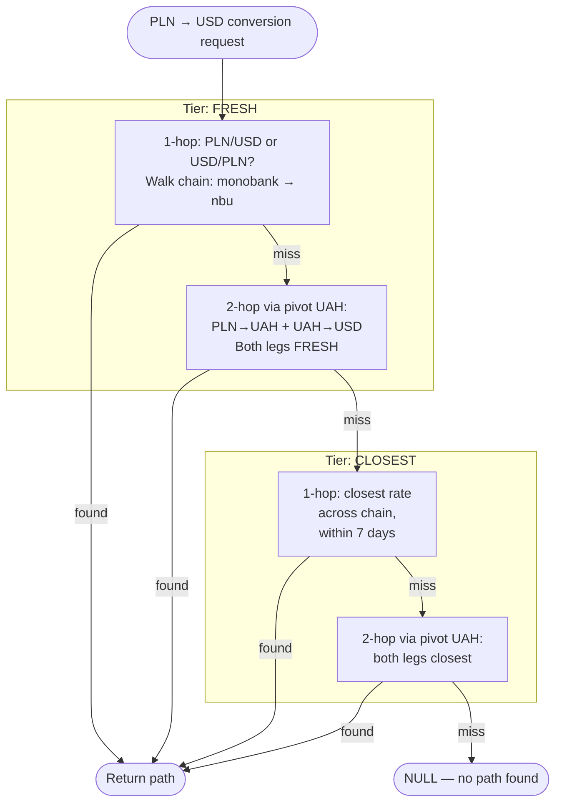
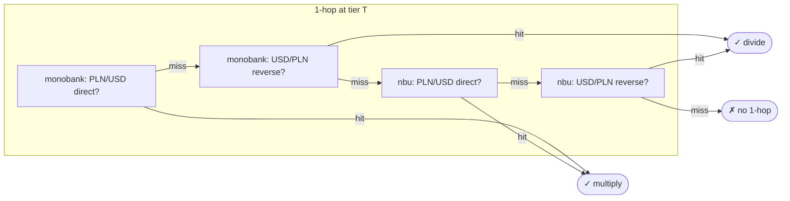
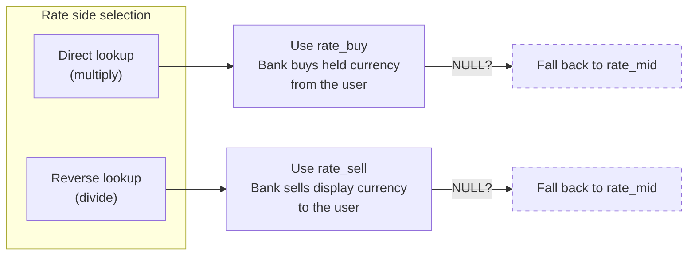

# Currency Conversion — Design & Logic Reference

Stateless description of the currency conversion subsystem.
Companion to `consumer-currency-conversion-test-suite.md`. Describes current
behavior only — no history, no migration details.

## 1. Problem

A transaction arrives in some currency (e.g. PLN on a Monobank account).
The user's dashboard shows amounts in UAH, USD, and EUR. The consumer
must convert every transaction into all three display currencies using
whatever rate data is available at processing time. Rate sources differ
in character, freshness, and directness. The conversion must pick the
best honest rate available, record exactly how it arrived at that
choice, and produce NULL when no honest answer is possible.

## 2. Files

```
currency_rate_repo.py               DB queries — rate lookup, chain loading
currency_conversion_service.py      Business logic — path resolution, rate application
consumer-currency-conversion-test-suite.md   Test specification
```

Repo is pure data access. Service holds all decisions. Neither writes to
the database.

## 3. Data model

### 3.1 `currency_rates` — SCD Type 2 rate history

Each row is one rate observation. Rows are **self-describing**: the row
itself carries everything needed to classify and interpret it.

| Column                     | Meaning                                                       |
|----------------------------|---------------------------------------------------------------|
| `source`                   | Provider (`monobank`, `nbu`, …)                               |
| `currency_from`            | Base currency of the quote                                    |
| `currency_to`              | Quote currency                                                |
| `rate_buy`                 | Provider's buy price (nullable)                               |
| `rate_sell`                | Provider's sell price (nullable)                              |
| `rate_mid`                 | Mid-market rate (always present)                              |
| `valid_from`               | Start of this row's validity interval                         |
| `valid_to`                 | End of this row's validity interval (NULL = open)             |
| `last_polled_at`           | Time of the most recent successful poll (NULL for non-polled) |
| `update_cadence_seconds` | Expected poller cadence (NULL for non-polled rows)            |

Rows fall into two types by self-declaration:

- **Poll-based**: `last_polled_at` is non-NULL (and `update_cadence_seconds` must be non-NULL too). Produced by a scheduled poller. Can be FRESH or CLOSEST.
- **Historical**: `last_polled_at` is NULL. Produced by a source that publishes rates without ongoing confirmation (NBU, ECB historical feeds, manual backfills). Always CLOSEST, never FRESH — the source does not vouch for accuracy after `valid_from`.

A poll-based row with `update_cadence_seconds` NULL is malformed and
excluded from FRESH lookups (section 11). A historical row may carry a
`update_cadence_seconds` value; it has no effect on behavior.

SCD2 discipline: rows do not overlap in time for the same `(source,
currency_from, currency_to)`. When a rate changes, the old row is
closed (`valid_to = change_time`) and a new row is opened.

The per-row `update_cadence_seconds` supports sources that expose
multiple endpoints at different cadences. A bank might publish a live
endpoint polled every 60s and a batch endpoint every hour; each row
records the cadence of the process that produced it.

### 3.2 `rate_source_config` — fallback chain and pivots

Routing-only configuration:

| source   | fallback_source | base_currencies |
|----------|-----------------|-----------------|
| monobank | nbu             | {UAH}           |
| nbu      | NULL            | {UAH}           |

- `fallback_source`: which source to try next if this one lacks a rate.
- `base_currencies`: currencies this source prices everything against. Drives pivot selection for multi-hop paths.

No per-source freshness thresholds. Freshness is a property of the rate
row.

Chain loading uses a recursive CTE capped at depth 10. A chain that hits
the cap with a non-NULL tail is a cycle or misconfiguration; the repo
raises `RateSourceChainError`.

## 4. Two tiers of rate quality

Every rate lookup classifies into one of two tiers.

### FRESH — direct evidence the rate applied at transaction time

Only poll-based rows can be FRESH. A poll-based row is FRESH when:

```
valid_from <= at_time
AND (valid_to IS NULL OR valid_to > at_time)
AND at_time <= last_polled_at + K * update_cadence_seconds
```

Three conditions:

- The row was in effect by `at_time` (`valid_from <= at_time`).
- The row had not been superseded by `at_time` (`valid_to` is NULL or still in the future). This matters: without this cap, a grace window could reach past the closure timestamp and the query would return a row that a successor already replaced.
- The last confirmation plus grace window reaches `at_time`.

`K` is a global constant (`_POLL_INTERVAL_TOLERANCE`, currently `2`).
Cosmetic — it determines when a poll-based row degrades from FRESH to
CLOSEST. The rate value is identical either way; only the metadata
tier flips.

Historical rows are never FRESH. Their `last_polled_at` is NULL, which
fails the predicate.

### CLOSEST — no direct evidence, approximate by proximity

No row FRESH-matches `at_time`. Fall back to the nearest row by
proximity, capped at 7 days.

Proximity is measured against the row's confirmed-live interval:

- **Poll-based row**: interval is `[valid_from, last_polled_at]`. Distance is zero if `at_time` is inside, otherwise to the nearer endpoint.
- **Historical row**: interval collapses to the single publication point `valid_from`. Distance is `|at_time - valid_from|`. `valid_to` is SCD2 bookkeeping — when a superseding row was published — and is never consulted for CLOSEST.

### Tie-breaking within CLOSEST

When multiple rows have equal proximity, order by source chain depth
(bank first, fallbacks after), then by row id. Deterministic, preserves
source priority when proximity is inconclusive.

### Why two tiers

FRESH answers "is this rate confirmed live at `at_time`?" Only
poll-based sources answer yes; historical sources don't confirm
anything after publication. CLOSEST answers "what's the nearest rate
we have?" — a pure proximity metric. Two tiers, cleanly separated by
whether the row has ongoing confirmation.

## 5. Path resolution

Given a source currency and target display currency, find a sequence of
rate lookups connecting them. Two nested loops.



### 5.1 Outer loop: tier iteration

```
for tier in (FRESH, CLOSEST):
    try 1-hop at this tier
    try 2-hop at this tier
    if found → return
```

Tier-major. Once any path is found, the search stops.

### 5.2 Inner loop: 1-hop resolution

At the current tier, walk the fallback chain. For each source, try two
directions.



- **Direct**: `(source_currency, target_currency)` as stored. Multiply: `amount * rate`.
- **Reverse**: `(target_currency, source_currency)`. Divide: `amount / rate`.

Direct precedes reverse at each source. Source priority beats direction
preference: a reverse rate from Monobank wins over a direct rate from
NBU within the same tier.

CLOSEST tier works differently at the query level: the repo ranks
across the whole chain at once by row-type-appropriate proximity,
instead of walking sources sequentially.

### 5.3 Inner loop: 2-hop resolution

If no 1-hop path exists at the current tier, try 2-hop paths through
a pivot.

Pivots come from `rate_source_config.base_currencies`, flattened in
chain order, deduplicated. Pivots equal to the source or target
currency are skipped.

Each leg resolves independently. **Both legs must resolve at the same
tier.** A FRESH leg 1 paired with a CLOSEST leg 2 is not accepted —
the 2-hop attempt at FRESH fails, and the outer loop moves to CLOSEST.

### 5.4 No path

All tiers exhausted → NULL for that display currency. Transaction is
still inserted. Warning logged. Missing is preferred over fabricated.

## 6. Rate-side selection

Poll-based sources publish bid/ask: `rate_buy`, `rate_sell`, and
`rate_mid`. Historical sources typically publish only `rate_mid`.

The mental model is **liquidation**: "if I converted my held currency
now, how much display currency would I end up with?" Conservative
valuation.



| Conversion | Rate used  | Rationale                           |
|------------|------------|-------------------------------------|
| Direct     | `rate_buy` | Bank buys held currency from user   |
| Reverse    | `rate_sell`| Bank sells display currency to user |

If the chosen side is NULL, fall back to `rate_mid`. Never substitute
the opposite side — that inverts the spread error.

In 2-hop paths, each leg applies the rule independently. Spreads
compound, which reflects the real cost of routing through an
intermediate.

## 7. Divide vs multiply

When a rate is stored as A/B = 41.50 (1 A buys 41.50 B):

- Converting A to B: `amount * 41.50`.
- Converting B to A: `amount / 41.50`.

Direction is tracked with `divide: bool` on each `_RateStep`:

```python
def apply(self, amount: Decimal) -> Decimal:
    return amount / self.rate if self.divide else amount * self.rate
```

Division avoids an extra rounding step compared to multiply-by-inverse.
The `effective_rate` field in metadata is computed by applying all
steps to `Decimal(1)`, which does introduce intermediate rounding for
divide steps. As a result `amount * effective_rate` can differ from
`path.apply(amount)` at the last digit of Decimal precision in edge
cases.

## 8. Fallback chain loading

Recursive CTE from the transaction's source, following `fallback_source`,
ordered by depth.

Safety:

- **Depth cap at 10.** If the CTE reaches depth 10 with a non-NULL tail, raise `RateSourceChainError`. Catches deep chains and cycles.
- **Unknown source**: empty result → empty chain → all non-identity conversions NULL. No crash.

Entry is `event.source`. Chains are per-source.

## 9. Pivot currencies

`_ordered_pivots` builds a deterministic list from `base_currencies`
across the chain, first-seen wins, chain order preserved.

Today both Monobank and NBU list `{UAH}`, so the only pivot is UAH.
Adding an ECB source with `{EUR, USD}` extends the list to
`[UAH, EUR, USD]`.

Pivots equal to the source or target currency are skipped.

## 10. Metadata

Every successful conversion writes a `rate_{currency}` entry to the
transaction's metadata JSONB:

```json
{
  "rate_usd": {
    "path": [
      {
        "from": "PLN",
        "to": "UAH",
        "source": "monobank",
        "rate_id": 42,
        "rate": "10.9",
        "rate_side": "buy",
        "tier": "fresh",
        "proximity_seconds": 0,
        "op": "multiply"
      },
      {
        "from": "UAH",
        "to": "USD",
        "source": "monobank",
        "rate_id": 88,
        "rate": "0.024",
        "rate_side": "buy",
        "tier": "fresh",
        "proximity_seconds": 0,
        "op": "multiply"
      }
    ],
    "effective_rate": "0.2616",
    "hops": 2,
    "quality": "fresh",
    "max_proximity_seconds": 0,
    "sides": ["buy"]
  }
}
```

Per step:
- `from` / `to`: logical direction (may differ from stored direction if `op: "divide"`)
- `source`: rate provider
- `rate_id`: FK to `currency_rates.id`
- `rate`: raw value
- `rate_side`: `buy`, `sell`, or `mid`
- `tier`: `fresh` or `closest`
- `proximity_seconds`: `0` for FRESH steps; actual distance-to-`at_time` for CLOSEST steps
- `op`: `multiply` or `divide`

Aggregate:
- `effective_rate`: compounded rate, as a string
- `hops`: 1 or 2
- `quality`: worst tier across steps
- `max_proximity_seconds`: worst proximity across steps
- `sides`: sorted, deduplicated set of sides used

FRESH steps report `proximity_seconds = 0` by convention: the tier
already signals "direct evidence," and sub-grace-window distances are
operationally noise. For CLOSEST steps, proximity is the actual
seconds of distance computed by the repo.

Identity conversions produce no metadata entry.

## 11. Edge cases

### Malformed row (`last_polled_at` set, `update_cadence_seconds` NULL)

An ingestion bug. Such rows are filtered out of FRESH lookups by the
repo's SQL (`update_cadence_seconds IS NOT NULL`). They remain
eligible at CLOSEST if within 7 days of `at_time`. Ingestion should
reject or flag these rows at write time; the service does not emit
runtime warnings for them.

### Rate exists in reverse but not direct

Common with NBU (publishes EUR/UAH, not UAH/EUR). The service finds the
reverse and divides. Metadata records `op: "divide"` and appropriate
`rate_side`.

### Transaction time in one source's FRESH window, nothing from the bank

FRESH tier wins across the whole chain before CLOSEST is tried. If
Monobank is in its grace window and publishes the pair, FRESH resolves
at Monobank. If Monobank has no rate at all, the chain falls through
to the next source; if no poll-based source is FRESH, the whole chain
degrades to CLOSEST.

### Transaction time before `last_polled_at`

Backfill scenario: transaction from January processed in April against
a rate polled yesterday. The FRESH predicate holds: `at_time <=
last_polled_at + K * interval` is easily satisfied, and `valid_from <=
at_time` is the gating condition (which is the honest one — did this
rate exist when the transaction happened).

### Grace window and SCD2 successor

If row A has a grace window extending past `T`, and row B supersedes A
at time `T' < T`, the FRESH query rejects A (its `valid_to = T' <
at_time`) and returns B if B is itself FRESH. Under correct SCD2
ingestion the successor always exists; if it doesn't (ingestion lag),
both rows are ineligible and the conversion falls to CLOSEST. This is
conservative: when data is ambiguous, prefer degraded quality over an
overconfident FRESH on a stale row.

### Cyclic fallback chain

`load_source_chain` walks the cycle until the depth cap. Post-fetch
check raises `RateSourceChainError`. The service does not catch — the
transaction fails loudly.

### Very old transaction with no rate history

CLOSEST capped at 7 days. If no row is within 7 days, conversion
returns NULL.

## 12. Adding a new rate source

1. Insert a row into `rate_source_config`: `source`, `fallback_source`, `base_currencies`.
2. Implement ingestion. Each ingestion job sets `last_polled_at` and `update_cadence_seconds` consistently with what it does:
   - A scheduled poller sets both to reflect its actual cadence.
   - A historical bulk import sets both to NULL and provides `valid_from`/`valid_to` explicitly.
   - A source with multiple endpoints runs multiple ingestion jobs, each writing rows with the appropriate polling semantics.
3. No consumer changes. Chain loading, pivots, and FRESH classification pick up new rows automatically.

## 13. Relationship to other subsystems

`CurrencyConversionService.convert` is called by
`TransactionHandler.handle` after transfer detection and ID resolution.
It reads from `currency_rates` and `rate_source_config`, returns a
`ConversionResult` with three display amounts and the rate metadata.
The handler merges rate metadata into the transaction's metadata and
persists.

No side effects. Safe to retry.
