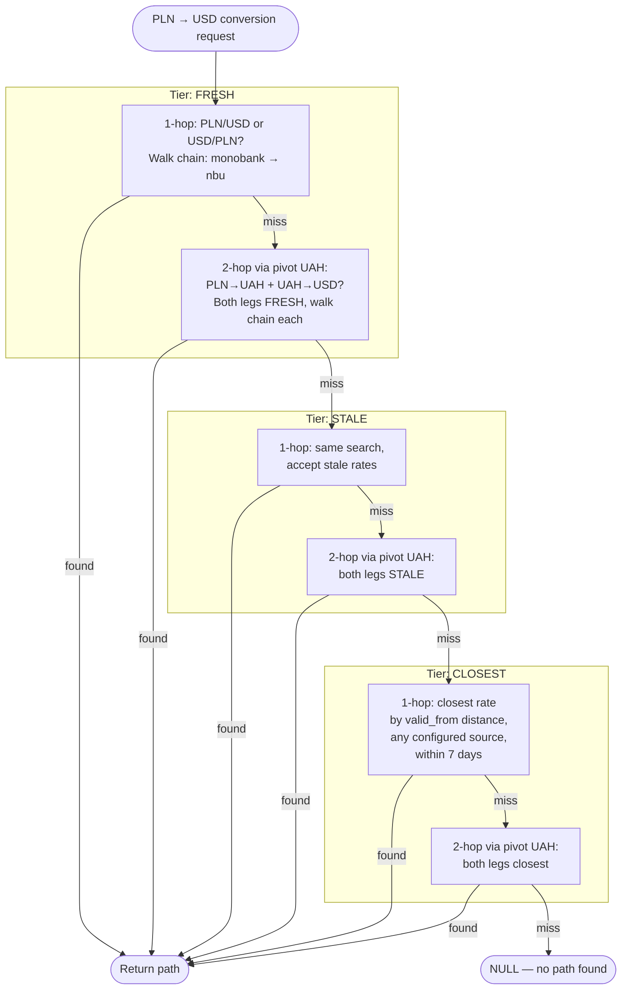
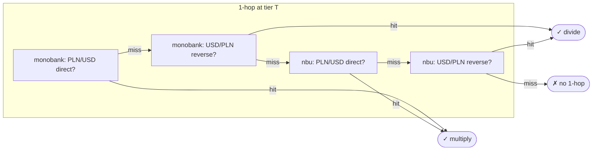
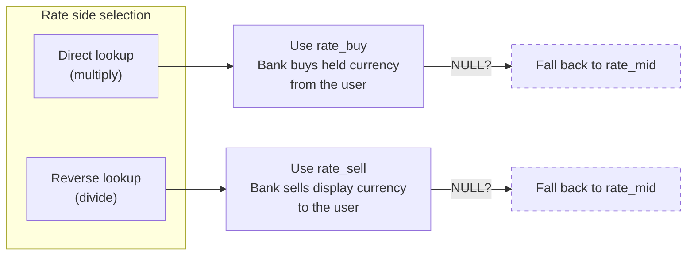

# Currency Conversion — Design & Logic Reference

A companion to `technical-considerations.md` (section 2.6) and
`currency_conversion_test_suite.md`. This document explains *why* the
currency conversion subsystem works the way it does, what each piece is
responsible for, and where the tricky bits live. It is written for two
audiences:

1. **Developer** — as a learning reference for a logic-heavy part of the
   pipeline.
2. **Agents** — as authoritative context when implementing tests, extending
   the fallback chain, or adding new rate sources.

---

## 1. The problem in one paragraph

A Monobank transaction arrives in PLN. The user's dashboard shows amounts
in UAH, USD, and EUR. The consumer must convert PLN to all three display
currencies using exchange rates that may come from multiple sources
(Monobank, NBU, eventually ECB), may be stale, may be stored in the
reverse direction, and may require chaining through an intermediate
currency. The conversion must pick the most honest rate available, record
exactly how it got there, and degrade gracefully when rates are missing.

---

## 2. What the files do

```
currency_rate_repo.py               DB queries — find rates, load fallback chain config
currency_conversion_service.py      Business logic — resolve a rate path, apply it
0006_rate_source_config.py          Migration — adds last_polled_at + fallback config table
currency_conversion_test_suite.md   Test spec — 38 unit + 20 integration tests
```

The repo is a pure data-access layer with zero business logic. The service
is where all the decisions happen. The migration creates the database
structures both depend on.

---

## 3. The data model underneath

### 3.1 `currency_rates` — SCD Type 2 rate history

Each row is one rate observation: a source (monobank, nbu) quoting a
currency pair (PLN/UAH) with a validity window (`valid_from` to
`valid_to`). When the rate stays the same
between polls, only `last_polled_at` is bumped.

Key columns:

| Column           | Role                                                         |
|------------------|--------------------------------------------------------------|
| `source`         | Which provider published this rate (`monobank`, `nbu`)       |
| `currency_from`  | The base currency of the quote (e.g. `USD`)                  |
| `currency_to`    | The quote currency (e.g. `UAH`)                              |
| `rate_buy`       | Bank's buy price (nullable — NBU doesn't publish bid/ask)    |
| `rate_sell`      | Bank's sell price (nullable)                                 |
| `rate_mid`       | Mid-market rate (always present)                             |
| `valid_from`     | When this rate became effective                              |
| `valid_to`       | When this rate was superseded (`NULL` = still current)       |
| `last_polled_at` | Last time the ingestion loop confirmed this rate was current |

The distinction between `valid_to` and `last_polled_at` is the core
insight: `valid_to` tells you *when the rate changed*, while
`last_polled_at` tells you *when the system was last alive to check*. If
the polling loop was down for 6 hours, the rate row might still show
`valid_to = NULL` (the rate never changed), but `last_polled_at` is 6
hours old — the consumer knows it can't trust that "unchanged" signal.

### 3.2 `rate_source_config` — the fallback chain

A tiny config table (2 rows today) that defines:

| source   | fallback_source | max_staleness_seconds | base_currencies |
|----------|-----------------|-----------------------|-----------------|
| monobank | nbu             | 7200 (2h)             | {UAH}           |
| nbu      | NULL            | 90000 (25h)           | {UAH}           |

This is a linked list: monobank falls back to nbu, nbu has no fallback.
The `max_staleness_seconds` is the maximum acceptable gap between
`last_polled_at` and the transaction time before the consumer considers
the rate untrustworthy for that source.

`base_currencies` lists the currencies each source prices everything
against. Both Monobank and NBU price against UAH, so all their rates have
UAH on one side. This determines which intermediate currencies are
available for multi-hop conversion (see section 5.3).

---

## 4. The three tiers of rate quality

Every rate lookup is classified into one of three tiers. This is the
single most important concept in the whole subsystem — the tier system
drives the resolution order and determines which rate wins.

### FRESH — the rate was actively monitored at transaction time

The rate row's validity window covers the transaction time, AND the gap
between `last_polled_at` and transaction time is within
`max_staleness_seconds`.

In plain terms: "the system was alive, polling this source, and the rate
was current when this transaction happened."

### STALE — the rate was valid but the system wasn't watching

The validity window covers the transaction time, BUT `last_polled_at` is
older than `max_staleness_seconds`. The rate might be correct — it was
never superseded — but the system can't vouch for it because the polling
loop was down or delayed.

When does this happen in practice? If the ingestion service restarts and
misses a few poll cycles, or if there's a network issue reaching the
Monobank/NBU API. The rate row stays open (nothing closed it), but
`last_polled_at` drifts.

### CLOSEST — no rate row covers this time at all

No source in the chain has a rate whose validity window includes the
transaction time. The system falls back to the nearest rate by
`valid_from` distance, within a 7-day cap.

When does this happen? During backfill. If you're processing a
transaction from 3 months ago and rate history doesn't go back that far,
CLOSEST finds the nearest available rate and uses it. It's the "best
effort" tier.

### Why three tiers matter

The resolution loop iterates tiers in order: FRESH, then STALE, then
CLOSEST. Within each tier, it tries all possible paths (direct, reverse,
multi-hop) before moving to the next tier. This means:

- A FRESH rate from NBU (the fallback source) beats a STALE rate from
  Monobank (the primary source). Freshness trumps source authority.
- A STALE direct rate beats a CLOSEST anything. Having a rate in the
  validity window — even if the system wasn't watching — is better than
  grabbing the nearest historical rate.
- A 2-hop FRESH path beats a 1-hop STALE path. Tier is the primary sort
  key; hop count is secondary.

The tier is recorded in metadata so you can audit conversion quality
after the fact.

---

## 5. Rate path resolution — the search algorithm

Given a source currency (e.g. PLN) and a target display currency (e.g.
USD), the service needs to find a *path* — a sequence of rate lookups
that connects the two. The algorithm is structured as two nested loops:
the outer loop iterates tiers, the inner loop tries increasingly complex
paths.



### 5.1 The outer loop: tier iteration

```
for tier in (FRESH, STALE, CLOSEST):
    try 1-hop at this tier
    try 2-hop at this tier
    if found → return
```

This is tier-major ordering. Once a path is found at any tier, the search
stops. No lower-quality path is ever considered.

### 5.2 The inner loop: 1-hop resolution

For a given tier, the service first tries to find a single rate that
connects source → target directly. Within a tier, it walks the fallback
chain (monobank → nbu) trying each source in priority order. For each
source, it tries two directions:



For each source, it tries two directions:

1. **Direct**: look up `(source_currency, target_currency)` as stored.
   If found, the conversion is a multiplication: `amount * rate`.
2. **Reverse**: look up `(target_currency, source_currency)` — the pair
   stored backwards. If found, the conversion is a division:
   `amount / rate`.

Direct is tried before reverse at each source. Source priority (chain
order) beats direction preference — a reverse rate from Monobank is
preferred over a direct rate from NBU, within the same tier.

The CLOSEST tier works differently: instead of walking the chain with
staleness checks, it asks the database for the single closest rate (by
`valid_from` distance) across all configured sources, within 7 days.

### 5.3 The inner loop: 2-hop resolution (chaining through a pivot)

If no 1-hop path exists at the current tier, the service tries 2-hop
paths through a pivot currency. The pivot list comes from
`rate_source_config.base_currencies`, ordered by chain depth (monobank's
pivots first, then nbu's), deduplicated.

Today, both sources have `base_currencies = {UAH}`, so the only pivot is
UAH. A PLN → USD conversion might resolve as PLN → UAH → USD.

Each leg of a 2-hop path is resolved independently using the same
direct-then-reverse logic. Critically, **both legs must resolve at the
same tier**. You can't mix a FRESH first leg with a STALE second leg — if
leg 2 fails at FRESH, the entire 2-hop attempt at FRESH fails, and the
outer loop moves to the next tier.

Why this constraint? Without it, you'd get inconsistent quality metadata.
A "FRESH" path where one leg is actually stale is misleading. The tier
label on the path must honestly reflect the worst leg.

### 5.4 What happens when nothing resolves

If all tiers are exhausted and no path exists, the converted amount is
`NULL`. The transaction is still inserted — it just has `NULL` for that
display currency. A warning is logged. The dashboard will show a gap.

This is intentional: a missing rate is better than a fabricated one.

---

## 6. Rate-side selection — which price to use

Monobank publishes three prices for major pairs: `rate_buy`, `rate_sell`,
and `rate_mid` (or `rate_cross` for non-UAH pairs). NBU publishes only a
mid rate. The service must pick the right side.

The mental model is **liquidation**: "if I sold my held currency right
now, how much display currency would I get?" This is the conservative
view — it shows the user the realistic value of their money, not the
optimistic one.



The rule, implemented in `_pick_rate`:

| Conversion direction | Rate used  | Intuition                                    |
|----------------------|------------|----------------------------------------------|
| Direct (multiply)    | `rate_buy` | Bank *buys* the held currency from the user  |
| Reverse (divide)     | `rate_sell`| Bank *sells* the display currency to the user|

If the chosen side is `NULL` (NBU, or any pair without bid/ask), fall
back to `rate_mid`. **Never** fall through to the opposite side — using
`rate_sell` when `rate_buy` is the correct side would flip the sign of
the spread error and overstate the user's balance.

In a 2-hop path, each leg applies the rule independently. A PLN → UAH →
USD path through Monobank compounds the spread twice — that's honest (it
reflects the real cost of routing through UAH), but more pessimistic than
a direct cross-quote would be.

The chosen side is recorded in metadata as `rate_side: "buy" | "sell" |
"mid"` per step.

---

## 7. The divide-vs-multiply distinction

This is the trickiest mechanical detail. When a rate is stored as
A/B = 41.50 (meaning 1 A buys 41.50 B), converting 100 A to B is
`100 * 41.50 = 4150`. But converting 100 B to A requires
`100 / 41.50 = 2.41`.

The service tracks this with a `divide: bool` flag on each `_RateStep`.
The `apply` method on a step does:

```python
def apply(self, amount: Decimal) -> Decimal:
    return amount / self.rate if self.divide else amount * self.rate
```

Why not just store `1/rate` and always multiply? Because division avoids
an intermediate rounding step. `100 / 41.50` is computed in one Decimal
operation. `100 * (1/41.50)` requires first computing `1/41.50`
(truncated to 28 digits), then multiplying — two operations, one extra
rounding. For a personal finance app the difference is sub-cent, but the
divide approach is mathematically cleaner and it's what `effective_rate`
in the metadata reflects.

The `effective_rate` field in metadata is computed by applying all steps
to `Decimal(1)` — so for a divide step it's `1/rate`, which *does* have
the intermediate rounding. This means `amount * effective_rate` and
`path.apply(amount)` can theoretically disagree at the last digit of
Decimal precision. The test suite has an explicit test for this (test
spec section 5, test 18).

---

## 8. The fallback chain — how `load_source_chain` works

The repo loads the chain with a recursive CTE starting from the
transaction's source (e.g. `monobank`), following `fallback_source`
links, ordered by depth. The result is a `list[SourceConfig]` — monobank
first, nbu second.

Safety checks:
- **Depth cap** (`_MAX_CHAIN_DEPTH = 10`): if the CTE hits 10 levels and
  the last row still has a non-NULL `fallback_source`, raise
  `RateSourceChainError`. This catches both excessively deep chains and
  cycles (a cycle like a→b→c→a never terminates naturally, but the depth
  cap stops it at 10 rows).
- **Unknown source**: if the entry source isn't in `rate_source_config`,
  the CTE returns zero rows → the service gets an empty chain → all
  conversions return NULL (except identity). No crash.

The chain entry point is `event.source` — the bank that originated the
transaction. This means a Monobank transaction starts the chain at
monobank, and a future Revolut transaction would start at revolut. The
chain is per-source, not global.

---

## 9. Pivot currencies — how the system decides where to chain through

When a 2-hop path is needed, the service tries pivoting through
currencies listed in `rate_source_config.base_currencies`. The function
`_ordered_pivots` flattens these lists in chain order (monobank's pivots
first, then nbu's), deduplicated.

Today: both sources list `{UAH}`, so the only pivot is UAH. This works
because both Monobank and NBU price everything against UAH.

If you add an ECB source with `base_currencies = {EUR, USD}`, the pivot
list becomes `[UAH, EUR, USD]`. A GBP → JPY conversion could chain
through any of them — whichever has a rate. The chain-order dedup means
Monobank's UAH is tried before ECB's EUR, which is tried before ECB's
USD.

Pivots that equal the source or target currency are skipped — chaining
PLN → USD → USD is nonsensical.

---

## 10. Metadata — what gets recorded and why

Every successful conversion writes a `rate_{currency}` entry to the
transaction's `metadata` JSONB field. The structure per target currency:

```json
{
  "rate_usd": {
    "path": [
      {
        "from": "PLN",
        "to": "UAH",
        "source": "monobank",
        "rate_id": 42,
        "rate": "10.9",
        "rate_side": "buy",
        "tier": "fresh",
        "op": "multiply"
      },
      {
        "from": "UAH",
        "to": "USD",
        "source": "monobank",
        "rate_id": 88,
        "rate": "0.024",
        "rate_side": "buy",
        "tier": "fresh",
        "op": "multiply"
      }
    ],
    "effective_rate": "0.2616",
    "hops": 2,
    "quality": "fresh",
    "sides": ["buy"]
  }
}
```

Fields per step:
- `from` / `to` — the logical direction of the conversion (may differ
  from how the rate is stored if `op: "divide"`)
- `source` — which rate provider's data was used
- `rate_id` — FK to `currency_rates.id`, for audit trail
- `rate` — the raw rate value from the database
- `rate_side` — which price column was used (`buy`, `sell`, `mid`)
- `tier` — the quality tier this rate was resolved at
- `op` — `"multiply"` or `"divide"`, how the rate was applied

Summary fields:
- `effective_rate` — the compounded rate across all steps (product of
  multiply steps, with divide steps contributing `1/rate`)
- `hops` — number of steps (1 or 2)
- `quality` — the worst tier across all steps (if leg 1 is FRESH and leg
  2 is STALE, quality is STALE)
- `sides` — sorted, deduplicated set of rate sides used across all steps

Identity conversions (transaction already in the target currency) produce
no metadata entry — there's nothing to trace.

---

## 11. Edge cases and their handling

### Transaction time before `last_polled_at`

This happens during backfill: a transaction from January is processed in
April, and the rate's `last_polled_at` is from yesterday's poll. The
staleness check computes `lag = at_time - last_polled_at`, which is
negative. The code treats `at_time <= last_polled_at` as FRESH — the
system was alive *after* the transaction time, so the rate was confirmed
at some point.

### `last_polled_at` is NULL

The DB schema says `NOT NULL`, but the Python dataclass allows `None`
defensively. If a row somehow has `NULL`, it is excluded from **all
tiers** — FRESH/STALE skip it in `_try_pair`, and the CLOSEST query
filters with `last_polled_at IS NOT NULL`. A rate without polling
metadata is untrusted at every quality level.

### No rate sources configured for a transaction's bank

`load_source_chain` returns an empty list. The service iterates over
zero sources at each tier, finds nothing, returns `None` for all
non-identity conversions. No crash — just NULL amounts and log warnings.

### Rate exists in reverse but not direct

Common case: NBU publishes EUR/UAH but not UAH/EUR. The service finds
the reverse pair and divides. The metadata records `op: "divide"` and
`rate_side: "sell"` (liquidation semantics: the bank sells EUR to the
user).

### Cyclic fallback chain

`load_source_chain`'s recursive CTE walks cycles until the depth cap
(10) stops it. The post-fetch check detects the anomaly (last row's
`fallback_source` is not NULL at depth 10) and raises
`RateSourceChainError`. The consumer does **not** catch this — the
transaction fails loudly.

### Very old transactions during backfill

The CLOSEST tier has a 7-day maximum distance. If a transaction is older
than 7 days from any rate row, the conversion returns NULL. The solution
is to run the rate backfill job first (NBU historical rates), which
populates `currency_rates` for the backfill window.

---

## 12. How to add a new rate source

Adding a third source (e.g. ECB) requires:

1. **Migration**: insert a row into `rate_source_config` with
   `fallback_source` pointing to the appropriate existing source,
   `max_staleness_seconds` matching the source's update frequency, and
   `base_currencies` listing which currencies the source prices
   everything against (e.g. `{EUR, USD}` for ECB).

2. **Ingestion service**: add `banks/ecb/client.py` and
   `banks/ecb/rates_provider.py` following the Monobank/NBU pattern.
   Register the provider in the rate polling loop.

3. **No consumer changes needed.** The consumer reads the chain from the
   database. As long as the new source's rates are in `currency_rates`
   and the config row exists, the fallback chain and pivot system pick
   them up automatically.

The only code that needs to know about individual sources is the
ingestion service (where to fetch rates from). The consumer is
source-agnostic by design.

---

## 13. Relationship to other subsystems

The currency conversion service is called by `TransactionHandler.handle`
after transfer detection and ID resolution. It receives the raw event,
queries the database for rates, and returns a `ConversionResult` with
three display amounts and the rate metadata dict. The handler merges the
rate metadata into the transaction's existing metadata (bank-specific
fields like `comment`, `receipt_id`) and passes everything to the
transaction repo for insert.

The service has no side effects — it only reads from `currency_rates` and
`rate_source_config`. It doesn't write, doesn't publish, doesn't modify
the event. This makes it safe to retry and easy to test.

---

## 14. Test architecture overview

The test suite (`currency_conversion_test_suite.md`) is structured in
three layers:

1. **Pure function tests** (sections 2.1–2.7) — test `_pick_rate`,
   `_ordered_pivots`, `_ensure_tz`, `_RateStep.apply`, `_RatePath`
   compound behavior. No database, no service instantiation. These run
   in milliseconds.

2. **Service tests with in-memory repo** (sections 3.1–3.9) — test the
   full resolution algorithm (tier ordering, source priority, multi-hop,
   rate-side selection, metadata shape) against an `InMemoryRateRepo`
   that mirrors the real repo's interface but stores rates in a list.
   Fast, deterministic, exercises all business logic branches.

3. **Integration tests with real DB** (sections 4–5) — test the SQL
   queries (SCD2 window matching, closest-rate distance, recursive CTE
   chain loading) and the full service end-to-end against TimescaleDB.
   Each test runs in a rolled-back transaction.

The in-memory repo is load-bearing: it lets the service tests exercise
every resolution path without database overhead or timing sensitivity.
The integration tests then verify that the SQL behaves identically to the
in-memory simulation.
