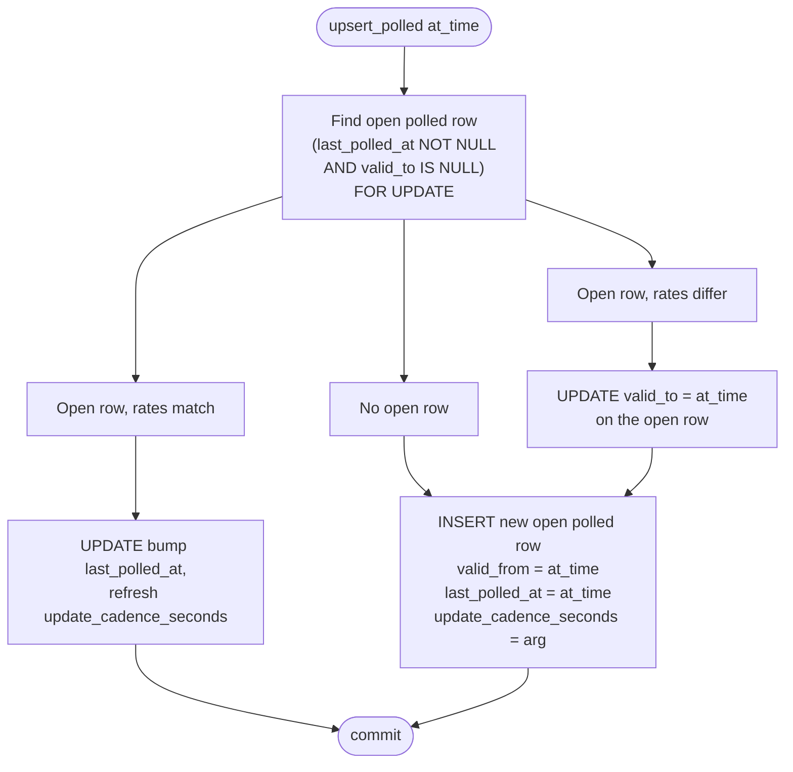
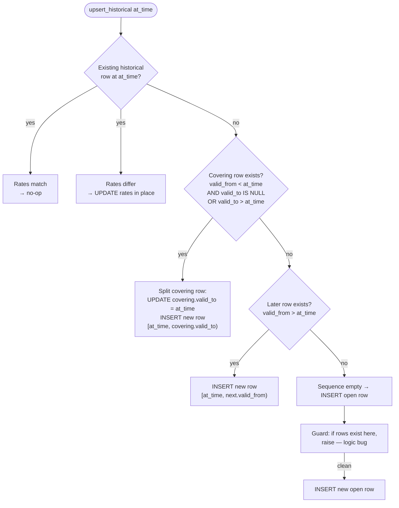

# Currency Rate Ingestion — Design & Logic Reference

Stateless description of the rate ingestion subsystem.
Companion to `ingestion-currency-rate-test-suite.md`. Describes current
behavior only.

## 1. Problem

Third-party rate providers publish foreign-exchange data in different
shapes:

- **Poll-based providers** (Monobank) expose a "current rates" endpoint with live bid/ask/mid. We scrape it on a schedule. The value is "as of now" at each poll.
- **Historical providers** (NBU) publish rates tagged with the date they are effective for. A single fetch might return one row per currency per day.

Both shapes must land in a single `currency_rates` SCD2 table that the
consumer-side conversion service reads. The ingestion layer's job is to
normalize provider output into rows that fit the SCD2 invariants:

- No overlapping intervals within the same `(source, currency_from, currency_to, kind)` sequence.
- `valid_from` is the point from which the rate applies (publication time for historical; poll moment for polled).
- Polled rows carry `last_polled_at` and `update_cadence_seconds`; historical rows carry neither.

## 2. Files

```
main.py                             FastAPI lifespan, provider registration, poll loops
models.py                           NormalizedRate, RateKind, RateProviderConfig
services/currency_rate_service.py   Dispatch by kind to the correct upsert
repositories/currency_rate_repo.py  upsert_polled / upsert_historical
banks/monobank/rates_provider.py    Monobank polled-rates fetcher
banks/nbu/rates_provider.py         NBU live + historical-range fetchers
```

Providers fetch and normalize. Service dispatches. Repo mutates.
Providers have no DB access; service has no provider knowledge beyond
the `RateProviderConfig` passed in.

## 3. Data model

### 3.1 `NormalizedRate`

Provider output after normalization. One instance per (source, pair,
moment).

| Field           | Meaning                                                |
|-----------------|--------------------------------------------------------|
| `source`        | `"monobank"`, `"nbu"`, …                               |
| `currency_from` | ISO 4217 alpha code                                    |
| `currency_to`   | ISO 4217 alpha code                                    |
| `rate_buy`      | Provider's buy price (nullable)                        |
| `rate_sell`     | Provider's sell price (nullable)                       |
| `rate_mid`      | Mid-market rate (always present)                       |
| `at_time`       | Authoritative timestamp from the provider              |

`at_time` means different things per kind:

- **Polled**: moment of observation. Monobank's `date` field (Unix seconds) turned into a UTC datetime.
- **Historical**: effective publication date. NBU's date string (`DD.MM.YYYY`) parsed as UTC midnight.

The type alone doesn't encode kind — the same `NormalizedRate` class
serves both. Kind is carried by the surrounding `RateProviderConfig`.

### 3.2 `RateKind`

```python
class RateKind(StrEnum):
    POLLED = "polled"
    HISTORICAL = "historical"
```

Discriminates which upsert path applies. A provider is one kind for its
lifetime; a source can have multiple providers (e.g. NBU has both a
live poller and a historical-range fetcher, each a separate
`RateProviderConfig`).

### 3.3 `RateProviderConfig`

| Field              | Meaning                                              |
|--------------------|------------------------------------------------------|
| `source`           | Destination source name in `currency_rates`.         |
| `fetch`            | Async callable returning `list[NormalizedRate]`.     |
| `interval_seconds` | Poll loop sleep between fetches. For polled configs it's also written to `update_cadence_seconds` on each row. |
| `kind`             | `RateKind.POLLED` or `RateKind.HISTORICAL`.          |

For historical providers `interval_seconds` controls how often the
lifespan task re-fetches, but is not written to rows.

## 4. Two upsert paths

The repo maintains two independent SCD2 sequences per `(source,
currency_from, currency_to)`: one polled, one historical. Neither
upsert ever touches rows of the other type. Their sequences can overlap
each other in time; the consumer's `find_closest_rate` tie-breaks in
favor of polled when proximity is equal.

### 4.1 `upsert_polled`

Anchored at an observation moment (`at_time`, passed in from the
`NormalizedRate`):



Concurrency: the `SELECT ... FOR UPDATE` inside the transaction
serializes concurrent pollers for the same pair. A second poller
arriving during the first's transaction blocks on the lock and sees
fresh state when it proceeds.

### 4.2 `upsert_historical`

`at_time` is the declared effective moment. Logic is slot-in with SCD2
invariant preservation. Four cases:



Concurrency: `pg_advisory_xact_lock` keyed on
`hashtextextended(source || currency_from || currency_to, 0)`.
Serializes concurrent historical writers for the same pair. Row-level
locks aren't enough because the operation may touch multiple rows
(split) and the target rows aren't knowable upfront.

The advisory lock and polled `FOR UPDATE` operate on disjoint row sets,
so polled and historical writers for the same pair don't block each
other.

### 4.3 Why two paths

The paths answer different questions:

- **Polled**: "we observed rate X at moment T. Record or extend."
- **Historical**: "the source says rate Y was in effect from moment T. Slot into the known history."

Merging them into one function forces a discriminator parameter and a
branching body that mostly runs disjoint code. Two methods with sharp
contracts are clearer and independently testable.

## 5. Providers

A provider is an async function `() -> list[NormalizedRate]`. It knows
about the external API, handles its idiosyncrasies, and returns
normalized rows. No DB access.

### 5.1 Monobank polled provider

Hits Monobank's `/bank/currency` endpoint. Normalizes each entry:

- Resolves numeric ISO codes to alpha (`currency_code_a`/`_b` → `UAH`, `USD`, etc.). Pairs with unknown numeric codes are skipped silently.
- `rate_mid`: prefers `rate_cross` if present, otherwise `(rate_buy + rate_sell) / 2`. If neither is derivable, the row is dropped.
- `rate_buy` / `rate_sell`: from the provider as-is (may be NULL).
- `at_time`: Monobank's `date` field as UTC.

A single fetch returns the current snapshot — typically ~30 rows, one
per supported pair.

### 5.2 NBU polled provider

Hits NBU's exchange-rate endpoint. Each entry becomes:

- `currency_from = r.cc`, `currency_to = UAH`.
- `rate_buy = rate_sell = NULL` (NBU publishes a single rate).
- `rate_mid = r.rate`.
- `at_time` parsed from NBU's `DD.MM.YYYY` string at UTC midnight.

Configured as `RateKind.HISTORICAL` — every row NBU publishes is
effective-dated, even in the "live" endpoint, and has no intra-day
polling semantics.

### 5.3 NBU historical-range provider

`fetch_historical_rates(from_date, to_date)`: iterates ISO alpha codes
other than UAH, calls NBU's historical endpoint per currency, yields
one `NormalizedRate` per (currency, date). `rate_mid` computed as
`amount / units` to normalize for quotes like "100 JPY per N UAH."

Used for backfills. Not currently wired into the lifespan task loop —
triggered manually or from a one-off script.

## 6. Wiring

`main.py` registers providers at app boot:

```python
_RATE_PROVIDERS: list[RateProviderConfig] = [
    RateProviderConfig(
        source=RateSource.monobank,
        fetch=monobank_fetch_rates,
        interval_seconds=300,
        kind=RateKind.POLLED,
    ),
    RateProviderConfig(
        source=RateSource.nbu,
        fetch=nbu_fetch_rates,
        interval_seconds=86400,
        kind=RateKind.HISTORICAL,
    ),
]
```

For each config, `lifespan` spawns `_rate_loop` as a long-lived task.
The loop:

1. Calls `config.fetch()`. Any exception is logged; the loop continues.
2. Calls `service.ingest_rates(pool, rates, config)`. Any exception is logged; the loop continues.
3. Sleeps `config.interval_seconds`.

On app shutdown, all rate tasks are cancelled and awaited (eating the
`CancelledError`). Errors in one provider's fetch or write do not
affect other providers.

## 7. Service layer

`CurrencyRateService.ingest_rates(pool, rates, config)`:

1. Acquire a connection from the pool.
2. Branch on `config.kind`:
   - `HISTORICAL`: for each rate, call `repo.upsert_historical`.
   - `POLLED`: for each rate, call `repo.upsert_polled` passing `config.interval_seconds` as `update_cadence_seconds`.
3. Log count.

One connection shared across all rates in a batch. Each upsert is its
own transaction internally. No service-level transaction spans the
batch — if row 5 fails, rows 1–4 stay committed.

## 8. Relationship to consumer

This ingestion subsystem writes to `currency_rates`. The consumer's
`CurrencyConversionService` reads from `currency_rates` but never
writes. The table is the only coupling point between the two services.
Schema changes affect both; ingestion owns the write contract,
consumer owns the read contract.

`rate_source_config` is consumer-only — ingestion doesn't consult it.
A source can exist in `currency_rates` without appearing in
`rate_source_config`; the consumer simply won't route to it.

## 9. Edge cases

### Rates equal across the boundary

Polled: open row has rates `X`, new observation also has rates `X`.
We bump `last_polled_at` rather than closing and opening. Keeps the
row set small; preserves the "this rate has been live since `valid_from`" claim.

Historical: `upsert_historical` with `at_time` matching an existing
row's `valid_from` and same rates → no-op. Idempotent retry works
cleanly.

### Different rates at same `valid_from` (historical)

An existing historical row at `valid_from = V` with rates `X`, and a
new upsert for `V` with rates `Y`. Treated as a source correction:
rates updated in place; `valid_to` untouched; no new row inserted.
The historical sequence invariant (one row per `valid_from`) is
preserved. Worth logging at the call site if audit matters.

### Partial provider data

Monobank returns an entry with no `rate_cross`, no `rate_buy`, and no
`rate_sell`: provider drops the row. Never reaches the service.

Pair has unknown numeric ISO code: provider drops the row.

The service/repo never see malformed rows from the provider layer.

### Provider fetch failure

Logged, loop continues. No partial write — if `fetch()` raises, no
upsert runs for that cycle. Next cycle tries fresh.

### Write failure mid-batch

Rate 1–4 committed, rate 5 raises: the exception propagates out of the
service, is logged in `_rate_loop`, the loop continues. Rates 6–N in
the same batch never get written. Rate 5 is reattempted next cycle —
idempotent for polled (bump or no-op) and historical (compare or slot).

### Historical slot-in under concurrent writers

Two historical upserts for the same pair but different `valid_from`
values arriving simultaneously: the advisory lock serializes them.
Whichever commits first finishes; the second reads fresh state and
slots in. No overlap can result.

### Cross-kind same-instant conflict

Polled poller observes at `T`; historical upsert also arrives for
`valid_from = T`. Under the current model both rows coexist (polled
and historical rows never collide by design — the uniqueness key
includes row kind via `last_polled_at IS NULL`). Consumer tie-break
picks the polled row on exact proximity ties.

### Webhook-triggered updates (future)

The wiring is pull-only today. If a webhook mechanism pushes a single
rate update mid-cycle, calling `service.ingest_rates(pool,
[normalized], config)` works the same way. No service-level changes
needed.

## 10. Adding a new provider

1. Write `fetch_rates()` in a new `banks/{name}/rates_provider.py`. Return `list[NormalizedRate]`.
2. Register in `main.py` `_RATE_PROVIDERS` with `source`, `interval_seconds`, `kind`.
3. If the source should participate in the consumer's fallback chain, add a row to `rate_source_config` (consumer-side concern, separate PR).

No changes to `CurrencyRateService`, `CurrencyRateRepo`, or the lifespan
plumbing.

## 11. Adding a new ingestion kind

Introducing a third `RateKind` (e.g. `STREAMED`) would require:

1. New `upsert_*` method on the repo.
2. New branch in `CurrencyRateService.ingest_rates`.
3. New `SCD2` semantics for the kind, documented here.

The two-kind design is deliberate. Adding a third is a real change,
not an incidental extension.
