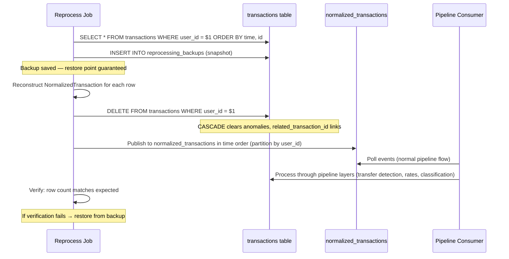

# ADR: Transaction Reprocessing

Status: **Draft** — designed, not yet implemented.

---

## Problem

The consumer pipeline evolves over time — new layers are added (transfer detection, ML classification, rate improvements). When a layer is introduced or its logic changes, existing transactions in the database were processed under the old rules. We need a way to re-run the full pipeline on historical data without:

- Re-fetching from Monobank API (rate-limited, slow, unnecessary)
- Writing per-feature migration scripts (diverge from runtime code path)
- Losing data during the process

## Decision

A **reprocessing job** that:
1. Reads existing transaction rows from the database
2. Reconstructs `NormalizedTransaction` from stored columns (source-agnostic — one format regardless of bank count)
3. Deletes the original rows
4. Republishes events to the `normalized_transactions` Kafka topic
5. The pipeline consumer processes them fresh through all downstream layers (transfer detection, rates, classification)

This exercises the same code path as normal pipeline consumption. Normalization is upstream (in the normalization consumer) and is NOT re-exercised — if normalization logic has a bug, the fix is re-fetching from bank APIs (a sibling operation, not a reprocess variant). See `adr-consumer-pipeline-architecture.md` for the two-consumer architecture.

## Why topic round-trip (not direct handler call)

- **Same code path:** No special "reprocess" mode in the pipeline consumer. Events flow through the standard layer sequence.
- **Source-agnostic:** The reprocess job publishes `NormalizedTransaction` — one format. No per-source reconstruction logic, no linear growth with bank count.
- **Load balancing:** At scale, we control pace via publish rate. The pipeline consumer processes at its own speed.
- **Ordering:** The job publishes in `(time, id)` order within a single producer — Kafka preserves this within a partition. Note: transfer detection is order-independent by design (first leg inserts, second leg finds and pairs regardless of arrival order), so ordering is for reproducibility rather than correctness. Producer should use `enable.idempotence=true` to prevent reordering on retries.
- **Decoupling:** The job only needs DB read access + Kafka producer. No import of consumer internals.

## Prerequisites

All prerequisites below are **hard blockers** — reprocessing cannot function without them. They must be implemented before the reprocessing job is deployed.

### `rate_source` column

The currency conversion layer uses `rate_source` to select which rate chain to query. Currently not stored in the `transactions` table. Without it, `NormalizedTransaction` cannot be reconstructed and reprocessing is impossible.

```sql
ALTER TABLE transactions ADD COLUMN rate_source TEXT;
-- Backfill: derivable from source
UPDATE transactions SET rate_source = 'monobank' WHERE source = 'monobank';
UPDATE transactions SET rate_source = 'nbu' WHERE source = 'manual';
```

### `reprocessing_locks` table (status indicator)

```sql
CREATE TABLE reprocessing_locks (
    user_id    UUID PRIMARY KEY REFERENCES users(id),
    locked_at  TIMESTAMPTZ NOT NULL DEFAULT now()
);
```

Status indicator for frontend/observability. Actual mutual exclusion is via `pg_advisory_xact_lock`. Separate from `users` — avoids contention on RLS-protected core table.

### `reprocessing_backups` table

```sql
CREATE TABLE reprocessing_backups (
    id         UUID PRIMARY KEY DEFAULT gen_random_uuid(),
    user_id    UUID NOT NULL REFERENCES users(id),
    data       JSONB NOT NULL,
    created_at TIMESTAMPTZ NOT NULL DEFAULT now()
);
```

Stores pre-delete snapshots. Survives pod termination (unlike local filesystem in K8s Jobs).

### Metadata separation

The stored `metadata` JSONB merges the original bank metadata (`counter_name`, `counter_edrpou`, `comment`, `receipt_id`) with rate conversion metadata (`rate_usd`, `rate_eur`, `rate_uah`). When reconstructing `NormalizedTransaction`, strip `rate_*` keys — they'll be recomputed by the conversion layer.

## Event reconstruction

The reprocessing job reconstructs `NormalizedTransaction` from stored DB columns and publishes to the `normalized_transactions` topic. This is **source-agnostic** — one reconstruction function regardless of how many banks exist. The information-loss rule (see `adr-consumer-pipeline-architecture.md`) guarantees all meaningful normalized fields are persisted.

All `NormalizedTransaction` fields are recoverable from the stored row:

| Field                      | Source column              | Notes                                              |
|----------------------------|----------------------------|----------------------------------------------------|
| `id`                       | `id`                       |                                                    |
| `source`                   | `source`                   |                                                    |
| `source_id`                | `source_id`                |                                                    |
| `user_id`                  | `user_id`                  |                                                    |
| `account_id`               | `account_id`               |                                                    |
| `time`                     | `time`                     |                                                    |
| `amount_cents`             | `amount_cents`             |                                                    |
| `operation_amount_cents`   | `operation_amount_cents`   |                                                    |
| `operation_currency_code`  | `operation_currency_code`  |                                                    |
| `description`              | `description`              |                                                    |
| `mcc`                      | `mcc`                      |                                                    |
| `cashback_amount_cents`    | `cashback_amount_cents`    |                                                    |
| `balance_cents`            | `balance_cents`            |                                                    |
| `hold`                     | `hold`                     |                                                    |
| `transaction_type`         | `raw_transaction_type`     | The original type before pipeline reclassification |
| `counterparty_iban`        | `counterparty_iban`        |                                                    |
| `metadata`                 | `metadata` with `rate_*` keys stripped |                                      |
| `rate_source`              | `rate_source` (new column) |                                                    |

**Topic:** publishes to `normalized_transactions`.

### Why publish to `normalized_transactions` (not per-source topics)

Reprocessing fixes downstream-layer bugs (transfer detection, currency conversion, classification). It does NOT fix normalization bugs — if the normalizer mapped a field wrong, the stored data is already wrong-normalized and reprocessing would reproduce the same error. Normalization bugs require **re-fetching** from bank APIs (a separate operational procedure, out of scope for this ADR).

Publishing to `normalized_transactions` means:
- One reconstruction format regardless of bank count (no per-source logic)
- No coupling to bank-native payload formats (which may have changed since ingestion)
- The reprocess job imports nothing from the normalization consumer

## Job design

```
Location: services/consumer/src/grosh_consumer/jobs/run_reprocess.py
Scope: configurable — accepts an optional list of user_ids
```

### Parameters

| Parameter | Type | Default | Meaning |
|---|---|---|---|
| `user_ids` | `list[UUID] \| None` | `None` | Users to reprocess. `None` = all users. |

When `user_ids` is `None`, the job queries all distinct user_ids from the transactions table and processes them sequentially (one user at a time — backup, delete, publish, verify, then next user). This keeps the deletion window per-user rather than global.

### Trigger mechanisms

**Per-user endpoint** (consumer service, authenticated):
```
POST /reprocess
```
Acts on the current authenticated user. No admin role required — users can trigger reprocessing of their own data (e.g. after linking a new account, or if they notice stale classification).

**Batch K8s Job** (ops, all users or subset):
```bash
# All users
kubectl apply -f infra/k8s/reprocess-job-template.yaml

# Specific users (via env var)
USER_IDS=uuid1,uuid2 envsubst < infra/k8s/reprocess-job-template.yaml | kubectl apply -f -
```
Used for maintenance operations (new pipeline layer deployed, logic change, bulk fix). Runs to completion independently — no HTTP timeout concerns. Visible via `kubectl get jobs` / `kubectl logs`.

**Why K8s Job for batch (not an admin endpoint):** Reprocessing all users takes minutes. That's a batch workload, not a request/response API call. An admin endpoint would just be a thin wrapper that creates the Job anyway — skip the indirection.

### Flow



### Safety: backup before delete

The job inserts a full snapshot into `reprocessing_backups` before any destructive operation. This is a few KB of JSONB for ~2700 rows — milliseconds to write. If anything goes wrong during replay (consumer crash, logic bug, partial processing), restore from the backup row.

No shadow tables, no schema duplication, no DI for table names, no ephemeral filesystem.

### Why not a shadow table?

Considered and rejected. A shadow table would need:
- RLS policies duplicated
- All partial indexes recreated
- FK constraints from other tables can't reference a temp table

The complexity of reproducing the full table infrastructure on a temp table exceeds the benefit. A JSONB backup row achieves the same safety guarantee with zero schema complexity.

### Concurrency: per-user reprocessing lock

A race exists between the reprocess job (deleting rows) and the consumer (inserting new webhook events). Without protection, a webhook event could be inserted after the snapshot read but deleted by the subsequent bulk DELETE — losing data.

**Mechanism:** Advisory locks for mutual exclusion + a status table for observability.

Two concerns, two mechanisms:

1. **Mutual exclusion** (consumer INSERT vs reprocess DELETE): `pg_advisory_xact_lock(hashtext('reprocess:' || user_id::text))`. Both the consumer and the reprocess job acquire this lock at the start of their transaction. One blocks until the other commits. Released automatically at transaction end — no TTL needed.

2. **Status indicator** (frontend display, stale detection): a `reprocessing_locks` table.

```sql
CREATE TABLE reprocessing_locks (
    user_id    UUID PRIMARY KEY REFERENCES users(id),
    locked_at  TIMESTAMPTZ NOT NULL DEFAULT now()
);
```

Row exists = reprocessing is in progress. Separate from `users` to avoid contention on a core RLS-protected table.

**Reprocess job flow:**
1. Clean up stale locks: `DELETE FROM reprocessing_locks WHERE locked_at < now() - interval '30 min'`
2. `INSERT INTO reprocessing_locks (user_id) VALUES ($1)` — marks user as reprocessing
3. `SELECT pg_advisory_xact_lock(hashtext('reprocess:' || $1::text))` — acquires mutual exclusion
4. Read all rows, publish to topic, delete from DB
5. `DELETE FROM reprocessing_locks WHERE user_id = $1` — clears status

**Consumer guard (at the start of the handler transaction):**
```sql
SELECT pg_advisory_xact_lock(hashtext('reprocess:' || $1::text))
```
Normally: no contention, lock acquired instantly (free — no row lookup, no disk I/O).
During reprocess: blocks until the reprocess job's transaction commits, then proceeds. The deleted rows are gone, and the consumer's event (whether webhook or republished) inserts cleanly.

**Why this is race-free:** Advisory locks operate at the transaction level regardless of row existence. Unlike `FOR SHARE` (which locks nothing if no row matches), `pg_advisory_xact_lock` always serializes — there's no "empty result" edge case. Both consumer and reprocess job are guaranteed to not overlap for the same user.

Note: the consumer wraps its entire handler (INSERT + transfer detection + anomaly recording) in a single DB transaction, so the advisory lock covers all writes atomically.

**Stale lock recovery:** The `reprocessing_locks` row is a status indicator, not the exclusion mechanism — it is best-effort and eventually correct, not authoritative. If the job is OOM-killed, the advisory lock is released automatically (session ends → transaction rolls back → lock freed). The status row remains (frontend may show "reprocessing" for up to 30 min after a crash) but is cleaned up by the next reprocess job (step 1 above) or manually: `DELETE FROM reprocessing_locks WHERE user_id = $1`.

**Double-trigger prevention:** The second job's `INSERT INTO reprocessing_locks` hits the PK constraint and fails immediately. No duplicate runs.

**Rate-limiting:** The per-user endpoint should enforce a cooldown (e.g. one reprocess per hour per user) to prevent self-inflicted DoS.

### The deletion window

Between DELETE and consumer re-processing, the user's data is incomplete. For a ~3-user family app this is acceptable — the operation takes seconds per user. The `reprocessing_locks` row can be used by the frontend to show a "refreshing" state.

### Cascade effects

- `related_transaction_id` (self-FK with `ON DELETE SET NULL`): when a row is deleted, the partner's reference is NULLed. Since both legs belong to the same user and are deleted in the same batch, the order doesn't matter — all pairs are cleared.
- `transfer_match_anomalies`: `ON DELETE CASCADE` on `transaction_id` — cleared automatically
- Fresh processing rebuilds all links and anomalies from scratch

### Idempotency

The consumer's idempotency guard (`SELECT EXISTS WHERE id = $1`) must NOT fire during reprocessing — the rows were just deleted. Since we delete before publishing, the guard sees no existing row and processes normally. No special flag needed.

### Verification

The job records the highest Kafka offset it published per partition. It then waits until the consumer's committed offset reaches or exceeds that value (polled via Kafka AdminClient). Once caught up:

- Verify all IDs from the pre-delete snapshot exist in the table: `SELECT id FROM transactions WHERE user_id = $1 AND id = ANY($snapshot_ids)`
- If any IDs are missing: alert and restore from backup
- New transactions that arrived during the reprocess window (webhook events) are excluded from the check — they have IDs not in the snapshot and are expected

This catches missing rows (consumer dropped events, partial replay), not corrupted content. Stronger verification (full row hash comparison) can be added if pipeline logic ever produces silently-wrong outputs.

On verification failure, the order is: 1) restore from backup, 2) clear the `reprocessing_locks` row, 3) alert. System returns to known-good state before humans are notified.

### Backup storage and retention

K8s Job pods lose local storage on termination. Backups are stored in a DB table:

```sql
CREATE TABLE reprocessing_backups (
    id         UUID PRIMARY KEY DEFAULT gen_random_uuid(),
    user_id    UUID NOT NULL REFERENCES users(id),
    data       JSONB NOT NULL,
    created_at TIMESTAMPTZ NOT NULL DEFAULT now()
);
```

`data` contains the full snapshot (array of row objects). A few KB per user at current scale.

NOT deleted on success — bugs may surface hours later. In production, a daily K8s CronJob removes backups older than 30 days. Locally, the table grows unboundedly (negligible — reprocessing is rare and rows are small).

## When to use

- New pipeline layer added (transfer detection, ML classifier)
- Existing layer logic changed (description guard updated, rate fallback improved)
- Bug fix that affected stored results
- NOT for routine backfill (use `run_transactions_backfill.py` for fetching new data from Monobank)

## What this is NOT

- Not a reconciliation job (doesn't selectively re-pair transfers)
- Not a Monobank backfill (doesn't call external APIs)
- Not a migration (doesn't run SQL transformations)

It's a "backup, nuke, and replay from stored truth" operation. The stored row IS the source of truth; the pipeline layers are deterministic transformations applied on top.

---

## Testing

After implementation, create comprehensive unit and integration regression test suites (similar in scope to the currency conversion test suites). Specific test cases to be determined during implementation with fresh context.
