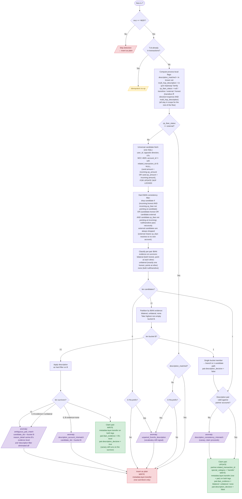

# ADR: Transfer Detection v2 — Universal Predicate + Evidence-Ranked Decision

Status: **Proposed** — supersedes `adr-transfer-detection.md` once approved. Two ADRs intentionally coexist during review for direct A/B comparison.

---

## Prerequisite: metadata wrapping convention

v2 writes its diagnostic block at `metadata.layer.transfer = {row, pair}`. The `metadata.layer.<name>` namespace is owned by the **reprocess decoupling design** — see `adr-transaction-reprocessing.md` "Metadata separation: wrapped namespaces."

**v2 cannot ship without the wrapping convention being in place.** Specifically:

1. The normalizer must wrap bank metadata under `metadata.source` (Slice 16 task).
2. Each pipeline layer (currency conversion, transfer detection v2) must write its output under `metadata.layer.<name>` (Slice 16 task — this v2 ADR depends on it).
3. The orchestrator's `_merge_metadata` must do structured rather than flat merging (Slice 16 task).
4. A one-time SQL migration must wrap existing rows' flat metadata into the new shape (Slice 16 task).

These are all listed as Slice 16 prerequisite tasks. Once they land, v2 can be implemented in its own slice with `metadata.layer.transfer` as a clean greenfield namespace.

The post-cutover sweep that fixes Issue 1 + Issue 2 + regenerates v2 metadata blocks across all rows is itself a reprocess invocation, which depends on `adr-transaction-reprocessing.md` v2 (session-scoped lock + staging buffer + LISTEN/NOTIFY drain) being deployed.

**Implementation order:**
1. Slice 16 metadata wrapping refactor (prerequisite for both v2 ADRs).
2. `adr-transaction-reprocessing.md` v2 implementation (operationalizes the reprocess sweep).
3. This ADR (transfer detection v2) implementation.
4. Reprocess sweep across all users (cuts over data to v2 shape; fixes Issues 1 + 2).

Steps 2 and 3 can ship in either order in principle, but step 4 requires both.

---

## Why a v2

The original three-tier ladder (Tier A / B / C, with fallthroughs and per-tier ambiguity codes) produces correct results for the bulk of the dataset but exhibits structural problems that surfaced during Slice 14b verification:

- **Three SQL queries with overlapping predicates** — the three tier queries duplicate `user_id`, `±2s`, opposite direction, MCC, and `related_transaction_id IS NULL` filters. Drift between tiers is easy: the description guard runs as a hard gate on Tier C and a canary on A/B; Tier C alone enforces `counterparty_iban IS NULL`; Tier C alone applies amount cross-matching. Each tier has its own ambiguity code.
- **Order-sensitive results in multi-hop chains.** Tier A on a multi-hop expense whose `counterparty_iban` lies (points at the chain end, not the immediate partner) finds 0 candidates and falls through to Tier B. The fallthrough was added late in Slice 14b; before it landed, 446 multi-hop transfer legs ingested without ever pairing — surfacing the design's fragility.
- **Tier B has no disambiguation.** When Tier B finds >1 reverse-IBAN candidates (4 transactions in the dataset, on the white-card-income side of multi-hop chains), it records `ambiguous_reverse_iban` and never claims, even though `operation_amount` cross-matching would resolve the ambiguity unambiguously.
- **The flowchart in v1 documented a 0-result-as-terminal flow that the implementation already deviated from.** The text was correct; the diagram lagged.

v2 collapses the ladder into one linear flow with a single count-based branch point. IBAN evidence becomes a candidate-ranking signal recorded as metadata; the description guard becomes a soft tiebreaker that only votes when IBAN evidence cannot break a tie. Two open issues from v1 (Tier B ambiguity; multi-hop chain-end IBAN) collapse to one fix that falls out naturally from the structural change.

This ADR is **bank-specific** — it describes the Monobank strategy. Other banks register their own strategies; nothing in v2 generalizes across sources without explicit per-source verification.

---

## Inputs to the design

The v2 design is based on:

1. The full v1 ADR (`adr-transfer-detection.md`) — kept as the canonical source for the data audit, description vocabulary, and validation patterns.
2. Empirical analysis of all 2 711 transactions in the user's `transactions` table as of 2026-05-08 (1 347 MCC 4829, 763 unpaired, 2 anomalies).
3. The directional transitive-IBAN rule, verified against 456 multi-hop transactions (§4 below).

The empirical numbers are documented in `uncommitted/transfer-detection-current-analysis.md`.

---

## The new flow

### 1. MCC + idempotency gate

If `tx.mcc != '4829'` → no-op return. (`mcc` is stored as a string column matching ISO 18245.) If `tx.id` already exists in `transactions` → no-op return.

MCC is checked first: it's an in-memory string compare, while idempotency is a DB roundtrip. Filtering the cheap predicate first means non-4829 rows skip the DB call entirely.

### 2. Precompute process-local flags

At the top of the strategy, compute and bind for the rest of the call:

- `description_matched: bool` — description is in the known phrase set (the `_INCOME_MAP`/`_EXPENSE_MAP` allowlist).
- `multi_hop_description: bool` — description is in the `для переказу на` family (subset of `description_matched`).
- `cp_iban_status` — 4-value enum:
  - `null` — `counterparty_iban IS NULL`.
  - `transitive` — `direction = 'expense' AND multi_hop_description`. The Monobank quirk: multi-hop expense legs report the **chain-end IBAN** (final destination card), not the immediate partner. Verified empirically; see §4.
  - `external` — `cp_iban` is set, not transitive, does not resolve to any own account.
  - `honest` — `cp_iban` is set, not transitive, resolves to some own account (the partner's account, OR an intermediate hop's account).

`description_matched` and `multi_hop_description` never short-circuit the flow. `cp_iban_status` does — see §3a below.

### 3a. External-IBAN short-circuit

If `cp_iban_status == 'external'`, the row is structurally a transfer to/from an account the user hasn't linked to the platform. The platform cannot find a pairing partner because the partner's row doesn't exist in the database. Continuing through the universal fetch would waste a query and (under coincidental amount + time alignment) risk a false pair against an unrelated own-account row.

Skip the universal fetch entirely:

- If `description_matched` (description is in the known phrase set) → insert as plain. No anomaly. The `metadata.layer.transfer.row` block records `cp_iban_status = external` and `description_matched = true` for traceability. **Rationale:** the user has implicitly opted out of pairing this row by not linking the source/target account; bombarding them with `unpaired_*_description` anomalies that can never auto-resolve is noise.
- If description has `З `/`На ` prefix but is NOT in the known set → record `unpaired_from_description` or `unpaired_to_description` (vocabulary drift signal — Monobank may have introduced a new card type). The `external` cp_iban status doesn't suppress this signal, because the prefix-but-unknown case is exactly when we want to know about description vocabulary drift.
- Otherwise (no transfer signal in description) → insert as plain, no anomaly. Same as today's "genuinely external" behavior.

This is the **only** flag-driven short-circuit in the algorithm. `null`, `transitive`, and `honest` rows all proceed to step 3.

### 3. Universal candidate fetch

A single SQL query replaces the three tier queries:

```sql
SELECT id, account_id, direction, time, amount_cents, operation_amount_cents,
       counterparty_iban, description
FROM transactions
WHERE user_id = $1
  AND direction = $2                                   -- opposite of incoming
  AND mcc = '4829'
  AND account_id != $3                                 -- self-account excluded
  AND related_transaction_id IS NULL                   -- unclaimed only
  AND (
        amount_cents = $4                              -- $4 = COALESCE(incoming.op_amount, incoming.amount_cents)
        OR operation_amount_cents = $5                 -- $5 = incoming.amount_cents
      )
  AND time BETWEEN $6::timestamptz - interval '2 seconds'
              AND $6::timestamptz + interval '2 seconds'
FOR UPDATE SKIP LOCKED
```

Description and IBAN are NOT in this query. They participate only in classification (step 4), tiebreaking (step 6, count > 1 branch), and anomaly recording.

#### Why two amount predicates (the symmetry requirement)

Monobank's data contract for cross-currency transfers is `incoming.operation_amount_cents == partner.amount_cents` — the source row's `op_amount` field encodes what the destination receives in the destination's currency. **The contract is asymmetric.** Specifically:

- For the **expense side** of a cross-currency transfer, Monobank populates `op_amount` with the partner's amount in the partner's currency. Example: USD FOP expense `amount=50000` (USD-cents), `op_amount=2190000` (UAH-cents that the partner received).
- For the **income side** of the same transfer, Monobank populates `op_amount` with the income's own amount in the income's own currency — NOT what the partner sent in its currency. Example: UAH FOP income `amount=2190000`, `op_amount=2190000` (also UAH-cents). The income's `op_currency` field is `UAH`, not `USD`. There is no reference to `50000` or `USD` anywhere on the income row.

This asymmetry has been verified against 292 currently-paired pairs in the data: 27 of them are FOP↔FOP cross-currency direct transfers without the multi-hop suffix, and all 27 exhibit the asymmetric op_amount pattern (the income side's `op_amount` echoes its own `amount` instead of referencing the partner's USD amount).

**Consequence for the universal fetch.** A single-clause predicate `candidate.amount_cents = incoming.operation_amount_cents` works from the expense side (USD FOP expense's `op_amount=2190000` matches UAH FOP income's `amount=2190000`) but fails from the income side (UAH FOP income's `op_amount=2190000` is searched against USD FOP expense's `amount=50000`, no match).

A second clause `candidate.operation_amount_cents = incoming.amount_cents` closes the asymmetry. For the same example: from the income side, the predicate now also tries "USD FOP expense's `op_amount=2190000` against UAH FOP income's `amount=2190000`" → match. From the expense side, the original clause already finds the partner; the second clause is redundant but harmless.

**Steady-state safety.** The asymmetry isn't merely a reprocess-time concern — production webhook delivery has no order guarantee. If the expense arrives first under a single-clause predicate, BOTH legs end up unpaired with `unpaired_*_description` anomalies, and auto-cleanup never fires because no claim ever happens. The two-clause predicate ensures the second leg always finds the first regardless of arrival order.

**The two predicates collapse for same-currency and other patterns.** When `incoming.amount_cents == incoming.operation_amount_cents` (every same-currency transfer), the two clauses become identical → no broadening of the candidate set. When the partner is itself a multi-hop or card↔card cross-currency pair, Monobank populates `op_amount` symmetrically on both sides → again no broadening. The second clause only adds candidates in the FOP↔FOP cross-currency direct case, which is exactly the case it's designed to fix.

**Empirical verification.** Under the two-clause predicate, the candidate set widens for 227 white-card-income rows (they now match against both their UAH FOP expense partner via the original clause AND their multi-hop USD FOP expense sibling via the new clause). Both are real candidates; the bucket-locked principle (§6) correctly picks the unilateral candidate (UAH FOP expense whose IBAN points at the white card) over the none-evidence one (USD FOP expense whose IBAN is suppressed by the transitive rule). Zero false pairs introduced.

### 4. IBAN consistency hard filter + evidence classification (per pair)

By construction, the incoming row reaches this step only with `cp_iban_status ∈ {null, transitive, honest}` (external rows short-circuited at §3a). Each candidate returned by the universal fetch can have any `cp_iban_status` value including `external`.

**Hard consistency filter (run before classification):** drop any candidate where one of the following holds:

- **Incoming-side mismatch:** `incoming.cp_iban_status == 'honest'` AND incoming's `cp_iban` does NOT resolve to candidate's `account_id`. (Incoming `external` is impossible here — short-circuited at §3a. Incoming `null`/`transitive` impose no claim.)
- **Candidate-side mismatch:** `candidate.cp_iban_status IN ('honest', 'external')` AND candidate's `cp_iban` does NOT resolve to incoming's `account_id`. (Candidate `null`/`transitive` impose no claim.)

The `external` case on the candidate side is structurally a hard-drop: by definition `external` means the candidate's `cp_iban` doesn't resolve to ANY own account, so it definitionally doesn't resolve to incoming's account, so the filter always drops it. This is correct behavior — an `external` candidate is the candidate's own statement that "my partner is outside the platform"; honoring that statement filters out a class of false-pair surface where an external transfer (e.g. P2P from an unlinked sender) could otherwise coincidentally claim against an own-account row with matching amount + time.

Equivalently: any non-NULL non-`transitive` cp_iban is a positive claim about partnership. Both sides' claims (when present) must point at the other side. `null` and `transitive` impose no constraint (no claim made or claim suppressed).

**Evidence classification (run on surviving candidates):**

- **`bilateral`** — both sides have `honest` status AND each side's `cp_iban` resolves to the other side's account.
- **`unilateral`** — exactly one side has `honest` status pointing at the other side's account; the other side is `null` or `transitive`.
- **`none`** — neither side contributes positive IBAN evidence (both `null`/`transitive`).

The directional transitive rule from step 2 is what makes the multi-hop case classify cleanly: the income side's honest IBAN provides `unilateral` evidence; the expense side's transitive IBAN is suppressed and contributes 0 without violating the consistency check.

`iban_evidence` is a **per-pair** value: identical on both legs of a successful claim. Compare with `cp_iban_status`, which is **per-tx** (each leg has its own).

### 5. Description-pair validation

Run `validate_pair_descriptions(income_desc, expense_desc, income_acc_props, expense_acc_props)` from the existing `descriptions.py` module. Returns `True` if both sides' descriptions are consistent with the partner's account properties (or contain no constraint, e.g. generic `Переказ на картку`).

Used in two places:
- **Canary on the claim path (step 6, count == 1):** invalid → record `description_consistency_mismatch`, claim proceeds anyway.
- **Hard filter on the tiebreaker path (step 6, count > 1):** invalid candidates removed from the bucket.

### 6. Count-and-decide

The `metadata.layer.transfer` block is **always written on every MCC 4829 row** (after we passed the MCC gate). Its `row` sub-block carries per-tx diagnostic flags; the `pair` sub-block is added only when a claim happens. See §2 for the block's shape.

A single branch on `len(candidates)`:

**`count == 0`:**
- If description starts with `З `/`На ` prefix → record `unpaired_from_description` or `unpaired_to_description` (auto-cleaned later if a partner arrives). The check is on the prefix alone, not on `description_matched` — every entry in the known phrase set already starts with one of these prefixes (or is the explicit-allowed `Переказ на картку`), so the prefix check is equivalent in current data and simpler.
- No claim, no `pair` sub-block. Block is still written with the `row` sub-block populated.

**`count == 1`:**
- Run description validation. Invalid → record `description_consistency_mismatch` (canary), claim proceeds.
- Claim pair: `UPDATE partner SET related_transaction_id = $new_tx_id, special_category = 'transfer'`. Write the full `metadata.layer.transfer` block (with `pair` sub-block) on both legs.
- `pair.iban_evidence` = the candidate's evidence level (`bilateral`, `unilateral`, or `none`).
- `pair.description_decisive = false` (no tiebreaker was needed; count was 1 from the start).

**`count > 1`:**
1. Partition candidates by IBAN evidence: `bilateral`, `unilateral`, `none` buckets.
2. Take the highest non-empty bucket B. Record its evidence level as the candidate `iban_evidence`.
3. If `len(B) == 1` → branch to the count-1 path with that single candidate; `pair.description_decisive = false`.
4. If `len(B) > 1` → apply description validation as a hard filter on B:
   - 1 survivor → claim. `pair.iban_evidence = B's level`, `pair.description_decisive = true`. Still run the canary on the surviving candidate's other-side description; if disagreement, also record `description_consistency_mismatch`.
   - 0 survivors AND bucket evidence == `none` → record `description_account_mismatch` with `candidate_ids = pre-filter B`. No claim, no `pair` sub-block.
   - 0 survivors AND bucket evidence ≥ `unilateral` → record `ambiguous_pair_match` with `candidate_ids = pre-filter B`. No claim, no `pair` sub-block. (Do NOT fall through to the next-lower bucket — the higher bucket had stronger evidence; description's failure to break its tie doesn't justify accepting a weaker-evidence candidate.)
   - >1 survivors → record `ambiguous_pair_match` with `candidate_ids = pre-filter B`. No claim, no `pair` sub-block.

`iban_evidence` and `description_decisive` are **independent** facts. A pair can have `bilateral` IBAN evidence AND `description_decisive = true` simultaneously (multiple bilateral candidates, description picks one). Recording them as orthogonal fields preserves both signals; conflating them into a single enum would lose the IBAN level whenever description is decisive.

#### Principle: bucket-locked evidence

When `count > 1`, the algorithm partitions candidates by IBAN evidence and **commits to the highest non-empty bucket**. If the description hard filter on that bucket eliminates all candidates, the algorithm records `ambiguous_pair_match` (or `description_account_mismatch` when the bucket is `none`-evidence) and stops. **It does NOT fall through to a lower-evidence bucket.**

Reasoning: the higher bucket reflects the strongest available IBAN signal. Accepting a weaker-evidence candidate just because the stronger bucket's description tiebreaker was inconclusive is unprincipled — it inverts the evidence ordering. The description filter exists to disambiguate within an evidence level, not to override evidence levels.

Operational consequence: an `ambiguous_pair_match` anomaly with `iban_evidence = bilateral` in `reason_detail` is a stronger signal than the same anomaly with `iban_evidence = none` — the former means "we had bilateral IBAN evidence and description couldn't pick the winner," which is closer to a real bug than "we had no IBAN evidence and description couldn't disambiguate."

### Flowchart



**Notes on the chart:**

- MCC check runs before the idempotency lookup (cheap in-memory string compare vs. a DB roundtrip).
- `metadata.layer.transfer` is written on **every MCC 4829 row** that passes the MCC + idempotency gate — successful claims, anomalies, and unpaired-but-known rows all carry the block. Non-4829 rows have no block at all.
- `cp_iban_status = transitive` suppresses the row's IBAN during evidence classification but does NOT short-circuit the flow.
- `cp_iban_status = external` does NOT short-circuit either. The row enters the universal fetch; if it finds a partner via amount + description signal alone, the pair claims as `none` evidence (rare but possible in principle, unobserved in current data). If it finds 0 candidates (the expected case for genuine external), it lands on the 0-branch and the metadata block records `cp_iban_status = external` for traceability.
- On a successful claim, the block is written on **both legs**. The `row` sub-block content differs per leg (each leg has its own `description_matched`, `multi_hop_description`, `cp_iban_status`); the `pair` sub-block is identical on both legs (it's a pair-level property).

---

## 2. Metadata block

A sub-key inside the layer-namespaced wrapper: `metadata.layer.transfer = {...}`. The wrapping convention (`metadata = {source: {...}, layer: {...}}`) is owned by the reprocess decoupling design — see `adr-transaction-reprocessing.md` "Metadata separation." Sub-key chosen over a dedicated column to avoid schema rigidity during iteration; can promote to a typed column later if shape stabilizes and indexing is needed.

**Scope:** the block is present on **every MCC 4829 row** (after it passes the MCC + idempotency gate). Non-4829 rows have no block. The invariant is one-line: `metadata.layer.transfer exists ⇔ mcc == '4829'`.

**Two sub-blocks:**

- `row` — per-tx diagnostic facts. Each leg has its own values; the two legs of a paired transfer can (and often do) differ.
- `pair` — per-pair conclusion. Identical on both legs of a successful claim. Present only when the row was claimed (`special_category = 'transfer'`); absent otherwise.

```jsonc
metadata.layer.transfer = {
  "row": {
    "description_matched": bool,
    "multi_hop_description": bool,
    "cp_iban_status": "null" | "transitive" | "external" | "honest"
  },
  "pair": {                         // present only when claimed
    "iban_evidence": "bilateral" | "unilateral" | "none",
    "description_decisive": bool
  }
}
```

**`row` sub-block fields** (always present on MCC 4829, populated from the row's own data):

| Field                   | Type / values                                    | Meaning                                                                                                                                                                                |
|-------------------------|--------------------------------------------------|----------------------------------------------------------------------------------------------------------------------------------------------------------------------------------------|
| `description_matched`   | `bool`                                           | Row's description is in the known phrase set. Independent of pairing outcome — a claimed transfer can have `false` here (e.g. paired by IBAN with an unknown phrase), useful for drift signal. |
| `multi_hop_description` | `bool`                                           | Row's description is in the `для переказу на` family. Subset of `description_matched`. Drives the directional transitive rule on `cp_iban_status`.                                     |
| `cp_iban_status`        | `null` \| `transitive` \| `external` \| `honest` | Per the directional rule (§1, step 2). `transitive` means the row's IBAN was suppressed during evidence classification.                                                                |

**`pair` sub-block fields** (present only on claimed rows, identical on both legs):

| Field                  | Type / values                         | Meaning                                                                                                                                                  |
|------------------------|---------------------------------------|----------------------------------------------------------------------------------------------------------------------------------------------------------|
| `iban_evidence`        | `bilateral` \| `unilateral` \| `none` | The IBAN evidence level of the claimed pair. Pure measure of IBAN-based confidence; never reflects the description tiebreaker.                           |
| `description_decisive` | `bool`                                | True iff the description hard filter narrowed a multi-candidate bucket from N>1 to 1. False when no tiebreaker was needed (count was 1 from the start).  |

`iban_evidence` and `description_decisive` are **independent**: a pair can have `iban_evidence = bilateral` AND `description_decisive = true` simultaneously (multiple bilateral candidates, description picked one). Recording them as orthogonal fields preserves both signals.

**Reflects current state, not historical.** The `pair` sub-block records the algorithm's decision against the **current** sibling rows in the database at the moment the pair was claimed. Reprocess regenerates this field against the post-replay state — the original classification is not preserved. If a row was originally paired with partner X under v1 detection, after reprocess it may be paired with partner Y (or unpaired) and `pair.iban_evidence` reflects the new decision. This is intentional: reprocess is how classification corrections propagate. See `adr-transaction-reprocessing.md` "Preserved vs. re-derived fields" for the broader principle.

---

## 3. Anomaly enum changes

**Drop** (consolidation):

- `ambiguous_iban_match` (was Tier A)
- `ambiguous_reverse_iban` (was Tier B)
- `ambiguous_amount_match` (was Tier C)

**Add:**

- `ambiguous_pair_match` — single code replacing the three. `reason_detail` carries which evidence level was operative; `candidate_ids` carries the pre-filter bucket for traceability.

**Note on `reason_detail` schema:** the column stays `TEXT` (inherited from v1, no schema change). It is human-readable prose, not a structured field. Structured signals live elsewhere: `candidate_ids` for IDs (already a typed UUID array), `metadata.layer.transfer.row` on each leg for per-tx flags, `metadata.layer.transfer.pair` on claimed legs for pair-level evidence. Querying anomalies analytically uses these structured fields, not `reason_detail` parsing. If a future need requires structured `reason_detail` (unlikely at our scale), promotion to `JSONB` is a backwards-compatible migration with no business-logic risk.

**Keep unchanged:**

- `description_consistency_mismatch` — canary on a claimed pair where descriptions disagree but pair was claimed because IBAN evidence was sufficient. Fires regardless of evidence level.
- `description_account_mismatch` — description-driven hard rejection on `no_iban` evidence with candidates that all fail validation.
- `unpaired_from_description`, `unpaired_to_description` — auto-cleaned on later partner arrival.

---

## 4. Empirical evidence for the directional transitive rule

Verified against the full 456 multi-hop transactions in the dataset (snapshot 2026-05-08).

**Method:** for each row whose description is in the `для переказу на` family, compare `counterparty_iban` to the actual partner's account IBAN. For paired rows the partner is `related_transaction_id`. For unpaired rows the partner is inferred via the same predicate the universal fetch uses (cross-account, opposite direction, ±2s, op_amount cross-match).

**Results:**

| Direction | Honest IBAN | Dishonest IBAN (chain-end) | NULL | Total |
|-----------|-------------|----------------------------|------|-------|
| income    | 227         | 0                          | 0    | 227   |
| expense   | 5           | 224                        | 0    | 229   |

Income is 100% honest. Expense is 97.8% dishonest. The 5 honest-expense exceptions split as:

- **2 rows from 2026-04** — Issue-1 cases (the white-card-income reverse-IBAN ambiguity). The "honest" classification is an artifact of the inferred-partner query selecting the chain-end card vs. the correct UAH FOP partner. They're actually dishonest under the right partner assignment.
- **3 rows from 2023** — genuine 2-leg multi-hop USD FOP → UAH FOP transfers without a third card hop. The user transferred straight to UAH FOP; the description still carries the `для переказу на картку` suffix but no card leg follows.

**Cost analysis on the 3 historical exceptions:** each pair still resolves correctly because the partner (UAH FOP income) has an honest IBAN pointing back at USD FOP, providing `unilateral_iban` evidence. We lose `bilateral_iban` classification (would have been honest+honest) and gain `unilateral_iban` (honest income + suppressed expense). **No correctness loss, only a one-step downgrade in evidence enum.**

The directional rule is a **Monobank-specific** quirk encoded inside `MonobankTransferDetection`. Other banks (PUMB, Revolut on the roadmap) need their own analysis if they exhibit similar asymmetries; the rule does not generalize.

---

## 5. What v2 fixes vs preserves vs trades

| Property                                             | Status     | Notes                                                                                                                            |
|------------------------------------------------------|------------|----------------------------------------------------------------------------------------------------------------------------------|
| Issue 1 (Tier B reverse-IBAN ambiguity)              | Fixed      | Amount predicate is in the universal fetch; white-income case never gets 2 candidates.                                           |
| Issue 2 (multi-hop chain-end IBAN)                   | Fixed      | Chain-end IBAN classifies as `unilateral` evidence; pair found.                                                                  |
| Tier A→B fallthrough                                 | Eliminated | Single fetch replaces tiered fallthrough.                                                                                        |
| Description as hard gate on Tier C                   | Demoted    | Soft tiebreaker only when IBAN evidence is ambiguous.                                                                            |
| Description as canary on Tier A/B                    | Preserved  | Recorded as `description_consistency_mismatch` on claim path.                                                                    |
| Marking unpaired-but-prefixed rows as transfer       | Rejected   | Preserves the `transfer ⇔ paired` invariant.                                                                                     |
| Drift detection on description vocabulary            | Preserved  | Anomaly types still fire; sustained spike = drift signal. External + prefix-but-unknown still records `unpaired_*_description`.  |
| Per-tier anomaly granularity                         | Lost       | Three `ambiguous_*` codes consolidate to one `ambiguous_pair_match`; evidence level moves to detail.                             |
| Evidence-level traceability on claimed pairs         | Added      | New `pair.iban_evidence` and `pair.description_decisive` fields inside `metadata.layer.transfer`.                                |
| Diagnostic metadata on every MCC 4829 row            | Added      | `metadata.layer.transfer` block written on every MCC 4829 row (row sub-block always; pair sub-block only on claim).              |
| Multi-hop expense IBAN false signal                  | Suppressed | Directional transitive rule (`direction=expense AND multi_hop_description → cp_iban_status=transitive`).                         |
| External-IBAN surface (incoming side)                | Closed     | `incoming.cp_iban_status = external` short-circuits before the universal fetch (§3a).                                            |
| External-IBAN surface (candidate side)               | Closed     | `candidate.cp_iban_status = external` always fails §4's filter (external cp_iban cannot resolve to incoming's account).          |
| Hard IBAN consistency on candidates                  | Added      | §4 post-fetch filter drops candidates whose `honest`/`external` cp_iban contradicts the incoming row.                            |
| `unpaired_*_description` noise on unlinked accounts  | Reduced    | External-IBAN + known description short-circuits silently (no anomaly). User implicitly opts out by not linking the account.     |
| FOP↔FOP cross-currency direct (Monobank op asymmetry) | Fixed      | §3 universal fetch uses two amount predicates (incoming.op vs cand.amount, plus cand.op vs incoming.amount). Income side now finds expense partner regardless of webhook arrival order. |

---

## 6. Concurrency

`FOR UPDATE SKIP LOCKED` on the universal fetch handles the same concurrency cases as the v1 tier queries:

- Two workers processing different incoming legs of a same-millisecond pair: one acquires the row lock, the other skips → inserts unpaired → auto-resolve when the late arrival's universal fetch finds the now-committed first leg. Same correctness profile as v1.
- The strategy itself runs entirely within the orchestrator's per-event transaction (`pipeline.py:run`), so the `UPDATE partner` and the `INSERT new row` commit atomically. A crash mid-strategy leaves no half-claimed pair.

The pipeline consumer must run with **`concurrency=1` per Kafka partition** to preserve transfer-detection correctness. This is the standard Kafka per-partition single-consumer-instance guarantee — do not deliberately fork. Increasing throughput requires increasing partition count, not concurrency within a partition.

This is independent of any operational concerns (reprocessing, etc.). The transfer detection strategy is pure business logic; it knows nothing about reprocessing or staging mechanisms. See `adr-transaction-reprocessing.md` for how reprocessing interacts with this constraint.

---

## 7. Migration / cutover

The schema change to drop the three obsolete enum values cannot run while v1 anomaly rows still reference them. The reprocessing job is the natural cutover vehicle:

1. Deploy v2 strategy code. The DB enum still has all 7 values (3 v1-specific + 4 shared with v2 + 1 new). v2 strategy emits `ambiguous_pair_match` and the kept codes; never emits the v1 codes.
2. Run the reprocess job for all users. CASCADE-clears all existing anomaly rows; v2 strategy regenerates them on replay using only the new enum values.
3. Run a schema migration to drop `ambiguous_iban_match`, `ambiguous_reverse_iban`, `ambiguous_amount_match` from the `transfer_anomaly_reason` enum.

Step 3 must come last; step 2 only succeeds because the DB still accepts the new values from step 1's strategy. Pinning this order prevents a deploy-order bug.

The same reprocess sweep also rebuilds `metadata.layer.transfer` on every MCC 4829 row. Non-4829 rows have no block (as designed). Reprocess drops the entire `metadata.layer` sub-tree on the way in (one rule, no per-layer enumeration — see `adr-transaction-reprocessing.md` "Metadata separation"); the v2 strategy regenerates `metadata.layer.transfer` on the way out, so stale v1-era metadata cannot leak through.

---

## 8. Source-agnostic design (unchanged from v1)

The 3 tiers, description guard, MCC 4829 candidate filter, operation_amount cross-match, and directional transitive rule are **entirely Monobank-specific**. Transfer detection is one layer in the consumer's layered pipeline (see `adr-consumer-pipeline-architecture.md`). The consumer dispatches via a Strategy protocol:

```python
class TransferDetectionStrategy(Protocol):
    async def detect_and_pair(
        self, conn: Connection, tx: NormalizedTransaction
    ) -> TransferResult: ...
```

The pipeline orchestrator checks the registry and delegates:

```python
TRANSFER_STRATEGIES: dict[str, TransferDetectionStrategy] = {
    "monobank": MonobankTransferDetection(),
}
```

`MonobankTransferDetection` owns all v2 logic described in this ADR. No base class, no shared skeleton — each bank implements its strategy from scratch.

---

## 9. Open questions

These are documented as known decisions deferred until the implementation slice. The current draft answers them; they're flagged here for explicit review.

1. **Lock scope under the universal fetch.** One SQL widens the `FOR UPDATE SKIP LOCKED` candidate set vs. three narrower v1 queries. At 3 users and ~3 events/min steady state, this is theoretical. Real exposure only emerges if the consumer runs at >100 events/sec on a partition shared by multiple actively-transacting users — well beyond the current design scope.

**Resolved in this draft (no longer open):**

- ~~Bucket-fall-through semantics~~ → see §6 "Principle: bucket-locked evidence." The algorithm commits to the highest non-empty bucket and does not fall through.
- ~~`reason_detail` schema~~ → see §3 note. Stays `TEXT`; structured fields live in `candidate_ids` and the metadata block.
- ~~External-IBAN false-pair surface~~ → see §3a "External-IBAN short-circuit" and §4 "Hard IBAN consistency filter." External rows skip the universal fetch entirely; honest-IBAN candidates that contradict the incoming row are filtered post-fetch.

---

## 10. Testing

Before this ADR is implemented, regression test coverage must include:

- All v1 tests (transfer pair claims, ambiguity rejection, description canary, description gate, idempotency) reframed against the v2 entry points.
- New: directional transitive rule — multi-hop expense's IBAN is suppressed; multi-hop income's IBAN is honest.
- New: bucket partition + description tiebreaker — `bilateral` bucket of size 2, description picks one survivor.
- New: `metadata.layer.transfer.row` written on every MCC 4829 row (paired or unpaired); `pair` sub-block only on claimed rows.
- New: 4-leg multi-hop chain replays correctly under v2 (USD FOP → UAH FOP → card, both pairs claim).

The v1 test suites in `services/consumer/tests/integration/test_transfer_*.py` and `services/consumer/tests/unit/test_transfer_service_*.py` should be ported, not deleted — many cases remain valid (claim-lock concurrency, idempotency, anomaly recording).

---

## Comparison with v1

| Aspect                              | v1 (current)                                                   | v2 (proposed)                                                                  |
|-------------------------------------|----------------------------------------------------------------|--------------------------------------------------------------------------------|
| Number of SQL queries per detection | 3 (Tier A / B / C)                                             | 1 (universal fetch)                                                            |
| Tier ladder + fallthrough           | Yes; Tier A→B fallthrough required                             | None; single linear flow                                                       |
| Description guard placement         | Hard gate on Tier C; canary on A/B                             | Soft tiebreaker (count > 1); canary on claim                                   |
| Multi-hop chain-end IBAN handling   | Implicit, relies on Tier B reverse-IBAN to recover             | Explicit directional transitive rule; suppressed during classification         |
| Tier B disambiguation               | None (records `ambiguous_reverse_iban`)                        | Falls out automatically — amount predicate is in the universal fetch           |
| Anomaly codes                       | 3 ambiguity codes + 3 description/unpaired codes               | 1 ambiguity code + 3 description/unpaired codes                                |
| Metadata on every MCC 4829 row      | None                                                           | `metadata.layer.transfer.row` always; `pair` sub-block only when claimed       |
| Evidence traceability               | None                                                           | `pair.iban_evidence` (3 values) + `pair.description_decisive` bool, orthogonal |
| Coupling to ops (reprocess)         | None                                                           | None (v2 is pure business logic; reprocess interacts with it generically)      |
