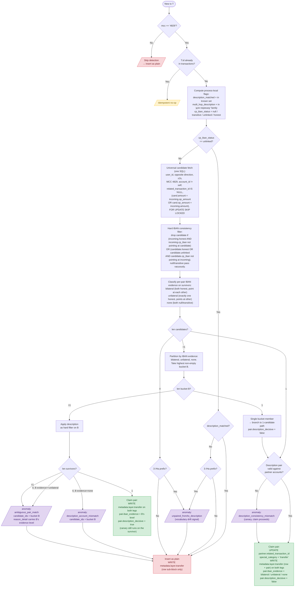

# ADR: Transfer Detection (Monobank)

How the enrichment service decides whether an MCC 4829 transaction is an internal transfer between the user's own accounts, finds its partner leg, and records the result.

The algorithm is **Monobank-specific** — it encodes the Monobank API's quirks (no transfer correlation ID, conditional `counterIban` population, directional IBAN dishonesty in multi-hop chains, description vocabulary). Other banks (PUMB, Revolut on the roadmap) register their own strategy; nothing in this design generalizes across sources without explicit per-source verification.

---

## Problem

Monobank doesn't provide a transfer correlation ID or counterparty account reference for card-to-card transfers within the same bank. Internal transfers are also the **majority** of transactions by count for the primary user (USD FOP → UAH FOP → UAH card → spending card). Without detection, internal movements inflate income/expense totals.

### Monobank API audit

Verified by querying the `/personal/statement` endpoint directly. For MCC 4829 transactions:

| Transaction type                | `counterName`     | `counterIban`        | `counterEdrpou`    | `originalMcc` |
|---------------------------------|-------------------|----------------------|--------------------|---------------|
| FOP → own account (internal)    | User's own name   | Own account IBAN     | Own EDRPOU         | 4829          |
| Card → own card (internal)      | **absent**        | **absent**           | **absent**         | 4829          |
| External P2P outgoing           | **absent**        | **absent**           | **absent**         | 4829          |
| External P2P incoming           | **absent**        | **absent**           | **absent**         | 4829          |
| External IBAN (taxes, salary)   | Company/org name  | External IBAN        | External EDRPOU    | 4829          |

Key conclusions:

- `originalMcc` is always identical to `mcc` — zero signal.
- `counterName`/`counterEdrpou` are present only on FOP/IBAN transfers; the fields are omitted entirely for card-to-card (not null).
- **Card-to-card internal and external P2P are identical in the API.** The Monobank app's visual distinction uses private internal data not exposed publicly.
- **Single-row classification is impossible for card-to-card** — pair-matching is required.

What ingestion stores:

| API field        | Stored as                          | Notes                                      |
|------------------|------------------------------------|--------------------------------------------|
| `counterName`    | `metadata.source.counter_name`     | Only on FOP/IBAN transfers                 |
| `counterEdrpou`  | `metadata.source.counter_edrpou`   | Only on FOP/IBAN transfers                 |
| `counterIban`    | `counterparty_iban` column         | Dedicated indexed column                   |
| `originalMcc`    | **dropped**                        | Always equals `mcc`, no value in storing   |
| `comment`        | `metadata.source.comment`          | FX transfers carry rate/contract info here |

### Empirical anchor

Dataset audited at design time: ~2 700 transactions, 7 accounts, ~1 350 with MCC 4829.

| Category                              | Legs | Detection signal                                              |
|---------------------------------------|------|---------------------------------------------------------------|
| Internal transfers (IBAN-detectable)  | 756  | `counterparty_iban` → own account                             |
| Internal transfers (no IBAN, paired)  | 276  | `operation_amount_cents` cross-match within ±2s               |
| External P2P (no match)               | 242  | No metadata, no pair on own accounts                          |
| External with IBAN                    | 70   | `counterparty_iban` → external account                        |

Patterns observed:

1. **FOP accounts always populate `counterparty_iban`** on transfer legs, pointing to the target account's IBAN. They also carry `counter_name` and `counter_edrpou`.
2. **Card-to-card transfers never have `counterparty_iban`** on either side.
3. **`operation_amount_cents` encodes what the other side sees.** For FX transfers, `expense.operation_amount = income.amount` and vice versa — Monobank's way of encoding the cross-currency link.
4. **Multi-hop chains** (USD FOP → UAH FOP → UAH card) appear as 4 legs within ±1s, with the intermediate FOP carrying both an income and an expense.
5. **External P2P** (person names, masked card numbers) never has a matching counterpart on any own account within any time window.

---

## Algorithm

A single linear flow with one count-based branch. IBAN evidence becomes a candidate-ranking signal; the description guard becomes a soft tiebreaker only when IBAN evidence cannot break a tie.

### 1. MCC + idempotency gate

If `tx.mcc != '4829'` → no-op return. If `tx.id` already exists in `transactions` → no-op return.

MCC is checked first — an in-memory string compare, while idempotency is a DB roundtrip. Filtering the cheap predicate first means non-4829 rows skip the DB call entirely.

### 2. Precompute process-local flags

At the top of the strategy, compute and bind for the rest of the call:

- `description_matched: bool` — description is in the known phrase set (the `_INCOME_MAP` / `_EXPENSE_MAP` allowlist below).
- `multi_hop_description: bool` — description is in the `для переказу на` family (subset of `description_matched`).
- `cp_iban_status` — 4-value enum:
  - `null` — `counterparty_iban IS NULL`.
  - `transitive` — `direction = 'expense' AND multi_hop_description`. The Monobank quirk: multi-hop expense legs report the **chain-end IBAN** (final destination card), not the immediate partner. See §"Empirical evidence for the directional transitive rule" below.
  - `unlinked` — `cp_iban` is set, not transitive, does not resolve to any own account.
  - `honest` — `cp_iban` is set, not transitive, resolves to some own account (the partner's account, OR an intermediate hop's account).

`description_matched` and `multi_hop_description` never short-circuit the flow. `cp_iban_status` does — see step 3a.

### 3a. Unlinked-partner IBAN short-circuit

If `cp_iban_status == 'unlinked'`, the row is structurally a transfer to/from an account the user hasn't linked. The platform cannot find a pairing partner because the partner's row doesn't exist in the database. Continuing through the universal fetch would waste a query and (under coincidental amount + time alignment) risk a false pair against an unrelated own-account row.

Skip the universal fetch entirely:

- If `description_matched` → insert as plain. No anomaly. The `metadata.layer.transfer.row` block records `cp_iban_status = unlinked` and `description_matched = true` for traceability. Rationale: the user has implicitly opted out of pairing this row by not linking the source/target account; bombarding them with `unpaired_*_description` anomalies that can never auto-resolve is noise.
- If description has `З `/`На ` prefix but is NOT in the known set → record `unpaired_from_description` or `unpaired_to_description` (vocabulary drift signal — Monobank may have introduced a new card type). The `unlinked` cp_iban status doesn't suppress this signal: the prefix-but-unknown case is exactly when we want to know about vocabulary drift.
- Otherwise (no transfer signal in description) → insert as plain, no anomaly.

This is the **only** flag-driven short-circuit in the algorithm. `null`, `transitive`, and `honest` rows all proceed to step 3.

### 3. Universal candidate fetch

A single SQL query:

```sql
SELECT id, account_id, direction, time, amount_cents, operation_amount_cents,
       counterparty_iban, description
FROM transactions
WHERE user_id = $1
  AND direction = $2                                   -- opposite of incoming
  AND mcc = '4829'
  AND account_id != $3                                 -- self-account excluded
  AND related_transaction_id IS NULL                   -- unclaimed only
  AND (
        amount_cents = $4                              -- $4 = COALESCE(incoming.op_amount, incoming.amount_cents)
        OR operation_amount_cents = $5                 -- $5 = incoming.amount_cents
      )
  AND time BETWEEN $6::timestamptz - interval '2 seconds'
              AND $6::timestamptz + interval '2 seconds'
FOR UPDATE SKIP LOCKED
```

Description and IBAN are **not** in this query. They participate only in classification (step 4), tiebreaking (step 6 count > 1 branch), and anomaly recording.

#### Why two amount predicates (the symmetry requirement)

Monobank's data contract for cross-currency transfers is `incoming.operation_amount_cents == partner.amount_cents` — the source row's `op_amount` field encodes what the destination receives in the destination's currency. **The contract is asymmetric:**

- For the **expense side** of a cross-currency transfer, Monobank populates `op_amount` with the partner's amount in the partner's currency. Example: USD FOP expense `amount=50000` (USD-cents), `op_amount=2190000` (UAH-cents that the partner received).
- For the **income side** of the same transfer, Monobank populates `op_amount` with the income's own amount in the income's own currency — NOT what the partner sent in its currency. Example: UAH FOP income `amount=2190000`, `op_amount=2190000`. The income's `op_currency` field is `UAH`, not `USD`. There is no reference to `50000` or `USD` anywhere on the income row.

This asymmetry has been verified against 292 currently-paired pairs in the data: 27 are FOP↔FOP cross-currency direct transfers without the multi-hop suffix, and all 27 exhibit the asymmetric op_amount pattern.

**Consequence.** A single-clause predicate `candidate.amount_cents = incoming.operation_amount_cents` works from the expense side but fails from the income side. A second clause `candidate.operation_amount_cents = incoming.amount_cents` closes the asymmetry. For the same example: from the income side, the predicate now also tries "UAH FOP income's `op_amount=2190000` matches USD FOP expense's `amount=50000`? no — but USD FOP expense's `op_amount=2190000` matches UAH FOP income's `amount=2190000`? yes" → match.

**Steady-state safety.** The asymmetry isn't a reprocess-only concern — production webhook delivery has no order guarantee. If the expense arrives first under a single-clause predicate, BOTH legs end up unpaired with `unpaired_*_description` anomalies, and auto-cleanup never fires because no claim ever happens. The two-clause predicate ensures the second leg always finds the first regardless of arrival order.

**The two predicates collapse for same-currency.** When `incoming.amount_cents == incoming.operation_amount_cents` (every same-currency transfer), the two clauses become identical → no broadening of the candidate set. The second clause only adds candidates in the FOP↔FOP cross-currency direct case, which is exactly the case it's designed to fix.

### 4. IBAN consistency hard filter + evidence classification (per pair)

By construction, the incoming row reaches this step only with `cp_iban_status ∈ {null, transitive, honest}` (unlinked rows short-circuited at §3a). Each candidate returned by the universal fetch can have any `cp_iban_status` value including `unlinked`.

**Hard consistency filter** (run before classification) — drop any candidate where:

- **Incoming-side mismatch:** `incoming.cp_iban_status == 'honest'` AND incoming's `cp_iban` does NOT resolve to candidate's `account_id`.
- **Candidate-side mismatch:** `candidate.cp_iban_status IN ('honest', 'unlinked')` AND candidate's `cp_iban` does NOT resolve to incoming's `account_id`.

The `unlinked` case on the candidate side is structurally a hard-drop: by definition `unlinked` means the candidate's `cp_iban` doesn't resolve to ANY own account, so it definitionally doesn't resolve to incoming's account. This is correct behavior — an `unlinked` candidate is the candidate's own statement that "my partner is outside the platform"; honoring that filters out a class of false-pair surface where an unlinked-partner transfer (e.g. P2P from an unlinked sender) could otherwise coincidentally claim against an own-account row with matching amount + time.

`null` and `transitive` impose no constraint (no claim made or claim suppressed).

**Evidence classification** (run on surviving candidates):

- **`bilateral`** — both sides have `honest` status AND each side's `cp_iban` resolves to the other side's account.
- **`unilateral`** — exactly one side has `honest` status pointing at the other side's account; the other side is `null` or `transitive`.
- **`none`** — neither side contributes positive IBAN evidence (both `null`/`transitive`).

The directional transitive rule from step 2 is what makes the multi-hop case classify cleanly: the income side's honest IBAN provides `unilateral` evidence; the expense side's transitive IBAN is suppressed and contributes 0 without violating the consistency check.

`iban_evidence` is a **per-pair** value: identical on both legs of a successful claim. `cp_iban_status` is **per-tx** (each leg has its own).

### 5. Description-pair validation

Run `validate_pair_descriptions(income_desc, expense_desc, income_acc_props, expense_acc_props)`. Returns `True` if both sides' descriptions are consistent with the partner's account properties (or contain no constraint, e.g. generic `Переказ на картку`).

Used in two places:

- **Canary on the claim path** (step 6, count == 1): invalid → record `description_consistency_mismatch`, claim proceeds anyway.
- **Hard filter on the tiebreaker path** (step 6, count > 1): invalid candidates removed from the bucket.

### 6. Count-and-decide

The `metadata.layer.transfer` block is **always written on every MCC 4829 row** (after passing the MCC gate). Its `row` sub-block carries per-tx diagnostic flags; the `pair` sub-block is added only when a claim happens.

A single branch on `len(candidates)`:

**`count == 0`:**
- If description starts with `З `/`На ` prefix → record `unpaired_from_description` or `unpaired_to_description` (auto-cleaned later if a partner arrives).
- No claim, no `pair` sub-block.

**`count == 1`:**
- Run description validation. Invalid → record `description_consistency_mismatch` (canary), claim proceeds.
- Claim pair: `UPDATE partner SET related_transaction_id = $new_tx_id, special_category = 'transfer'`. Write the full block (`row` + `pair`) on both legs.
- `pair.iban_evidence` = the candidate's evidence level (`bilateral`, `unilateral`, or `none`).
- `pair.description_decisive = false` (no tiebreaker was needed).

**`count > 1`:**

1. Partition candidates by IBAN evidence: `bilateral`, `unilateral`, `none` buckets.
2. Take the highest non-empty bucket B.
3. If `len(B) == 1` → branch to the count-1 path with that single candidate; `pair.description_decisive = false`.
4. If `len(B) > 1` → apply description validation as a hard filter on B:
   - 1 survivor → claim. `pair.iban_evidence = B's level`, `pair.description_decisive = true`. Still run the canary on the surviving candidate's other-side description; on disagreement, also record `description_consistency_mismatch`.
   - 0 survivors AND bucket evidence == `none` → record `description_account_mismatch` with `candidate_ids = pre-filter B`. No claim.
   - 0 survivors AND bucket evidence ≥ `unilateral` → record `ambiguous_pair_match` with `candidate_ids = pre-filter B`. No claim. **Do NOT fall through to the next-lower bucket** — the higher bucket had stronger evidence; description's failure to break its tie doesn't justify accepting a weaker-evidence candidate.
   - >1 survivors → record `ambiguous_pair_match` with `candidate_ids = pre-filter B`. No claim.

`iban_evidence` and `description_decisive` are **independent** facts. A pair can have `bilateral` IBAN evidence AND `description_decisive = true` simultaneously (multiple bilateral candidates, description picks one). Recording them as orthogonal fields preserves both signals.

#### Principle: bucket-locked evidence

When `count > 1`, the algorithm partitions candidates by IBAN evidence and **commits to the highest non-empty bucket**. If the description filter on that bucket eliminates all candidates, the algorithm records `ambiguous_pair_match` (or `description_account_mismatch` when the bucket is `none`-evidence) and stops. **It does NOT fall through to a lower-evidence bucket.**

Rationale: the higher bucket reflects the strongest available IBAN signal. Accepting a weaker-evidence candidate just because the stronger bucket's description tiebreaker was inconclusive is unprincipled — it inverts the evidence ordering. The description filter exists to disambiguate within an evidence level, not to override evidence levels.

Operational consequence: an `ambiguous_pair_match` anomaly with `iban_evidence = bilateral` in `reason_detail` is a stronger signal than the same anomaly with `iban_evidence = none` — the former means "we had bilateral IBAN evidence and description couldn't pick the winner," which is closer to a real bug than "no IBAN evidence and description couldn't disambiguate."

### Flowchart



Notes on the chart:

- MCC check runs before the idempotency lookup (cheap in-memory string compare vs. a DB roundtrip).
- `metadata.layer.transfer` is written on **every MCC 4829 row** that passes the MCC + idempotency gate.
- `cp_iban_status = transitive` suppresses the row's IBAN during evidence classification but does NOT short-circuit the flow.
- `cp_iban_status = unlinked` short-circuits at §3a. The metadata block records the status for traceability.
- On a successful claim, the block is written on **both legs**. The `row` sub-block content differs per leg; the `pair` sub-block is identical on both.

---

## Description vocabulary

The known phrase set drives `description_matched` and the description validation step. Vocabulary is **case-sensitive** as observed in data ("З Чорної" with capital З). Unrecognized `З `/`На ` prefixes trigger an `unpaired_*_description` anomaly rather than silently passing.

### Transfer flow patterns

**Pattern 1 — Direct FOP → card (2 legs):**
```
FOP   (expense): "На чорну картку"            [has counterparty_iban → honest]
Card  (income):  "З гривневого рахунку ФОП"   [no counterparty_iban → null/none]
```
The FOP expense names the target card. The card income names the source FOP.

**Pattern 2 — Direct FOP → FOP with FX (2 legs):**
```
USD FOP (expense): "На гривневий рахунок ФОП"  [has counterparty_iban → honest]
UAH FOP (income):  "З доларового рахунку ФОП"  [has counterparty_iban → honest]
```
Both name the other account. Bidirectional IBAN link → `bilateral` evidence.

**Pattern 3 — Multi-hop FOP → FOP → card (4 legs):**
```
USD FOP (expense): "На гривневий рахунок ФОП для переказу на картку"  [counterparty_iban → FINAL card, suppressed by transitive rule]
UAH FOP (income):  "З доларового рахунку ФОП для переказу на картку"  [counterparty_iban → USD FOP, honest]
UAH FOP (expense): "На чорну/білу картку"                             [counterparty_iban → card, honest]
Card    (income):  "З гривневого рахунку ФОП"                         [no counterparty_iban]
```
The `для переказу на картку` suffix signals routing intent (money en route to a card). The expense leg's `counterparty_iban` points to the **final destination card**, not the immediate partner — hence the directional transitive rule.

**Pattern 4 — Card → card (2 legs, no IBAN):**
```
Source card (expense): "Переказ на картку"   [no counterparty_iban → null]
Target card (income):  "З Чорної картки"     [no counterparty_iban → null]
```
Generic expense. Income names the source by card type/color. Pair is found via amount cross-match + description evidence (bucket evidence = `none`, description decisive).

### Income descriptions (`З ...`) — encode the source account

| Description                                              | Source account constraint           | Observed    |
|----------------------------------------------------------|-------------------------------------|-------------|
| `З гривневого рахунку ФОП`                               | `type = fop`, `currency = UAH`      | yes         |
| `З гривневого рахунку ФОП для переказу на картку`         | `type = fop`, `currency = UAH`      | yes         |
| `З доларового рахунку ФОП`                               | `type = fop`, `currency = USD`      | yes         |
| `З доларового рахунку ФОП для переказу на картку`         | `type = fop`, `currency = USD`      | yes         |
| `З єврового рахунку ФОП`                                 | `type = fop`, `currency = EUR`      | speculative |
| `З єврового рахунку ФОП для переказу на картку`           | `type = fop`, `currency = EUR`      | speculative |
| `З Чорної картки`                                        | `type = black`                      | yes         |
| `З Білої картки`                                         | `type = white`                      | yes         |
| `З доларової картки`                                     | `currency = USD` (any card type)    | yes         |
| `З єврової картки`                                       | `currency = EUR` (any card type)    | speculative |
| `З Платинової картки`                                    | `type = platinum`                   | speculative |
| `З Залізної картки`                                      | `type = iron`                       | speculative |
| `З Жовтої картки`                                        | `type = yellow`                     | speculative |

### Expense descriptions (`На ...` / generic) — encode the target account

| Description                                                | Target account constraint          | Observed    |
|------------------------------------------------------------|------------------------------------|-------------|
| `Переказ на картку`                                        | No constraint (generic)            | yes         |
| `На чорну картку`                                          | `type = black`                     | yes         |
| `На білу картку`                                           | `type = white`                     | yes         |
| `На гривневий рахунок ФОП`                                 | `type = fop`, `currency = UAH`     | yes         |
| `На гривневий рахунок ФОП для переказу на картку`           | `type = fop`, `currency = UAH`     | yes         |
| `На доларовий рахунок ФОП`                                 | `type = fop`, `currency = USD`     | speculative |
| `На євровий рахунок ФОП`                                   | `type = fop`, `currency = EUR`     | speculative |
| `На доларовий рахунок ФОП для переказу на картку`           | `type = fop`, `currency = USD`     | speculative |
| `На євровий рахунок ФОП для переказу на картку`             | `type = fop`, `currency = EUR`     | speculative |
| `На платинову картку`                                      | `type = platinum`                  | speculative |
| `На залізну картку`                                        | `type = iron`                      | speculative |
| `На жовту картку`                                          | `type = yellow`                    | speculative |

### `для переказу на картку` suffix

This suffix appears on the FOP↔FOP hop within a multi-hop chain. It does NOT change the account constraint — `З доларового рахунку ФОП` and `З доларового рахунку ФОП для переказу на картку` both validate against the same source (`type = fop, currency = USD`). The suffix only signals routing intent. For matching purposes, treat with and without suffix as equivalent.

### Speculative entries are safe

Entries marked **speculative** are inferred from Monobank's known card types (platinum, iron, yellow, EUR FOP/card). If the actual description differs, the transaction won't match and falls through to anomaly recording rather than false-pairing — the vocabulary is allowlist-only; unknown phrases don't claim.

---

## Metadata block

A sub-key inside the layer-namespaced wrapper: `metadata.layer.transfer = {...}`. The wrapping convention (`metadata = {source: {...}, layer: {...}}`) is owned by the reprocess decoupling design — see `adr-transaction-reprocessing.md` "Metadata separation."

**Scope:** the block is present on **every MCC 4829 row** that passes the MCC + idempotency gate. Non-4829 rows have no block. The invariant is one-line: `metadata.layer.transfer exists ⇔ mcc == '4829'`.

**Two sub-blocks:**

- `row` — per-tx diagnostic facts. Each leg has its own values.
- `pair` — per-pair conclusion. Identical on both legs of a successful claim. Present only when claimed (`special_category = 'transfer'`).

```jsonc
metadata.layer.transfer = {
  "row": {
    "description_matched": bool,
    "multi_hop_description": bool,
    "cp_iban_status": "null" | "transitive" | "unlinked" | "honest"
  },
  "pair": {                         // present only when claimed
    "iban_evidence": "bilateral" | "unilateral" | "none",
    "description_decisive": bool
  }
}
```

**`row` sub-block fields:**

| Field                   | Type / values                                    | Meaning                                                                                                                                                                            |
|-------------------------|--------------------------------------------------|------------------------------------------------------------------------------------------------------------------------------------------------------------------------------------|
| `description_matched`   | `bool`                                           | Row's description is in the known phrase set. Independent of pairing outcome — a claimed transfer can have `false` here (paired by IBAN with an unknown phrase) — useful for drift. |
| `multi_hop_description` | `bool`                                           | Row's description is in the `для переказу на` family. Subset of `description_matched`. Drives the directional transitive rule.                                                     |
| `cp_iban_status`        | `null` \| `transitive` \| `unlinked` \| `honest` | Per the directional rule. `transitive` means the row's IBAN was suppressed during evidence classification.                                                                         |

**`pair` sub-block fields** (claimed rows only, identical on both legs):

| Field                  | Type / values                         | Meaning                                                                                                                              |
|------------------------|---------------------------------------|--------------------------------------------------------------------------------------------------------------------------------------|
| `iban_evidence`        | `bilateral` \| `unilateral` \| `none` | The IBAN evidence level of the claimed pair. Pure measure of IBAN-based confidence; never reflects the description tiebreaker.       |
| `description_decisive` | `bool`                                | True iff the description hard filter narrowed a multi-candidate bucket from N>1 to 1. False when no tiebreaker was needed.            |

**Reflects current state, not historical.** The `pair` sub-block records the algorithm's decision against the **current** sibling rows in the database at the moment the pair was claimed. Reprocess regenerates it against the post-replay state — the original classification is not preserved. See `adr-transaction-reprocessing.md` "Preserved vs. re-derived fields" for the broader principle.

---

## Anomaly enum

| Code                              | Cause                                                                                                                              | Auto-resolves? | Pair claimed? |
|-----------------------------------|------------------------------------------------------------------------------------------------------------------------------------|----------------|---------------|
| `unpaired_from_description`       | Description starts with `З ` but no partner found at this time.                                                                    | Yes            | No            |
| `unpaired_to_description`         | Description starts with `На ` but no partner found at this time.                                                                   | Yes            | No            |
| `ambiguous_pair_match`            | `count > 1` within the winning evidence bucket and description couldn't break the tie. `reason_detail` carries the evidence level. | No             | No            |
| `description_account_mismatch`    | Single candidate (or count > 1 in the `none` bucket) failed description validation. Indicates vocabulary drift or wrong matching.   | No             | No            |
| `description_consistency_mismatch` | Pair was claimed (IBAN evidence sufficient) but descriptions disagreed with the paired accounts. Canary signal — pair still proceeds. | No             | **Yes**       |

`reason_detail` is human-readable `TEXT`, not a structured field. Structured signals live in `candidate_ids` (typed UUID array) and the `metadata.layer.transfer` block.

**Auto-resolution.** When a pair is successfully claimed, the orchestrator deletes any pre-existing `unpaired_*_description` anomaly on either leg in the same transaction. This is the only auto-resolve path; the three other codes are terminal until manually investigated or until reprocess clears them.

---

## Empirical evidence for the directional transitive rule

Verified against 456 multi-hop transactions in the design-time dataset.

**Method:** for each row whose description is in the `для переказу на` family, compare `counterparty_iban` to the actual partner's account IBAN. For paired rows the partner is `related_transaction_id`. For unpaired rows the partner is inferred via the same predicate the universal fetch uses.

| Direction | Honest IBAN | Dishonest IBAN (chain-end) | NULL | Total |
|-----------|-------------|----------------------------|------|-------|
| income    | 227         | 0                          | 0    | 227   |
| expense   | 5           | 224                        | 0    | 229   |

Income is 100% honest. Expense is 97.8% dishonest. The 5 honest-expense exceptions:

- **2 reverse-IBAN-ambiguity cases** — the "honest" classification is an artifact of the inferred-partner query selecting the chain-end card vs. the correct UAH FOP partner. They're actually dishonest under the right partner assignment.
- **3 genuine 2-leg multi-hop USD FOP → UAH FOP transfers** without a third card hop. The description still carries the `для переказу на картку` suffix but no card leg follows.

**Cost analysis.** The 3 historical exceptions still resolve correctly because the partner (UAH FOP income) has an honest IBAN pointing back at USD FOP, providing `unilateral` evidence. We lose `bilateral` classification (would have been honest+honest) and gain `unilateral` (honest income + suppressed expense). No correctness loss, only a one-step downgrade in evidence enum.

The directional rule is **Monobank-specific** — encoded inside `MonobankTransferDetection`. Other banks would need their own analysis if they exhibit similar asymmetries.

---

## Concurrency

`FOR UPDATE SKIP LOCKED` on the universal fetch handles the per-event concurrency cases:

- Two workers processing different incoming legs of a same-millisecond pair: one acquires the row lock, the other skips → inserts unpaired → auto-resolves when the late arrival's universal fetch finds the now-committed first leg.
- The strategy itself runs entirely within the enrichment orchestrator's per-event transaction. The `UPDATE partner` and `INSERT new row` commit atomically. A crash mid-strategy leaves no half-claimed pair.

The enrichment consumer must run with **concurrency=1 per Kafka partition** to preserve transfer-detection correctness. This is the standard Kafka per-partition single-consumer-instance guarantee — increasing throughput requires increasing partition count, not concurrency within a partition.

This is independent of reprocessing concerns. The strategy is pure business logic; it knows nothing about staging or locks. See `adr-transaction-reprocessing.md` for how reprocessing interacts with this constraint.

---

## Source-agnostic dispatch

Transfer detection is one layer in the enrichment pipeline (see `adr-consumer-pipeline-architecture.md`). The pipeline dispatches via a Strategy protocol:

```python
class TransferDetectionStrategy(Protocol):
    async def detect_and_pair(
        self, conn: Connection, tx: NormalizedTransaction
    ) -> TransferResult: ...
```

The pipeline orchestrator checks the registry and delegates:

```python
TRANSFER_STRATEGIES: dict[str, TransferDetectionStrategy] = {
    "monobank": MonobankTransferDetection(),
}
```

`MonobankTransferDetection` owns all logic described in this ADR. No base class, no shared skeleton — each bank implements its strategy from scratch. The 7-step algorithm, description vocabulary, MCC 4829 candidate filter, operation_amount cross-match, and directional transitive rule are **entirely Monobank-specific** and do not generalize without explicit per-source verification.

---

## What is NOT a transfer (correctly excluded)

| Description pattern                           | Why excluded                                            |
|-----------------------------------------------|---------------------------------------------------------|
| Person names: "Олена К.", "Андрій П."          | No matching counterpart on any own account              |
| Masked card numbers: "516874****1234"          | External P2P to non-own cards                           |
| "Від: Acme Corp" (with external IBAN)          | `counterparty_iban` doesn't match any own account       |
| "Випуск іменної картки"                       | Bank fee, no counterpart                                |
| Tax payments (with government IBAN)            | IBAN is government, not own account                     |
| Transfer to external bank                      | Only one leg visible (other bank not integrated)        |
| "Інтернет-банк PUMBOnline"                    | Incoming from external bank                             |
