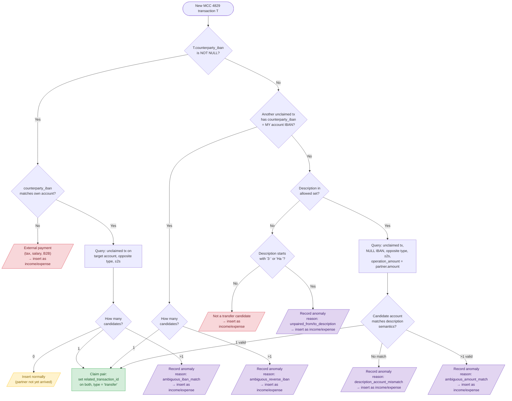
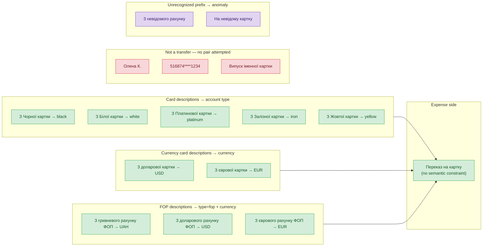
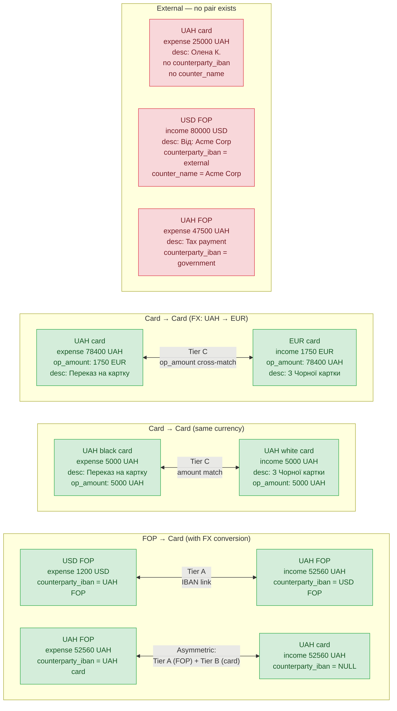
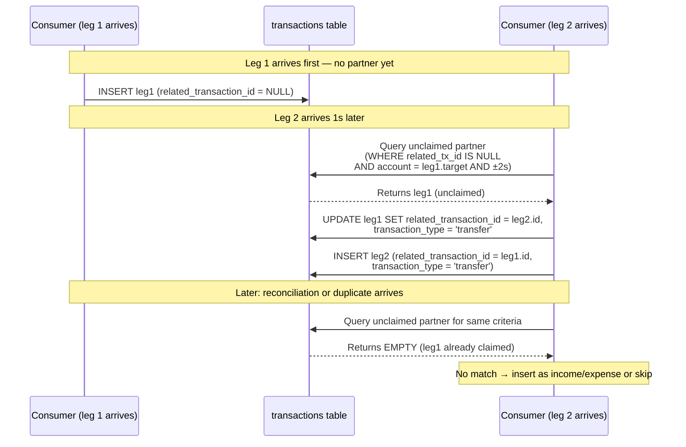

# ADR: Transfer Detection (v1 — superseded)

Status: **Superseded** by `adr-transfer-detection-v2.md` (shipped in slice 17 / 17b). Retained as historical context — the Monobank API audit, the `_INCOME_MAP`/`_EXPENSE_MAP` description vocabulary, and the empirical data audit in this document are still the canonical source for those facts and are referenced by v2. The three-tier ladder (Tier A / B / C) described here is **no longer in the codebase**; v2 collapsed it to a single linear flow with one count-based branch. Do not implement against this ADR — read v2 instead.

---

## Problem

Monobank doesn't provide a transfer correlation ID or counterparty account reference for card-to-card transfers within the same bank. The existing IBAN-based detection in the consumer only works when `counterparty_iban` is populated — which Monobank rarely does for internal card-to-card transfers.

Transfers are the **majority** of transactions by count for the primary user (USD FOP → UAH FOP → UAH card → spending card). Leaving them undetected makes the UI useless for budgeting — income/expense totals are wildly inflated by internal money movement.

## Raw API audit

Verified by querying Monobank `/personal/statement` endpoint directly (2026-05-02). The public API response for MCC 4829 transactions:

| Transaction type | `counterName` | `counterIban` | `counterEdrpou` | `originalMcc` |
|---|---|---|---|---|
| FOP → own account (internal) | User's own name | Own account IBAN | Own EDRPOU | 4829 (same as mcc) |
| Card → own card (internal) | **absent** | **absent** | **absent** | 4829 |
| External P2P outgoing | **absent** | **absent** | **absent** | 4829 |
| External P2P incoming | **absent** | **absent** | **absent** | 4829 |
| External IBAN (taxes, salary) | Company/org name | External IBAN | External EDRPOU | 4829 |

**Key conclusions:**
- `originalMcc` is **always** identical to `mcc` — provides zero signal.
- `counterName` is only present on FOP/IBAN transfers. For card-to-card it's **absent** (not null — the field is omitted entirely).
- **Card-to-card internal and external P2P are identical in the API.** The Monobank app's visual distinction uses private internal data not exposed via the public API.
- **Single-row classification is impossible for card-to-card** — pair-matching is required.

### What we ingest

| API field | Stored as | Notes |
|-----------|-----------|-------|
| `counterName` | `metadata->>'counter_name'` | Present only on FOP/IBAN transfers |
| `counterEdrpou` | `metadata->>'counter_edrpou'` | Same — only on FOP/IBAN |
| `counterIban` | `counterparty_iban` column | Dedicated column, indexed |
| `originalMcc` | **dropped** | Always equals `mcc`, no value in storing |
| `comment` | `metadata->>'comment'` | FX transfers include rate/contract info |

---

## Data audit results

Dataset: ~2700 transactions, 7 accounts, ~1350 with MCC 4829.

| Category | Legs | Detection signal | Examples |
|----------|------|-----------------|----------|
| Internal transfers (IBAN-detectable) | 756 | `counterparty_iban` → own account + `counter_name` = own name | FOP→FOP, FOP→card |
| Internal transfers (no IBAN, paired) | 276 | `operation_amount` cross-match within ±2s | Card→card, card→EUR card |
| External P2P (no match) | 242 | No metadata, no pair on own accounts | Person names, masked card numbers |
| External with IBAN | 70 | `counterparty_iban` → external account | Salary income, tax payments |

**Total internal: ~1030 legs = ~515 transfer events (some multi-hop chains produce 4-6 legs).**

### Key data patterns observed

1. **FOP accounts always populate `counterparty_iban`** on their transfer legs — pointing to the target account's IBAN. Also always have `counter_name` = user's own name and `counter_edrpou` = user's tax ID.
2. **Card-to-card transfers never have `counterparty_iban`** on either side. No `counterName`/`counterEdrpou` in the API response at all.
3. **`operation_amount_cents` encodes what the other side sees** — for FX transfers, `expense.operation_amount = income.amount` and vice versa. This is Monobank's way of encoding the cross-currency link.
4. **Multi-hop chains** (USD FOP → UAH FOP → UAH card) appear as 4 legs within ±1s, with the intermediate FOP having both an income and expense.
5. **External P2P** (person names, masked card numbers) never has a matching counterpart on any own account within any time window.

---

## Algorithm: deterministic transfer detection

### Step 1: Is this transaction an internal transfer?

A transaction `T` with `mcc = 4829` is an internal transfer if **any** condition holds:

| Tier | Condition | What it detects |
|------|-----------|-----------------|
| A | `T.counterparty_iban` matches an own account's IBAN | FOP↔FOP, FOP→card (sender/intermediary side) |
| B | Another MCC 4829 tx `T2` exists on a different own account (opposite `raw_transaction_type`, ±2s) where `T2.counterparty_iban = T.account.iban` | Receiver side where sender's IBAN points at me |
| C | Both `T` and `T2` have `NULL` counterparty_iban, AND `T.operation_amount_cents = T2.amount_cents` (opposite type, ±2s, different account) | Pure card↔card transfers (including FX) |

### Step 2: Find T's unique partner

Once classified as internal, the partner is found by:

1. **Tier A** — T has `counterparty_iban` → own account: partner is the opposite-type MCC 4829 tx on THAT specific account within ±2s. Observed 1:1 across the entire validation dataset; the algorithm still rejects multi-matches as a guardrail in case this invariant breaks on future data.
2. **Tier B** — T has no `counterparty_iban`, but another unclaimed tx has `counterparty_iban = T.account.iban`: that tx is the partner (it "points at me").
3. **Tier C** — Both T and partner have NULL `counterparty_iban`: find partner with `T.operation_amount_cents = partner.amount_cents` (opposite type, ±2s, different account, description guard passes).

Tiers are tried in order with fallthrough. Tier A falls through to Tier B when it finds 0 candidates on an own account (counterparty_iban may point to a non-immediate hop in multi-step transfers, e.g. Monobank reports the final destination IBAN, not the intermediate FOP). External IBANs (not matching any own account) and ambiguity (>1 candidate) are terminal — no fallthrough. Each tier is proven 1:1 in the dataset; ambiguity at any tier → reject.

### Validation results

| Metric | Result |
|--------|--------|
| False positives (external incorrectly flagged as internal) | **0** |
| False negatives (internal missed by algorithm) | **0** |
| Ambiguous matches (leg with >1 valid partner) | **0** |
| Description consistency (IBANs and descriptions always agree) | **0** mismatches |
| Coverage | **100%** of all MCC 4829 transactions correctly classified |

Note: the canary check (`description_consistency_mismatch`) was validated retroactively across all 756 IBAN-paired legs — descriptions named the partner account correctly in 100% of cases. This is empirical evidence that descriptions are reliable and consistent with IBAN data.

---

## Safety invariants

Three rules ensure **zero false positives by construction**:

### 1. Semantic description guard (Tier C only)

The `operation_amount` cross-match (Tier C: both sides have NULL IBAN) requires an additional constraint: the descriptions must match known internal transfer patterns AND their semantic content must be validated against the actual partner account.

#### Transfer flow patterns (observed)

**Pattern 1 — Direct FOP → card (2 legs):**
```
FOP   (expense): "На чорну картку"          [has counterparty_iban → Tier A]
Card  (income):  "З гривневого рахунку ФОП"  [no counterparty_iban → Tier B/C]
```
The FOP expense names the target card. The card income names the source FOP.

**Pattern 2 — Direct FOP → FOP with FX (2 legs):**
```
USD FOP (expense): "На гривневий рахунок ФОП"  [has counterparty_iban → Tier A]
UAH FOP (income):  "З доларового рахунку ФОП"  [has counterparty_iban → Tier A]
```
Both name the other account. Both have counterparty_iban. Bidirectional IBAN link.

**Pattern 3 — Multi-hop FOP → FOP → card (4 legs):**
```
USD FOP (expense): "На гривневий рахунок ФОП для переказу на картку"  [counterparty_iban → FINAL card, not intermediate FOP!]
UAH FOP (income):  "З доларового рахунку ФОП для переказу на картку"  [counterparty_iban → USD FOP]
UAH FOP (expense): "На чорну/білу картку"                             [counterparty_iban → card]
Card    (income):  "З гривневого рахунку ФОП"                         [no counterparty_iban]
```
The suffix `"для переказу на картку"` ("for the purpose of transferring to a card") signals this is the first hop of a multi-hop chain. The money went FOP→FOP but the user's intent was to reach a card. Note: the expense leg's counterparty_iban points to the **final destination card** (skipping the intermediate FOP).

**Pattern 4 — Card → card (2 legs, no IBAN):**
```
Source card (expense): "Переказ на картку"     [no counterparty_iban → Tier C]
Target card (income):  "З Чорної картки"        [no counterparty_iban → Tier C]
```
Generic expense. Income names the source by card type/color.

#### Income descriptions ("З ...") — encode the source account

| Description | Source account constraint | Observed | Notes |
|---|---|---|---|
| `З гривневого рахунку ФОП` | `type = fop`, `currency = UAH` | yes | Direct FOP→card or multi-hop final leg |
| `З доларового рахунку ФОП` | `type = fop`, `currency = USD` | yes | Direct FOP→FOP |
| `З доларового рахунку ФОП для переказу на картку` | `type = fop`, `currency = USD` | yes | Multi-hop first leg (same source as above, suffix = routing intent) |
| `З єврового рахунку ФОП` | `type = fop`, `currency = EUR` | speculative | |
| `З єврового рахунку ФОП для переказу на картку` | `type = fop`, `currency = EUR` | speculative | |
| `З Чорної картки` | `type = black` | yes | Card→card |
| `З Білої картки` | `type = white` | yes | Card→card |
| `З доларової картки` | `currency = USD` (any card type) | yes | Card→card FX |
| `З єврової картки` | `currency = EUR` (any card type) | speculative | |
| `З Платинової картки` | `type = platinum` | speculative | |
| `З Залізної картки` | `type = iron` | speculative | |
| `З Жовтої картки` | `type = yellow` | speculative | |

#### Expense descriptions ("На ..." / generic) — encode the target account

| Description | Target account constraint | Observed | Notes |
|---|---|---|---|
| `Переказ на картку` | No constraint (generic) | yes | Card→card; income side carries all validation |
| `На чорну картку` | `type = black` | yes | FOP→card |
| `На білу картку` | `type = white` | yes | FOP→card |
| `На гривневий рахунок ФОП` | `type = fop`, `currency = UAH` | yes | Direct FOP→FOP |
| `На гривневий рахунок ФОП для переказу на картку` | `type = fop`, `currency = UAH` | yes | Multi-hop first leg (target is intermediate FOP, not final card) |
| `На доларовий рахунок ФОП` | `type = fop`, `currency = USD` | speculative | |
| `На євровий рахунок ФОП` | `type = fop`, `currency = EUR` | speculative | |
| `На доларовий рахунок ФОП для переказу на картку` | `type = fop`, `currency = USD` | speculative | |
| `На євровий рахунок ФОП для переказу на картку` | `type = fop`, `currency = EUR` | speculative | |
| `На платинову картку` | `type = platinum` | speculative | |
| `На залізну картку` | `type = iron` | speculative | |
| `На жовту картку` | `type = yellow` | speculative | |

#### "для переказу на картку" suffix

This suffix appears on the FOP↔FOP hop within a multi-hop chain. It does NOT change the account constraint — `"З доларового рахунку ФОП"` and `"З доларового рахунку ФОП для переказу на картку"` both validate against the same source (`type = fop, currency = USD`). The suffix only signals routing intent (money is en route to a card). For matching purposes, treat with and without suffix as equivalent.

#### Validation rules

**Description validation, applied to ALL tiers (not just Tier C):**

1. **Per-side validation:** Each description validates against the OTHER leg's account:
   - Income "З ..." names the source → validate against the expense leg's account properties (type, currency)
   - Expense "На ..." names the target → validate against the income leg's account properties (type, currency)
   - "Переказ на картку" (generic) → no constraint on the expense side; income carries validation alone
   - Both sides are checked independently. If either fails, the pair is rejected.

2. **Tier-specific consequences:**
   - **Tier A/B (IBAN-based):** Pairing proceeds regardless (IBAN is deterministic), but a description consistency mismatch records an anomaly with reason `description_consistency_mismatch`. This is a **drift canary** — if descriptions start disagreeing with IBANs, something changed upstream.
   - **Tier C (no IBAN):** Description validation is **load-bearing**. A mismatch → reject the pair and record anomaly. The pair does NOT proceed.

**Example (Tier A with canary):** IBAN deterministically pairs a UAH FOP expense with a UAH black card income. The expense says "На чорну картку" (correct — matches the card), income says "З гривневого рахунку ФОП" (correct — matches the FOP). If either description were wrong (e.g. income said "З Білої картки" but the expense is on FOP, not white card), the pair still proceeds but an anomaly is recorded.

**Example (Tier C, load-bearing):** Two no-IBAN legs match on operation_amount within 2s. Income says "З Чорної картки" on a EUR card. The candidate expense is on a UAH black card. Validate: "З Чорної картки" requires source `type = black` — but we're checking the *expense's* account which IS the black card. Cross-check: the expense says "Переказ на картку" (generic, no constraint). Both pass → pair proceeds.

**Scope:** Entries marked "observed" are validated against the full dataset. Entries marked "speculative" are inferred from Monobank's known card types (platinum, iron, yellow, EUR FOP/card). Speculative entries are safe — if the actual description differs, the transaction won't match and will fall through to anomaly recording rather than false-pairing.

Note: descriptions are case-sensitive as observed in data ("З Чорної" with capital З). Unrecognized "З " or "На " prefix patterns trigger anomaly recording rather than silent failure.

### 1b. False negative detection (unpaired transfer-like prefixes)

If a transaction's description starts with `"З "` (Ukrainian for "from") and it remains unpaired after all tiers → record anomaly with reason `"unpaired_from_description"`.

Symmetrically, if an expense description starts with `"На "` (Ukrainian for "to") and it remains unpaired → record anomaly with reason `"unpaired_to_description"`.

Both signal a likely internal transfer whose partner is missing (e.g. an account not yet linked, or Monobank introduced a new card type before the codebase was updated).

This does NOT mark the transaction as a transfer — it stays as income/expense — but ensures the gap is visible.

### 2. Ambiguity rejection

If a transaction has **more than one valid candidate** (after applying all tier rules + description guard) → **reject all** and record anomaly. Never guess between multiple candidates.

### 3. Claim lock (self FK)

Once paired, a transaction's `related_transaction_id` is set. The pair-match query only considers unclaimed legs and locks the candidate row to prevent concurrent claim:

```sql
SELECT id FROM transactions
WHERE related_transaction_id IS NULL
  AND ...  -- tier-specific filters
FOR UPDATE SKIP LOCKED
```

`FOR UPDATE` prevents two concurrent handler invocations from reading the same unclaimed leg. `SKIP LOCKED` means if another transaction already holds the lock, this query returns no result rather than blocking — the current event inserts normally and will be paired when its partner's handler runs (or by reprocessing).

The entire detection flow (partner query + UPDATE existing leg + INSERT new leg) runs within a single DB transaction. Advisory locks are NOT used here (those are reserved for reprocessing). Row-level `FOR UPDATE` is sufficient because the claim path always targets a specific existing row.

### 4. Idempotency guard

The transfer detection service is **not naturally idempotent** — it creates anomaly records and modifies existing rows. To prevent spurious anomalies and double-claiming on duplicate invocations (e.g. backfill re-runs), the service checks whether the incoming event's `id` already exists in the `transactions` table at entry. If it does, the service returns immediately with no side effects.

This is enforced within the service itself, not delegated to callers.

---

## Anomaly recording

When the algorithm rejects a match or detects inconsistency, record it for visibility.

### Schema

```sql
CREATE TYPE transfer_anomaly_reason AS ENUM (
    'unpaired_from_description',
    'unpaired_to_description',
    'ambiguous_iban_match',
    'ambiguous_reverse_iban',
    'ambiguous_amount_match',
    'description_account_mismatch',
    'description_consistency_mismatch'
);

CREATE TABLE transfer_match_anomalies (
    id              UUID PRIMARY KEY DEFAULT gen_random_uuid(),
    transaction_id  UUID NOT NULL UNIQUE REFERENCES transactions(id) ON DELETE CASCADE,
    candidate_ids   UUID[] NOT NULL,
    reason_code     transfer_anomaly_reason NOT NULL,
    reason_detail   TEXT,
    created_at      TIMESTAMPTZ NOT NULL DEFAULT now()
);
```

Note: `transactions` has `PRIMARY KEY (id)` (see `adr-drop-timescaledb.md`), enabling direct FK references from both `transfer_match_anomalies` and the self-referential `related_transaction_id REFERENCES transactions(id) ON DELETE SET NULL`.
```

`reason_code` is a closed enum (enforced by Postgres). `reason_detail` is free-text context for debugging (e.g. "expected type=fop currency=UAH, got type=black").

### Canonical reason codes

| `reason_code` | Tier | `candidate_ids` contains | Self-resolves? | Pair claimed? |
|---|---|---|---|---|
| `unpaired_from_description` | — | `{}` (empty — no candidates found) | Yes | No |
| `unpaired_to_description` | — | `{}` (empty) | Yes | No |
| `ambiguous_iban_match` | A | Multiple candidates on the target account | No | No |
| `ambiguous_reverse_iban` | B | Multiple candidates pointing at this account | No | No |
| `ambiguous_amount_match` | C | Multiple candidates after description validation | No | No |
| `description_account_mismatch` | C | Single candidate that matched on amount but failed validation | No | No |
| `description_consistency_mismatch` | A/B | The partner that WAS claimed | No | **Yes** (canary) |

`description_consistency_mismatch` is the only anomaly type where the pair was successfully claimed — it's a drift warning, not a rejection. All other types mean the pair was NOT claimed.

### Resolution modes

1. **Automatic (cleanup on claim):** When a pair is successfully claimed, delete any existing anomaly record for either transaction (`DELETE FROM transfer_match_anomalies WHERE transaction_id = ANY($1)`). This only fires for `unpaired_*_description` anomalies — the transaction was awaiting its partner, which has now arrived. All other anomaly types are terminal (the algorithm rejected the pair, so a subsequent claim attempt for the same leg cannot reach the claim path).

2. **Manual investigation:** Terminal anomalies persist indefinitely — they represent description drift, ambiguity, or validation failures that need human review. The transaction stays as income/expense until explicitly resolved.

The table always represents **currently unresolved** issues, not historical noise.

### Invariants

**Exclusivity:** A transaction has at most ONE active anomaly record at a time. Enforced via `UNIQUE` constraint on `transaction_id`. A duplicate insert is a **logic error** in the detection service (it should never reach two rejection branches for the same transaction) — the constraint violation propagates as an unhandled exception. No `ON CONFLICT DO NOTHING` — fail loudly so the bug is visible immediately.

**Staleness guard:** Any listeners or dashboards consuming this table should ignore records where `created_at` is less than 2 seconds old — the partner leg may still be in flight. Only surface anomalies that have persisted beyond the expected pairing window.

---

## Implementation: real-time second-leg matching

### Consumer flow

When a new MCC 4829 transaction arrives:

1. **Tier A**: does `counterparty_iban` match an own account?
   - Yes → query for the **unclaimed** partner on that account (opposite type, ±2s, `related_transaction_id IS NULL`)
   - If exactly 1 found: validate descriptions, claim both. If descriptions mismatch → claim anyway but record `description_consistency_mismatch` (canary).
   - If >1 found: record `ambiguous_iban_match`, do not claim
   - If 0 found: fall through to Tier B (counterparty_iban may point to a non-immediate hop; the actual partner may be findable via reverse IBAN lookup)

2. **Tier B**: does another existing **unclaimed** tx have `counterparty_iban = my account IBAN`?
   - If exactly 1 found: validate descriptions, claim both. If descriptions mismatch → claim anyway but record `description_consistency_mismatch` (canary).
   - If >1 found: record `ambiguous_reverse_iban`, do not claim

3. **Tier C**: both NULL IBAN — semantic description guard + `operation_amount_cents` cross-match among **unclaimed** legs
   - Parse both descriptions: income "З ..." → required source account properties; expense "На ..." → required target account properties (or generic "Переказ на картку" = no constraint)
   - Query candidates: opposite type, ±2s, `operation_amount` cross-match, `related_transaction_id IS NULL`
   - Filter candidates: validate descriptions against their respective accounts
   - If exactly 1 valid: claim both
   - If >1 valid: record `ambiguous_amount_match`, do not claim
   - If 0 valid but amount/time matched: record `description_account_mismatch`, do not claim

4. No match → insert normally. Either external P2P, or partner hasn't arrived yet.
   - If description starts with `"З "` (income) → record `unpaired_from_description`
   - If description starts with `"На "` (expense) → record `unpaired_to_description`
   - Otherwise (person names, card numbers, bank fees) → no anomaly, genuinely external

### Applying to historical data

When transfer detection is first deployed (or its logic changes), existing transactions need re-pairing. This is handled by the generic **transaction reprocessing job** (see `adr-transaction-reprocessing.md`) — not a transfer-specific migration. The reprocessing job deletes and replays all transactions through the full consumer pipeline, which includes transfer detection.

### Index design

```sql
-- For Tier A lookups (find unclaimed partner by target account + time + type)
CREATE INDEX idx_transactions_transfer_match
ON transactions (user_id, account_id, raw_transaction_type, time DESC)
WHERE mcc = 4829 AND related_transaction_id IS NULL;

-- For Tier B lookups (reverse: find unclaimed tx whose counterparty_iban = my IBAN)
CREATE INDEX idx_transactions_transfer_reverse_iban
ON transactions (user_id, counterparty_iban, raw_transaction_type, time DESC)
WHERE mcc = 4829 AND related_transaction_id IS NULL AND counterparty_iban IS NOT NULL;

-- For Tier C lookups (operation_amount cross-match, unclaimed only, both IBANs NULL)
CREATE INDEX idx_transactions_transfer_opamt
ON transactions (user_id, operation_amount_cents, raw_transaction_type, time DESC)
WHERE mcc = 4829 AND counterparty_iban IS NULL AND related_transaction_id IS NULL;
```

---

## Multi-hop chains

The flow USD FOP → UAH FOP → UAH card produces 4 legs and 2 pairs:

```
USD FOP (expense 1200 USD)   ←→  UAH FOP (income 52560 UAH)     [Tier A→B fallthrough or Tier A depending on arrival order]
UAH FOP (expense 52560 UAH) ←→  UAH card (income 52560 UAH)    [Asymmetric: Tier A on FOP side, Tier B on card side]
```

Each pair is independent. The UAH FOP account participates in both pairs (once as receiver, once as sender) — its income and expense legs happen at the same timestamp on the same account but **cannot false-match each other** because pair-matching requires `different account_id`.

Note on first pair: Monobank may report the **final destination** IBAN on the USD FOP expense (the black card) instead of the immediate counterparty (UAH FOP). When this happens, Tier A resolves the IBAN to the black card, finds 0 candidates there, and falls through to Tier B. Tier B finds the UAH FOP income (which has `counterparty_iban` pointing at the USD FOP). The UAH FOP income side, if it has the correct `counterparty_iban` pointing at the USD FOP, resolves directly via Tier A.

Note on second pair: the FOP expense leg has `counterparty_iban` pointing at the card (resolved via Tier A), while the card income leg has no IBAN and gets matched via Tier B (the FOP leg's IBAN points at it).

---

## What is NOT a transfer (correctly excluded)

| Description pattern | Why excluded |
|--------------------|----|
| Person names: "Олена К.", "Андрій П." | No matching counterpart on any own account |
| Masked card numbers: "516874****1234" | External P2P to non-own cards |
| "Від: Acme Corp" (with external IBAN) | `counterparty_iban` doesn't match any own account |
| "Випуск іменної картки" | Bank fee, no counterpart |
| Tax payments (with government IBAN) | IBAN is government, not own account |
| Transfer to external bank | Only one leg visible (other bank not integrated) |
| "Інтернет-банк PUMBOnline" | Incoming from external bank |

---

## Operational: drift detection

Two complementary drift signals exist:

1. **Per-transaction canary** (`description_consistency_mismatch` anomalies): fires when an IBAN-determined pair has descriptions that don't agree with the paired accounts. Surfaces individual API changes — e.g. Monobank renames a card type in descriptions but IBANs still work.

2. **Aggregate tier match-rate**: a sustained drop in Tier A/B match rate during known-FOP-active periods signals a systemic upstream change (e.g. Monobank stopped populating `counterIban`). Tier C anomaly volume is expected to fluctuate as new card types or description formats appear — investigate persistent anomalies but treat a low noise floor as normal.

Tier classification:
- **Tier A and Tier B are deterministic:** exact IBAN matching against a known set of own accounts. No interpretation, no vocabulary.
- **Tier C is heuristic:** description vocabulary matching plus amount cross-match. Depends on a maintained allowlist of known description patterns.

---

## Source-agnostic design

Everything described in this ADR — the 3 tiers, description guard, MCC 4829 candidate filter, operation_amount cross-match — is **entirely Monobank-specific**. Transfer detection is one layer in the consumer's layered pipeline (see `adr-consumer-pipeline-architecture.md`). The consumer dispatches via a Strategy protocol:

```python
class TransferDetectionStrategy(Protocol):
    source: str

    async def detect_and_pair(
        self, conn: Connection, tx: NormalizedTransaction, own_accounts: list[Account]
    ) -> TransferResult: ...
```

The pipeline orchestrator checks the registry and delegates:

```python
TRANSFER_STRATEGIES: dict[str, TransferDetectionStrategy] = {
    "monobank": MonobankTransferDetection(),
}

strategy = TRANSFER_STRATEGIES.get(tx.source)
if strategy:
    result = await strategy.detect_and_pair(conn, tx, own_accounts)
```

`MonobankTransferDetection` owns all logic described in this ADR: candidate filtering (MCC 4829), tier resolution (A/B/C), description guard dictionary, anomaly recording, claim locks. No base class, no shared skeleton — each bank implements its strategy from scratch.

**Why no shared base class:** We have exactly one bank. Premature abstraction from N=1 creates a skeleton that future banks must fight if they work fundamentally differently (e.g. a bank with an explicit transfer flag needs no pair-matching at all — the normalizer sets `transaction_type = transfer` directly and the detection layer is skipped). If common patterns emerge after 2+ banks are implemented, extract shared utilities at that point — not before.

**What lives where:**
- `MonobankTransferDetection` + its description dict, tier logic, helpers → `services/consumer/src/grosh_consumer/sources/monobank/`
- `TransferDetectionStrategy` protocol + `TransferResult` → `services/consumer/src/grosh_consumer/services/`
- Registry + dispatch → pipeline orchestrator
- Anomaly table schema, claim lock SQL → shared (table structure is source-agnostic, the logic that writes to it is not)

---

## Superseded concerns from original draft

| Original concern | Resolution |
|-----------------|------------|
| "MCC 4829 also covers external P2P" | Correct, but the algorithm distinguishes them deterministically — IBAN for FOP, description guard + pair-match for card-to-card |
| "FX transfer matching — amounts differ" | Solved by `operation_amount_cents` cross-match |
| "Time window: how many seconds?" | 2 seconds covers 100% of observed pairs |
| "Triple collision" | Zero ambiguous multi-matches in current data; ambiguity rejection + anomaly recording handles future occurrences |
| "Consumer purity / UPDATE concern" | Still valid — consumer needs UPDATE on existing rows |
| "Description regex for detection" | Used as a **safety guard** on Tier C only (not primary detection signal) — prevents false positives from accidental amount collisions |

---

## Testing

After implementation, create comprehensive unit and integration regression test suites (similar in scope to the currency conversion test suites). Specific test cases to be determined during implementation with fresh context.

---

## Diagrams

### Main flow: TransferDetectionService



### Semantic description guard: income → source account validation



### Transaction flow examples



### Claim lock mechanism


