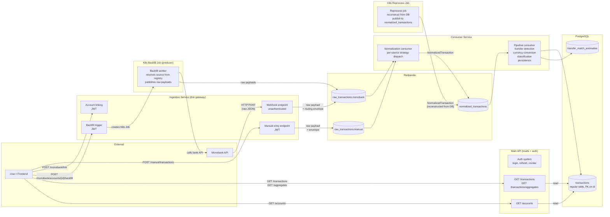

# Technical Specification: Transaction Ingestion Pipeline

- **Functional Specification:** `context/spec/003-transaction-ingestion-pipeline/functional-spec.md`
- **Status:** Draft
- **Author(s):** Nick

---

## 1. High-Level Technical Approach

The pipeline spans four backend services and the database layer:

1. **Ingestion service** — dedicated FastAPI service that owns all pipeline-feeding writes and account lifecycle. Receives Monobank webhooks, handles account linking (Monobank + manual), account management (rename, soft-delete), triggers backfill, accepts manual transaction entries. Publishes **raw bank payloads** (not normalized) with a routing envelope to per-source Redpanda topics. Validates JWTs for authenticated endpoints (does not issue tokens — that's the main API's job). Connects as `grosh_ingestion` (RLS enforced).
2. **Main API service** — serves the frontend with read-only data endpoints and the auth system. Lists accounts, queries transactions with filters, serves compute-on-read aggregates, manages user settings. Owns login, refresh token rotation, token revocation, and user management. Has no Redpanda dependency and no bank-specific code. Connects as `grosh_api` (RLS enforced).
3. **Consumer service** — two-stage pipeline:
   - **Normalization consumer**: subscribes to all `raw_transactions.*` topics, dispatches to per-source `NormalizationStrategy`, publishes `NormalizedTransaction` to `normalized_transactions`.
   - **Pipeline consumer**: subscribes to `normalized_transactions`, runs transfer detection → currency conversion → classification → persistence to PostgreSQL.
   Connects as `grosh_consumer` (RLS bypassed).
4. **Database** — PostgreSQL 16 with `pgvector` and `pg_cron` extensions. Plain tables with B-tree indexes. Aggregations computed on read via a single SQL query (no materialized views). `pg_cron` handles TTL cleanup for revoked tokens.

No frontend changes in this spec — REST API endpoints are the delivery boundary. Per-source raw models live in each source's module within the consumer; `NormalizedTransaction` is the internal consumer contract (not a cross-service shared model). All services connect to PostgreSQL with separate connection pools and per-service database roles.

**Data flow through the pipeline:**



Key points:
- **Two separate services serve the frontend.** The ingestion service handles all writes that feed the pipeline. The main API handles all reads and the auth system.
- **The ingestion service is a thin gateway.** It validates webhook authenticity, resolves `user_id`/`account_id` from the DB, and publishes the **raw bank payload** (not normalized) with a routing envelope to per-source topics. Normalization happens in the consumer.
- **The consumer has bank-specific code.** Normalization strategies and transfer detection strategies are per-source — they live in `sources/{bank}/` within the consumer. Currency conversion, classification, and persistence are source-agnostic.
- **Two-stage consumer with intermediate topic.** Raw → normalized (per-source logic) is cleanly separated from normalized → DB (source-agnostic pipeline). This enables reprocessing to publish directly to `normalized_transactions` without per-source reconstruction.
- **Reprocessing publishes to `normalized_transactions`.** It reconstructs `NormalizedTransaction` from stored DB columns and replays through the full pipeline consumer. Source-agnostic — one format regardless of bank count.
- **Auth is split:** the main API issues, refreshes, and revokes tokens. The ingestion service only validates them. Both share the same `JWT_SECRET`.
- **Each source** has code in two places: `sources/{bank}/` in ingestion (webhook, client, backfill) and `sources/{bank}/` in consumer (normalizer, transfer detection). Adding a new bank means adding subfolders in both — the main API doesn't change.
- **The backfill K8s Job** is also a producer — it publishes raw bank payloads to the same per-source topic as the webhook.

---

## 2. Proposed Solution & Implementation Plan

### 2.1 Architecture Changes

**Ingestion service** is a FastAPI application (`services/ingestion/`). Code is organized by source under `sources/` — each source gets its own subfolder. Monobank has `router.py`, `client.py`, `rates_provider.py`, `models.py`, `linking_service.py`, `backfill.py`, and `repo.py`. NBU has `client.py` and `rates_provider.py`. Manual has `router.py` and `service.py`. There are no generic `routers/` or top-level `services/account_service.py`/`services/transaction_service.py` — these dissolved into source modules. It owns:
- The Redpanda producer (initialized in lifespan). `confluent_kafka.Producer` with `bootstrap.servers = redpanda:9092`. Fire-and-forget produces with delivery callbacks for error logging. Flushed on shutdown.
- Per-source modules under `sources/` — e.g. `sources/monobank/` contains the HTTP client, webhook + link endpoints in a single router, `MonobankLinkingService`, `MonobankRepo`, and `MonobankBackfillProvider`. The webhook handler extracts routing fields (source_id, external account_id) from the raw payload inline — no separate adapter. `sources/nbu/` has the NBU HTTP client and rates provider. `sources/manual/` has `ManualService` (account creation, transaction creation + Redpanda publish) and its router.
- Generic repositories: `repositories/account_repo.py` (create account, ownership check), `repositories/integration_repo.py` (create integration via config dict), `repositories/user_settings_repo.py` (read default rate source, validate rate source). Each repo owns exactly one table.
- Currency rate ingestion (full design rationale in `ingestion-currency-rate-guide.md`) — per-source background loops poll exchange rate endpoints at each provider's cadence (Monobank `/bank/currency` every 5min, NBU `/exchange` daily). Each provider is a `RateProviderConfig` with `RateKind.POLLED` or `RateKind.HISTORICAL`. Polled providers write `update_cadence_seconds` and `last_polled_at` to rows; historical providers write neither. Stores in the `currency_rates` SCD2 table. Each source defines a `rates_provider.py` that normalizes to `NormalizedRate`. Providers are registered in `main.py`.
- Rate fallback chain — `rate_source_config` table defines fallback relationships (monobank → nbu) and base pivot currencies. Consumer checks FRESH eligibility via `last_polled_at + K * update_cadence_seconds >= transaction_time` (K=2).
- Admin rate backfill — K8s Job fetches NBU historical rates for a date range via `?start=YYYYMMDD&end=YYYYMMDD&valcode=CC` (one request per currency, ~45 total). Triggered by admin endpoint.

**Auth in the ingestion service:** JWT validation only — decodes access tokens using the shared `JWT_SECRET`, extracts `user_id`, sets the RLS session variable. Does not issue tokens, manage refresh tokens, or handle login. If the token is expired, returns 401. The frontend refreshes via the main API and retries.

**Main API service** (existing) gains read-path endpoints: `GET /accounts`, `GET /transactions`, `GET /transactions/aggregates`, `GET /rates`, `GET /rates/at`, `GET /settings`, `PUT /settings`. Retains full ownership of the auth system (login, refresh, revocation). Has no Redpanda dependency.

**Backfill worker** runs as a Kubernetes Job using the **ingestion service image**. The ingestion service triggers it via the `kubernetes` Python client, passing all parameters as env vars. The Job resolves the bank source from the integration record and dispatches to the matching `TransactionBackfillProvider` from the registry. Each provider encapsulates bank-specific logic (API auth, pagination, rate limits, adapter) and publishes raw transaction batches to the source's `raw_transactions.{source}` topic. Using the ingestion image is natural — the backfill job is a producer that needs bank clients and adapters, not a consumer.

**Consumer service** runs two consumer loops in a single process:
- **Normalization consumer** (`group.id = normalization`) — subscribes to all `raw_transactions.*` topics. Dispatches each message to the per-source `NormalizationStrategy` (registered in a `dict[str, NormalizationStrategy]`). Publishes the resulting `NormalizedTransaction` to the `normalized_transactions` topic. Bank-specific raw models are validated here (malformed payloads → skip + commit + log).
- **Pipeline consumer** (`group.id = transaction-pipeline`) — subscribes to `normalized_transactions`. Runs the layered pipeline in sequence: transfer detection (per-source strategy) → currency conversion (source-agnostic) → classification (future, mixed) → persistence (`ON CONFLICT (id) DO NOTHING`). Each layer defines a Strategy protocol; the pipeline orchestrator dispatches via a registry dict. Transfer detection and normalization are per-source; conversion and persistence are generic.

**Reprocessing job** runs as a Kubernetes Job using the **consumer service image**. Reads existing transaction rows from the DB, reconstructs `NormalizedTransaction` from stored columns (source-agnostic — one format), deletes originals, and publishes to `normalized_transactions`. The pipeline consumer processes them fresh. Triggered per-user via `POST /reprocess` or in batch via kubectl. Uses advisory locks to serialize against concurrent consumer writes.

### 2.2 Data Model / Database Changes

New migration: `0004_transaction_pipeline.py`

**Extensions to enable:**

| Extension  | Purpose                              |
|------------|--------------------------------------|
| `pgcrypto` | `pgp_sym_encrypt` for Monobank token |
| `pgvector` | Transaction description embeddings (future ML classifier) |
| `pg_cron`  | Scheduled TTL cleanup for revoked tokens |

**New ENUM types:**

| Type                  | Values                                      |
|-----------------------|---------------------------------------------|
| `bank_source`         | `monobank`                                  |
| `transaction_type`    | `income`, `expense`, `transfer`, `check`    |
| `transaction_source`  | `monobank`, `manual`                        |
| `transaction_origin`  | `bank`, `manual`                            |
| `transfer_anomaly_reason` | `unpaired_from_description`, `unpaired_to_description`, `ambiguous_iban_match`, `ambiguous_reverse_iban`, `ambiguous_amount_match`, `description_account_mismatch`, `description_consistency_mismatch` |

**ER diagram — full database state after this spec:**


**New tables:**

| Table               | Key Columns                                                                                                                                                                                                                                                                                                                                                                                                          | Notes                                                                                                                                                                        |
|---------------------|----------------------------------------------------------------------------------------------------------------------------------------------------------------------------------------------------------------------------------------------------------------------------------------------------------------------------------------------------------------------------------------------------------------------|------------------------------------------------------------------------------------------------------------------------------------------------------------------------------|
| `bank_integrations` | `id UUID PK`, `user_id FK→users`, `bank bank_source`, `config JSONB NOT NULL DEFAULT '{}'`, `status TEXT`, `created_at`, `updated_at`                                                                                                                                                                                                                                                                               | RLS on `user_id`. Bank-specific connection details live in `config`. Monobank stores `{"encrypted_token": "...", "webhook_secret": "...", "webhook_url": "..."}`. Token encrypted via `pgp_sym_encrypt` in `MonobankLinkingService`; stored as hex in `config.encrypted_token`. Webhook secret uniqueness enforced via partial expression index on `(config->>'webhook_secret') WHERE config->>'webhook_secret' IS NOT NULL`. |
| `accounts`          | `id UUID PK`, `user_id FK→users`, `integration_id FK→bank_integrations NULL`, `source transaction_source`, `type TEXT`, `currency_code TEXT`, `masked_pan TEXT`, `iban TEXT`, `external_id TEXT`, `cashback_type TEXT`, `name TEXT`, `is_active BOOLEAN`, `created_at`, `updated_at` | RLS on `user_id`. `integration_id` NULL for manual accounts. `type` is plain TEXT (not an enum — bank-specific types vary). `name` for manual accounts, unique per `(user_id, name, currency_code)` where `source = 'manual'`. |
| `categories`        | `id UUID PK`, `user_id FK→users NULL`, `name TEXT`, `parent_id FK→categories NULL`, `created_at`                                                                                                                                                                                                                                                                                                                     | RLS: `user_id = current_setting(...) OR user_id IS NULL` (system defaults visible to all).                                                                                   |
| `transactions`      | `id UUID PK` (deterministic hash), `source_id TEXT`, `user_id FK→users`, `account_id FK→accounts`, `time TIMESTAMPTZ`, `amount_cents BIGINT`, `operation_amount_cents BIGINT`, `currency_code TEXT`, `operation_currency_code TEXT NULL`, `amount_uah_cents BIGINT`, `amount_usd_cents BIGINT`, `amount_eur_cents BIGINT`, `description TEXT`, `mcc INT`, `cashback_amount_cents BIGINT`, `balance_cents BIGINT`, `hold BOOLEAN`, `raw_transaction_type transaction_type NOT NULL`, `transaction_type transaction_type NOT NULL`, `counterparty_iban TEXT`, `rate_source TEXT`, `metadata JSONB`, `source transaction_source`, `related_transaction_id UUID FK→transactions(id) ON DELETE SET NULL`, `created_at` | Regular table, PK on `id`. RLS on `user_id`. **Currency semantics:** `currency_code` is the account's base currency (resolved by the consumer from the `accounts` table at write time). `operation_currency_code` is the merchant/operation currency — NULL for domestic transactions, set to the foreign currency (e.g. `EUR`) for cross-currency purchases. `amount_cents` is in the account's base currency (the amount actually debited/credited). **Type system:** `raw_transaction_type` is the sign-based classification set by the normalizer (income/expense/check) and is immutable. `transaction_type` is the consumer-enriched classification — copied from `raw_transaction_type` by default, upgraded to `'transfer'` when the pipeline consumer detects an internal transfer via the 3-tier algorithm. `rate_source` stores which rate source chain was used for conversion (required for reprocessing). Display amounts denormalized at write time using per-bank exchange rates from `currency_rates`. `metadata` holds bank-specific extras (e.g. `counter_edrpou`, `counter_name`, `comment`) and per-currency rate traceability paths (`rate_uah`, `rate_usd`, `rate_eur`). **Origin:** `origin` (`transaction_origin` enum: `bank`, `manual`) classifies how the transaction was created — `bank` for API-ingested, `manual` for user-entered. Derivable from `source` (`monobank` → `bank`, `manual` → `manual`). **Conflict handling:** `ON CONFLICT (id) DO NOTHING` for idempotent dedup. `UNIQUE (account_id, source_id)` as a safety net — violations indicate a bug (same bank tx with two UUIDs) and crash loudly. |
| `transfer_match_anomalies` | `id UUID PK`, `transaction_id UUID FK→transactions(id) ON DELETE CASCADE UNIQUE`, `candidate_ids UUID[]`, `reason_code transfer_anomaly_reason NOT NULL`, `reason_detail TEXT`, `created_at TIMESTAMPTZ` | Records rejected or suspicious transfer matches. One anomaly per transaction max (UNIQUE constraint). Auto-deleted when a partner arrives and the pair is successfully claimed. |
| `revoked_tokens`    | `jti UUID PK`, `expires_at TIMESTAMPTZ NOT NULL`                                                                                                                                                         | Access token revocation for instant logout. `pg_cron` purges expired rows every 5 minutes. No RLS needed. |
| `reprocessing_locks` | `user_id UUID PK FK→users`, `locked_at TIMESTAMPTZ NOT NULL DEFAULT now()`                                                                                                                               | Status indicator for frontend. Row exists = reprocessing in progress. Stale locks (>30 min) are cleaned up by the next reprocess job. |
| `reprocessing_backups` | `id UUID PK`, `user_id UUID FK→users NOT NULL`, `data JSONB NOT NULL`, `created_at TIMESTAMPTZ NOT NULL DEFAULT now()`                                                                                  | Pre-delete snapshots for reprocessing safety. Retained 30 days. |
| `currency_rates`    | `id BIGSERIAL PK`, `source TEXT`, `currency_from TEXT`, `currency_to TEXT`, `rate_buy NUMERIC(18,8) NULL`, `rate_sell NUMERIC(18,8) NULL`, `rate_mid NUMERIC(18,8) NOT NULL`, `valid_from TIMESTAMPTZ NOT NULL DEFAULT now()`, `valid_to TIMESTAMPTZ NULL`, `last_polled_at TIMESTAMPTZ NULL`, `update_cadence_seconds INTEGER NULL`                                                                                                    | SCD Type 2. Two independent sequences per (source, pair): polled rows (`last_polled_at` and `update_cadence_seconds` both set) and historical rows (both NULL). `valid_to = NULL` = current rate. Polled rows get `last_polled_at` bumped on every poll if rates unchanged. `valid_from` is the provider's authoritative timestamp (`at_time`), not SQL `now()`. Rates stored as exact decimals (NUMERIC(18,8)). `rate_buy`/`rate_sell` nullable for mid-only sources (NBU). No RLS — rates are global. |
| `rate_source_config` | `source TEXT PK`, `fallback_source TEXT FK→rate_source_config NULL`, `base_currencies TEXT[] NOT NULL DEFAULT '{}'`                                                                                                                                                                                                                                                                                                      | Fallback chain for rate sources. `base_currencies` lists the currencies this source publishes rates against (e.g. `{UAH}` for both Monobank and NBU). Consumer uses the union of all base currencies as candidate intermediates when chaining conversions — no hard-coded pivot currency. Seed: nbu→NULL (`{UAH}`), monobank→nbu (`{UAH}`). |
| `user_settings`      | `user_id UUID PK FK→users`, `default_rate_source TEXT FK→rate_source_config NULL`, `timezone TEXT NOT NULL DEFAULT 'UTC'`, `updated_at TIMESTAMPTZ DEFAULT now()`                                                                                                                                                                                                                                                                        | Per-user preferences. `default_rate_source` is nullable — no hardcoded default. NULL means no default; manual transactions must specify `rate_source` explicitly, or conversion falls back to the transaction's source. `timezone` is an IANA timezone identifier used by the aggregation query for timezone-aware bucketing (`AT TIME ZONE`). Defaults to `'UTC'`; the frontend auto-detects the browser timezone and sends `PUT /settings` on first load. RLS on `user_id`. Created automatically via `AFTER INSERT ON users` trigger when a new user is created. |

**Transaction ID strategy:** The primary key `id` is a deterministic UUID computed as `UUID5(NAMESPACE, source + ":" + source_id)` where `source` is "monobank" or "manual" and `source_id` is the external system's transaction identifier. This is computed by the producer (ingestion service) before publishing to Redpanda. The consumer uses `INSERT ... ON CONFLICT (id) DO NOTHING` for idempotent deduplication.

**Indexes:**

| Index                                                                              | Purpose                            |
|-------------------------------------------------------------------------------------|-------------------------------------|
| `transactions(user_id, time DESC)`                                                  | Feed pagination, aggregation queries |
| `transactions(id)` UNIQUE (PK)                                                      | Deduplication via ON CONFLICT       |
| `transactions(account_id, source_id)` UNIQUE                                        | Business-key dedup safety net       |
| `transactions(user_id, account_id, time DESC)`                                      | Per-account queries                 |
| `transactions(user_id, account_id, raw_transaction_type, time DESC) WHERE mcc = 4829 AND related_transaction_id IS NULL` | Transfer detection Tier A            |
| `transactions(user_id, counterparty_iban, raw_transaction_type, time DESC) WHERE mcc = 4829 AND related_transaction_id IS NULL AND counterparty_iban IS NOT NULL` | Transfer detection Tier B (reverse IBAN) |
| `transactions(user_id, operation_amount_cents, raw_transaction_type, time DESC) WHERE mcc = 4829 AND counterparty_iban IS NULL AND related_transaction_id IS NULL` | Transfer detection Tier C            |
| `accounts(user_id)`                                                                 | Account listing                     |
| `accounts(user_id, name, currency_code) WHERE source = 'manual' AND name IS NOT NULL` UNIQUE | Manual account name uniqueness |
| `accounts(iban) WHERE iban IS NOT NULL`                                             | Transfer detection IBAN lookup       |
| `bank_integrations(config->>'webhook_secret') WHERE config->>'webhook_secret' IS NOT NULL` UNIQUE | Webhook secret validation |
| `currency_rates(source, currency_from, currency_to, valid_from) WHERE valid_to IS NULL` | Current rate lookup            |
| `revoked_tokens(expires_at)`                                                        | pg_cron TTL cleanup                 |

**Aggregation (compute-on-read):**

No materialized views. The `GET /transactions/aggregates` endpoint executes a single SQL query per request:

```sql
SELECT
    date_trunc($bucket, time AT TIME ZONE $user_tz) AS period_start,
    -- UAH
    COALESCE(SUM(amount_uah_cents) FILTER (WHERE transaction_type = 'income'),  0) AS uah_income_cents,
    COALESCE(SUM(amount_uah_cents) FILTER (WHERE transaction_type = 'expense'), 0) AS uah_expense_cents,
    ROUND(100.0 * COUNT(amount_uah_cents) / COUNT(*), 1) AS uah_converted_pct,
    -- USD, EUR follow same pattern
FROM transactions
WHERE user_id = $1
  AND transaction_type IN ('income', 'expense')
  AND time >= COALESCE($from, '-infinity'::timestamptz)
  AND time < COALESCE($to, 'infinity'::timestamptz)
GROUP BY period_start
ORDER BY period_start
```

With `INDEX (user_id, time DESC)`, this scans only the requesting user's rows. At 50 tx/month × 10 years = 6000 rows, any aggregation pattern completes in under 1ms. Supports any bucket size (day/week/month/quarter/year), arbitrary date ranges, per-currency selection, and timezone-aware bucketing. `converted_pct` exposes conversion completeness without inflating the response.

**pg_cron TTL for revoked tokens:**

```sql
SELECT cron.schedule_in_database(
    'purge-revoked-tokens',
    '*/5 * * * *',
    $$DELETE FROM revoked_tokens WHERE expires_at < now()$$,
    'grosh'
);
```

`pg_cron` requires `shared_preload_libraries=pg_cron` and `cron.database_name=grosh` set via Docker Compose command args.

### 2.3 API Contracts

#### Ingestion Service

**sources/monobank/router.py:**

| Method | Path                              | Auth | Request Body             | Response                               | Notes                                                                                    |
|--------|-----------------------------------|------|--------------------------|----------------------------------------|------------------------------------------------------------------------------------------|
| GET    | `/monobank/webhook/{secret}`      | None | (none)                   | 200 OK                                 | Monobank verification handshake                                                          |
| POST   | `/monobank/webhook/{secret}`      | None | Monobank `StatementItem` | 200 OK / 404 / 422                     | 404 if unknown secret or account. 422 if payload malformed. 200 only on success.         |
| POST   | `/monobank/link`                  | JWT  | `{ token: str }`         | `{ integration_id, accounts: [...] }`  | 409 if already linked. Creates integration + accounts, registers webhook.                |
| POST   | `/monobank/relink`                | JWT  | `{ token: str }`         | `{ integration_id, webhook_url }`      | Updates webhook URL + token on existing integration. No account changes. 422 if not linked. |
| POST   | `/monobank/accounts/{id}/backfill` | JWT | (query: `from`, `to`)    | `{ job_name, status }`                 | 409 if backfill already running. Triggers transactions backfill K8s Job.                 |

**routers/admin.py:**

| Method | Path                     | Auth | Request Body                           | Response                 | Notes                                                                 |
|--------|--------------------------|------|----------------------------------------|--------------------------|-----------------------------------------------------------------------|
| POST   | `/admin/rates-backfill`  | JWT+admin | `{ source, from_date, to_date }`    | `{ job_name, status }`   | 409 if already running. Validates source via registry.                |

**sources/manual/router.py:**

| Method | Path                     | Auth | Request Body                                                                    | Response                               | Notes                                             |
|--------|--------------------------|------|---------------------------------------------------------------------------------|----------------------------------------|---------------------------------------------------|
| POST   | `/manual/accounts`       | JWT  | `{ type: "cash", currency_code, name }`                                         | `{ id, type, currency_code, name }`    | 409 if name+currency already exists for user. Creates a manual cash account.  |
| POST   | `/manual/transactions`   | JWT  | `{ account_id, amount_cents, operation_currency_code, description, time, transaction_type, mcc?, rate_source?, idempotency_key? }` | `{ id, source, source_id, ... }` | `operation_currency_code` is the merchant/operation currency (used as the source currency for conversion). `transaction_type` restricted to `income` or `expense` (422 on `transfer` or `check` — transfers require pair detection which doesn't apply to manual source). Optional `idempotency_key` for dedup on retry. 403 if account not owned. 422 if invalid rate_source. |

**sources/manual/router.py (account management — moved from API service for write-ownership consistency):**

| Method | Path                              | Auth | Request Body / Params                                                           | Response                               | Notes                                                  |
|--------|-----------------------------------|------|---------------------------------------------------------------------------------|----------------------------------------|--------------------------------------------------------|
| PUT    | `/manual/accounts/{id}`           | JWT  | `{ name }`                                                                      | Updated account                        | Manual accounts only (403 for bank accounts)           |
| DELETE | `/manual/accounts/{id}`           | JWT  | (none)                                                                          | 204 or 404                             | Soft-delete (sets is_active=false). Manual only.       |

#### Main API Service

**accounts.py router:**

| Method | Path                 | Auth | Query Params / Body                       | Response                          | Notes                                        |
|--------|----------------------|------|-------------------------------------------|-----------------------------------|----------------------------------------------|
| GET    | `/accounts`          | JWT  | `source`, `type`, `currency_code`, `name` | List of accounts (RLS-scoped)     | All filters optional                         |
| GET    | `/accounts/{id}`     | JWT  | (none)                                    | Single account or 404             |                                              |

**transactions.py router:**

| Method | Path                              | Auth | Query Params                                                              | Response                                                                                                                   |
|--------|-----------------------------------|------|---------------------------------------------------------------------------|----------------------------------------------------------------------------------------------------------------------------|
| GET    | `/transactions`                   | JWT  | `type`, `account_id`, `from`, `to`, `unconverted_currency`, `limit`, `cursor` | Cursor-paginated list of transactions. Each item includes `currency_code` (account base currency), `operation_currency_code` (merchant currency, nullable), `raw_transaction_type` (normalizer classification), and `transaction_type` (consumer-enriched, may be `'transfer'`). `unconverted_currency` filters to rows where that currency's amount is NULL. |
| GET    | `/transactions/aggregates`        | JWT  | `currency`, `from`, `to`, `bucket`, `fields`                              | `{ bucket, items: [{ period_start, currencies: { UAH: { total_income_cents, total_expense_cents, delta_cents, converted_pct }, ... } }] }`. All params optional. Defaults: all currencies, all history, month bucket, all fields. |

**rates.py router:**

| Method | Path             | Auth      | Query Params                                                    | Response                                                                         | Notes                                   |
|--------|------------------|-----------|-----------------------------------------------------------------|----------------------------------------------------------------------------------|-----------------------------------------|
| GET    | `/rates`         | JWT | `source`, `currency_from`, `currency_to`, `from`, `to`, `limit`, `cursor` | Cursor-paginated list of rate rows                                      | No RLS (global table).                  |
| GET    | `/rates/at`      | JWT | `at` (datetime, default now), `source`, `currency_from`, `currency_to` | All rates active at the given timestamp                                 | SCD2 point-in-time query.               |

**settings.py router:**

| Method | Path        | Auth | Request Body                  | Response                                           | Notes                                          |
|--------|-------------|------|-------------------------------|----------------------------------------------------|------------------------------------------------|
| GET    | `/settings` | JWT  | (none)                        | `{ default_rate_source, timezone, updated_at }` | Returns current `user_settings` row            |
| PUT    | `/settings` | JWT  | `{ default_rate_source?, timezone? }` | `{ default_rate_source, timezone, updated_at }` | Validates `default_rate_source` against `rate_source_config` (422 if unknown). Validates `timezone` is a valid IANA identifier. Upserts `user_settings`. |

#### Consumer Service

**reprocess endpoint (exposed via consumer's HTTP server):**

| Method | Path          | Auth | Request Body | Response                    | Notes                                                                                    |
|--------|---------------|------|--------------|-----------------------------|------------------------------------------------------------------------------------------|
| POST   | `/reprocess`  | JWT  | (none)       | `{ status, user_id }`      | Acts on authenticated user. 409 if already in progress. 429 if cooldown not elapsed (1h). |

### 2.4 Redpanda Topics

| Topic                        | Partitions | Key       | Purpose                                                        |
|------------------------------|------------|-----------|----------------------------------------------------------------|
| `raw_transactions.monobank`  | 3          | `user_id` | Raw Monobank payloads from webhook and backfill                |
| `raw_transactions.manual`    | 3          | `user_id` | Manual transaction entries                                     |
| `normalized_transactions`    | 3          | `user_id` | Source-agnostic `NormalizedTransaction` (intermediate topic)   |

Per-source topics carry raw bank payloads wrapped in a `TransactionEnvelope` (routing metadata + untyped `payload` dict). The normalization consumer subscribes to all `raw_transactions.*` topics. The pipeline consumer subscribes only to `normalized_transactions`. Reprocessing publishes directly to `normalized_transactions` (skips normalization).

### 2.5 Models & Wire Formats

**Shared package (`grosh-shared`):**

| File           | Contents                                                                               |
|----------------|----------------------------------------------------------------------------------------|
| `models.py`    | Enums (`TransactionSource`, `TransactionType`, `RateSource`), `Transaction`, `Account`, `BankIntegration` domain models |
| `id_utils.py`  | Deterministic UUID: `generate_transaction_id(source, source_id) -> UUID` via `uuid5`   |
| `auth.py`      | JWT decode/validate utility (shared between API and ingestion)                         |
| `iso_4217.py`  | ISO 4217 numeric → alpha-3 currency code mapping                                      |
| `db_url.py`    | DSN conversion helpers (asyncpg ↔ SQLAlchemy dialect)                                  |

The shared package no longer defines the Kafka message schema — each source owns its own raw format, and `NormalizedTransaction` is the internal consumer contract.

**Consumer models:**

| Model                   | Location                              | Purpose                                              |
|-------------------------|---------------------------------------|------------------------------------------------------|
| `TransactionEnvelope`   | `grosh_shared/envelope.py`            | Wire format between ingestion and consumer: `user_id`, `account_id`, `source`, `payload: dict` |
| `NormalizedTransaction` | `grosh_consumer/models/normalized.py` | Source-agnostic intermediate format. All fields needed by the pipeline consumer: `id`, `source`, `source_id`, `user_id`, `account_id`, `time`, `amount_cents`, `operation_amount_cents`, `operation_currency_code`, `description`, `mcc`, `cashback_amount_cents`, `balance_cents`, `hold`, `counterparty_iban`, `rate_source`, `metadata` |
| `TransferResult`        | `grosh_consumer/models/transfer.py`   | Output of transfer detection: `transaction_type`, `related_transaction_id`, anomalies |
| `ConversionResult`      | `grosh_consumer/models/conversion.py` | Output of currency conversion: per-currency amounts + rate metadata |

**Per-source raw models (consumer, validated during normalization):**

| Source   | Model                      | Location                                      |
|----------|----------------------------|-----------------------------------------------|
| Monobank | `MonobankStatementItem`    | `grosh_consumer/sources/monobank/models.py`   |
| Manual   | `ManualTransactionPayload` | `grosh_consumer/sources/manual/models.py`     |

The normalizer deserializes `envelope.payload` into the source-specific Pydantic model. Malformed payloads fail with a validation error (skip + commit + log).

### 2.6 Consumer Pipeline Logic

**Stage 1 — Normalization consumer:**

1. Poll message from any `raw_transactions.*` topic
2. Deserialize to `TransactionEnvelope` (routing metadata + raw `payload` dict)
3. Look up `NormalizationStrategy` from registry by `envelope.source`
4. Call `strategy.normalize(envelope)` → `NormalizedTransaction`
5. Publish `NormalizedTransaction` to `normalized_transactions` (key = `user_id`)
6. Commit Kafka offset

Each normalizer validates the raw payload (deserializes into source-specific Pydantic model), applies source-specific transformations (abs amounts, type inference from sign, currency code resolution), and emits a source-agnostic `NormalizedTransaction`.

**Stage 2 — Pipeline consumer:**

1. Poll message from `normalized_transactions`
2. Deserialize to `NormalizedTransaction`
3. Idempotency check: if `id` already exists in `transactions` table → skip (return immediately, no side effects)
4. Acquire advisory lock: `pg_advisory_xact_lock(hashtext('reprocess:' || user_id))` — acquired on **every** event, not just during reprocessing. Normally instant (no contention). During reprocessing, blocks until the reprocess job's transaction commits, serializing consumer writes against the delete-and-replay window.
5. **Transfer detection** (per-source strategy dispatch): 3-tier algorithm for Monobank (see `adr-transfer-detection.md`). Sets `transaction_type = 'transfer'` and `related_transaction_id` on both legs when a pair is found. Records anomalies for rejected or ambiguous matches.
6. **Currency conversion** (source-agnostic): tiered rate resolution (FRESH → CLOSEST) with fallback chain. Computes `amount_uah_cents`, `amount_usd_cents`, `amount_eur_cents`. Records rate path metadata.
7. **Classification** (future): rule lookup → MCC fallback → ML classifier. Currently a no-op pass-through.
8. **Persistence**: `INSERT INTO transactions (...) ON CONFLICT (id) DO NOTHING`
9. Commit Kafka offset

Note: `amount_cents` is always positive (or zero for checks) and is in the account's base currency (`currency_code`). The `raw_transaction_type` field (income/expense/check) is set by the normalizer from sign conventions and is immutable. `transaction_type` is the pipeline-enriched field — initially copied from `raw_transaction_type`, then upgraded to `'transfer'` if the transfer detection strategy detects an internal transfer. Zero-amount transactions (card verification holds) are typed as `check`. `operation_currency_code` carries the merchant's currency for foreign purchases; NULL for domestic transactions.

**Transfer detection (Monobank strategy):**

The `MonobankTransferDetection` strategy implements a 3-tier algorithm for detecting internal transfers between the user's own accounts. Full algorithm design in `adr-transfer-detection.md`. Summary:

- **Tier A**: `counterparty_iban` matches an own account → deterministic pairing
- **Tier B**: another existing unclaimed tx has `counterparty_iban` = my account's IBAN → reverse lookup
- **Tier C**: both NULL IBAN, `operation_amount_cents` cross-match ±2s + semantic description validation against known Monobank transfer patterns

Safety invariants: ambiguity rejection (never guess between multiple candidates), claim locks (`FOR UPDATE SKIP LOCKED`), description validation on ALL tiers (load-bearing on Tier C — mismatch rejects the pair; canary on Tier A/B — mismatch records `description_consistency_mismatch` anomaly but pair proceeds since IBAN is deterministic), idempotency check at service entry. Anomaly recording for visibility into rejected matches and drift detection.

**Currency rate lookup with tiered fallback:**

For each denormalized amount (`amount_uah_cents`, `amount_usd_cents`, `amount_eur_cents`), the consumer builds a **rate path** from `event.operation_currency_code` (the merchant/source currency) to the target display currency using a per-transaction source chain loaded via a recursive CTE (`load_source_chain(entry_source)`). The path may be a single direct rate or a two-step chain through a pivot currency. No hard-coded pivot — pivots are derived from `rate_source_config.base_currencies`, ordered by chain depth then array position.

**Rate quality tiers:**

| Tier    | Condition                                                                                              | Meaning                              |
|---------|--------------------------------------------------------------------------------------------------------|--------------------------------------|
| FRESH   | Poll-based row with `last_polled_at + K * update_cadence_seconds >= T` and SCD2 window covers T (K=2) | Rate was actively monitored at time T |
| CLOSEST | No FRESH match; nearest row by proximity to T within 7-day window                                      | Last resort, logged as warning       |

Historical rows (`last_polled_at IS NULL`) are never FRESH — they always resolve via CLOSEST proximity.

**Resolution order (outer to inner):**

For each tier in (FRESH, CLOSEST):
1. Try 1-hop: direct pair, then reverse pair (for each source in the chain)
2. Try 2-hop via each pivot currency; both legs must resolve at the **same tier**

Within FRESH: source-major, direction-minor — the transaction's bank is tried before its fallbacks; for each source, direct lookup before reverse.

Within CLOSEST: ranked by date distance across the whole chain. Under degraded conditions, proximity to the transaction time beats source authority.

If no path resolves at any tier → `amount_{target}_cents` is NULL. Transactions are immutable, and a future "repair" operation can re-convert amounts after rates are backfilled.

**Rate-side selection (liquidation semantics):**

When converting a held currency to a display currency, the consumer picks the side of the bank's quote that reflects what the user would realize on liquidation:

| Direction     | Side used  | Reasoning                                        |
|---------------|------------|--------------------------------------------------|
| `divide=False` (stored as from→to) | `rate_buy`  | Bank buys the held currency from user |
| `divide=True` (stored as to→from)  | `rate_sell` | Bank sells the display currency to user |

If the chosen side is NULL (NBU, cross-rate pairs), fall back to `rate_mid`. Never substitute the opposite side — that would invert the sign of the spread error. In multi-hop paths, each leg applies the rule independently.

**Rate traceability metadata:**

Uniform format for all conversions. Each step carries: `from`, `to`, `source`, `rate_id`, `rate`, `rate_side` (`buy`/`sell`/`mid`), `tier` (`fresh`/`closest`), `op` (`multiply`/`divide`). CLOSEST-tier steps additionally include `proximity_seconds` — the absolute time distance in seconds between the transaction time and the rate's `valid_from`, indicating how stale the rate is. FRESH-tier steps omit this field (freshness is guaranteed by the `last_polled_at` check). Path-level metadata includes `effective_rate`, `hops`, overall `quality` (worst tier in the path), `sides` used, and `max_proximity_seconds` (worst proximity across all steps, present only if any step is CLOSEST).

Direct rate (Monobank publishes USD→EUR cross rate, FRESH tier):
```json
{
  "rate_eur": {
    "path": [
      {"from": "USD", "to": "EUR", "source": "monobank", "rate_id": 42,
       "rate": "0.9030", "rate_side": "buy", "tier": "fresh", "op": "multiply"}
    ],
    "effective_rate": "0.9030",
    "hops": 1,
    "quality": "fresh",
    "sides": ["buy"]
  }
}
```

Chained rate (NBU only publishes X→UAH, USD→EUR via UAH pivot, CLOSEST tier):
```json
{
  "rate_eur": {
    "path": [
      {"from": "USD", "to": "UAH", "source": "nbu", "rate_id": 108,
       "rate": "41.23", "rate_side": "mid", "tier": "closest", "proximity_seconds": 86400, "op": "multiply"},
      {"from": "UAH", "to": "EUR", "source": "nbu", "rate_id": 109,
       "rate": "45.80", "rate_side": "mid", "tier": "closest", "proximity_seconds": 86400, "op": "divide"}
    ],
    "effective_rate": "0.9002",
    "hops": 2,
    "quality": "closest",
    "max_proximity_seconds": 86400,
    "sides": ["mid"]
  }
}
```

Identity conversions (transaction already in target currency) are omitted from metadata.

**Source chain protection:** The recursive CTE has a depth cap of 10. If the chain hits the cap with a non-NULL `fallback_source`, a `RateSourceChainError` is raised — this catches cyclic or misconfigured chains at query time rather than looping forever.

**Hold flag:**

The `hold` column is stored as-is from the bank API but **not used for filtering or branching**. Analysis of Monobank's historical statement API showed the flag is unreliable: settled transactions are returned with `hold = true` based on which internal system processed them (card pipeline vs IBAN/SEP), not based on actual settlement status. The most recent ~30 days of data always comes back as `hold = true` regardless. Aggregates filter only on `transaction_type`, not on `hold`. The consumer does not perform hold→settlement linking — deduplication relies solely on `ON CONFLICT (id) DO NOTHING`.

Consumer config: normalization consumer `group.id = normalization`, pipeline consumer `group.id = transaction-pipeline`. Both: `auto.offset.reset = earliest`, `enable.auto.commit = false`. Manual commit after successful processing.

### 2.7 Backfill K8s Jobs

Two separate Job types, both source-agnostic. Parameters are passed as env vars; no Redpanda topic needed.

**Transactions backfill:** `infra/k8s/transactions-backfill-job-template.yaml`

- Uses the **ingestion service** Docker image with standalone entrypoint `python -m grosh_ingestion.jobs.run_transactions_backfill`
- Receives all parameters as env vars: `BACKFILL_INTEGRATION_ID`, `BACKFILL_USER_ID`, `BACKFILL_ACCOUNT_EXTERNAL_ID`, `BACKFILL_FROM_TIMESTAMP`, `BACKFILL_TO_TIMESTAMP`
- The entrypoint resolves the bank source from the integration record, then dispatches to the matching `TransactionBackfillProvider` from the source registry. Each provider encapsulates bank-specific logic (API auth, pagination, rate limits, adapter normalization)
- Publishes each transaction batch to `raw_transactions.{source}` as raw bank payloads wrapped in `TransactionEnvelope`
- `backoffLimit: 3`, `ttlSecondsAfterFinished: 3600`, `activeDeadlineSeconds: 1800`

**Rates backfill:** `infra/k8s/rates-backfill-job-template.yaml`

- Standalone entrypoint `python -m grosh_ingestion.jobs.run_rates_backfill`
- Receives `BACKFILL_SOURCE`, `BACKFILL_FROM_DATE`, `BACKFILL_TO_DATE` as env vars
- Looks up the `RateProviderConfig` from the registry and calls `config.fetch_historical(from_date, to_date)`. Each source's rates provider implements historical fetching
- `backoffLimit: 3`, `ttlSecondsAfterFinished: 3600`, `activeDeadlineSeconds: 3600`

**Ingestion service triggers both jobs** via `kubernetes` Python client. `BackfillService` constructs `V1Job` objects programmatically with unique timestamped names and passes all parameters as container env vars alongside `grosh-secrets` via `envFrom`. The `kubernetes` package is a dependency of the ingestion service.

### 2.8 New File Structure Summary

**Ingestion service (new):**

Source-specific code is grouped per source under `sources/`. Each source has a `router.py` (single router per source) and optionally `service.py` / `linking_service.py`, `client.py`, `models.py`, `rates_provider.py`, `repo.py`. Adding a new bank means adding a new subfolder under `sources/` — no changes to existing code. Normalization logic (raw bank payload → canonical `NormalizedTransaction`) lives in the consumer, not in the ingestion service — the ingestion service publishes raw bank payloads wrapped in `TransactionEnvelope`.

| Path                                                                                      | Responsibility                                                                         |
|-------------------------------------------------------------------------------------------|----------------------------------------------------------------------------------------|
| `services/ingestion/src/grosh_ingestion/main.py`                                         | App factory, lifespan (asyncpg pool + Redpanda producer + currency rate loop); registers all source routers |
| `services/ingestion/src/grosh_ingestion/deps.py`                                         | DI composition root, JWT validation dependency                                         |
| `services/ingestion/src/grosh_ingestion/models.py`                                       | Ingestion domain models (NormalizedRate, RateProviderConfig, TransactionBackfillProvider, WebhookReregistrationProvider protocols) |
| `services/ingestion/src/grosh_ingestion/registry.py`                                     | Source provider registries: `RATE_PROVIDERS`, `TRANSACTION_BACKFILL_PROVIDERS`          |
| `services/ingestion/src/grosh_ingestion/sources/monobank/models.py`                      | Monobank Pydantic models (API responses, webhook payload, currency rate)               |
| `services/ingestion/src/grosh_ingestion/sources/monobank/client.py`                      | Monobank API HTTP client (httpx) + public currency rate fetch                          |
| `services/ingestion/src/grosh_ingestion/sources/monobank/rates_provider.py`              | Normalize Monobank currency rates → list[NormalizedRate]                               |
| `services/ingestion/src/grosh_ingestion/sources/monobank/router.py`                      | `/monobank/link`, `/monobank/relink` (JWT) + `/monobank/webhook/{secret}` GET/POST (unauthenticated) + `/monobank/accounts/{id}/backfill` (JWT) |
| `services/ingestion/src/grosh_ingestion/sources/monobank/backfill.py`                    | `MonobankBackfillProvider` — implements `TransactionBackfillProvider` for Monobank      |
| `services/ingestion/src/grosh_ingestion/sources/monobank/linking_service.py`             | `MonobankLinkingService` — link (create integration + accounts + webhook), relink (update webhook URL + token on existing integration) |
| `services/ingestion/src/grosh_ingestion/sources/monobank/repo.py`                        | `MonobankRepo` — `get_active_integration_by_webhook_secret()` (queries `config->>'webhook_secret'`), `get_account_by_external_id()` |
| `services/ingestion/src/grosh_ingestion/sources/nbu/client.py`                           | NBU API HTTP client (daily + historical date-range queries)                            |
| `services/ingestion/src/grosh_ingestion/sources/nbu/rates_provider.py`                   | Normalize NBU rates → list[NormalizedRate] (daily + historical)                        |
| `services/ingestion/src/grosh_ingestion/sources/manual/router.py`                        | `/manual/accounts` POST + PUT + DELETE, `/manual/transactions` POST (all JWT)          |
| `services/ingestion/src/grosh_ingestion/sources/manual/service.py`                       | `ManualService` — account creation, transaction creation + Redpanda publish            |
| `services/ingestion/src/grosh_ingestion/repositories/account_repo.py`                    | Generic: `create_account()`, `belongs_to_user()`            |
| `services/ingestion/src/grosh_ingestion/repositories/user_settings_repo.py`              | `get_default_rate_source()` — reads `user_settings` table    |
| `services/ingestion/src/grosh_ingestion/repositories/integration_repo.py`                | Generic: `create_integration()`, `get_bank_source()`                                   |
| `services/ingestion/src/grosh_ingestion/repositories/user_repo.py`                       | User is_active check, get_role                                                         |
| `services/ingestion/src/grosh_ingestion/repositories/currency_rate_repo.py`              | SCD2 upsert (rates stored as NUMERIC(18,8))                                            |
| `services/ingestion/src/grosh_ingestion/services/backfill_service.py`                    | Source-agnostic K8s Job creation via `kubernetes` client                                |
| `services/ingestion/src/grosh_ingestion/routers/admin.py`                                | `POST /admin/rates-backfill` (admin-only)                |
| `services/ingestion/src/grosh_ingestion/jobs/run_transactions_backfill.py`           | Standalone script: resolves source from integration, dispatches to provider             |
| `services/ingestion/src/grosh_ingestion/jobs/run_rates_backfill.py`                  | Standalone script: resolves source from registry, calls `fetch_historical()`            |
| `services/ingestion/src/grosh_ingestion/jobs/reregister_webhooks.py`                | Re-registers webhooks for all active integrations via `WEBHOOK_REREGISTRATION_PROVIDERS` |
| `services/ingestion/pyproject.toml`                                                       | Dependencies: fastapi, asyncpg, confluent-kafka, httpx, PyJWT, kubernetes, grosh-shared |
| `services/ingestion/Dockerfile`                                                           | Multi-stage build, same pattern as API                                                 |

**Main API service (modified):**

| Path                                                            | Responsibility                                     |
|-----------------------------------------------------------------|----------------------------------------------------|
| `services/api/src/grosh_api/routers/accounts.py`                | `GET /accounts`, `GET /accounts/{id}` — read-only            |
| `services/api/src/grosh_api/routers/transactions.py`            | `GET /transactions`, `GET /transactions/aggregates`          |
| `services/api/src/grosh_api/routers/rates.py`                   | `GET /rates` (cursor-paginated), `GET /rates/at` (point-in-time SCD2 query) |
| `services/api/src/grosh_api/routers/settings.py`                | `GET /settings`, `PUT /settings` — user_settings read/upsert |
| `services/api/src/grosh_api/repositories/rate_repo.py`          | Cursor-paginated rate listing and point-in-time SCD2 lookup  |
| `services/api/src/grosh_api/repositories/settings_repo.py`      | `user_settings` CRUD + rate_source validation                |
| `services/api/src/grosh_api/repositories/account_repo.py`       | Account read operations                                      |
| `services/api/src/grosh_api/repositories/transaction_repo.py`   | Transaction queries, aggregate queries                       |
| `services/api/migrations/versions/0004_transaction_pipeline.py` | Extensions (pgcrypto, pgvector), tables, indexes, RLS policies |
| `services/api/migrations/versions/0006_rate_source_config.py`   | last_polled_at on currency_rates, rate_source_config table   |
| `services/api/migrations/versions/0007_user_settings.py`        | user_settings table + auto-create trigger                    |
| `services/api/migrations/versions/0008_app_roles.py`            | Create grosh_api/grosh_ingestion/grosh_consumer roles, grant per-table write privileges (full matrix), RLS policy rewrite to use `app.current_user_id()` |
| `services/api/migrations/versions/0009_revoked_tokens.py`       | revoked_tokens table + pg_cron purge job                     |

**Consumer service:**

| Path                                                                   | Responsibility                                            |
|------------------------------------------------------------------------|-----------------------------------------------------------|
| `services/consumer/src/grosh_consumer/main.py`                         | Entrypoint: starts both consumer loops via `asyncio.gather()` |
| `services/consumer/src/grosh_consumer/consumers/normalization_consumer.py` | Stage 1: raw envelopes → NormalizedTransaction → `normalized_transactions` topic |
| `services/consumer/src/grosh_consumer/consumers/pipeline_consumer.py`  | Stage 2: NormalizedTransaction → pipeline orchestrator → DB |
| `services/consumer/src/grosh_consumer/db.py`                           | asyncpg pool setup                                        |
| `services/consumer/src/grosh_consumer/kafka.py`                        | Kafka producer delivery callback                          |
| `services/consumer/src/grosh_consumer/models/normalized.py`            | `NormalizedTransaction` — internal consumer contract (not in shared package) |
| `services/consumer/src/grosh_consumer/models/transfer.py`              | `TransferResult`, `PairMatch`                             |
| `services/consumer/src/grosh_consumer/models/conversion.py`            | `ConversionResult` (unchanged)                            |
| `services/consumer/src/grosh_consumer/sources/monobank/normalizer.py`  | `MonobankNormalizer` (raw payload → NormalizedTransaction) |
| `services/consumer/src/grosh_consumer/sources/monobank/transfer.py`    | `MonobankTransferDetection` strategy (3-tier algorithm)   |
| `services/consumer/src/grosh_consumer/sources/monobank/descriptions.py`| Description guard dictionary and validation               |
| `services/consumer/src/grosh_consumer/sources/manual/normalizer.py`    | `ManualNormalizer` (trivial — payload is already canonical) |
| `services/consumer/src/grosh_consumer/services/pipeline.py`            | Orchestrates layer sequence (transfer → conversion → classification → persistence) |
| `services/consumer/src/grosh_consumer/services/currency_conversion_service.py` | Source-agnostic rate resolution (unchanged)      |
| `services/consumer/src/grosh_consumer/repositories/transaction_repo.py`| DB insert, ON CONFLICT (id) DO NOTHING                    |
| `services/consumer/src/grosh_consumer/repositories/account_repo.py`    | Account lookups (reads only, incl. IBAN for transfer detection) |
| `services/consumer/src/grosh_consumer/repositories/currency_rate_repo.py` | Rate queries (reads only)                              |
| `services/consumer/src/grosh_consumer/repositories/anomaly_repo.py`    | Transfer anomaly recording                                |
| `services/consumer/src/grosh_consumer/jobs/run_reprocess.py`           | Reprocessing job entrypoint                               |

**Shared package:**

| Path                                        | Responsibility                                                         |
|---------------------------------------------|------------------------------------------------------------------------|
| `shared/src/grosh_shared/envelope.py`       | `TransactionEnvelope` — wire format between ingestion and consumer     |
| `shared/src/grosh_shared/id_utils.py`       | Deterministic UUID hash function                                       |
| `shared/src/grosh_shared/models.py`         | Enums (`Topic`, `TransactionSource`, etc.), `Account`, `BankIntegration` domain models |
| `shared/src/grosh_shared/auth.py`           | JWT decode/validate utility (shared between API and ingestion)         |
| `shared/src/grosh_shared/db_url.py`         | DSN conversion helpers (asyncpg ↔ SQLAlchemy dialect)                  |
| `shared/src/grosh_shared/iso_4217.py`       | ISO 4217 numeric → alpha-3 currency code mapping                      |

**Infrastructure:**

| Path                                             | Responsibility                                         |
|--------------------------------------------------|--------------------------------------------------------|
| `infra/k8s/transactions-backfill-job-template.yaml` | K8s Job manifest template for transactions backfill |
| `infra/k8s/rates-backfill-job-template.yaml`     | K8s Job manifest template for historical rate backfill |
| `infra/k8s/ingestion-rbac.yaml`                  | ServiceAccount + Role + RoleBinding for Job creation   |
| `infra/grosh.postman_collection.json`            | Postman collection for all API and ingestion endpoints |
| `scripts/reregister-webhooks/dev.sh`             | Re-register webhooks in local dev (docker compose exec)  |
| `scripts/reregister-webhooks/prod.sh`            | Re-register webhooks in production (kubectl exec)        |
| `scripts/dev-k8s-setup.sh`                       | Local K8s namespace, secrets, kubeconfig, image build    |
| `scripts/dev-generate-certs.sh`                  | mkcert localhost TLS certs for dev HTTPS                 |

---

## 3. Impact and Risk Analysis

### System Dependencies

- **Ingestion service** (`grosh_ingestion` role) depends on: Redpanda (producer), PostgreSQL (writes: accounts, bank_integrations, currency_rates; reads: all), Monobank API (linking/webhook/rates), NBU API (rates), K8s API (backfill job trigger)
- **Main API service** (`grosh_api` role) depends on: PostgreSQL (writes: users, refresh_tokens, revoked_tokens, user_settings; reads: all). No Redpanda dependency.
- **Consumer service** (`grosh_consumer` role, RLS bypassed) depends on: Redpanda (consumer), PostgreSQL (writes: transactions, transfer_match_anomalies; reads: all)
- **Transaction Backfill Job** depends on: Monobank API (statement reads), Redpanda (producer), shared package
- **Rate Backfill Job** depends on: NBU API (historical rates), PostgreSQL (writes: currency_rates)
- **Reprocessing Job** depends on: PostgreSQL (reads: transactions; writes: reprocessing_locks, reprocessing_backups; deletes: transactions), Redpanda (producer to normalized_transactions)

### Potential Risks & Mitigations

| Risk                                                | Mitigation                                                                                                                                          |
|-----------------------------------------------------|-----------------------------------------------------------------------------------------------------------------------------------------------------|
| Monobank webhook replay / duplicate delivery        | Deterministic hash ID + `ON CONFLICT DO NOTHING` makes consumer fully idempotent                                                                    |
| Monobank API downtime during backfill               | K8s Job `backoffLimit: 3` retries. Backfill is idempotent — safe to re-run.                                                                         |
| Webhook endpoint abuse (public, unauthenticated)    | Opaque webhook secret in URL (unguessable). Validate account exists in DB. Rate-limit endpoint.                                                     |
| Redpanda unavailable when webhook fires             | Producer delivery failure logged. Monobank retries webhook delivery (built-in). No data loss.                                                       |
| Transfer detection misses (IBAN not yet registered) | When a new account is linked, re-scan recent transactions for transfer matches.                                                                     |
| Consumer crashes mid-batch                          | Manual offset commit after DB write. At-least-once + idempotent dedup. No data loss.                                                                |
| Monobank webhook has no payload signature            | Confirmed: Monobank does not sign webhook payloads. Security relies on the unguessable UUID4 secret in the URL path + account ID validation against DB. Acceptable for a self-hosted app with no public registration. |

### Database Role Separation & RLS Enforcement

Currently all services connect as `grosh_admin` (the table owner from `POSTGRES_USER`). PostgreSQL skips RLS for table owners, so RLS policies are only enforced because the API and ingestion services explicitly call `set_config('app.current_user_id', ...)` before queries. If a service forgets the `set_config` call, it silently sees all rows instead of failing — a dangerous default.

**Target state:** four database roles — one per service plus the owner for migrations. Each service gets `SELECT` on all tables but write privileges only on the tables it owns. No table has write access from more than one service.

| Role              | RLS      | Used by                      | Notes                          |
|-------------------|----------|------------------------------|--------------------------------|
| `grosh_admin`     | Bypassed | Alembic migrations only      | Table owner                    |
| `grosh_api`       | Enforced | API service                  |                                |
| `grosh_ingestion` | Enforced | Ingestion service            |                                |
| `grosh_consumer`  | Bypassed | Consumer service, K8s jobs   | `BYPASSRLS` attribute          |

**Why the consumer bypasses RLS:** The consumer processes events for all users in a single loop. It needs cross-user access for transfer detection (IBAN lookup across all accounts) and writes transactions for any user. Setting `set_config` per-event would work but adds complexity with no security benefit — the consumer is a trusted internal service, not user-facing. The role has `BYPASSRLS` but restricted write grants (per the matrix above), so privilege separation is still enforced at the table level.

**Write privilege matrix (all roles also get SELECT on all tables):**

| Table                        | `grosh_api`    | `grosh_ingestion`  | `grosh_consumer`           |
|------------------------------|----------------|--------------------|----------------------------|
| `users`                      | INSERT, UPDATE | —                  | —                          |
| `refresh_tokens`             | INSERT, DELETE | —                  | —                          |
| `revoked_tokens`             | INSERT, DELETE | —                  | —                          |
| `accounts`                   | —              | INSERT, UPDATE     | —                          |
| `bank_integrations`          | —              | INSERT, UPDATE     | —                          |
| `transactions`               | —              | —                  | INSERT, UPDATE, DELETE     |
| `transfer_match_anomalies`   | —              | —                  | INSERT, DELETE             |
| `currency_rates`             | —              | INSERT, UPDATE     | —                          |
| `user_settings`              | INSERT, UPDATE | —                  | —                          |
| `reprocessing_locks`         | —              | —                  | INSERT, DELETE             |
| `reprocessing_backups`       | —              | —                  | INSERT, DELETE             |

Account management endpoints (`PUT /manual/accounts/{id}`, `DELETE /manual/accounts/{id}`) live in the ingestion service. This consolidates all account write operations (create, rename, soft-delete) in a single service and prevents split write ownership on the `accounts` table.

**Migration (`0008_app_roles.py`):**

1. Create roles `grosh_api`, `grosh_ingestion`, `grosh_consumer` with `LOGIN` (passwords from env vars)
2. Grant `CONNECT ON DATABASE`, `USAGE ON SCHEMA public` to all three
3. Grant `SELECT ON ALL TABLES` and `USAGE, SELECT ON ALL SEQUENCES` to all three
4. Grant table-specific write privileges per the matrix above
5. `ALTER DEFAULT PRIVILEGES FOR ROLE grosh_admin` — grant SELECT + sequence usage to all three roles for future objects
6. Create `app` schema with `app.current_user_id()` utility function (see below)
7. Rewrite all RLS policies to use `app.current_user_id()` instead of raw `current_setting(...)::uuid` cast
8. Add `users_auth_lookup` policy for email-based login lookups

**RLS utility function (`app` schema):**

```sql
CREATE FUNCTION app.current_user_id()
RETURNS UUID
LANGUAGE sql
STABLE
PARALLEL SAFE
AS $$
    SELECT NULLIF(current_setting('app.current_user_id', true), '')::uuid;
$$;
```

All RLS policies use `app.current_user_id()` instead of inlining the cast. This prevents `''::uuid` errors — PostgreSQL reverts transaction-local `set_config` values to empty string (not NULL) after commit. `NULLIF` converts `''` to NULL, which safely doesn't match any row. The `app` schema keeps utility functions separate from data tables.

**Login RLS:** The `users` table has a second permissive policy (`users_auth_lookup`) that matches on `email = NULLIF(current_setting('app.current_user_email', true), '')::citext`. The login flow calls `set_config('app.current_user_email', email, true)` before querying.

**DSN configuration:** Each service gets its own `DATABASE_URL` env var using its role. Alembic uses `DATABASE_URL_ADMIN` (grosh_admin). Env vars: `GROSH_API_DB_PASSWORD`, `GROSH_INGESTION_DB_PASSWORD`, `GROSH_CONSUMER_DB_PASSWORD`.

**Verification:** Connect as `grosh_api`, attempt `INSERT INTO transactions` → permission denied. Connect as `grosh_consumer`, query `accounts` without `set_config` → all rows visible (RLS bypassed). Connect as `grosh_ingestion`, query `accounts` without `set_config` → zero rows (RLS enforced). With `set_config`, only that user's rows.

### Access Token Revocation (Instant Logout)

JWTs are stateless — once issued, they're valid until expiry (15 min). Without server-side revocation, "logout" only kills the refresh token; the access token keeps working. For a family app this is confusing UX.

**Solution:** A `revoked_tokens` table with `pg_cron` TTL cleanup.

**Table:**

```sql
CREATE TABLE revoked_tokens (
    jti        UUID        PRIMARY KEY,
    expires_at TIMESTAMPTZ NOT NULL
);
CREATE INDEX idx_revoked_tokens_expires_at ON revoked_tokens (expires_at);
```

TTL via `pg_cron`: `DELETE FROM revoked_tokens WHERE expires_at < now()` every 5 minutes. No RLS needed — revocation is a global concern. The `grosh_api` role gets INSERT + DELETE on this table.

**Flow:**
1. `POST /auth/logout` — insert the current access token's `jti` + `exp` into `revoked_tokens` (alongside existing refresh token deletion)
2. `POST /auth/logout-all` — revoke current access token + delete all refresh tokens
3. `get_current_user` dependency — after decoding the JWT, check `SELECT 1 FROM revoked_tokens WHERE jti = $1`. If found → 401.

**Performance:** At 3 users with 15-min token TTL, the table never exceeds ~20 rows. `pg_cron` purges expired entries every 5 minutes. The query is a single indexed lookup.

**Write privilege:** `grosh_api` gets INSERT, DELETE on `revoked_tokens`. No other service writes to it.

---

## 4. Testing Strategy

| Layer                 | Approach                                                                                                                                                                                                                                                                                     |
|-----------------------|----------------------------------------------------------------------------------------------------------------------------------------------------------------------------------------------------------------------------------------------------------------------------------------------|
| **Unit tests**        | Ingestion service: mock repos, Monobank client, K8s client. Test adapter payload building. Main API: mock repos. Test query filtering and aggregation. Consumer: test normalization strategies (raw → NormalizedTransaction), transfer detection logic (all 3 tiers, anomaly recording), currency conversion (rate resolution, tier ordering, path building). |
| **Integration tests** | Ingestion: real DB, mocked Redpanda producer. Verify endpoints produce correct events. Main API: real DB (rollback-transaction pattern). Verify query endpoints return correct data including aggregates. Consumer: real DB, feed pre-built `NormalizedTransaction` events. Verify transfer pairing, rate conversion, persistence, and dedup. |
| **Contract tests**    | Verify `TransactionEnvelope` + raw payload round-trip (ingestion → normalization consumer). Verify `NormalizedTransaction` round-trip (normalization consumer → pipeline consumer). |
| **Backfill tests**    | Unit test the pagination logic (mock Monobank API responses). Integration test with a local K8s environment is deferred to Phase 2 Go Live. |
| **Transfer detection** | Comprehensive regression suite: all 3 tiers, all anomaly types, multi-hop chains, concurrent claim scenarios, description guard validation. See `adr-transfer-detection.md` for validated test patterns. |
| **Reprocessing**      | End-to-end: insert transactions, trigger reprocess, verify all re-appear with updated pipeline results. Concurrency: concurrent webhook during reprocess window. Failure recovery: simulate crash mid-replay, verify backup restore. |
