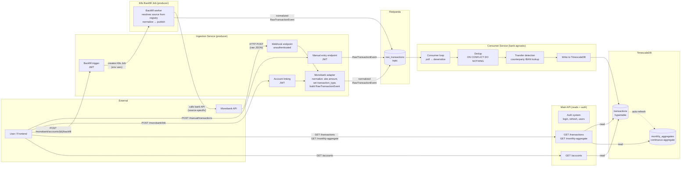
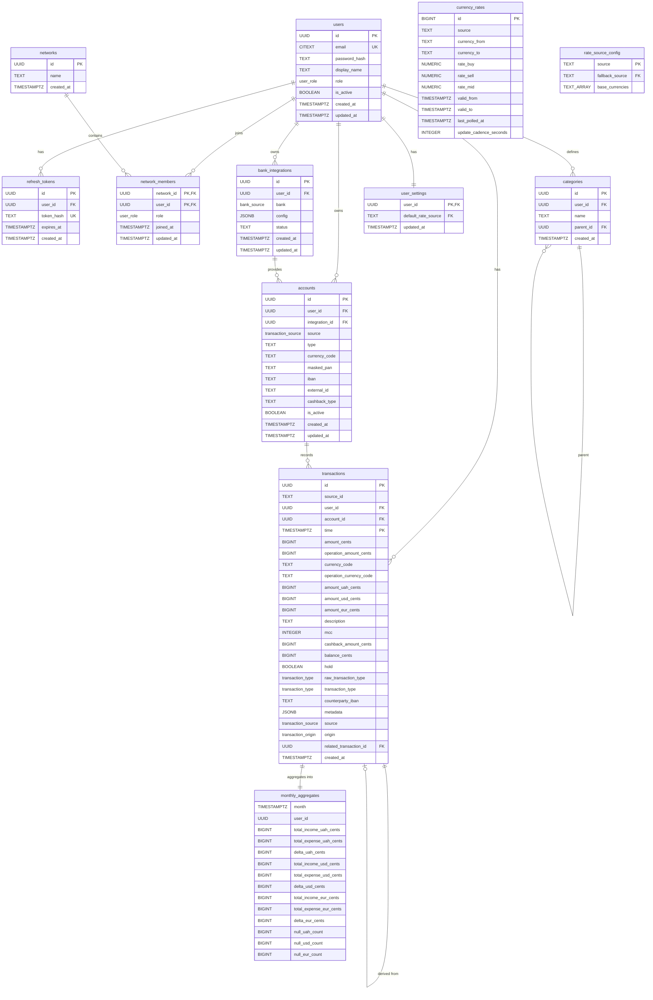

# Technical Specification: Transaction Ingestion Pipeline

- **Functional Specification:** `context/spec/003-transaction-ingestion-pipeline/functional-spec.md`
- **Status:** Draft
- **Author(s):** Nick

---

## 1. High-Level Technical Approach

The pipeline spans four backend services and the database layer:

1. **Ingestion service** (new) — dedicated FastAPI service that owns all pipeline-feeding writes. Receives Monobank webhooks, handles account linking (Monobank + manual), triggers backfill, accepts manual transaction entries. Owns the Redpanda producer, bank adapters, and account write operations. Validates JWTs for authenticated endpoints (does not issue tokens — that's the main API's job).
2. **Main API service** (existing) — serves the frontend with read endpoints. Lists accounts, queries transactions with filters, serves monthly aggregates. Owns the auth system (login, refresh token rotation, user management). Has no Redpanda dependency and no bank-specific code.
3. **Consumer service** — built from scratch. Subscribes to `raw_transactions` topic, deduplicates via deterministic hash IDs (`ON CONFLICT DO NOTHING`), detects internal transfers by counterparty IBAN lookup, and writes to TimescaleDB.
4. **Database** — new migration enables TimescaleDB + pgcrypto extensions, creates `bank_integrations`, `accounts`, `categories`, and `transactions` (hypertable) tables with RLS policies, plus continuous aggregates for monthly rollups by currency.

No frontend changes in this spec — REST API endpoints are the delivery boundary. The Redpanda wire format (`RawTransactionEvent`) and Monobank API client live in `grosh-shared` for cross-service reuse. Both the ingestion service and main API connect to TimescaleDB with separate connection pools.

**Data flow through the pipeline:**



Key points:
- **Two separate services serve the frontend.** The ingestion service handles all writes that feed the pipeline. The main API handles all reads and the auth system.
- **Monobank never talks to Redpanda.** It only sends HTTP to the ingestion service's webhook endpoint.
- **The ingestion service is the producer.** It translates bank-specific JSON into normalized `RawTransactionEvent` (always-positive amounts, explicit `transaction_type`) and publishes to Redpanda.
- **The consumer is bank-agnostic.** It only sees `RawTransactionEvent` — doesn't know or care which bank originated it.
- **Auth is split:** the main API issues and refreshes tokens. The ingestion service only validates them. Both share the same `JWT_SECRET`.
- **Each source adapter** (currently only Monobank) lives in the ingestion service under `sources/`. Adding a new bank means adding a new subfolder — the consumer and main API don't change.
- **The backfill K8s Job** is also a producer — it calls Monobank's API directly, normalizes identically, and publishes to the same topic.

---

## 2. Proposed Solution & Implementation Plan

### 2.1 Architecture Changes

**Ingestion service** is a new FastAPI application (`services/ingestion/`). Code is organized by source under `sources/` — each source gets its own subfolder. Monobank has `router.py`, `client.py`, `transaction_adapter.py`, `rates_provider.py`, `models.py`, `linking_service.py`, and `repo.py`. NBU has `client.py` and `rates_provider.py`. Manual has `router.py` and `service.py`. There are no generic `routers/` or top-level `services/account_service.py`/`services/transaction_service.py` — these dissolved into source modules. It owns:
- The Redpanda producer (initialized in lifespan). `confluent_kafka.Producer` with `bootstrap.servers = redpanda:9092`. Fire-and-forget produces with delivery callbacks for error logging. Flushed on shutdown.
- Per-source modules under `sources/` — e.g. `sources/monobank/` contains the HTTP client, transaction adapter (normalizes to `RawTransactionEvent`), webhook + link endpoints in a single router, `MonobankLinkingService`, and `MonobankRepo`. `sources/nbu/` has the NBU HTTP client and rates provider. `sources/manual/` has `ManualService` (account creation, transaction creation + Redpanda publish) and its router.
- Generic repositories: `repositories/account_repo.py` (create account, ownership check), `repositories/integration_repo.py` (create integration via config dict), `repositories/user_settings_repo.py` (read default rate source, validate rate source). Each repo owns exactly one table.
- Currency rate ingestion (full design rationale in `ingestion-currency-rate-guide.md`) — per-source background loops poll exchange rate endpoints at each provider's cadence (Monobank `/bank/currency` every 5min, NBU `/exchange` daily). Each provider is a `RateProviderConfig` with `RateKind.POLLED` or `RateKind.HISTORICAL`. Polled providers write `update_cadence_seconds` and `last_polled_at` to rows; historical providers write neither. Stores in the `currency_rates` SCD2 table. Each source defines a `rates_provider.py` that normalizes to `NormalizedRate`. Providers are registered in `main.py`.
- Rate fallback chain — `rate_source_config` table defines fallback relationships (monobank → nbu) and base pivot currencies. Consumer checks FRESH eligibility via `last_polled_at + K * update_cadence_seconds >= transaction_time` (K=2).
- Admin rate backfill — K8s Job fetches NBU historical rates for a date range via `?start=YYYYMMDD&end=YYYYMMDD&valcode=CC` (one request per currency, ~45 total). Triggered by admin endpoint.

**Auth in the ingestion service:** JWT validation only — decodes access tokens using the shared `JWT_SECRET`, extracts `user_id`, sets the RLS session variable. Does not issue tokens, manage refresh tokens, or handle login. If the token is expired, returns 401. The frontend refreshes via the main API and retries.

**Main API service** (existing) gains only read-path endpoints: `GET /accounts`, `GET /transactions`, `GET /transactions/monthly-aggregate`. Retains full ownership of the auth system. Has no Redpanda dependency.

**Backfill worker** runs as a Kubernetes Job using the **ingestion service image**. The ingestion service triggers it via the `kubernetes` Python client, passing all parameters as env vars. The Job resolves the bank source from the integration record and dispatches to the matching `TransactionBackfillProvider` from the registry. Each provider encapsulates bank-specific logic (API auth, pagination, rate limits, adapter normalization) and publishes transaction batches to `raw_transactions`. Using the ingestion image is natural — the backfill job is a producer that needs bank clients and adapters, not a consumer.

**Consumer service** runs the transaction consumer loop:
- **Transaction consumer** (`group.id = transaction-pipeline`) — subscribes to `raw_transactions`, deduplicates, detects transfers, looks up per-bank exchange rates from `currency_rates` SCD2 table, computes denormalized display amounts (`amount_uah_cents`, `amount_usd_cents`, `amount_eur_cents`), writes to DB. The consumer is bank-agnostic — it has no bank clients or adapters.

### 2.2 Data Model / Database Changes

New migration: `0004_transaction_pipeline.py`

**Extensions to enable:**

| Extension     | Purpose                              |
|---------------|--------------------------------------|
| `timescaledb` | Hypertables, continuous aggregates   |
| `pgcrypto`    | `pgp_sym_encrypt` for Monobank token |

**New ENUM types:**

| Type                  | Values                                      |
|-----------------------|---------------------------------------------|
| `bank_source`         | `monobank`                                  |
| `transaction_type`    | `income`, `expense`, `transfer`, `check`    |
| `transaction_source`  | `monobank`, `manual`                        |
| `transaction_origin`  | `bank`, `manual`, `derived`                 |

**ER diagram — full database state after this spec:**



**New tables:**

| Table               | Key Columns                                                                                                                                                                                                                                                                                                                                                                                                          | Notes                                                                                                                                                                        |
|---------------------|----------------------------------------------------------------------------------------------------------------------------------------------------------------------------------------------------------------------------------------------------------------------------------------------------------------------------------------------------------------------------------------------------------------------|------------------------------------------------------------------------------------------------------------------------------------------------------------------------------|
| `bank_integrations` | `id UUID PK`, `user_id FK→users`, `bank bank_source`, `config JSONB NOT NULL DEFAULT '{}'`, `status TEXT`, `created_at`, `updated_at`                                                                                                                                                                                                                                                                               | RLS on `user_id`. Bank-specific connection details live in `config`. Monobank stores `{"encrypted_token": "...", "webhook_secret": "...", "webhook_url": "..."}`. Token encrypted via `pgp_sym_encrypt` in `MonobankLinkingService`; stored as hex in `config.encrypted_token`. Webhook secret uniqueness enforced via partial expression index on `(config->>'webhook_secret') WHERE config->>'webhook_secret' IS NOT NULL`. |
| `accounts`          | `id UUID PK`, `user_id FK→users`, `integration_id FK→bank_integrations NULL`, `source transaction_source`, `type TEXT`, `currency_code TEXT`, `masked_pan TEXT`, `iban TEXT`, `external_id TEXT`, `cashback_type TEXT`, `name TEXT`, `is_active BOOLEAN`, `created_at`, `updated_at` | RLS on `user_id`. `integration_id` NULL for manual accounts. `type` is plain TEXT (not an enum — bank-specific types vary). `name` for manual accounts, unique per `(user_id, name, currency_code)` where `source = 'manual'`. |
| `categories`        | `id UUID PK`, `user_id FK→users NULL`, `name TEXT`, `parent_id FK→categories NULL`, `created_at`                                                                                                                                                                                                                                                                                                                     | RLS: `user_id = current_setting(...) OR user_id IS NULL` (system defaults visible to all).                                                                                   |
| `transactions`      | `id UUID PK` (deterministic hash), `source_id TEXT`, `user_id FK→users`, `account_id FK→accounts`, `time TIMESTAMPTZ`, `amount_cents BIGINT`, `operation_amount_cents BIGINT`, `currency_code TEXT`, `operation_currency_code TEXT NULL`, `amount_uah_cents BIGINT`, `amount_usd_cents BIGINT`, `amount_eur_cents BIGINT`, `description TEXT`, `mcc INT`, `cashback_amount_cents BIGINT`, `balance_cents BIGINT`, `hold BOOLEAN`, `raw_transaction_type transaction_type NOT NULL`, `transaction_type transaction_type NOT NULL`, `counterparty_iban TEXT`, `metadata JSONB`, `source transaction_source`, `created_at` | **Hypertable** on `time`. RLS on `user_id`. **Currency semantics:** `currency_code` is the account's base currency (resolved by the consumer from the `accounts` table at write time). `operation_currency_code` is the merchant/operation currency — NULL for domestic transactions, set to the foreign currency (e.g. `EUR`) for cross-currency purchases. `amount_cents` is in the account's base currency (the amount actually debited/credited). **Type system:** `raw_transaction_type` is the sign-based classification set by the adapter (income/expense/check) and is immutable. `transaction_type` is the consumer-enriched classification — copied from `raw_transaction_type` by default, upgraded to `'transfer'` when the consumer detects an internal transfer via IBAN matching. Display amounts denormalized at write time using per-bank exchange rates from `currency_rates`. `metadata` holds bank-specific extras (e.g. `counter_edrpou`, `invoice_id`) and rate source traceability (e.g. `rate_source_uah`, `rate_source_usd`, `rate_source_eur`). |
| `currency_rates`    | `id BIGSERIAL PK`, `source TEXT`, `currency_from TEXT`, `currency_to TEXT`, `rate_buy NUMERIC(18,8) NULL`, `rate_sell NUMERIC(18,8) NULL`, `rate_mid NUMERIC(18,8) NOT NULL`, `valid_from TIMESTAMPTZ NOT NULL DEFAULT now()`, `valid_to TIMESTAMPTZ NULL`, `last_polled_at TIMESTAMPTZ NULL`, `update_cadence_seconds INTEGER NULL`                                                                                                    | SCD Type 2. Two independent sequences per (source, pair): polled rows (`last_polled_at` and `update_cadence_seconds` both set) and historical rows (both NULL). `valid_to = NULL` = current rate. Polled rows get `last_polled_at` bumped on every poll if rates unchanged. `valid_from` is the provider's authoritative timestamp (`at_time`), not SQL `now()`. Rates stored as exact decimals (NUMERIC(18,8)). `rate_buy`/`rate_sell` nullable for mid-only sources (NBU). No RLS — rates are global. |
| `rate_source_config` | `source TEXT PK`, `fallback_source TEXT FK→rate_source_config NULL`, `base_currencies TEXT[] NOT NULL DEFAULT '{}'`                                                                                                                                                                                                                                                                                                      | Fallback chain for rate sources. `base_currencies` lists the currencies this source publishes rates against (e.g. `{UAH}` for both Monobank and NBU). Consumer uses the union of all base currencies as candidate intermediates when chaining conversions — no hard-coded pivot currency. Seed: nbu→NULL (`{UAH}`), monobank→nbu (`{UAH}`). |
| `user_settings`      | `user_id UUID PK FK→users`, `default_rate_source TEXT FK→rate_source_config NULL`, `updated_at TIMESTAMPTZ DEFAULT now()`                                                                                                                                                                                                                                                                        | Per-user preferences. `default_rate_source` is nullable — no hardcoded default. NULL means no default; manual transactions must specify `rate_source` explicitly, or conversion falls back to the transaction's source. RLS on `user_id`. Created automatically via `AFTER INSERT ON users` trigger when a new user is created. |

**Transaction ID strategy:** The primary key `id` is a deterministic UUID computed as `UUID5(NAMESPACE, source + ":" + source_id)` where `source` is "monobank" or "manual" and `source_id` is the external system's transaction identifier. This is computed by the producer (ingestion service) before publishing to Redpanda. The consumer uses `INSERT ... ON CONFLICT (id) DO NOTHING` for idempotent deduplication.

**Indexes:**

| Index                                                                              | Purpose                       |
|------------------------------------------------------------------------------------|-------------------------------|
| `transactions(user_id, time DESC)`                                                 | Feed pagination               |
| `transactions(id)` UNIQUE (PK)                                                     | Deduplication via ON CONFLICT |
| `transactions(account_id, source_id, time)` UNIQUE                                 | Dedup + per-account lookup    |
| `transactions(user_id, account_id, time DESC)`                                     | Per-account queries (future)  |
| `accounts(user_id)`                                                                | Account listing               |
| `accounts(user_id, name, currency_code)` WHERE `source = 'manual' AND name IS NOT NULL` UNIQUE | Manual account name uniqueness |
| `accounts(iban)` WHERE `iban IS NOT NULL`                                          | Transfer detection lookup     |
| `bank_integrations(config->>'webhook_secret') WHERE config->>'webhook_secret' IS NOT NULL` UNIQUE | Webhook URL validation |
| `currency_rates(source, currency_from, currency_to, valid_from)` WHERE `valid_to IS NULL` | Current rate lookup    |

**Continuous aggregates:**

```sql
CREATE MATERIALIZED VIEW monthly_aggregates
WITH (timescaledb.continuous) AS
SELECT
    time_bucket('1 month', time) AS month,
    user_id,
    -- UAH
    COALESCE(SUM(amount_uah_cents)
        FILTER (WHERE transaction_type = 'income'),  0) AS total_income_uah_cents,
    COALESCE(SUM(amount_uah_cents)
        FILTER (WHERE transaction_type = 'expense'), 0) AS total_expense_uah_cents,
    COALESCE(SUM(amount_uah_cents)
        FILTER (WHERE transaction_type = 'income'),  0)
  - COALESCE(SUM(amount_uah_cents)
        FILTER (WHERE transaction_type = 'expense'), 0) AS delta_uah_cents,
    -- USD
    COALESCE(SUM(amount_usd_cents)
        FILTER (WHERE transaction_type = 'income'),  0) AS total_income_usd_cents,
    COALESCE(SUM(amount_usd_cents)
        FILTER (WHERE transaction_type = 'expense'), 0) AS total_expense_usd_cents,
    COALESCE(SUM(amount_usd_cents)
        FILTER (WHERE transaction_type = 'income'),  0)
  - COALESCE(SUM(amount_usd_cents)
        FILTER (WHERE transaction_type = 'expense'), 0) AS delta_usd_cents,
    -- EUR
    COALESCE(SUM(amount_eur_cents)
        FILTER (WHERE transaction_type = 'income'),  0) AS total_income_eur_cents,
    COALESCE(SUM(amount_eur_cents)
        FILTER (WHERE transaction_type = 'expense'), 0) AS total_expense_eur_cents,
    COALESCE(SUM(amount_eur_cents)
        FILTER (WHERE transaction_type = 'income'),  0)
  - COALESCE(SUM(amount_eur_cents)
        FILTER (WHERE transaction_type = 'expense'), 0) AS delta_eur_cents,
    -- NULL rate counts (data quality)
    COUNT(*) FILTER (WHERE amount_uah_cents IS NULL) AS null_uah_count,
    COUNT(*) FILTER (WHERE amount_usd_cents IS NULL) AS null_usd_count,
    COUNT(*) FILTER (WHERE amount_eur_cents IS NULL) AS null_eur_count
FROM transactions
WHERE transaction_type NOT IN ('transfer', 'check')
  AND hold = false
GROUP BY month, user_id
WITH NO DATA;
```

Note: `amount_{currency}_cents` columns are denormalized at write time by the consumer using per-bank exchange rates from the `currency_rates` SCD2 table. All amounts are always positive; direction is indicated by `transaction_type`. The aggregate no longer groups by `currency_code` — each row contains all three currency representations.

Refresh policy: continuous, real-time aggregation enabled (combines materialized data with recent un-materialized rows).

### 2.3 API Contracts

#### Ingestion Service

**sources/monobank/router.py:**

| Method | Path                              | Auth | Request Body             | Response                               | Notes                                                                                    |
|--------|-----------------------------------|------|--------------------------|----------------------------------------|------------------------------------------------------------------------------------------|
| GET    | `/monobank/webhook/{secret}`      | None | (none)                   | 200 OK                                 | Monobank verification handshake                                                          |
| POST   | `/monobank/webhook/{secret}`      | None | Monobank `StatementItem` | 200 OK / 404 / 422                     | 404 if unknown secret or account. 422 if payload malformed. 200 only on success.         |
| POST   | `/monobank/link`                  | JWT  | `{ token: str }`         | `{ integration_id, accounts: [...] }`  | 409 if already linked. Creates integration + accounts, registers webhook.                |
| POST   | `/monobank/relink`                | JWT  | `{ token: str }`         | `{ integration_id, webhook_url }`      | Updates webhook URL + token on existing integration. No account changes. 422 if not linked. |
| POST   | `/monobank/accounts/{id}/backfill` | JWT | (query: `from`, `to`)    | `{ job_name, status }`                 | 409 if backfill already running. Triggers transactions backfill K8s Job.                 |

**routers/admin.py:**

| Method | Path                     | Auth | Request Body                           | Response                 | Notes                                                                 |
|--------|--------------------------|------|----------------------------------------|--------------------------|-----------------------------------------------------------------------|
| POST   | `/admin/rates-backfill`  | JWT+admin | `{ source, from_date, to_date }`    | `{ job_name, status }`   | 409 if already running. Validates source via registry.                |

**sources/manual/router.py:**

| Method | Path                     | Auth | Request Body                                                                    | Response                               | Notes                                             |
|--------|--------------------------|------|---------------------------------------------------------------------------------|----------------------------------------|---------------------------------------------------|
| POST   | `/manual/accounts`       | JWT  | `{ type: "cash", currency_code, name }`                                         | `{ id, type, currency_code, name }`    | 409 if name+currency already exists for user. Creates a manual cash account.  |
| POST   | `/manual/transactions`   | JWT  | `{ account_id, amount_cents, operation_currency_code, description, time, transaction_type, mcc?, rate_source?, idempotency_key? }` | `{ id, source, source_id, ... }` | `operation_currency_code` is the merchant/operation currency (used as the source currency for conversion). Optional `idempotency_key` for dedup on retry. 403 if account not owned. 422 if invalid rate_source. |

#### Main API Service

**accounts.py router:**

| Method | Path                 | Auth | Query Params / Body                       | Response                          | Notes                                        |
|--------|----------------------|------|-------------------------------------------|-----------------------------------|----------------------------------------------|
| GET    | `/accounts`          | JWT  | `source`, `type`, `currency_code`, `name` | List of accounts (RLS-scoped)     | All filters optional                         |
| GET    | `/accounts/{id}`     | JWT  | (none)                                    | Single account or 404             |                                              |
| PUT    | `/accounts/{id}`     | JWT  | `{ name }`                                | Updated account                   | Manual accounts only (403 for bank accounts) |
| DELETE | `/accounts/{id}`     | JWT  | (none)                                    | 204 or 404                        | Soft-delete (sets is_active=false)           |

**transactions.py router:**

| Method | Path                              | Auth | Query Params                                           | Response                                                                                                                   |
|--------|-----------------------------------|------|--------------------------------------------------------|----------------------------------------------------------------------------------------------------------------------------|
| GET    | `/transactions`                   | JWT  | `type`, `account_id`, `from`, `to`, `limit`, `cursor` | Cursor-paginated list of transactions. Each item includes `currency_code` (account base currency), `operation_currency_code` (merchant currency, nullable), `raw_transaction_type` (adapter classification), and `transaction_type` (consumer-enriched, may be `'transfer'`). |
| GET    | `/transactions/monthly-aggregate` | JWT  | (none)                                                 | `[{ month, income_uah, expense_uah, delta_uah, income_usd, expense_usd, delta_usd, income_eur, expense_eur, delta_eur }]` |

**rates.py router:**

| Method | Path             | Auth      | Query Params                                                    | Response                                                                         | Notes                                   |
|--------|------------------|-----------|-----------------------------------------------------------------|----------------------------------------------------------------------------------|-----------------------------------------|
| GET    | `/rates`         | JWT | `source`, `currency_from`, `currency_to`, `from`, `to`, `limit`, `cursor` | Cursor-paginated list of rate rows                                      | No RLS (global table).                  |
| GET    | `/rates/at`      | JWT | `at` (datetime, default now), `source`, `currency_from`, `currency_to` | All rates active at the given timestamp                                 | SCD2 point-in-time query.               |

**settings.py router:**

| Method | Path        | Auth | Request Body                  | Response                                           | Notes                                          |
|--------|-------------|------|-------------------------------|----------------------------------------------------|------------------------------------------------|
| GET    | `/settings` | JWT  | (none)                        | `{ default_rate_source: str \| null, updated_at }` | Returns current `user_settings` row            |
| PUT    | `/settings` | JWT  | `{ default_rate_source: str \| null }` | `{ default_rate_source, updated_at }`     | Validates `default_rate_source` against `rate_source_config` (422 if unknown). Upserts `user_settings`. |

### 2.4 Redpanda Topics

| Topic              | Partitions | Key       | Purpose                                               |
|--------------------|------------|-----------|-------------------------------------------------------|
| `raw_transactions` | 3          | `user_id` | All incoming transactions (webhook, backfill, manual) |

### 2.5 Shared Models (grosh-shared)

**New file: `shared/src/grosh_shared/events.py`**

| Model                  | Key Fields                                                                                                                                                                                                                                | Purpose                                  |
|------------------------|-------------------------------------------------------------------------------------------------------------------------------------------------------------------------------------------------------------------------------------------|------------------------------------------|
| `RawTransactionEvent`  | `id` (deterministic UUID), `source`, `source_id`, `user_id`, `account_id`, `time`, `amount_cents`, `operation_amount_cents`, `operation_currency_code` (the merchant/operation currency, e.g. `"EUR"` for a foreign purchase), `description`, `mcc`, `cashback_amount_cents`, `balance_cents`, `hold`, `counterparty_iban`, `rate_source: str \| None = None` — bank adapters set this to the bank source (e.g. `"monobank"`); manual entries resolve from request or `user_settings.default_rate_source`; consumer uses `event.rate_source or event.source` for backwards compatibility. The consumer resolves `currency_code` (account base currency) from the DB at write time — it is not on the wire event. | Wire format on `raw_transactions` topic  |

**New file: `shared/src/grosh_shared/id_utils.py`**

Deterministic UUID generation: `generate_transaction_id(source: str, source_id: str) -> UUID` using `uuid5(NAMESPACE, f"{source}:{source_id}")`.

**Update: `shared/src/grosh_shared/models.py`**

Update existing `Transaction` model to match the new DB schema (add `transaction_type`, `operation_amount_cents`, `source`, `counterparty_iban`, `balance_cents`, `hold`). Add `Account`, `BankIntegration` domain models.

### 2.6 Consumer Pipeline Logic

Transaction consumer processing flow:

1. Poll message from `raw_transactions`
2. Deserialize to `RawTransactionEvent`
3. Transfer detection: if `counterparty_iban` is set, query `accounts` table for `iban = counterparty_iban` AND `user_id = event.user_id`. If match found → set `transaction_type = 'transfer'` (overrides the `raw_transaction_type` copied from the event; `raw_transaction_type` is left as-is).
4. Currency conversion with fallback (see below; full design rationale in `consumer-currency-conversion-guide.md`)
5. `INSERT INTO transactions (...) VALUES (...) ON CONFLICT (id) DO NOTHING`
6. Commit Kafka offset

Note: `amount_cents` is always positive (or zero for checks) and is in the account's base currency (`currency_code`). The `raw_transaction_type` field (income/expense/check) is set by the adapter from sign conventions and is immutable. `transaction_type` is the consumer-enriched field — initially copied from `raw_transaction_type`, then upgraded to `'transfer'` if IBAN matching detects an internal transfer. Zero-amount transactions (card verification holds) are typed as `check`. `operation_currency_code` carries the merchant's currency for foreign purchases; NULL for domestic transactions.

**Currency rate lookup with tiered fallback:**

For each denormalized amount (`amount_uah_cents`, `amount_usd_cents`, `amount_eur_cents`), the consumer builds a **rate path** from `event.operation_currency_code` (the merchant/source currency) to the target display currency using a per-transaction source chain loaded via a recursive CTE (`load_source_chain(entry_source)`). The path may be a single direct rate or a two-step chain through a pivot currency. No hard-coded pivot — pivots are derived from `rate_source_config.base_currencies`, ordered by chain depth then array position.

**Rate quality tiers:**

| Tier    | Condition                                                                                              | Meaning                              |
|---------|--------------------------------------------------------------------------------------------------------|--------------------------------------|
| FRESH   | Poll-based row with `last_polled_at + K * update_cadence_seconds >= T` and SCD2 window covers T (K=2) | Rate was actively monitored at time T |
| CLOSEST | No FRESH match; nearest row by proximity to T within 7-day window                                      | Last resort, logged as warning       |

Historical rows (`last_polled_at IS NULL`) are never FRESH — they always resolve via CLOSEST proximity.

**Resolution order (outer to inner):**

For each tier in (FRESH, CLOSEST):
1. Try 1-hop: direct pair, then reverse pair (for each source in the chain)
2. Try 2-hop via each pivot currency; both legs must resolve at the **same tier**

Within FRESH: source-major, direction-minor — the transaction's bank is tried before its fallbacks; for each source, direct lookup before reverse.

Within CLOSEST: ranked by date distance across the whole chain. Under degraded conditions, proximity to the transaction time beats source authority.

If no path resolves at any tier → `amount_{target}_cents` is NULL. Transactions are immutable, and a future "repair" operation can re-convert amounts after rates are backfilled.

**Rate-side selection (liquidation semantics):**

When converting a held currency to a display currency, the consumer picks the side of the bank's quote that reflects what the user would realize on liquidation:

| Direction     | Side used  | Reasoning                                        |
|---------------|------------|--------------------------------------------------|
| `divide=False` (stored as from→to) | `rate_buy`  | Bank buys the held currency from user |
| `divide=True` (stored as to→from)  | `rate_sell` | Bank sells the display currency to user |

If the chosen side is NULL (NBU, cross-rate pairs), fall back to `rate_mid`. Never substitute the opposite side — that would invert the sign of the spread error. In multi-hop paths, each leg applies the rule independently.

**Rate traceability metadata:**

Uniform format for all conversions. Each step carries the stored rate, operation (`multiply`/`divide`), rate side (`buy`/`sell`/`mid`), and quality tier. Path-level metadata includes `effective_rate`, `hops`, overall `quality` (worst tier in the path), and `sides` used.

Direct rate (Monobank publishes USD→EUR cross rate, FRESH tier):
```json
{
  "rate_eur": {
    "path": [
      {"from": "USD", "to": "EUR", "source": "monobank", "rate_id": 42,
       "rate": "0.9030", "rate_side": "buy", "tier": "fresh", "op": "multiply"}
    ],
    "effective_rate": "0.9030",
    "hops": 1,
    "quality": "fresh",
    "sides": ["buy"]
  }
}
```

Chained rate (NBU only publishes X→UAH, USD→EUR via UAH pivot, CLOSEST tier):
```json
{
  "rate_eur": {
    "path": [
      {"from": "USD", "to": "UAH", "source": "nbu", "rate_id": 108,
       "rate": "41.23", "rate_side": "mid", "tier": "closest", "proximity_seconds": 86400, "op": "multiply"},
      {"from": "UAH", "to": "EUR", "source": "nbu", "rate_id": 109,
       "rate": "45.80", "rate_side": "mid", "tier": "closest", "proximity_seconds": 86400, "op": "divide"}
    ],
    "effective_rate": "0.9002",
    "hops": 2,
    "quality": "closest",
    "max_proximity_seconds": 86400,
    "sides": ["mid"]
  }
}
```

Identity conversions (transaction already in target currency) are omitted from metadata.

**Source chain protection:** The recursive CTE has a depth cap of 10. If the chain hits the cap with a non-NULL `fallback_source`, a `RateSourceChainError` is raised — this catches cyclic or misconfigured chains at query time rather than looping forever.

**Hold → settlement strategy:**

Transactions are immutable once written. When a bank sends a settlement for a previously held transaction, two separate rows are stored:

1. The adapter passes the `hold` flag through and always uses the same base ID (`UUID5(NAMESPACE, "monobank:tx-001")`) for both hold and settlement events. It does not know whether a hold exists — that's the consumer's job.
2. The consumer checks: if the incoming event has `hold = false` and a row with the same base ID already exists with `hold = true`, this is a settlement of a previous hold. The consumer generates a new ID (`UUID5(NAMESPACE, "monobank:tx-001:settled")`), sets `related_transaction_id` to the hold's ID, and inserts as a new row.
3. If no hold exists (regular settled transaction), the consumer inserts with the base ID via `ON CONFLICT DO NOTHING` — fully idempotent.
4. Aggregates exclude holds: `WHERE hold = false AND transaction_type NOT IN ('transfer', 'check')`. Only settled transactions affect totals.
5. The feed shows both: holds as "pending", settlements as final. UI links them via `related_transaction_id`.
6. **Conversion mismatch between hold and settlement is expected.** The hold is converted using rates at hold time; the settlement uses rates at settlement time (potentially days later). Both amounts are correct for their respective timestamps, but the UAH/USD/EUR equivalents may differ slightly. This is visible in the feed but harmless — aggregates exclude holds, so only the settlement affects totals.
6. Orphaned holds (hold with no matching settlement after ~7 days) are harmless — invisible in aggregates. Optional periodic cleanup deferred.

Consumer config: `group.id = transaction-pipeline`, `auto.offset.reset = earliest`, `enable.auto.commit = false`. Manual commit after successful DB write.

### 2.7 Backfill K8s Jobs

Two separate Job types, both source-agnostic. Parameters are passed as env vars; no Redpanda topic needed.

**Transactions backfill:** `infra/k8s/transactions-backfill-job-template.yaml`

- Uses the **ingestion service** Docker image with standalone entrypoint `python -m grosh_ingestion.jobs.run_transactions_backfill`
- Receives all parameters as env vars: `BACKFILL_INTEGRATION_ID`, `BACKFILL_USER_ID`, `BACKFILL_ACCOUNT_EXTERNAL_ID`, `BACKFILL_FROM_TIMESTAMP`, `BACKFILL_TO_TIMESTAMP`
- The entrypoint resolves the bank source from the integration record, then dispatches to the matching `TransactionBackfillProvider` from the source registry. Each provider encapsulates bank-specific logic (API auth, pagination, rate limits, adapter normalization)
- Publishes each transaction batch to `raw_transactions` as `RawTransactionEvent` messages
- `backoffLimit: 3`, `ttlSecondsAfterFinished: 3600`, `activeDeadlineSeconds: 1800`

**Rates backfill:** `infra/k8s/rates-backfill-job-template.yaml`

- Standalone entrypoint `python -m grosh_ingestion.jobs.run_rates_backfill`
- Receives `BACKFILL_SOURCE`, `BACKFILL_FROM_DATE`, `BACKFILL_TO_DATE` as env vars
- Looks up the `RateProviderConfig` from the registry and calls `config.fetch_historical(from_date, to_date)`. Each source's rates provider implements historical fetching
- `backoffLimit: 3`, `ttlSecondsAfterFinished: 3600`, `activeDeadlineSeconds: 3600`

**Ingestion service triggers both jobs** via `kubernetes` Python client. `BackfillService` constructs `V1Job` objects programmatically with unique timestamped names and passes all parameters as container env vars alongside `grosh-secrets` via `envFrom`. The `kubernetes` package is a dependency of the ingestion service.

### 2.8 New File Structure Summary

**Ingestion service (new):**

Source-specific code is grouped per source under `sources/`. Each source has a `router.py` (single router per source) and optionally `service.py` / `linking_service.py`, `client.py`, `models.py`, `transaction_adapter.py`, `rates_provider.py`, `repo.py`. Adding a new bank means adding a new subfolder under `sources/` — no changes to existing code.

| Path                                                                                      | Responsibility                                                                         |
|-------------------------------------------------------------------------------------------|----------------------------------------------------------------------------------------|
| `services/ingestion/src/grosh_ingestion/main.py`                                         | App factory, lifespan (asyncpg pool + Redpanda producer + currency rate loop); registers all source routers |
| `services/ingestion/src/grosh_ingestion/deps.py`                                         | DI composition root, JWT validation dependency                                         |
| `services/ingestion/src/grosh_ingestion/models.py`                                       | Ingestion domain models (NormalizedRate, RateProviderConfig, TransactionBackfillProvider, WebhookReregistrationProvider protocols) |
| `services/ingestion/src/grosh_ingestion/registry.py`                                     | Source provider registries: `RATE_PROVIDERS`, `TRANSACTION_BACKFILL_PROVIDERS`          |
| `services/ingestion/src/grosh_ingestion/sources/monobank/models.py`                      | Monobank Pydantic models (API responses, webhook payload, currency rate)               |
| `services/ingestion/src/grosh_ingestion/sources/monobank/client.py`                      | Monobank API HTTP client (httpx) + public currency rate fetch                          |
| `services/ingestion/src/grosh_ingestion/sources/monobank/transaction_adapter.py`         | Normalize Monobank payload → RawTransactionEvent (abs amounts, infer transaction_type) |
| `services/ingestion/src/grosh_ingestion/sources/monobank/rates_provider.py`              | Normalize Monobank currency rates → list[NormalizedRate]                               |
| `services/ingestion/src/grosh_ingestion/sources/monobank/router.py`                      | `/monobank/link`, `/monobank/relink` (JWT) + `/monobank/webhook/{secret}` GET/POST (unauthenticated) + `/monobank/accounts/{id}/backfill` (JWT) |
| `services/ingestion/src/grosh_ingestion/sources/monobank/backfill.py`                    | `MonobankBackfillProvider` — implements `TransactionBackfillProvider` for Monobank      |
| `services/ingestion/src/grosh_ingestion/sources/monobank/linking_service.py`             | `MonobankLinkingService` — link (create integration + accounts + webhook), relink (update webhook URL + token on existing integration) |
| `services/ingestion/src/grosh_ingestion/sources/monobank/repo.py`                        | `MonobankRepo` — `get_active_integration_by_webhook_secret()` (queries `config->>'webhook_secret'`), `get_account_by_external_id()` |
| `services/ingestion/src/grosh_ingestion/sources/nbu/client.py`                           | NBU API HTTP client (daily + historical date-range queries)                            |
| `services/ingestion/src/grosh_ingestion/sources/nbu/rates_provider.py`                   | Normalize NBU rates → list[NormalizedRate] (daily + historical)                        |
| `services/ingestion/src/grosh_ingestion/sources/manual/router.py`                        | `/manual/accounts` + `/manual/transactions` (both JWT)                                 |
| `services/ingestion/src/grosh_ingestion/sources/manual/service.py`                       | `ManualService` — account creation, transaction creation + Redpanda publish            |
| `services/ingestion/src/grosh_ingestion/repositories/account_repo.py`                    | Generic: `create_account()`, `belongs_to_user()`            |
| `services/ingestion/src/grosh_ingestion/repositories/user_settings_repo.py`              | `get_default_rate_source()` — reads `user_settings` table    |
| `services/ingestion/src/grosh_ingestion/repositories/integration_repo.py`                | Generic: `create_integration()`, `get_bank_source()`                                   |
| `services/ingestion/src/grosh_ingestion/repositories/user_repo.py`                       | User is_active check, get_role                                                         |
| `services/ingestion/src/grosh_ingestion/repositories/currency_rate_repo.py`              | SCD2 upsert (rates stored as NUMERIC(18,8))                                            |
| `services/ingestion/src/grosh_ingestion/services/backfill_service.py`                    | Source-agnostic K8s Job creation via `kubernetes` client                                |
| `services/ingestion/src/grosh_ingestion/routers/admin.py`                                | `POST /admin/rates-backfill` (admin-only)                |
| `services/ingestion/src/grosh_ingestion/jobs/run_transactions_backfill.py`           | Standalone script: resolves source from integration, dispatches to provider             |
| `services/ingestion/src/grosh_ingestion/jobs/run_rates_backfill.py`                  | Standalone script: resolves source from registry, calls `fetch_historical()`            |
| `services/ingestion/src/grosh_ingestion/jobs/reregister_webhooks.py`                | Re-registers webhooks for all active integrations via `WEBHOOK_REREGISTRATION_PROVIDERS` |
| `services/ingestion/pyproject.toml`                                                       | Dependencies: fastapi, asyncpg, confluent-kafka, httpx, PyJWT, kubernetes, grosh-shared |
| `services/ingestion/Dockerfile`                                                           | Multi-stage build, same pattern as API                                                 |

**Main API service (modified):**

| Path                                                            | Responsibility                                     |
|-----------------------------------------------------------------|----------------------------------------------------|
| `services/api/src/grosh_api/routers/accounts.py`                | `GET /accounts` — read-only account listing                  |
| `services/api/src/grosh_api/routers/transactions.py`            | `GET /transactions`, `GET /monthly-aggregate`                |
| `services/api/src/grosh_api/routers/rates.py`                   | `GET /rates` (cursor-paginated), `GET /rates/at` (point-in-time SCD2 query) |
| `services/api/src/grosh_api/routers/settings.py`                | `GET /settings`, `PUT /settings` — user_settings read/upsert |
| `services/api/src/grosh_api/repositories/rate_repo.py`          | Cursor-paginated rate listing and point-in-time SCD2 lookup  |
| `services/api/src/grosh_api/repositories/settings_repo.py`      | `user_settings` CRUD + rate_source validation                |
| `services/api/src/grosh_api/repositories/account_repo.py`       | Account read operations                                      |
| `services/api/src/grosh_api/repositories/transaction_repo.py`   | Transaction queries, aggregate queries                       |
| `services/api/migrations/versions/0004_transaction_pipeline.py` | Extensions, tables, hypertable, RLS (rate_buy/sell nullable, valid_from DEFAULT now()) |
| `services/api/migrations/versions/0005_monthly_aggregates.py`   | Continuous aggregate + refresh policy              |
| `services/api/migrations/versions/0006_rate_source_config.py`   | last_polled_at on currency_rates, rate_source_config table |

**Consumer service:**

| Path                                                                   | Responsibility                        |
|------------------------------------------------------------------------|---------------------------------------|
| `services/consumer/src/grosh_consumer/consumer.py`                     | Main consumer loop, message dispatch  |
| `services/consumer/src/grosh_consumer/handlers/transaction_handler.py` | Dedup + transfer detection + DB write |
| `services/consumer/src/grosh_consumer/repositories/account_repo.py`    | IBAN lookup for transfer detection    |
| `services/consumer/src/grosh_consumer/db.py`                           | asyncpg pool setup for consumer       |

**Shared package:**

| Path                                        | Responsibility                                                         |
|---------------------------------------------|------------------------------------------------------------------------|
| `shared/src/grosh_shared/events.py`         | `RawTransactionEvent`                                                  |
| `shared/src/grosh_shared/id_utils.py`       | Deterministic UUID hash function                                       |
| `shared/src/grosh_shared/models.py`         | Updated `Transaction` + new `Account`, `BankIntegration` domain models |
| `shared/src/grosh_shared/auth.py`           | JWT decode/validate utility (shared between API and ingestion)         |
| `shared/src/grosh_shared/db_url.py`         | DSN conversion helpers (asyncpg ↔ SQLAlchemy dialect)                  |
| `shared/src/grosh_shared/iso_4217.py`       | ISO 4217 numeric → alpha-3 currency code mapping                      |

**Infrastructure:**

| Path                                             | Responsibility                                         |
|--------------------------------------------------|--------------------------------------------------------|
| `infra/k8s/transactions-backfill-job-template.yaml` | K8s Job manifest template for transactions backfill |
| `infra/k8s/rates-backfill-job-template.yaml`     | K8s Job manifest template for historical rate backfill |
| `infra/k8s/ingestion-rbac.yaml`                  | ServiceAccount + Role + RoleBinding for Job creation   |
| `infra/grosh.postman_collection.json`            | Postman collection for all API and ingestion endpoints |
| `scripts/reregister-webhooks/dev.sh`             | Re-register webhooks in local dev (docker compose exec)  |
| `scripts/reregister-webhooks/prod.sh`            | Re-register webhooks in production (kubectl exec)        |
| `scripts/dev-k8s-setup.sh`                       | Local K8s namespace, secrets, kubeconfig, image build    |
| `scripts/dev-generate-certs.sh`                  | mkcert localhost TLS certs for dev HTTPS                 |

---

## 3. Impact and Risk Analysis

### System Dependencies

- **Ingestion service** depends on: Redpanda (producer), TimescaleDB (writes: integrations, accounts, currency_rates), Monobank API (linking/webhook/rates), NBU API (rates), K8s API (backfill job trigger)
- **Main API service** depends on: TimescaleDB (reads: transactions, accounts, aggregates). No Redpanda dependency.
- **Consumer service** depends on: Redpanda (consumer), TimescaleDB (writes: transactions; reads: accounts, currency_rates, rate_source_config)
- **Transaction Backfill Job** depends on: Monobank API (statement reads), Redpanda (producer), shared package
- **Rate Backfill Job** depends on: NBU API (historical rates), TimescaleDB (writes: currency_rates)

### Potential Risks & Mitigations

| Risk                                                | Mitigation                                                                                                                                          |
|-----------------------------------------------------|-----------------------------------------------------------------------------------------------------------------------------------------------------|
| Monobank webhook replay / duplicate delivery        | Deterministic hash ID + `ON CONFLICT DO NOTHING` makes consumer fully idempotent                                                                    |
| Monobank API downtime during backfill               | K8s Job `backoffLimit: 3` retries. Backfill is idempotent — safe to re-run.                                                                         |
| Webhook endpoint abuse (public, unauthenticated)    | Opaque webhook secret in URL (unguessable). Validate account exists in DB. Rate-limit endpoint.                                                     |
| Redpanda unavailable when webhook fires             | Producer delivery failure logged. Monobank retries webhook delivery (built-in). No data loss.                                                       |
| Transfer detection misses (IBAN not yet registered) | When a new account is linked, re-scan recent transactions for transfer matches.                                                                     |
| Consumer crashes mid-batch                          | Manual offset commit after DB write. At-least-once + idempotent dedup. No data loss.                                                                |
| [NEEDS CLARIFICATION] Monobank webhook auth         | Research whether Monobank provides any signature or verification beyond the GET handshake. Currently relying on opaque URL + account ID validation. |

### Database Role Separation & RLS Enforcement

Currently all services connect as `grosh-admin` (the table owner from `POSTGRES_USER`). PostgreSQL skips RLS for table owners, so RLS policies are only enforced because the API and ingestion services explicitly call `set_config('app.current_user_id', ...)` before queries. If a service forgets the `set_config` call, it silently sees all rows instead of failing — a dangerous default.

**Target state:** two database roles with different privileges.

| Role        | Purpose                              | RLS behavior                   | Used by                           |
|-------------|--------------------------------------|--------------------------------|-----------------------------------|
| `grosh_app` | Application-level access             | RLS enforced (not table owner) | API service, ingestion service    |
| `grosh_admin` | Table owner, migrations, superuser | RLS bypassed (table owner)     | Alembic migrations, consumer service, backfill jobs |

**Why the consumer bypasses RLS:** The consumer processes events for all users in a single loop. It needs cross-user access for transfer detection (IBAN lookup across all accounts) and writes transactions for any user. Setting `set_config` per-event would work but adds complexity with no security benefit — the consumer is a trusted internal service, not user-facing.

**Migration plan:**

1. Create role `grosh_app` with `LOGIN` and a password (stored in Infisical / `.env`)
2. `GRANT CONNECT ON DATABASE grosh TO grosh_app`
3. `GRANT USAGE ON SCHEMA public TO grosh_app`
4. `GRANT SELECT, INSERT, UPDATE, DELETE ON ALL TABLES IN SCHEMA public TO grosh_app`
5. `GRANT USAGE, SELECT ON ALL SEQUENCES IN SCHEMA public TO grosh_app`
6. `ALTER DEFAULT PRIVILEGES ... GRANT ...` so future tables/sequences created by `grosh_admin` are also accessible to `grosh_app`
7. Update `DATABASE_URL` in API and ingestion service configs to use `grosh_app`
8. Consumer and backfill jobs keep using `grosh_admin`

**Verification:** With `grosh_app`, a query on `accounts` without `set_config` returns zero rows (RLS enforced). With `set_config('app.current_user_id', '<valid-uuid>', true)`, it returns only that user's rows. The consumer, connecting as `grosh_admin`, sees all rows without `set_config`.

---

## 4. Testing Strategy

| Layer                 | Approach                                                                                                                                                                                                                                                                                     |
|-----------------------|----------------------------------------------------------------------------------------------------------------------------------------------------------------------------------------------------------------------------------------------------------------------------------------------|
| **Unit tests**        | Ingestion service: mock repos, Monobank client, K8s client. Test Monobank adapter normalization (sign → abs, type inference). Main API: mock repos. Test query filtering and aggregation. Consumer handler: mock DB, test dedup behavior and transfer detection override.                    |
| **Integration tests** | Ingestion: real DB, mocked Redpanda producer. Verify endpoints produce correct events. Main API: real DB (existing rollback-transaction pattern). Verify query endpoints return correct data. Consumer: real DB, feed pre-built events. Verify transactions land correctly and dedup works.   |
| **Contract tests**    | Verify `RawTransactionEvent` round-trip: serialize in ingestion service → deserialize in consumer. Ensures shared model stays consistent across services.                                                                                                                                    |
| **Backfill tests**    | Unit test the pagination logic (mock Monobank API responses). Integration test with a local K8s environment is deferred to Phase 2 Go Live.                                                                                                                                                  |
