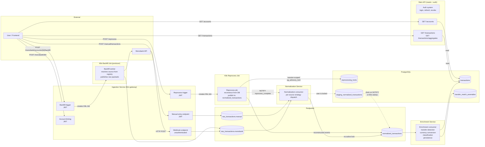
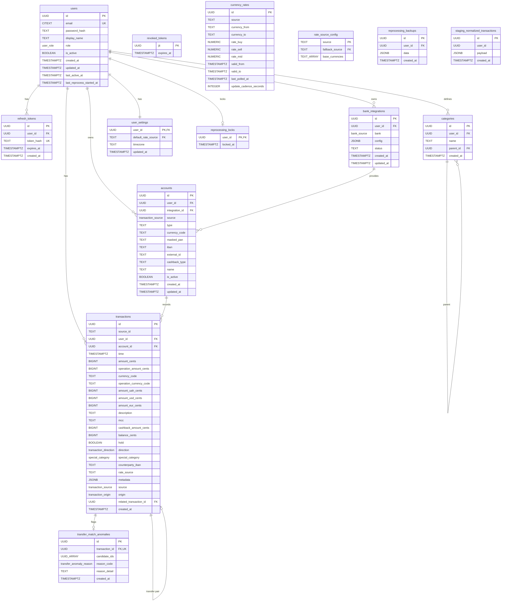

# Technical Specification: Transaction Ingestion Pipeline

- **Functional Specification:** `context/spec/003-transaction-ingestion-pipeline/functional-spec.md`
- **Author(s):** Nick

---

## 1. High-Level Technical Approach

The pipeline spans four backend services and the database layer:

1. **Ingestion service** (`grosh-ingestion`) — FastAPI service that owns all pipeline-feeding writes and account lifecycle. Receives Monobank webhooks, handles account linking (Monobank + manual), account management (rename, soft-delete), triggers backfill, accepts manual transaction entries. Publishes **raw bank payloads** (not normalized) with a routing envelope to per-source Redpanda topics. Validates JWTs for authenticated endpoints (does not issue tokens — that's the main API's job). Connects as `grosh_ingestion` (RLS enforced).
2. **Main API service** (`grosh-api`) — serves the frontend with read-only data endpoints and the auth system. Lists accounts, queries transactions with filters, serves compute-on-read aggregates, manages user settings. Owns login, refresh token rotation, token revocation, and user management. Has no Redpanda dependency and no bank-specific code. Connects as `grosh_api` (RLS enforced).
3. **Consumer services** — two-stage pipeline (see `references/adr-consumer-pipeline-architecture.md` for the full architecture):
   - **Normalization service** (`grosh-normalization`): subscribes to all `raw_transactions.*` topics, dispatches to per-source `NormalizationStrategy`, publishes `NormalizedTransaction` to `normalized_transactions`. Also owns the staging buffer and the reprocess job — every producer of the intermediate topic lives here.
   - **Enrichment service** (`grosh-enrichment`): pure consumer of `normalized_transactions`. Runs transfer detection → currency conversion → classification → persistence to PostgreSQL.
   Both connect as `grosh_consumer` (RLS bypassed).
4. **Database** — PostgreSQL 18 with `pgvector`, `pg_cron`, and `pg_stat_statements` extensions. Plain tables with B-tree indexes. Aggregations computed on read via a single SQL query (no materialized views). `pg_cron` handles TTL cleanup for revoked tokens and reprocessing backups. PG18 provides native `uuidv7()` for time-ordered UUID generation.

No frontend changes in this spec — REST API endpoints are the delivery boundary. Per-source raw models live in each source's module within the normalization service; `NormalizedTransaction` is the internal inter-service contract. All services connect to PostgreSQL with separate connection pools and per-service database roles.

**Data flow through the pipeline:**



Key points:

- **Two separate services serve the frontend.** Ingestion handles all writes that feed the pipeline. Main API handles all reads and the auth system.
- **The ingestion service is a thin gateway.** It validates webhook authenticity, resolves `user_id`/`account_id` from the DB, and publishes the **raw bank payload** (not normalized) with a routing envelope to per-source topics. Normalization happens in the normalization service.
- **Consumer services have bank-specific code.** Normalization strategies live in `sources/{bank}/` within the normalization service. Transfer detection strategies live in `sources/{bank}/` within the enrichment service. Currency conversion, classification, and persistence are source-agnostic.
- **Reprocessing publishes to `normalized_transactions`.** It reconstructs `NormalizedTransaction` from stored DB columns and replays through the enrichment consumer's normal processing path. Source-agnostic — one format regardless of bank count.
- **Auth is split:** the main API issues, refreshes, and revokes tokens. The ingestion service only validates them. Both share the same `JWT_SECRET`.
- **The backfill K8s Job** is also a producer — it publishes raw bank payloads to the same per-source topic as the webhook.

---

## 2. Architecture & Implementation

### 2.1 Service Layout

**Ingestion service** (`services/ingestion/`) is organized by source under `sources/`:

- `sources/monobank/` — webhook + link routes, HTTP client, `MonobankLinkingService`, `MonobankBackfillProvider`, `MonobankRepo`, `MonobankRatesProvider`.
- `sources/nbu/` — HTTP client + rates provider (live + historical).
- `sources/manual/` — `ManualService` (account creation, transaction creation + Redpanda publish) and its router.
- `repositories/` — generic repos: `account_repo`, `integration_repo`, `user_settings_repo`, `user_repo`, `revoked_token_repo` (read-only mirror — see "Auth carve-out" below), `currency_rate_repo`, `reprocess_repo`.
- `services/backfill_service.py`, `services/reprocess_dispatcher.py` — K8s Job submission, source-agnostic.
- `routers/reprocess.py`, `routers/admin_reprocess.py`, `routers/admin.py` — cross-cutting routers (not under `sources/` because they are source-agnostic).
- `jobs/run_transactions_backfill.py`, `jobs/run_rates_backfill.py`, `jobs/reregister_webhooks.py` — K8s Job entrypoints (the ingestion image carries them).

The ingestion service owns the Redpanda producer (initialized in lifespan: `confluent_kafka.Producer` with `bootstrap.servers = redpanda:9092`, fire-and-forget produces with delivery callbacks for error logging, flushed on shutdown).

**Auth in the ingestion service:** JWT validation only — decodes access tokens using the shared `JWT_SECRET`, extracts `user_id`, checks `revoked_tokens`, sets the RLS session variables (`app.current_user_id` AND `app.current_user_role`). Does not issue tokens, manage refresh tokens, or handle login. If the token is expired, returns 401. The frontend refreshes via the main API and retries.

**Why ingestion sets `app.current_user_role`.** Mirrors the API service. The admin bulk-reprocess endpoint's `SELECT id FROM users` snapshot must see all rows, which only works if the admin carve-out RLS policy on `users` triggers. The policy reads `app.current_user_role()`; without ingestion setting it, the query silently returns only the caller's own row in production.

**Main API service** (`services/api/`) gains read-path endpoints: `GET /accounts`, `GET /transactions`, `GET /transactions/aggregates`, `GET /rates`, `GET /rates/at`, `GET /settings`, `PUT /settings`, plus admin-only user management at `GET /admin/users`, `POST /admin/users`, `DELETE /admin/users/{user_id}`. Retains full ownership of the auth system (login, refresh, revocation). Has no Redpanda dependency.

**Backfill workers** run as Kubernetes Jobs using the **ingestion service image**. The ingestion service triggers them via the `kubernetes` Python client, passing all parameters as env vars. Each provider encapsulates bank-specific logic (API auth, pagination, rate limits, adapter) and publishes raw transaction batches to the source's `raw_transactions.{source}` topic.

**Normalization service** (`services/normalization/`):

- `consumers/normalization_consumer.py` — Stage 1: raw envelopes → `NormalizedTransaction` → `normalized_transactions` topic. Routes to `staging_normalized_transactions` instead of publishing when the user has an active `reprocessing_locks` row (both the lock check and the write commit in the same DB transaction so the routing decision is consistent).
- `services/staging_drain_service.py` — long-lived `LISTEN reprocess_complete` connection plus 60s periodic sweep fallback. On notification, drains staged rows for the user (publish-then-delete for at-least-once).
- `services/reprocess_orchestrator.py` — 11-step state machine: clean stale locks → snapshot → reconstruct → DELETE originals → publish → wait for catchup → verify → release lock (success path) OR restore from backup → release lock (failure path). Holds a session-scoped `pg_advisory_lock` for the full job duration. Repos own all SQL.
- `reprocess_main.py` — thin K8s Job entrypoint (~50 lines). Opens a dedicated `asyncpg.connect()` (NOT pool — session-scoped advisory locks must survive across calls), iterates `USER_IDS_JSON`, closes the connection in `finally`.
- `sources/{monobank,manual}/normalizer.py` — per-source normalization strategies.
- `repositories/{staging,reprocess,transaction_read}_repo.py` — staging buffer queries, reprocess SQL, read-only `select_for_user` for the reprocess flow.

The staging drain service uses an **async context manager** lifecycle: `__aenter__` constructs the Kafka producer and spawns the listener + sweep background tasks; `__aexit__` runs the 5-step cleanup (each step in its own `try/except` so a failure in step N does not skip later steps): cancel listener + sweep, gather tasks, idempotent connection close, wait for in-flight drain tasks with 2s timeout, flush producer with 10s timeout.

**Enrichment service** (`services/enrichment/`):

- `consumers/enrichment_consumer.py` — Stage 2: `NormalizedTransaction` → enrichment orchestrator → DB.
- `services/enrichment_orchestrator.py` — orchestrates layer sequence (transfer detection → conversion → classification → persistence). Owns the structured `_merge_metadata` function that writes each layer's payload under `metadata.layer.<name>`.
- `services/transfer_detection.py` — `TransferDetectionStrategy` Protocol + `TransferResult`/`AnomalyRecord` dataclasses. The strategy interface; implementations live under `sources/{bank}/transfer/`.
- `services/currency_conversion_service.py` — source-agnostic rate resolution.
- `sources/monobank/transfer/` — purpose-split modules: `detector.py` (orchestrator implementing the strategy), `flags.py` (row flag computation including the directional transitive rule), `iban_classifier.py` (consistency filter + evidence classification), `decision.py` (count-and-decide branch + bucket-locked principle), `metadata.py` (JSON shape builders), `anomalies.py` (typed `AnomalyRecord` builders), `repo.py` (Monobank-specific SQL — `transaction_exists`, `find_universal_candidates`, `claim_pair`). The strategy modules are pure functions where possible (`flags.py`, `iban_classifier.py`, `metadata.py`, `anomalies.py`) — stateless, DB-free, unit-tested by passing plain dataclasses in and asserting on returned dataclasses.
- `sources/monobank/descriptions.py` — description guard: `_INCOME_MAP`, `_EXPENSE_MAP`, `parse_description`, `is_transfer_description`, `is_multi_hop_description`, `validate_pair_descriptions`.
- `repositories/{account,currency_rate,anomaly,transaction}_repo.py` — account reads (single `AccountProps` dataclass, no raw tuples), rate reads, anomaly INSERTs + auto-resolve DELETEs, transaction INSERTs (`ON CONFLICT (id) DO NOTHING`) and transfer-pair UPDATEs.

**Reprocess trigger** lives on the ingestion service alongside the existing backfill trigger. The endpoints are documented in §2.3.

**K8s Job labels (uniform across all three job kinds spawned by ingestion):**

- `app.kubernetes.io/managed-by=grosh-ingestion` — uniform.
- `grosh.app/job-kind=<monobank_backfill|rates_backfill|reprocess>` — discriminator.
- Per-account backfill jobs additionally carry `grosh.app/account-id={uuid}` AND `grosh.app/user-id={uuid}`.
- Per-user reprocess jobs additionally carry `grosh.app/user-id={uuid}`.
- Admin bulk reprocess jobs carry NEITHER (user list is in `USER_IDS_JSON` env var).
- Rates-backfill jobs carry NEITHER (admin-only, no user/account scope).

The status endpoints (§2.3) verify these labels against the URL's path scope before responding — IDOR defense per functional spec §2.10.3.

**K8s RBAC.** `infra/k8s/rbac/ingestion-role.yaml` grants `["create", "get", "list", "watch"]` on `batch.jobs` plus `["get", "list"]` on pods (needed for the status endpoints' pod counter aggregation):

```yaml
rules:
  - apiGroups: ["batch"]
    resources: ["jobs"]
    verbs: ["create", "get", "list", "watch"]
  - apiGroups: [""]
    resources: ["pods"]
    verbs: ["get", "list"]
```

No new ServiceAccount needed — the existing `grosh-ingestion` SA holds both.

### 2.2 Data Model

**Extensions:**

| Extension            | Purpose                                                          |
|----------------------|------------------------------------------------------------------|
| `pgcrypto`           | `pgp_sym_encrypt` for Monobank token                             |
| `pgvector`           | Transaction description embeddings (future ML classifier)        |
| `pg_cron`            | Scheduled TTL cleanup (revoked tokens, reprocessing backups)     |
| `pg_stat_statements` | Per-query execution stats for observability                      |

**ENUM types:**

| Type                  | Values                                      |
|-----------------------|---------------------------------------------|
| `bank_source`         | `monobank`                                  |
| `transaction_direction` | `income`, `expense`, `zero`               |
| `special_category`    | `transfer` (future: `cancellation`, `hold`) |
| `transaction_source`  | `monobank`, `manual`                        |
| `transaction_origin`  | `bank`, `manual`                            |
| `transfer_anomaly_reason` | `unpaired_from_description`, `unpaired_to_description`, `ambiguous_pair_match`, `description_account_mismatch`, `description_consistency_mismatch` |

**ER diagram:**



**Tables:**

| Table | Key Columns | Notes |
|-------|-------------|-------|
| `bank_integrations` | `id UUID PK`, `user_id FK→users`, `bank bank_source`, `config JSONB NOT NULL DEFAULT '{}'`, `status TEXT`, `created_at`, `updated_at` | RLS on `user_id`. Bank-specific connection details live in `config`. Monobank stores `{"encrypted_token", "webhook_secret", "webhook_url", "monobank_client_id"}`. Token encrypted via `pgp_sym_encrypt`; hex-stored in `config.encrypted_token`. Webhook secret uniqueness enforced via partial expression index on `(config->>'webhook_secret') WHERE config->>'webhook_secret' IS NOT NULL`. |
| `accounts` | `id UUID PK`, `user_id FK→users`, `integration_id FK→bank_integrations NULL`, `source transaction_source`, `type TEXT`, `currency_code TEXT`, `masked_pan TEXT`, `iban TEXT`, `external_id TEXT`, `cashback_type TEXT`, `name TEXT`, `is_active BOOLEAN`, `created_at`, `updated_at` | RLS on `user_id`. `integration_id` NULL for manual accounts. `type` is plain TEXT (bank-specific types vary, not an enum). `name` for manual accounts, unique per `(user_id, name, currency_code)` where `source = 'manual'`. |
| `categories` | `id UUID PK`, `user_id FK→users NULL`, `name TEXT`, `parent_id FK→categories NULL`, `created_at` | RLS: `user_id = app.current_user_id() OR user_id IS NULL` (system defaults). `WITH CHECK` restricts the `user_id IS NULL` branch to admin role. |
| `transactions` | See ER diagram | Regular table, PK on `id`. RLS on `user_id` (USING + WITH CHECK). **Currency semantics:** `currency_code` is the account's base currency. `operation_currency_code` is the merchant/operation currency — NULL for domestic transactions, set to the foreign currency for cross-currency purchases. `amount_cents` is in the account's base currency. **Direction & special_category:** `direction` (`income`/`expense`/`zero`) is the immutable money-flow direction set by the normalizer from the amount sign. `special_category` is the pipeline enrichment classification — NULL for ordinary transactions, `'transfer'` when the transfer detection strategy claims an internal pair. Direction is preserved even on transfers. `rate_source` stores which rate source chain was used (required for reprocessing). Display amounts denormalized at write time. `metadata` is JSONB with two top-level namespaces: `metadata.source = {...}` (source-side keys preserved from bank payload — `counter_edrpou`, `counter_name`, `comment`, `receipt_id`) and `metadata.layer.<name> = {...}` (per-pipeline-layer outputs, re-derivable on reprocess: `metadata.layer.rate`, `metadata.layer.transfer`). `origin` (`transaction_origin` enum: `bank`, `manual`) classifies how the transaction was created. **Conflict handling:** `ON CONFLICT (id) DO NOTHING` for idempotent dedup. `UNIQUE (account_id, source_id)` as a safety net. |
| `transfer_match_anomalies` | `id UUID PK`, `transaction_id UUID FK→transactions ON DELETE CASCADE UNIQUE`, `candidate_ids UUID[]`, `reason_code transfer_anomaly_reason NOT NULL`, `reason_detail TEXT`, `created_at TIMESTAMPTZ` | One anomaly per transaction max (UNIQUE constraint). Only `unpaired_*` anomalies are auto-deleted when a partner arrives and the pair succeeds; terminal anomalies persist for manual investigation. |
| `users` | (extends existing) — adds `last_active_at TIMESTAMPTZ NULL`, `last_reprocess_started_at TIMESTAMPTZ NULL` | `last_active_at` is set by the auth service on every access-token issuance. `last_reprocess_started_at` drives the per-user 1/hour reprocess rate-limit; co-owned per the matrix in §3 (API service owns all other columns; ingestion gets a narrow column-level `UPDATE` grant). |
| `revoked_tokens` | `jti UUID PK`, `expires_at TIMESTAMPTZ NOT NULL` | Access token revocation for instant logout. `pg_cron` purges expired rows every 5 minutes. No RLS needed. |
| `reprocessing_locks` | `user_id UUID PK FK→users`, `locked_at TIMESTAMPTZ NOT NULL DEFAULT now()` | Status indicator + routing signal. Row presence = reprocessing in progress. Staleness detected via `pg_locks` introspection (the row is stale iff no live session holds `pg_advisory_lock(hashtext('reprocess:' || user_id::text))`). `locked_at` is a debug breadcrumb only. Co-owned: ingestion INSERTs, normalization DELETEs (see §3 data-ownership matrix). |
| `reprocessing_backups` | `id UUID PK DEFAULT uuidv7()`, `user_id UUID FK→users`, `data JSONB`, `created_at TIMESTAMPTZ` | Pre-delete snapshots. Retained 30 days via `pg_cron`. |
| `staging_normalized_transactions` | `id UUID PK DEFAULT uuidv7()`, `user_id UUID NOT NULL` (no FK — operational queue, not a relational entity), `payload JSONB NOT NULL`, `created_at TIMESTAMPTZ NOT NULL DEFAULT now()`. Index `idx_staging_user_created ON (user_id, created_at)`. | Buffer for `NormalizedTransaction` events whose user is currently being reprocessed. Drained via LISTEN/NOTIFY + 60s periodic sweep. No RLS — internal-only. |
| `currency_rates` | `id UUID PK DEFAULT uuidv7()`, `source TEXT`, `currency_from TEXT`, `currency_to TEXT`, `rate_buy NUMERIC(18,8) NULL`, `rate_sell NUMERIC(18,8) NULL`, `rate_mid NUMERIC(18,8) NOT NULL`, `valid_from TIMESTAMPTZ NOT NULL DEFAULT now()`, `valid_to TIMESTAMPTZ NULL`, `last_polled_at TIMESTAMPTZ NULL`, `update_cadence_seconds INTEGER NULL` | SCD Type 2. Two independent sequences per (source, pair): polled rows (`last_polled_at` and `update_cadence_seconds` both set) and historical rows (both NULL). `valid_to = NULL` = current rate. `valid_from` is the provider's authoritative timestamp. Rates stored as NUMERIC(18,8). `rate_buy`/`rate_sell` nullable for mid-only sources (NBU). No RLS — rates are global. |
| `rate_source_config` | `source TEXT PK`, `fallback_source TEXT FK→rate_source_config NULL`, `base_currencies TEXT[] NOT NULL DEFAULT '{}'` | Fallback chain. `base_currencies` lists currencies this source publishes rates against. Consumer uses the union as pivot candidates. Seed: `nbu→NULL ({UAH})`, `monobank→nbu ({UAH})`. |
| `user_settings` | `user_id UUID PK FK→users`, `default_rate_source TEXT FK→rate_source_config NULL`, `timezone TEXT NOT NULL DEFAULT 'UTC'`, `updated_at TIMESTAMPTZ DEFAULT now()` | Per-user preferences. RLS on `user_id`. Created automatically via `AFTER INSERT ON users` trigger. |

**Transaction ID strategy.** PK `id` is a deterministic UUID computed as `UUID5(NAMESPACE, source + ":" + source_id)`. Computed by the producer (ingestion service) before publishing to Redpanda. The consumer uses `INSERT ... ON CONFLICT (id) DO NOTHING` for idempotent deduplication.

**Indexes:**

| Index | Purpose |
|-------|---------|
| `transactions(user_id, time DESC)` | Feed pagination, aggregation queries |
| `transactions(id)` UNIQUE (PK) | Deduplication via ON CONFLICT |
| `transactions(account_id, source_id)` UNIQUE | Business-key dedup safety net |
| `transactions(user_id, account_id, time DESC)` | Per-account queries |
| `transactions(user_id, direction, time DESC) WHERE mcc = '4829' AND related_transaction_id IS NULL` | Transfer detection universal candidate fetch. The amount predicate is rechecked on the candidate set rather than indexed — both clauses are amount equality, and at per-user volume after the partial-index restriction the candidate set is bounded to a handful of rows. |
| `accounts(user_id)` | Account listing |
| `accounts(user_id, name, currency_code) WHERE source = 'manual' AND name IS NOT NULL` UNIQUE | Manual account name uniqueness |
| `accounts(iban) WHERE iban IS NOT NULL` | Transfer detection IBAN lookup |
| `bank_integrations(config->>'webhook_secret') WHERE config->>'webhook_secret' IS NOT NULL` UNIQUE | Webhook secret validation |
| `currency_rates(source, currency_from, currency_to, valid_from) WHERE valid_to IS NULL` | Current rate lookup |
| `revoked_tokens(expires_at)` | pg_cron TTL cleanup |

**Aggregation (compute-on-read).** No materialized views. `GET /transactions/aggregates` executes a single SQL query per request:

```sql
SELECT
    date_trunc($bucket, time AT TIME ZONE $user_tz) AS period_start,
    COALESCE(SUM(amount_uah_cents) FILTER (WHERE direction = 'income'),  0) AS uah_income_cents,
    COALESCE(SUM(amount_uah_cents) FILTER (WHERE direction = 'expense'), 0) AS uah_expense_cents,
    ROUND(100.0 * COUNT(amount_uah_cents) / COUNT(*), 1) AS uah_converted_pct,
    -- USD, EUR follow same pattern
FROM transactions
WHERE user_id = $1
  AND direction IN ('income', 'expense')
  AND special_category IS NULL
  AND time >= COALESCE($from, '-infinity'::timestamptz)
  AND time <  COALESCE($to,   'infinity'::timestamptz)
GROUP BY period_start
ORDER BY period_start
```

With `INDEX (user_id, time DESC)`, this scans only the requesting user's rows. At 50 tx/month × 10 years = 6000 rows, any aggregation pattern completes in under 1ms.

**Filter semantics:** the WHERE clause excludes transfers (`special_category = 'transfer'`) and zero-amount rows (`direction = 'zero'`) — only real income/expense flows count toward bucket totals. `delta_cents` is computed in SQL as `income - expense` per currency.

**Time-range convention — half-open `[from, to)`.** Inclusive lower bound, exclusive upper bound. Applies uniformly to every time-range filter exposed by the API (`GET /transactions`, `GET /transactions/aggregates`, `GET /rates`) and every `WHERE time >= from AND time < to` predicate in the repos. Rationale: half-open intervals tile the timeline without gaps or overlaps, match `date_trunc()` bucket boundaries, align with SCD2 windows (`valid_from <= t AND (valid_to IS NULL OR valid_to > t)`), and let a frontend pass identical `from`/`to` to list and aggregate endpoints without an off-by-one. Inclusive upper bounds are forbidden — they create bucket-edge double-counting and force end-of-day fudges (`23:59:59.999999`) that drift across timezones.

**Backfill date params — convention differs per endpoint.** The two backfill triggers take calendar dates (`from`, `to`), but their semantics diverge because they front two different external APIs:

- **`POST /monobank/accounts/{id}/backfill`** uses **half-open `[from, to)`**, matching the API-wide filter convention. The router validates `from < to` (zero-width windows rejected with 422 `INVALID_DATE_RANGE`) and `(to - from).days <= 31` (32+ days rejected with 422 `BACKFILL_WINDOW_TOO_LARGE`), then converts `to` to the **start of the named day** via `datetime.combine(to_date, datetime.min.time(), tzinfo=UTC)` — exclusive. So `from=2025-01-01&to=2025-02-01` requests exactly January (31 days, half-open) and is accepted; `to=2025-02-02` makes 32 days and is rejected. Frontend authors who want "everything through Feb 1 inclusive" pass `to=2025-02-02`.

- **`POST /admin/rates-backfill`** accepts a POST JSON body `{source, from_date, to_date}` (distinct from the monobank backfill's query-param shape). The router validates only `from_date <= to_date` (same-day requests are accepted), then forwards `from`/`to` as `YYYYMMDD` strings to the source's `fetch_historical(from_date, to_date)` provider. For NBU this hits the `?start=...&end=...` endpoint; the platform passes the dates through verbatim and relies on NBU's own boundary semantics — confirm against NBU's API docs when triggering large ranges. No 31-day cap (the bank has no per-request window limit comparable to Monobank's).

This is the documented divergence: time-range *filters* on internal API endpoints are uniformly half-open (`GET /transactions`, `GET /rates`, `GET /transactions/aggregates`); time-range *backfill triggers* adopt whatever the upstream bank API expects. New backfill endpoints should document the convention they use explicitly.

**`period_start` serialization.** The aggregation query uses `date_trunc($bucket, time AT TIME ZONE $user_tz)`, returning a naive `timestamp` representing the bucket boundary in the user's wall-clock timezone. The repo attaches the user's tz and the router converts to UTC for serialization, so `period_start` in JSON is always a UTC ISO timestamp. For a `Europe/Kyiv` user, January 2026's bucket is `"2025-12-31T22:00:00Z"` (= `2026-01-01T00:00 Kyiv`). Documented on the `AggregateItem.period_start` Pydantic field for OpenAPI consumers.

**List-typed query params: repeated-key + StrEnum.** Multi-value query params (`currency`, `fields`, `category`, `exclude_category`) use repeated keys with `list[SomeStrEnum]` typing: `?currency=UAH&currency=USD`, not `?currency=UAH,USD`. FastAPI parses repeated keys natively, validates membership against the enum, and emits a proper OpenAPI `type: array, items: {enum: [...]}` schema; generated SDKs see typed `Currency[]` instead of bare `string`. Enum values are canonical case only — `?currency=uah` returns 422. See the rule in root `CLAUDE.md`.

**`SpecialCategory` filter on `GET /transactions`** (whitelist + blacklist with NULL-safe semantics):

- `category: list[SpecialCategory] | None` — whitelist. SQL adds `special_category = ANY($N::special_category[])`. NULL `special_category` rows are excluded (NULL is never `= ANY(...)`).
- `exclude_category: list[SpecialCategory] | None` — blacklist. SQL adds `(special_category IS NULL OR special_category != ALL($N::special_category[]))`. The `OR special_category IS NULL` clause is load-bearing: a naive `special_category NOT IN (...)` filters NULL rows out (NULL `NOT IN (...)` is UNKNOWN, treated as false by `WHERE`), which would silently hide ordinary transactions.

422 conflict validation lives in the router (set intersection between the two lists), not the repo.

**pg_cron jobs:**

```sql
-- revoked_tokens (registered in migration 0008)
SELECT cron.schedule_in_database(
    'purge-revoked-tokens',
    '*/5 * * * *',
    $$DELETE FROM revoked_tokens WHERE expires_at < now()$$,
    'grosh'
);

-- reprocessing_backups (registered in migration 0015)
SELECT cron.schedule_in_database(
    'reprocessing_backups_cleanup',
    '0 3 * * *',
    $$DELETE FROM reprocessing_backups WHERE created_at < now() - interval '30 days'$$,
    'grosh'
);
```

The reprocessing-backups migration opens with a TZ guard (`RAISE EXCEPTION` if the connection's TimeZone resolves to a non-zero UTC offset, computed via `EXTRACT(timezone FROM now()) <> 0` rather than a string compare on `current_setting('TimeZone')` — asyncpg canonicalizes `'UTC'` to `'Etc/UTC'` on the wire, so a string compare would falsely reject every run). `infra/docker-compose.yml`'s postgres service carries `PGTZ: UTC` to satisfy the guard locally.

`pg_cron` and `pg_stat_statements` require `shared_preload_libraries=pg_cron,pg_stat_statements` plus `cron.database_name=grosh` and `pg_stat_statements.track=all`, set via Docker Compose command args.

### 2.3 API Contracts

**Versioning.** All endpoints in both services are mounted under `/v1` **except the Monobank webhook**. Versioning is implemented at the FastAPI `APIRouter` level in each service's `main.py`:

```python
# services/api/src/grosh_api/main.py
app.include_router(auth_router, prefix="/v1")
app.include_router(transactions_router, prefix="/v1")
# ... every other router gets prefix="/v1"

# services/ingestion/src/grosh_ingestion/main.py
app.include_router(monobank_router, prefix="/v1")
app.include_router(manual_router, prefix="/v1")
app.include_router(admin_router, prefix="/v1")
app.include_router(reprocess_router, prefix="/v1")
# Webhook router is mounted UNVERSIONED — the URL is registered with Monobank:
app.include_router(monobank_webhook_router)  # NOT under /v1
```

The Monobank webhook router is a separate `APIRouter` instance carrying only the GET/POST `/monobank/webhook/{webhook_secret}` routes. Every other Monobank route lives on the versioned router.

**Response model rule.** Every endpoint declares `response_model=<TypedModel>`. No bare `dict` returns. Enforced by the OpenAPI-completeness CI check.

#### Ingestion Service

**`sources/monobank/router.py`** (split: lifecycle router under `/v1`, webhook router unversioned):

| Method | Path | Auth | Request | Response | Notes |
|--------|------|------|---------|----------|-------|
| GET | `/monobank/webhook/{webhook_secret}` | None | (none) | 200 OK (no body) | Monobank verification handshake. Unversioned by design. |
| POST | `/monobank/webhook/{webhook_secret}` | None | Monobank `StatementItem` | 200 / 404 / 422 | 404 if unknown secret or account; 422 if payload malformed. |
| GET | `/v1/monobank/integrations` | JWT | (none) | `200, list[MonobankIntegrationResponse]` | Flat list, RLS-scoped. |
| POST | `/v1/monobank/link` | JWT | `{monobank_token}` | `201 or 200, MonobankLinkResponse` | Idempotent on `monobank_client_id`. **201** = fresh row inserted; **200** = existing row's token rotated. 422 `MONOBANK_TOKEN_INVALID` on 401/403 from Monobank; 502 `MONOBANK_API_UNAVAILABLE` on timeout/5xx/429; 409 `INTEGRATION_ALREADY_LINKED` if user has integration for a different client_id. |
| DELETE | `/v1/monobank/integrations/{integration_id}` | JWT | (none) | 204 or 404 | Hard delete. Accounts and transactions preserved. Best-effort Monobank webhook de-registration (10s timeout, WARN on failure). 404 `INTEGRATION_NOT_FOUND` if not owned. |
| POST | `/v1/monobank/accounts/{account_id}/backfill` | JWT | `?from=&to=` (dates) | `202, JobTriggerResponse` | Half-open `[from, to)`. Validates `from < to` (422 `INVALID_DATE_RANGE`) and `<= 31 days` (422 `BACKFILL_WINDOW_TOO_LARGE`). 404 `ACCOUNT_NOT_FOUND`. 502 `JOB_SUBMISSION_FAILED` on K8s failure. |
| GET | `/v1/monobank/accounts/{account_id}/backfill/{job_id}` | JWT | (none) | `200, JobStatusResponse` | Verifies `grosh.app/account-id` AND `grosh.app/user-id` labels match URL scope + caller (or admin). 404 `JOB_NOT_FOUND` on mismatch. 503 `JOB_STATUS_UNAVAILABLE` on K8s unreachable. |

**`routers/admin.py`** (ingestion-side admin endpoints):

| Method | Path | Auth | Body | Response |
|--------|------|------|------|----------|
| POST | `/v1/admin/rates-backfill` | JWT+admin | `{source, from_date, to_date}` | `202, JobTriggerResponse` |
| GET | `/v1/admin/rates-backfill/{job_id}` | JWT+admin | (none) | `200, JobStatusResponse` |

**`sources/manual/router.py`:**

| Method | Path | Auth | Body | Response |
|--------|------|------|------|----------|
| POST | `/v1/manual/accounts` | JWT | `{type: "cash", currency_code, name}` | `201, ManualAccountResponse` |
| PUT | `/v1/manual/accounts/{account_id}` | JWT | `{name}` | `200, ManualAccountResponse` |
| DELETE | `/v1/manual/accounts/{account_id}` | JWT | (none) | 204 or 404 |
| POST | `/v1/manual/transactions` | JWT | `{account_id, amount_cents, operation_currency_code, description, time, direction, mcc?, rate_source?, idempotency_key?}` | `201, ManualTransactionResponse` |

`CreateAccountRequest.type` is `Literal["cash"]`; `CreateTransactionRequest.direction` is `Literal[TransactionDirection.income, TransactionDirection.expense]`. Pydantic rejects other values at parse time with 422. The shared `TransactionDirection` enum keeps its `zero` member for bank balance-only adjustments — narrowing happens at the request schema only.

**Reprocess routers** (`routers/reprocess.py`, `routers/admin_reprocess.py`):

| Method | Path | Auth | Body | Response | Notes |
|--------|------|------|------|----------|-------|
| POST | `/v1/users/{user_id}/reprocess` | JWT (self or admin) | (empty) | `202, JobTriggerResponse` | Atomic UPDATE-RETURNING on `users.last_reprocess_started_at` (1/hour rate-limit) → 429 `RATE_LIMITED` with `detail` carrying next-eligible timestamp; then atomic INSERT on `reprocessing_locks` → 409 `REPROCESS_LOCKED` (with running job_id in detail) or proceed; then K8s submit with `_request_timeout=10s` → 502 `JOB_SUBMISSION_FAILED` on failure. All three steps in one transaction. |
| GET | `/v1/users/{user_id}/reprocess/{job_id}` | JWT (self or admin) | (none) | `200, JobStatusResponse` | Verifies `grosh.app/user-id` label + caller scope. 404 `JOB_NOT_FOUND` on mismatch. |
| POST | `/v1/admin/reprocess` | JWT+admin | `{user_ids: list[UUID] \| null, force: bool = false}` | `202, BulkReprocessResponse` | `null` → `SELECT id FROM users` snapshot. Per-target: rate-limit UPDATE (`force=true` drops the time predicate but still consumes the slot) → lock INSERT. Skipped users go to `skipped: [{user_id, reason}]` with `reason ∈ {REPROCESS_LOCKED, RATE_LIMITED}`. K8s Job submitted with `USER_IDS_JSON` = successful targets. No `grosh.app/user-id` label (spans multiple). When all skipped: `job_id=None, status_url=None`. |
| GET | `/v1/admin/reprocess/{job_id}` | JWT+admin | (none) | `200, JobStatusResponse` | Verifies absence of `grosh.app/user-id` (admin-bulk). |

The bare `POST /reprocess` at the ingestion root is **not** an endpoint — all triggers go through these two routes.

`BulkReprocessResponse` carries a model validator: `job_id` and `status_url` are either both null or both non-null. Clients branch on `job_id is None` to skip polling.

**K8s submit timeout.** `ReprocessDispatcher.submit` and `BackfillService.trigger_*` pass `_request_timeout=10` to the kubernetes Python client (`K8S_JOB_SUBMIT_TIMEOUT_SECONDS` module constant). This propagates to urllib3, which aborts the **HTTP socket** on timeout. The dispatcher's exception handler catches both `kubernetes.client.exceptions.ApiException` AND `urllib3.exceptions.TimeoutError` (the kubernetes client does NOT wrap urllib3 timeouts as `ApiException`; only `SSLError` gets wrapped) and re-raises as `K8sDispatchError`.

Why not `asyncio.wait_for(asyncio.to_thread(...))`? `asyncio.to_thread` runs the callable in a thread pool; `asyncio.wait_for` cancels the wrapping awaitable but cannot cancel the underlying thread (Python threads have no `.cancel()`). A hanging K8s call would leak into the background after rollback, risking orphan Jobs on retry. `_request_timeout` aborts at the urllib3 socket level, so when the timeout fires the call has truly stopped.

#### Main API Service

All Main API routes are mounted under `/v1/`.

**`accounts.py`:**

| Method | Path | Auth | Query / Body | Response |
|--------|------|------|--------------|----------|
| GET | `/v1/accounts` | JWT | `source`, `type`, `currency_code`, `name` (all optional) | `200, list[AccountResponse]` (RLS-scoped) |
| GET | `/v1/accounts/{id}` | JWT | (none) | `200, AccountResponse` or 404 |

**`transactions.py`:**

| Method | Path | Auth | Query | Response |
|--------|------|------|-------|----------|
| GET | `/v1/transactions` | JWT | `direction`, `category` (repeated), `exclude_category` (repeated), `account_id`, `from`, `to`, `limit`, `cursor` | `200, CursorPage[TransactionResponse]`. Half-open `[from, to)`. |
| GET | `/v1/transactions/aggregates` | JWT | `currency` (repeated), `from`, `to`, `bucket`, `fields` (repeated) | `200, AggregateResponse`. All optional. Defaults: all currencies, all history, month bucket, all fields. Excludes transfers and zero-amount rows. |

**`rates.py`:**

| Method | Path | Auth | Query | Response | Notes |
|--------|------|------|-------|----------|-------|
| GET | `/v1/rates` | JWT | `source`, `currency_from`, `currency_to`, `from`, `to`, `limit`, `cursor` | `200, CursorPage[RateResponse]` | Filters `valid_from >= from AND valid_from < to`. No RLS (global). |
| GET | `/v1/rates/at` | JWT | `at` (default now), `source`, `currency_from`, `currency_to` | `200, list[RateResponse]` | SCD2 point-in-time: `valid_from <= at AND (valid_to IS NULL OR valid_to > at)`. |

**`settings.py`:**

| Method | Path | Auth | Body | Response | Notes |
|--------|------|------|------|----------|-------|
| GET | `/v1/settings` | JWT | (none) | `200, UserSettingsResponse` | |
| PUT | `/v1/settings` | JWT | `{default_rate_source?, timezone?}` | `200, UserSettingsResponse` | Validates `default_rate_source` against `rate_source_config`; validates `timezone` is a valid IANA identifier. |

**`admin.py` (Main API):**

| Method | Path | Auth | Body / Query | Response |
|--------|------|------|--------------|----------|
| GET | `/v1/admin/users` | JWT+admin | `limit` (default 50, 1–200), `cursor` | `200, CursorPage[AdminUserResponse]` |
| POST | `/v1/admin/users` | JWT+admin | `{email, password, display_name, role?}` | `201, UserCreatedResponse` |
| DELETE | `/v1/admin/users/{user_id}` | JWT+admin | (none) | `204` |

Sort order on listing `created_at DESC, id DESC`. Cursor encodes the composite `(created_at, id)` tuple. 400 `INVALID_CURSOR` on undecodable cursor.

`POST /v1/admin/users` validates `email` via Pydantic `EmailStr` (`@field_validator` lowercases it before persistence) and hashes the password via `AuthService.hash_password`. Duplicate email → 409 with `code: VALIDATION_ERROR` (mapped from `UserAlreadyExistsError`). The created row's `user_settings` row is auto-INSERTed by the `AFTER INSERT ON users` trigger; the admin RLS carve-outs `users_admin_all` and `user_settings_admin_all` (migration 0013) are what allow the trigger's INSERT to pass `WITH CHECK` in the admin's session.

`DELETE /v1/admin/users/{user_id}` calls `UserService.delete_user(admin_id, target_id)`. Self-delete (`admin_id == target_id`) → 400 `VALIDATION_ERROR` (`CannotDeleteSelfError`). Non-existent target → 404 `USER_NOT_FOUND`. On success: sets `is_active = false` and deletes all refresh tokens for the target. The `is_active` check in `get_current_user` (`deps.py`) makes deactivation an instant logout for any outstanding access token too — no `revoked_tokens` entry is needed.

**`last_active_at` write path.** The auth service updates `users.last_active_at` on every access-token issuance. Both `POST /v1/auth/login` and `POST /v1/auth/refresh` execute `UPDATE users SET last_active_at = now() WHERE id = $1` immediately after signing the access token and immediately before returning. Single-row UPDATE per token issuance — at most once per 15 minutes per active user (the access-token TTL). No background task, no debouncing.

#### Cross-Cutting

**Shared error module** (`shared/src/grosh_shared/http/errors.py`):

```python
class ErrorCode(StrEnum):
    VALIDATION_ERROR = "VALIDATION_ERROR"
    AUTHENTICATION_REQUIRED = "AUTHENTICATION_REQUIRED"
    INSUFFICIENT_PERMISSIONS = "INSUFFICIENT_PERMISSIONS"
    ACCOUNT_NOT_FOUND = "ACCOUNT_NOT_FOUND"
    INTEGRATION_NOT_FOUND = "INTEGRATION_NOT_FOUND"
    USER_NOT_FOUND = "USER_NOT_FOUND"
    JOB_NOT_FOUND = "JOB_NOT_FOUND"
    RATE_NOT_FOUND = "RATE_NOT_FOUND"
    INVALID_CURSOR = "INVALID_CURSOR"
    INVALID_DATE_RANGE = "INVALID_DATE_RANGE"
    REPROCESS_LOCKED = "REPROCESS_LOCKED"
    RATE_LIMITED = "RATE_LIMITED"
    BACKFILL_WINDOW_TOO_LARGE = "BACKFILL_WINDOW_TOO_LARGE"
    MONOBANK_TOKEN_INVALID = "MONOBANK_TOKEN_INVALID"
    MONOBANK_API_UNAVAILABLE = "MONOBANK_API_UNAVAILABLE"
    INTEGRATION_ALREADY_LINKED = "INTEGRATION_ALREADY_LINKED"
    JOB_STATUS_UNAVAILABLE = "JOB_STATUS_UNAVAILABLE"
    JOB_SUBMISSION_FAILED = "JOB_SUBMISSION_FAILED"
    INTERNAL_ERROR = "INTERNAL_ERROR"


class ProblemDetail(BaseModel):
    type: str
    title: str
    status: int
    code: ErrorCode
    detail: str
    instance: str
    validation_errors: list[dict[str, Any]] | None = None


def raise_problem(status_code: int, code: ErrorCode, detail: str, ...) -> None:
    """Raise an HTTPException whose body conforms to the RFC 7807 envelope."""
```

Both `services/api/src/grosh_api/error_handlers.py` and `services/ingestion/src/grosh_ingestion/error_handlers.py` register three exception handlers:

1. **`HTTPException` handler** — picks up `raise_problem` calls (whose `detail` is already a serialized `ProblemDetail` dict) and emits the body verbatim.
2. **`RequestValidationError` handler** — converts Pydantic v2's `.errors()` output to `list[{loc, msg, type}]` (loc tuple→list), embeds in the envelope with `code=VALIDATION_ERROR`, status=422.
3. **Catch-all `Exception` handler** — last resort. Logs with `exc_info=True`, emits `ProblemDetail` with `code=INTERNAL_ERROR`, status=500, `detail="An unexpected error occurred"`. Never includes the exception's repr in `detail` (avoids leaking secrets).

All domain errors raise via `raise_problem(...)`. No endpoint returns the bare `{"detail": "..."}` shape.

**Response models** live in `services/{service}/src/grosh_{service}/schemas.py` (or per-source under `sources/{bank}/schemas.py` for source-specific shapes). New shared shapes live in `grosh-shared`:

| Model | Module | Used by |
|-------|--------|---------|
| `JobTriggerResponse` | `grosh_shared/messaging/jobs.py` | All 4 job-trigger endpoints |
| `JobStatusResponse` | `grosh_shared/messaging/jobs.py` | All 4 job-status endpoints |
| `BulkReprocessResponse` | `grosh_shared/messaging/jobs.py` | `POST /v1/admin/reprocess` only |
| `SkippedUser` | `grosh_shared/messaging/jobs.py` | `BulkReprocessResponse.skipped[]`. `reason: Literal["REPROCESS_LOCKED", "RATE_LIMITED"]` |
| `ProblemDetail` | `grosh_shared/http/errors.py` | Every error response |
| `MonobankLinkResponse` | `services/ingestion/sources/monobank/schemas.py` | `POST /v1/monobank/link` |
| `MonobankIntegrationResponse` | `services/ingestion/sources/monobank/schemas.py` | `GET /v1/monobank/integrations` |
| `ManualAccountResponse` | `services/ingestion/sources/manual/schemas.py` | `POST/PUT /v1/manual/accounts` |
| `ManualTransactionResponse` | `services/ingestion/sources/manual/schemas.py` | `POST /v1/manual/transactions` |
| `AdminUserResponse` | `services/api/src/grosh_api/routers/admin.py` | `GET /v1/admin/users` |
| `UserCreatedResponse` | `services/api/src/grosh_api/routers/admin.py` | `POST /v1/admin/users` |

**OpenAPI completeness CI check.** `scripts/check_openapi_completeness.py` imports both `grosh_api.main:app` and `grosh_ingestion.main:app`, walks their OpenAPI documents, and asserts every operation has a non-empty `responses[*].content[*].schema`. An empty schema (`additionalProperties: true` without other constraints, or a missing `schema` key) fails the build. Runs on every PR.

**Auth carve-out — `revoked_tokens` mirror.** Ingestion's `revoked_token_repo.py` is a read-only mirror of the API service's repo: single method `is_revoked(conn, jti) -> bool`. Revocation writes are API-owned per the data-ownership matrix. The duplicate-mirror pattern (rather than a shared module) matches `staging_repo.lock_exists` (normalization) and `reprocess_repo.lock_exists` (ingestion): each service has its own DB role and connection lifecycle, so a 5-line read method per service beats import coupling.

### 2.4 Redpanda Topics

| Topic | Partitions | Key | Purpose |
|-------|------------|-----|---------|
| `raw_transactions.monobank` | 3 | `user_id` | Raw Monobank payloads (webhook + backfill) |
| `raw_transactions.manual` | 3 | `user_id` | Manual transaction entries |
| `normalized_transactions` | 3 | `user_id` | Source-agnostic `NormalizedTransaction` (intermediate topic) |

Per-source topics carry raw bank payloads wrapped in a `TransactionEnvelope` (routing metadata + untyped `payload` dict). The normalization service subscribes to all `raw_transactions.*` topics. The enrichment service subscribes only to `normalized_transactions`. Reprocessing publishes directly to `normalized_transactions` (skips normalization).

### 2.5 Models & Wire Formats

**Shared package** (`grosh-shared/src/grosh_shared/`):

| Sub-package | Module | Contents |
|-------------|--------|----------|
| `domain/` | `models.py` | Enums (`TransactionSource`, `TransactionDirection`, `SpecialCategory`, `RateSource`), `User`, `Account`, `BankIntegration` domain models |
| `domain/` | `normalized.py` | `NormalizedTransaction`, `TransactionRow`, `TransactionRow.to_normalized()` — see "Schema-aware shared module" in `adr-consumer-pipeline-architecture.md` |
| `domain/` | `iso_4217.py` | ISO 4217 numeric → alpha-3 currency code mapping |
| `domain/` | `mcc.py` | `MccCode` enum (e.g. `WIRE_TRANSFER = '4829'`) — single source of truth for MCC literals |
| `messaging/` | `envelope.py` | `TransactionEnvelope` — Kafka wire format between ingestion and normalization |
| `messaging/` | `ids.py` | Deterministic UUID5 generator: `generate_transaction_id(source, source_id) -> UUID` |
| `messaging/` | `jobs.py` | `JobTriggerResponse`, `JobStatusResponse`, `BulkReprocessResponse`, `SkippedUser` |
| `db/` | `url.py` | DSN conversion helpers (asyncpg ↔ SQLAlchemy dialect) |
| `db/` | `rls.py` | `set_rls_user_id`, `set_rls_user_role` session-variable setters + advisory lock helpers |
| `db/` | `testing.py` | Test-DB lifecycle (create throwaway DB, run migrations, drop on teardown) |
| `http/` | `auth.py` | JWT decode/validate utility (shared between API and ingestion) |
| `http/` | `errors.py` | `ErrorCode`, `ProblemDetail`, `raise_problem(...)`, FastAPI exception handlers |

The shared package does NOT define a Kafka message schema beyond `TransactionEnvelope`. Each source owns its own raw format; `NormalizedTransaction` is the internal consumer contract.

**Consumer models:**

| Model | Location | Purpose |
|-------|----------|---------|
| `TransactionEnvelope` | `grosh_shared/messaging/envelope.py` | Wire format between ingestion and normalization: `user_id`, `account_id`, `source`, `payload: dict` |
| `NormalizedTransaction` | `grosh_shared/domain/normalized.py` | Source-agnostic intermediate format. All fields needed by the enrichment service: `id`, `source`, `source_id`, `user_id`, `account_id`, `time`, `amount_cents`, `operation_amount_cents`, `operation_currency_code`, `description`, `mcc`, `cashback_amount_cents`, `balance_cents`, `hold` (`bool \| None` — nullable for sources without an equivalent settlement flag), `counterparty_iban`, `rate_source`, `metadata` |
| `TransferResult` | `grosh_enrichment/services/transfer_detection.py` | Output of transfer detection: `special_category`, `related_transaction_id`, `anomalies: list[AnomalyRecord]`, `metadata_block: dict \| None` (the `metadata.layer.transfer` payload; `{"row": {...}}` on unpaired MCC 4829 rows, `{"row": {...}, "pair": {...}}` on claimed pairs, `None` for non-MCC-4829 rows preserving the invariant `metadata.layer.transfer exists ⇔ mcc == '4829'`) |
| `ConversionResult` | `grosh_enrichment/services/currency_conversion_service.py` | Per-currency amounts + rate metadata |

**Per-source raw models** (validated during normalization):

| Source | Model | Location |
|--------|-------|----------|
| Monobank | `MonobankStatementItem` | `grosh_normalization/sources/monobank/models.py` |
| Manual | `ManualTransactionPayload` | `grosh_normalization/sources/manual/models.py` |

The normalizer deserializes `envelope.payload` into the source-specific Pydantic model. Malformed payloads fail with a validation error (skip + commit + log).

### 2.6 Consumer Pipeline Logic

**Stage 1 — Normalization service:**

1. Poll message from any `raw_transactions.*` topic.
2. Deserialize to `TransactionEnvelope`.
3. Look up `NormalizationStrategy` from registry by `envelope.source`.
4. Call `strategy.normalize(envelope)` → `NormalizedTransaction`.
5. Check `reprocessing_locks` for the message's `user_id`. If a row exists, INSERT into `staging_normalized_transactions`. Otherwise publish to `normalized_transactions` (key = `user_id`). Both the read and the write commit in the same DB transaction so the routing decision is consistent.
6. Commit Kafka offset.

Each normalizer validates the raw payload, applies source-specific transformations (abs amounts, direction inference from sign, currency code resolution), and emits a source-agnostic `NormalizedTransaction`.

**Stage 2 — Enrichment service:**

1. Poll message from `normalized_transactions`.
2. Deserialize to `NormalizedTransaction`.
3. Idempotency check: if `id` already exists in `transactions` → skip (return immediately, no side effects).
4. **Transfer detection** (per-source strategy dispatch): for Monobank, runs the 7-step algorithm. Sets `special_category = 'transfer'` and `related_transaction_id` on both legs when a pair is claimed. The `direction` field is preserved. Writes `metadata.layer.transfer.row` on every MCC 4829 row and additionally `metadata.layer.transfer.pair` on claimed legs. Records anomalies for rejected, ambiguous, or unpaired matches.
5. **Currency conversion** (source-agnostic): tiered rate resolution (FRESH → CLOSEST) with fallback chain. Computes `amount_uah_cents`, `amount_usd_cents`, `amount_eur_cents`. Records rate path metadata under `metadata.layer.rate`.
6. **Classification** (future): rule lookup → MCC fallback → ML classifier. Currently a no-op pass-through.
7. **Persistence**: `INSERT INTO transactions (...) ON CONFLICT (id) DO NOTHING`.
8. Commit Kafka offset.

`amount_cents` is always positive (or zero for checks) and is in the account's base currency. `direction` is set by the normalizer from the amount sign and is immutable. `special_category` is the pipeline enrichment field — NULL by default, set to `'transfer'` by transfer detection. Zero-amount transactions have `direction = 'zero'` and short-circuit transfer detection. `operation_currency_code` carries the merchant's currency for foreign purchases; NULL for domestic.

**Transfer detection strategy** (Monobank). The `MonobankTransferDetection` strategy implements the 7-step algorithm. Full algorithm design in `references/adr-transfer-detection.md`. Module breakdown:

| Module | Responsibility | Approx LOC |
|--------|----------------|------------|
| `sources/monobank/transfer/detector.py` | `MonobankTransferDetection` class. `detect_and_pair` reads top-down as the algorithm flow. No SQL, no description parsing, no anomaly literals — all delegated. | ~120 |
| `sources/monobank/transfer/flags.py` | `RowFlags` dataclass + `compute_row_flags(row, iban_to_account) -> RowFlags`. Pure function. Owns the directional transitive rule. Duck-typed via Protocol for both `NormalizedTransaction` and `CandidateRow`. | ~80 |
| `sources/monobank/transfer/iban_classifier.py` | `is_consistent(...)` hard-filter + `classify_pair_evidence(...) -> PairEvidence`. Two pure functions. | ~80 |
| `sources/monobank/descriptions.py` | Description guard: `_INCOME_MAP`, `_EXPENSE_MAP`, `parse_description`, `is_transfer_description`, `is_multi_hop_description`, `validate_pair_descriptions`. | ~160 |
| `sources/monobank/transfer/decision.py` | `decide(incoming_id, candidates, ...) -> Decision` — count-and-decide branch. Returns `Claim` / `Anomaly` / `Skip` discriminated union. Bucket-locked principle lives in `_select_bucket()`. | ~120 |
| `sources/monobank/transfer/metadata.py` | `build_row_block(flags) -> dict`, `build_pair_block(...) -> dict`. Pure JSON-shape builders. Centralized so JSON shape changes touch one file. | ~30 |
| `sources/monobank/transfer/anomalies.py` | One builder per `AnomalyRecord` variant. Centralizes `reason_detail` formatting. | ~80 |
| `sources/monobank/transfer/repo.py` | Monobank-specific SQL: `transaction_exists`, `find_universal_candidates`, `claim_pair`. MCC literal from `grosh_shared.domain.mcc.MccCode.WIRE_TRANSFER.code`, bound as query parameter. ±2s window and two-clause amount predicate (FOP↔FOP cross-currency `op_amount` quirk) are hardcoded — encode Monobank-specific behavior. Lives under `sources/monobank/`, not `repositories/`. | ~120 |

**Pure functions where possible.** `flags.py`, `iban_classifier.py`, `descriptions.py`, `metadata.py`, and `anomalies.py` are stateless and DB-free. Unit tests pass plain dataclasses in and assert on the returned dataclass — no fixtures, no fakes, no DB roundtrip. Only `detector.py`, `decision.py` (composes the others), and the repos are exercised by integration tests against a real Postgres.

**Orchestrator merge contract.** The enrichment orchestrator (`services/enrichment_orchestrator.py`) is the single place that writes `metadata.layer.<name>` sub-blocks onto a row. Each layer returns a `metadata_block: dict | None` payload on its result type; the orchestrator merges each layer's payload under `metadata.layer.<name>` via the structured `_merge_metadata` function. The orchestrator never inspects, transforms, or filters `metadata_block` — it's an opaque payload owned by the strategy. For non-MCC-4829 rows, transfer detection returns `metadata_block = None` and the orchestrator writes nothing under `metadata.layer.transfer` (preserving the invariant `metadata.layer.transfer exists ⇔ mcc == '4829'`).

**Strategy registration.** `TRANSFER_STRATEGIES = {"monobank": MonobankTransferDetection(...)}`. Adding PUMB or Revolut means adding a new `sources/{bank}/transfer/` directory (with whatever module breakdown fits that bank's data) and registering the strategy. Zero changes to existing generic code.

**Concurrency.** `FOR UPDATE SKIP LOCKED` on the candidate fetch handles concurrent partner claims. The strategy runs entirely within the orchestrator's per-event transaction, so the `UPDATE partner` and `INSERT new row` commit atomically — a crash mid-strategy leaves no half-claimed pair. The enrichment consumer runs with `concurrency=1` per Kafka partition.

### 2.7 Currency Rate System

**`currency_rates` — SCD2 rate history.** Each row is one rate observation, **self-describing** via its own columns:

| Column | Meaning |
|--------|---------|
| `source` | Provider (`monobank`, `nbu`, …) |
| `currency_from` / `currency_to` | Pair |
| `rate_buy`, `rate_sell` | Provider's bid/ask (nullable) |
| `rate_mid` | Mid-market rate (always present) |
| `valid_from`, `valid_to` | SCD2 validity interval (`valid_to = NULL` = open) |
| `last_polled_at` | Time of most recent successful poll (NULL for non-polled) |
| `update_cadence_seconds` | Expected poller cadence (NULL for non-polled) |

Rows fall into two types by self-declaration:

- **Poll-based:** `last_polled_at` is non-NULL (and `update_cadence_seconds` must be non-NULL too). Produced by a scheduled poller. Can be FRESH or CLOSEST.
- **Historical:** `last_polled_at` is NULL. Produced by a source that publishes rates without ongoing confirmation (NBU live + historical, ECB historical, manual backfills). Always CLOSEST, never FRESH — the source does not vouch for accuracy after `valid_from`.

A poll-based row with `update_cadence_seconds NULL` is malformed and excluded from FRESH lookups.

**SCD2 discipline.** Rows do not overlap in time for the same `(source, currency_from, currency_to)`. When a rate changes, the old row is closed (`valid_to = change_time`) and a new row is opened. Two independent sequences per pair: polled and historical. Neither upsert ever touches rows of the other type. They can overlap each other in time; the consumer's `find_closest_rate` tie-breaks in favor of polled on equal proximity.

#### Rate quality tiers

| Tier | Condition | Meaning |
|------|-----------|---------|
| FRESH | Poll-based row with `valid_from <= at_time AND (valid_to IS NULL OR valid_to > at_time) AND at_time <= last_polled_at + K * update_cadence_seconds` (K=2) | Direct evidence rate applied at transaction time |
| CLOSEST | No FRESH match; nearest row by proximity within 7 days | Last resort, logged as warning |

Historical rows are never FRESH — `last_polled_at IS NULL` fails the predicate. K is cosmetic — it only determines when a poll-based row degrades from FRESH to CLOSEST; the rate value is identical either way, only the metadata tier flips.

**CLOSEST proximity** is measured against the row's confirmed-live interval:

- **Poll-based row:** interval is `[valid_from, last_polled_at]`. Distance is zero if `at_time` is inside, otherwise to the nearer endpoint.
- **Historical row:** interval collapses to the single publication point `valid_from`. Distance is `|at_time - valid_from|`. `valid_to` is SCD2 bookkeeping and is never consulted for CLOSEST.

Tie-breaking within CLOSEST: order by source chain depth (bank first, fallbacks after), then by row id.

#### Path resolution

For each denormalized amount (`amount_uah_cents`, `amount_usd_cents`, `amount_eur_cents`), the consumer builds a **rate path** from `event.operation_currency_code` (the merchant/source currency) to the target display currency.

**Outer loop:** tier iteration:

```
for tier in (FRESH, CLOSEST):
    try 1-hop at this tier
    try 2-hop at this tier (via pivots)
    if found → return
```

**Inner loop — 1-hop:** walk the fallback chain. For each source, try two directions:

- **Direct** (`source_currency, target_currency`) as stored. Multiply: `amount * rate`.
- **Reverse** (`target_currency, source_currency`). Divide: `amount / rate`.

Direct precedes reverse at each source. Source priority beats direction preference within the same tier. CLOSEST tier works differently: the repo ranks across the whole chain at once by row-type-appropriate proximity, instead of walking sources sequentially.

**Inner loop — 2-hop:** if no 1-hop path exists at the current tier, try 2-hop paths through a pivot. Pivots come from `rate_source_config.base_currencies`, flattened in chain order, deduplicated. Pivots equal to the source or target currency are skipped. Each leg resolves independently. **Both legs must resolve at the same tier** — a FRESH leg 1 paired with a CLOSEST leg 2 is not accepted; the 2-hop attempt at FRESH fails, and the outer loop moves to CLOSEST.

**No path:** all tiers exhausted → `amount_{target}_cents` is NULL. Transaction is still inserted. Missing is preferred over fabricated. NULL amounts can be repaired later via reprocessing after rates are backfilled.

#### Rate-side selection (liquidation semantics)

When converting a held currency to a display currency, the consumer picks the side of the bank's quote that reflects what the user would realize on liquidation:

| Direction | Side used | Reasoning |
|-----------|-----------|-----------|
| Direct (multiply) | `rate_buy` | Bank buys the held currency from user |
| Reverse (divide) | `rate_sell` | Bank sells the display currency to user |

If the chosen side is NULL (NBU, cross-rate pairs), fall back to `rate_mid`. Never substitute the opposite side — that would invert the sign of the spread error. In multi-hop paths, each leg applies the rule independently.

#### Source chain protection

The recursive CTE loading the chain has a depth cap of 10. If the chain hits the cap with a non-NULL `fallback_source`, `RateSourceChainError` is raised — catches cyclic or misconfigured chains at query time.

#### Rate traceability metadata

Each step carries: `from`, `to`, `source`, `rate_id`, `rate`, `rate_side` (`buy`/`sell`/`mid`), `tier` (`fresh`/`closest`), `op` (`multiply`/`divide`). CLOSEST-tier steps additionally include `proximity_seconds` — the absolute time distance in seconds between transaction time and the rate's confirmed-live point. FRESH-tier steps omit `proximity_seconds`. Path-level metadata: `effective_rate`, `hops`, `quality` (worst tier in the path), `sides` used, `max_proximity_seconds` (worst proximity across all steps, present only if any step is CLOSEST).

Direct rate (Monobank publishes USD→EUR cross rate, FRESH):
```json
{
  "rate_eur": {
    "path": [
      {"from": "USD", "to": "EUR", "source": "monobank", "rate_id": 42,
       "rate": "0.9030", "rate_side": "buy", "tier": "fresh", "op": "multiply"}
    ],
    "effective_rate": "0.9030", "hops": 1, "quality": "fresh", "sides": ["buy"]
  }
}
```

Chained rate (NBU only publishes X→UAH, USD→EUR via UAH pivot, CLOSEST):
```json
{
  "rate_eur": {
    "path": [
      {"from": "USD", "to": "UAH", "source": "nbu", "rate_id": 108,
       "rate": "41.23", "rate_side": "mid", "tier": "closest", "proximity_seconds": 86400, "op": "multiply"},
      {"from": "UAH", "to": "EUR", "source": "nbu", "rate_id": 109,
       "rate": "45.80", "rate_side": "mid", "tier": "closest", "proximity_seconds": 86400, "op": "divide"}
    ],
    "effective_rate": "0.9002", "hops": 2, "quality": "closest",
    "max_proximity_seconds": 86400, "sides": ["mid"]
  }
}
```

Identity conversions (transaction already in target currency) produce no metadata entry.

#### Rate ingestion

Each source has a `RateProviderConfig`:

| Field | Meaning |
|-------|---------|
| `source` | Destination source name in `currency_rates` |
| `fetch` | Async callable returning `list[NormalizedRate]` |
| `interval_seconds` | Poll loop sleep. For polled configs, also written to `update_cadence_seconds` on each row |
| `kind` | `RateKind.POLLED` or `RateKind.HISTORICAL` |

Two upsert paths in `currency_rate_repo.py`:

- **`upsert_polled`** — anchored at observation moment. SELECT-then-decide-then-write under `FOR UPDATE`. If no open row → INSERT new open polled row. If open row with matching rates → bump `last_polled_at` only (no new row). If open row with different rates → close it (`valid_to = at_time`), INSERT new open row. Concurrent pollers for the same pair serialize on the row lock.
- **`upsert_historical`** — slot-in with SCD2 invariant preservation. Cases: existing historical row at `at_time` matching → no-op; existing row at `at_time` with different rates → UPDATE in place (treated as source correction); covering row exists (`valid_from < at_time < valid_to`) → split it; later row exists → INSERT with bounded `valid_to`; sequence empty → INSERT open row. Concurrency: `pg_advisory_xact_lock(hashtextextended(source || currency_from || currency_to, 0))` serializes concurrent historical writers for the same pair.

The polled `FOR UPDATE` and the historical advisory lock operate on disjoint row sets, so polled and historical writers for the same pair don't block each other.

**Providers** (one async function per source returning `list[NormalizedRate]`, no DB access):

- **Monobank polled** — `/bank/currency`. Normalizes each entry: resolves numeric ISO codes to alpha, derives `rate_mid` from `rate_cross` or `(buy + sell) / 2`. Drops entries with unknown numeric codes or no derivable mid. `at_time` is Monobank's `date` field as UTC.
- **NBU polled** — official rate endpoint. `rate_buy = rate_sell = NULL` (NBU publishes a single rate); `rate_mid = r.rate`; `at_time` parsed from NBU's `DD.MM.YYYY` string at UTC midnight. Configured as `RateKind.HISTORICAL` — NBU's "live" endpoint is effective-dated and has no intra-day polling semantics.
- **NBU historical-range** — `fetch_historical_rates(from_date, to_date)`. Iterates ISO alpha codes other than UAH, calls NBU's historical endpoint per currency, yields one `NormalizedRate` per (currency, date). `rate_mid` computed as `amount / units` to normalize for quotes like "100 JPY per N UAH." Used for backfills.

**Wiring.** `main.py` registers providers at app boot:

```python
_RATE_PROVIDERS: list[RateProviderConfig] = [
    RateProviderConfig(source=RateSource.monobank, fetch=monobank_fetch_rates,
                       interval_seconds=300, kind=RateKind.POLLED),
    RateProviderConfig(source=RateSource.nbu, fetch=nbu_fetch_rates,
                       interval_seconds=86400, kind=RateKind.HISTORICAL),
]
```

For each config, `lifespan` spawns `_rate_loop` as a long-lived task: fetch → ingest → sleep. Errors in one provider's fetch or write do not affect other providers.

**Service.** `CurrencyRateService.ingest_rates(pool, rates, config)` branches on `config.kind` and dispatches to the matching repo upsert. One connection per batch; each upsert is its own internal transaction (no service-level batch transaction — if row 5 fails, rows 1–4 stay committed).

**Hold flag.** The `hold` column is stored as-is from the bank API but **not used for filtering or branching**. Analysis of Monobank's historical statement API showed the flag is unreliable: settled transactions are returned with `hold = true` based on which internal system processed them. The column is `BOOLEAN NULL` (nullable, no default) so non-Monobank sources can write `NULL` honestly. If we ever need real settlement state, we'll adopt a richer multi-state enum and write it explicitly per source rather than overload `hold`.

**Consumer config.** Normalization service `group.id = normalization`; enrichment service `group.id = transaction-pipeline`. Both: `auto.offset.reset = earliest`, `enable.auto.commit = false`. Manual commit after successful processing.

### 2.8 Backfill K8s Jobs

Two source-agnostic job kinds. The ingestion service constructs each `V1Job` programmatically at submit time via the kubernetes Python client — there are no static YAML manifests under `infra/k8s/` to apply. Parameters are passed to the pod as env vars; no Redpanda topic is needed for the trigger path.

**Transactions backfill** (`BackfillService.trigger_transactions_backfill`):

- Uses the ingestion service image with entrypoint `python -m grosh_ingestion.jobs.run_transactions_backfill`.
- Env vars: `BACKFILL_INTEGRATION_ID`, `BACKFILL_USER_ID`, `BACKFILL_ACCOUNT_EXTERNAL_ID`, `BACKFILL_FROM_TIMESTAMP`, `BACKFILL_TO_TIMESTAMP`.
- The entrypoint resolves the bank source from the integration record, dispatches to the matching `TransactionBackfillProvider`, and publishes each transaction batch to `raw_transactions.{source}` as raw bank payloads wrapped in `TransactionEnvelope`.
- Labels: `app.kubernetes.io/managed-by=grosh-ingestion`, `grosh.app/job-kind=monobank_backfill`, `grosh.app/account-id={uuid}`, `grosh.app/user-id={uuid}`.
- `backoffLimit: 3`, `ttlSecondsAfterFinished: 3600`, `activeDeadlineSeconds: 1800`.

**Rates backfill** (`BackfillService.trigger_rates_backfill`):

- Entrypoint `python -m grosh_ingestion.jobs.run_rates_backfill`.
- Env vars: `BACKFILL_SOURCE`, `BACKFILL_FROM_DATE`, `BACKFILL_TO_DATE`.
- Looks up the `RateProviderConfig` and calls `config.fetch_historical(from_date, to_date)`.
- Labels: `app.kubernetes.io/managed-by=grosh-ingestion`, `grosh.app/job-kind=rates_backfill`, `grosh.app/source={source}` (admin-only, no per-user scope).
- `backoffLimit: 3`, `ttlSecondsAfterFinished: 3600`, `activeDeadlineSeconds: 3600`.

All three K8s Job kinds (transactions backfill, rates backfill, reprocess) are constructed by the same programmatic-`V1Job` pattern in the ingestion service: unique timestamped names, container env vars set per call, `grosh-secrets` mounted via `envFrom`. Operators trigger via HTTP endpoints; ad-hoc `kubectl apply` against a static template was considered and rejected (per-invocation fields like Job name, label values, and env vars vary too much for static YAML to serve as a meaningful contract).

---

## 3. Database Roles & RLS

Four database roles — one per service plus the owner for migrations. Each service gets `SELECT` on all tables but write privileges only on the tables it owns.

| Role | RLS | Used by | Notes |
|------|-----|---------|-------|
| `grosh_admin` | Bypassed | Alembic migrations only | Table owner |
| `grosh_api` | Enforced | API service | |
| `grosh_ingestion` | Enforced | Ingestion service | |
| `grosh_consumer` | Bypassed | Normalization and enrichment services, K8s jobs | `BYPASSRLS` attribute |

**Why the consumer bypasses RLS.** The consumer processes events for all users in a single loop. It needs cross-user access (transfer detection's IBAN lookup across all accounts) and writes for any user. Setting `set_config` per-event would work but adds complexity with no security benefit — the consumer is a trusted internal service. The role has `BYPASSRLS` but restricted write grants (per the matrix below), so privilege separation is still enforced at the table level.

**Write privilege matrix** (all roles also get SELECT on all tables):

| Table | `grosh_api` | `grosh_ingestion` | `grosh_consumer` |
|-------|-------------|-------------------|------------------|
| `users` | INSERT, UPDATE (all columns) | UPDATE (`last_reprocess_started_at` only) | — |
| `refresh_tokens` | INSERT, DELETE | — | — |
| `revoked_tokens` | INSERT, DELETE | — | — |
| `accounts` | — | INSERT, UPDATE | — |
| `bank_integrations` | — | INSERT, UPDATE | — |
| `transactions` | — | — | INSERT, UPDATE, DELETE |
| `transfer_match_anomalies` | — | — | INSERT, DELETE |
| `currency_rates` | — | INSERT, UPDATE | — |
| `user_settings` | INSERT, UPDATE | — | — |
| `reprocessing_locks` | — | INSERT | DELETE |
| `reprocessing_backups` | — | — | INSERT, DELETE |
| `staging_normalized_transactions` | — | — | INSERT, DELETE |

**Data-ownership exceptions:**

- **`users` is co-owned.** API owns most columns; ingestion has a narrow column-level `UPDATE (last_reprocess_started_at)` grant for the per-user reprocess rate-limit. Documented in CLAUDE.md.
- **`reprocessing_locks` is co-owned.** Ingestion INSERTs (atomic, inside the trigger transaction); normalization DELETEs (on completion). Neither UPDATEs — the row has no mutable state. Documented in CLAUDE.md.
- **`transactions` is co-written across the consumer split.** Enrichment INSERTs/UPDATEs; normalization DELETEs (only during reprocess). Both services share the `grosh_consumer` role; the carve-out is enforced by code review + the carve-out grep test (`tests/e2e/integration/test_single_writer_carveout.py`), not by DB grants.

**Account management endpoints** (`PUT /v1/manual/accounts/{id}`, `DELETE /v1/manual/accounts/{id}`) live in the ingestion service. This consolidates all account write operations (create, rename, soft-delete) in a single service and prevents split write ownership on the `accounts` table.

### RLS utility functions

```sql
CREATE FUNCTION app.current_user_id()
RETURNS UUID
LANGUAGE sql STABLE PARALLEL SAFE
AS $$
    SELECT NULLIF(current_setting('app.current_user_id', true), '')::uuid;
$$;

CREATE FUNCTION app.current_user_role()
RETURNS text
LANGUAGE sql STABLE
AS $$
    SELECT NULLIF(current_setting('app.current_user_role', true), '')
$$;
```

All RLS policies use these functions rather than inlining the cast. `NULLIF` converts the empty string PG returns for an unset transaction-local GUC to NULL, which safely doesn't match any row. The `app` schema keeps utility functions separate from data tables.

### RLS policies

Every user-scoped table has RLS enabled with at least one policy carrying both `USING` and `WITH CHECK` clauses. `USING` filters reads and limits UPDATE/DELETE targets; `WITH CHECK` rejects the new row image on INSERT/UPDATE.

| Table | USING clause | WITH CHECK clause |
|-------|--------------|-------------------|
| `accounts`, `bank_integrations`, `transactions`, `user_settings` | `user_id = app.current_user_id()` | `user_id = app.current_user_id()` |
| `categories` | `user_id = app.current_user_id() OR user_id IS NULL` | `user_id = app.current_user_id() OR (user_id IS NULL AND app.current_user_role() = 'admin')` |

The `categories` policy keeps the system-category branch (`user_id IS NULL`) but restricts INSERTs of system rows to admin role.

**`users` table** has four per-command policies plus an admin carve-out:

- `users_auth_lookup` (FOR SELECT) — login flow's email lookup, gated by `app.current_user_email`.
- `users_isolation_select` (FOR SELECT) — self-read.
- `users_isolation_update` (FOR UPDATE, USING + WITH CHECK) — self-update.
- `users_isolation_delete` (FOR DELETE) — self-delete.
- `users_admin_all` (FOR ALL with WITH CHECK) — admin carve-out, gated by `app.current_user_role() = 'admin'`. Required because admin-driven user creation produces a fresh `id` that never matches the admin's own `current_user_id()`; a single `FOR ALL USING (id = app.current_user_id())` policy would force the INSERT through the same predicate and fail.

`user_settings` has the original isolation policy plus a mirrored `user_settings_admin_all` carve-out. This is required because `users` has an `AFTER INSERT` trigger that auto-creates a `user_settings` row, and that trigger runs in the admin's session — without the mirror, the trigger's INSERT would fail the isolation policy.

The admin carve-out uses a non-recursive session variable rather than a "look up admin role from the users table" predicate. The latter would cause PostgreSQL to detect infinite recursion (RLS on `users` querying `users`). Instead, `grosh_api` sets `app.current_user_role` in the request-prep dependency alongside `app.current_user_id`, and the policy reads it via the `STABLE` `app.current_user_role()` function.

**CI invariant test** (`tests/e2e/integration/test_rls_invariants.py`) queries `pg_class.relrowsecurity` and `pg_policies` after migrations run on a fresh DB, enumerates every table in `public` that has a `user_id` column, and asserts each has `relrowsecurity = true` AND at least one policy. An explicit allowlist (`RLS_EXEMPT: dict[str, str] = {}`) is currently empty; future exemptions must record a justification.

**`BYPASSRLS` on the consumer role:** WITH CHECK does not apply to `grosh_consumer` because it bypasses RLS entirely. Verified by the existing carve-out test that walks the source trees and asserts no normalization writes to `transactions`.

**Repository convention.** Repository methods on user-scoped tables MUST include `WHERE user_id = $1` (with `user_id` passed from the service layer) as part of the primary WHERE clause. RLS is the safety net, not the primary isolation mechanism. Two reasons: (1) **query plan stability** — indexes on user-scoped tables are `(user_id, ...)`-prefixed, and an explicit `WHERE user_id = $1` keeps the planner hitting the index instead of scan-then-RLS-filter; (2) **survivability under temporary RLS disablement** — if RLS is disabled for ad-hoc debugging or a migration carve-out, the query must still scope correctly to one user without the policy.

### DSN configuration

Each service gets its own `DATABASE_URL` env var using its role. Alembic uses `DATABASE_URL_ADMIN` (grosh_admin). Env vars: `GROSH_API_DB_PASSWORD`, `GROSH_INGESTION_DB_PASSWORD`, `GROSH_CONSUMER_DB_PASSWORD`.

### Access Token Revocation (Instant Logout)

JWTs are stateless — once issued, they're valid until expiry (15 min). Without server-side revocation, "logout" only kills the refresh token; the access token keeps working.

**Table:** `revoked_tokens (jti UUID PK, expires_at TIMESTAMPTZ NOT NULL)` + `idx_revoked_tokens_expires_at`.

**Flow:**

1. `POST /auth/logout` — insert the current access token's `jti` + `exp` into `revoked_tokens` (alongside refresh token deletion).
2. `POST /auth/logout-all` — revoke current access token + delete all refresh tokens.
3. `get_current_user` dependency — after decoding the JWT, checks `SELECT 1 FROM revoked_tokens WHERE jti = $1`. If found → 401.

TTL via `pg_cron`: `DELETE FROM revoked_tokens WHERE expires_at < now()` every 5 minutes. At 3 users with 15-min token TTL, the table never exceeds ~20 rows.

---

## 4. Migration History

Migrations under `shared/migrations/versions/`. Numbering follows arrival order on `main`:

| Migration | Purpose |
|-----------|---------|
| `0001_initial_schema` | Base auth schema (users, refresh_tokens, etc.) |
| `0002_seed` | Seed system categories |
| `0003_email_citext` | Email comparison case-insensitive |
| `0004_transaction_pipeline` | Core pipeline: extensions (pgcrypto, pgvector), enums (`bank_source`, `transaction_direction`, `special_category`, `transaction_source`, `transaction_origin`, `transfer_anomaly_reason`), tables (`bank_integrations`, `accounts`, `categories`, `transactions`, `transfer_match_anomalies`, `currency_rates`), indexes, RLS policies, the `bank_integrations_webhook_lookup` policy for unauthenticated webhook secret lookup |
| `0005_rate_source_config` | `last_polled_at`/`update_cadence_seconds` columns on `currency_rates`; `rate_source_config` table |
| `0006_user_settings` | `user_settings` table + auto-create trigger on `users` INSERT |
| `0007_app_roles` | Create `grosh_api`/`grosh_ingestion`/`grosh_consumer` roles, grant per-table write privileges (full matrix above), RLS policy rewrite to use `app.current_user_id()`, `users_auth_lookup` policy |
| `0008_revoked_tokens` | `revoked_tokens` table + `pg_cron` purge job |
| `0009_staging_normalized_transactions` | `staging_normalized_transactions` table (reprocess buffer) |
| `0010_pg_stat_statements` | Enable `pg_stat_statements` for query observability |
| `0011_accounts_config_and_integration_uniqueness` | Account `config` column + integration uniqueness constraints |
| `0012_users_last_active_at_and_lock_rbac` | `users.last_active_at` column. `GRANT INSERT ON reprocessing_locks TO grosh_ingestion; REVOKE INSERT FROM grosh_consumer` — the lock-ownership inversion described in `adr-transaction-reprocessing.md` |
| `0013_fix_revoked_tokens_grants_and_users_rls` | Re-apply missing `revoked_tokens` grants for `grosh_api`. Split single `users_isolation` ALL-policy into per-command policies. Add `app.current_user_role()` function. Add `users_admin_all` and `user_settings_admin_all` carve-outs (required so admin-driven user creation passes RLS, including the trigger-created `user_settings` row in the admin's session) |
| `0014_rls_with_check` | Add `WITH CHECK` clauses via `ALTER POLICY` on `accounts`, `bank_integrations`, `transactions`, `user_settings`, `categories` (categories' `user_id IS NULL` branch is restricted to admin role on the write side). ALTER POLICY (Postgres 12+) over DROP-then-CREATE so the policy is never absent during the migration |
| `0015_reprocessing_backups_cleanup_cron` | `pg_cron` job `reprocessing_backups_cleanup` (daily 03:00 UTC, deletes rows older than 30 days). Migration opens with a TZ guard that `RAISE EXCEPTION`s if the connection's TimeZone resolves to a non-zero UTC offset (`EXTRACT(timezone FROM now()) <> 0` — not a string compare on `current_setting('TimeZone')`, because asyncpg canonicalizes `'UTC'` to `'Etc/UTC'`). |
| `0016_users_last_reprocess_started_at` | `users.last_reprocess_started_at TIMESTAMPTZ NULL` column. `GRANT UPDATE (last_reprocess_started_at) ON users TO grosh_ingestion` (column-level grant — the only cross-service write to `users`) |
| `0017_bank_integrations_webhook_lookup_policy` | Inlined into 0004 — see that migration |

**Migration hygiene.** Migrations on the `003-transaction-ingestion-pipeline` branch could be edited in place before merging to `main` (the unmerged-branch rule from CLAUDE.md). Once merged, schema changes ship as new migrations.

---

## 5. Risk Analysis

### System dependencies

- **Ingestion service** (`grosh_ingestion` role) depends on: Redpanda (producer), PostgreSQL (writes: accounts, bank_integrations, currency_rates, `reprocessing_locks` INSERT, `users.last_reprocess_started_at` UPDATE; reads: all), Monobank API (linking/webhook/rates), NBU API (rates), K8s API (Job submission + `pods` read for status endpoints).
- **Main API service** (`grosh_api` role) depends on: PostgreSQL (writes: users, refresh_tokens, revoked_tokens, user_settings; reads: all). No Redpanda dependency. No K8s dependency.
- **Normalization service** (`grosh_consumer` role, RLS bypassed) depends on: Redpanda (consumer + producer to `normalized_transactions`), PostgreSQL (writes: `staging_normalized_transactions`, DELETEs on `reprocessing_locks` and `transactions` (during reprocess) and `reprocessing_backups`; reads: all). Runs a long-lived `LISTEN reprocess_complete` connection plus the 60s sweep.
- **Enrichment service** (`grosh_consumer` role) depends on: Redpanda (consumer), PostgreSQL (writes: transactions INSERT/UPDATE, transfer_match_anomalies; reads: all). Pure consumer of `normalized_transactions`.
- **Transactions backfill K8s Job** depends on: Monobank API (statement reads), Redpanda (producer), shared package.
- **Rates backfill K8s Job** depends on: NBU API (historical rates), PostgreSQL (writes: currency_rates).
- **Reprocess K8s Job** depends on: PostgreSQL (reads: transactions; writes: reprocessing_backups; DELETEs: transactions, reprocessing_locks; holds session-scoped `pg_advisory_lock` for the full job; issues `NOTIFY reprocess_complete` on success), Redpanda (producer to normalized_transactions). Spawned by the ingestion service's `ReprocessDispatcher`; runs in the `grosh` namespace using the consumer image.

### Potential risks & mitigations

| Risk | Mitigation |
|------|------------|
| Monobank webhook replay / duplicate delivery | Deterministic hash ID + `ON CONFLICT DO NOTHING` makes consumer fully idempotent |
| Monobank API downtime during backfill | K8s Job `backoffLimit: 3` retries. Backfill is idempotent — safe to re-run. |
| Webhook endpoint abuse (public, unauthenticated) | Opaque UUID4 webhook secret in URL (unguessable). Validate account exists in DB. |
| Redpanda unavailable when webhook fires | Producer delivery failure logged. Monobank retries webhook delivery. No data loss. |
| Transfer detection misses (IBAN not yet registered) | When a new account is linked, reprocess can be triggered to re-scan. |
| Consumer crashes mid-batch | Manual offset commit after DB write. At-least-once + idempotent dedup. No data loss. |
| Monobank webhook has no payload signature | Confirmed: Monobank does not sign payloads. Security relies on unguessable secret + account validation. Acceptable for a self-hosted family app with no public registration. |
| RLS WITH CHECK could surface latent wrong-user-id writes as user-facing 500s | Loud failure preferred over silent corruption. Integration test suite catches it before merge. |
| Concurrent reprocess triggers could submit duplicate K8s Jobs | API atomically INSERTs the lock row inside the trigger transaction before submitting the Job. Second trigger hits PK conflict → 409 with running job_id. The pod's lock-row assertion is defense in depth. |
| K8s API hang on `BatchV1Api.create_namespaced_job` could hold DB row locks for ~2 min OS TCP timeout | Socket-level `_request_timeout=10s` on the kubernetes client. The dispatcher catches both `ApiException` and `urllib3.exceptions.TimeoutError` and re-raises as `K8sDispatchError`; the router transaction rolls back. |
| Misconfigured Postgres TimeZone would silently schedule the `reprocessing_backups_cleanup` cron job in the wrong window | Migration `0015` opens with a TZ guard that `RAISE EXCEPTION`s if the connection's TimeZone resolves to a non-zero UTC offset. Forces the operator to set `PGTZ: UTC` or explicitly opt out by editing the migration. |
| Staging drain stalls silently | Sweep loop logs the oldest staged row's age every iteration. Age > 5 min → WARN-level log. Operator picks it up from log search. Grafana wiring deferred. |

---

## 6. Testing Strategy

| Layer | Approach |
|-------|----------|
| **Unit tests** | Ingestion: mock repos, Monobank client, K8s client. Test adapter payload building. Main API: mock repos. Test query filtering and aggregation. Consumer: test normalization strategies (raw → `NormalizedTransaction`), transfer detection modules in isolation (`flags.py` directional transitive rule, `iban_classifier.py` consistency filter + evidence levels, `decision.py` count-and-decide bucket-locked behavior, `metadata.py` JSON shape, `anomalies.py` reason_detail formatting), currency conversion (rate resolution, tier ordering, path building, rate-side selection). |
| **Integration tests** | Per-service `tests/integration/` against real Postgres via the `grosh_shared.db.testing` test-DB lifecycle. Each test gets an `asyncpg` connection wrapped in a rolled-back transaction. Ingestion: real DB, mocked Redpanda producer. Verify endpoints produce correct events. Main API: real DB. Verify query endpoints return correct data including aggregates. Normalization service: real DB, feed pre-built raw payloads, verify `NormalizedTransaction` shape and staging routing. Enrichment service: real DB, feed pre-built `NormalizedTransaction` events. Verify transfer pairing end-to-end, rate conversion, persistence, dedup. |
| **E2E tests** | Cross-service flows under `tests/e2e/services/` against the separate test compose project (`grosh-test`, ports 8010/8011). Each session truncates user-scoped tables and recreates Kafka topics; no container churn. |
| **Transfer detection regression** | MCC + idempotency gate; unlinked-partner short-circuit; universal fetch with 0/1/>1 candidates; consistency filter dropping `unlinked` and contradictory `honest`; evidence classification (`bilateral`/`unilateral`/`none`); directional transitive rule; bucket-locked principle (>1-bucket does not fall through on description failure); description canary on count==1; description hard filter on >1; auto-resolve of `unpaired_*` anomalies on partner arrival; FOP↔FOP cross-currency direct pairs found regardless of webhook arrival order; 4-leg multi-hop chain replays correctly; invariant `metadata.layer.transfer exists ⇔ mcc == '4829'` (with `pair` only on claimed rows); concurrent claim via `FOR UPDATE SKIP LOCKED`. |
| **Currency conversion regression** | FRESH vs CLOSEST tier predicates, tier coherence (no FRESH+CLOSEST mixing), source chain depth cap raises `RateSourceChainError`, ROUND_HALF_UP rounding on Decimal conversions, large-amount precision, naive timezone handling, multi-hop pivot ordering, rate-side selection (buy on direct, sell on reverse, mid fallback when chosen side NULL), proximity tie-breaking in CLOSEST, identity conversion produces no metadata entry, recursive CTE on cyclic chain raises. |
| **Reprocessing** | End-to-end: insert transactions → trigger reprocess via the ingestion endpoint → verify atomic lock INSERT in the trigger transaction → second concurrent call returns 409 with running job_id in detail → K8s Job spawned via `ReprocessDispatcher` (mocked in unit, real K8s in integration) → all transactions re-appear with regenerated `metadata.layer.*` and byte-identical `metadata.source`. Pod-startup lock assertion: trigger, manually DELETE the lock row, confirm pod exits 0 cleanly. Job submission failure: mock K8s 5xx, confirm rollback + 502. Concurrency: webhook for the locked user lands in `staging_normalized_transactions`, drains on `NOTIFY reprocess_complete`. Failure recovery: kill pod mid-flight, confirm session-scoped lock releases, backup exists, periodic sweep eventually drains. Bulk reprocess: `user_ids: null` enumerates current users; pre-locked users land in `skipped`. Rate-limit: 1st trigger 202, 2nd within 1h 429 RATE_LIMITED; admin `force: true` bypasses but consumes slot; K8s `ApiException` and `urllib3.exceptions.ReadTimeoutError` both roll back the timestamp UPDATE. |
| **RLS invariants** | Cross-user INSERT rejected (sqlstate 42501) on all five user-scoped tables; non-admin INSERT of `user_id IS NULL` on `categories` rejected; admin INSERT succeeds; non-admin SELECT of `user_id IS NULL` on `categories` still succeeds. Every `public.*` table with a `user_id` column has RLS enabled AND ≥1 policy (the CI invariant test). |
| **pg_cron retention** | Insert a `reprocessing_backups` row with `created_at = now() - interval '31 days'`, run the DELETE SQL directly, assert deleted. 29-day row survives. Direct DELETE invocation (not waiting for a cron tick) is the only feasible test — pytest can't wait 12 hours. Migration correctness is validated separately at deploy time by querying `cron.job`. |
| **Carve-out grep test** | Walks `services/normalization/src/` and `services/enrichment/src/` trees, parses each `.py` with `ast`, asserts: no `INSERT INTO transactions` or `UPDATE transactions` in normalization; no `DELETE FROM transactions` in enrichment. |
| **Staging drain observability** | Insert a 6-min-old staged row, run sweep, assert WARN log with `oldest_staged_age_seconds >= 360`. |
| **Manual entry schema tightening** | Sending `type: "checking"` or `direction: "zero"` to manual-entry endpoints returns 422 with RFC-7807 envelope. `validation_errors[*].loc == ["body", "type"]` and `validation_errors[*].type == "literal_error"`. |
