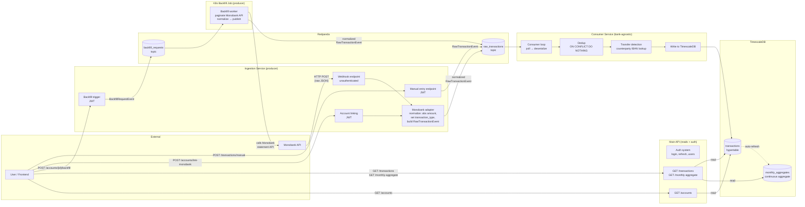
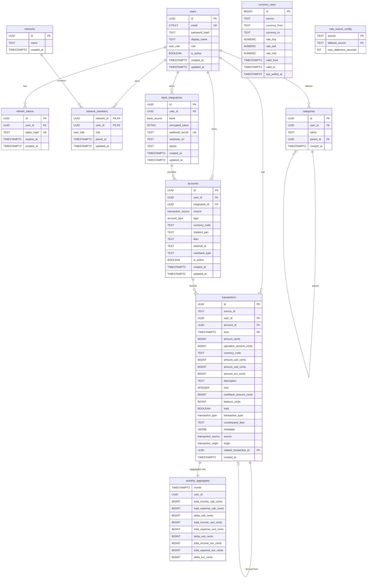

# Technical Specification: Transaction Ingestion Pipeline

- **Functional Specification:** `context/spec/003-transaction-ingestion-pipeline/functional-spec.md`
- **Status:** Draft
- **Author(s):** Nick

---

## 1. High-Level Technical Approach

The pipeline spans four backend services and the database layer:

1. **Ingestion service** (new) — dedicated FastAPI service that owns all pipeline-feeding writes. Receives Monobank webhooks, handles account linking (Monobank + manual), triggers backfill, accepts manual transaction entries. Owns the Redpanda producer, bank adapters, and account write operations. Validates JWTs for authenticated endpoints (does not issue tokens — that's the main API's job).
2. **Main API service** (existing) — serves the frontend with read endpoints. Lists accounts, queries transactions with filters, serves monthly aggregates. Owns the auth system (login, refresh token rotation, user management). Has no Redpanda dependency and no bank-specific code.
3. **Consumer service** — built from scratch. Subscribes to `raw_transactions` topic, deduplicates via deterministic hash IDs (`ON CONFLICT DO NOTHING`), detects internal transfers by counterparty IBAN lookup, and writes to TimescaleDB.
4. **Database** — new migration enables TimescaleDB + pgcrypto extensions, creates `bank_integrations`, `accounts`, `categories`, and `transactions` (hypertable) tables with RLS policies, plus continuous aggregates for monthly rollups by currency.

No frontend changes in this spec — REST API endpoints are the delivery boundary. The Redpanda wire format (`RawTransactionEvent`) and Monobank API client live in `grosh-shared` for cross-service reuse. Both the ingestion service and main API connect to TimescaleDB with separate connection pools.

**Data flow through the pipeline:**



Key points:
- **Two separate services serve the frontend.** The ingestion service handles all writes that feed the pipeline. The main API handles all reads and the auth system.
- **Monobank never talks to Redpanda.** It only sends HTTP to the ingestion service's webhook endpoint.
- **The ingestion service is the producer.** It translates bank-specific JSON into normalized `RawTransactionEvent` (always-positive amounts, explicit `transaction_type`) and publishes to Redpanda.
- **The consumer is bank-agnostic.** It only sees `RawTransactionEvent` — doesn't know or care which bank originated it.
- **Auth is split:** the main API issues and refreshes tokens. The ingestion service only validates them. Both share the same `JWT_SECRET`.
- **Each bank adapter** (currently only Monobank) lives in the ingestion service. Adding a new bank means adding a new adapter — the consumer and main API don't change.
- **The backfill K8s Job** is also a producer — it calls Monobank's API directly, normalizes identically, and publishes to the same topic.

---

## 2. Proposed Solution & Implementation Plan

### 2.1 Architecture Changes

**Ingestion service** is a new FastAPI application (`services/ingestion/`). Bank-specific code is organized per bank under `banks/` — each bank gets its own subfolder with `client.py`, `adapter.py`, and `webhook.py`. It owns:
- The Redpanda producer (initialized in lifespan). `confluent_kafka.Producer` with `bootstrap.servers = redpanda:9092`. Fire-and-forget produces with delivery callbacks for error logging. Flushed on shutdown.
- Per-bank modules under `banks/` — e.g. `banks/monobank/` contains the HTTP client, adapter (normalizes to `RawTransactionEvent`), and webhook endpoint.
- Account linking, manual account creation, backfill trigger, and manual transaction entry (all JWT-authenticated) in `routers/`.
- Currency rate ingestion — background loop polls exchange rate endpoints hourly (Monobank `/bank/currency` + NBU `/exchange`), stores in the `currency_rates` SCD2 table with `last_polled_at` tracking. Each bank defines a `rates_provider.py` that normalizes to `NormalizedRate`. Providers are registered in a list in `main.py`.
- Rate fallback chain — `rate_source_config` table defines fallback relationships (monobank → nbu) and staleness thresholds. Consumer checks `last_polled_at` against transaction time to detect stale rates.
- Admin rate backfill — K8s Job fetches NBU historical rates for a date range via `?start=YYYYMMDD&end=YYYYMMDD&valcode=CC` (one request per currency, ~45 total). Triggered by admin endpoint.

**Auth in the ingestion service:** JWT validation only — decodes access tokens using the shared `JWT_SECRET`, extracts `user_id`, sets the RLS session variable. Does not issue tokens, manage refresh tokens, or handle login. If the token is expired, returns 401. The frontend refreshes via the main API and retries.

**Main API service** (existing) gains only read-path endpoints: `GET /accounts`, `GET /transactions`, `GET /transactions/monthly-aggregate`. Retains full ownership of the auth system. Has no Redpanda dependency.

**Backfill worker** runs as a Kubernetes Job using the **ingestion service image** with a `--mode=backfill` entrypoint. The ingestion service triggers it via the `kubernetes` Python client. The Job subscribes to the `backfill_requests` Redpanda topic, paginates Monobank's statement API using `banks/monobank/client.py` (1 req/60s rate limit), normalizes via the bank adapter, and publishes each transaction batch to `raw_transactions`. Using the ingestion image is natural — the backfill job is a producer that needs bank clients and adapters, not a consumer.

**Consumer service** runs the transaction consumer loop:
- **Transaction consumer** (`group.id = transaction-pipeline`) — subscribes to `raw_transactions`, deduplicates, detects transfers, looks up per-bank exchange rates from `currency_rates` SCD2 table, computes denormalized display amounts (`amount_uah_cents`, `amount_usd_cents`, `amount_eur_cents`), writes to DB. The consumer is bank-agnostic — it has no bank clients or adapters.

### 2.2 Data Model / Database Changes

New migration: `0004_transaction_pipeline.py`

**Extensions to enable:**

| Extension     | Purpose                              |
|---------------|--------------------------------------|
| `timescaledb` | Hypertables, continuous aggregates   |
| `pgcrypto`    | `pgp_sym_encrypt` for Monobank token |

**New ENUM types:**

| Type                  | Values                                      |
|-----------------------|---------------------------------------------|
| `bank_source`         | `monobank`                                  |
| `account_type`        | `black`, `white`, `platinum`, `fop`, `cash` |
| `transaction_type`    | `income`, `expense`, `transfer`, `check`    |
| `transaction_source`  | `monobank`, `manual`                        |
| `transaction_origin`  | `bank`, `manual`, `derived`                 |

**ER diagram — full database state after this spec:**



**New tables:**

| Table               | Key Columns                                                                                                                                                                                                                                                                                                                                                                                                          | Notes                                                                                                                                                                        |
|---------------------|----------------------------------------------------------------------------------------------------------------------------------------------------------------------------------------------------------------------------------------------------------------------------------------------------------------------------------------------------------------------------------------------------------------------|------------------------------------------------------------------------------------------------------------------------------------------------------------------------------|
| `bank_integrations` | `id UUID PK`, `user_id FK→users`, `bank bank_source`, `encrypted_token BYTEA`, `webhook_secret TEXT UNIQUE`, `webhook_url TEXT`, `status TEXT`, `created_at`, `updated_at`                                                                                                                                                                                                                                           | RLS on `user_id`. Token encrypted via `pgp_sym_encrypt`. Webhook secret is a 32-byte hex random string.                                                                      |
| `accounts`          | `id UUID PK`, `user_id FK→users`, `integration_id FK→bank_integrations NULL`, `source bank_source NULL`, `type account_type`, `currency_code TEXT`, `masked_pan TEXT`, `iban TEXT`, `external_id TEXT`, `cashback_type TEXT`, `is_active BOOLEAN`, `created_at`, `updated_at`                                                                                                                                        | RLS on `user_id`. `integration_id` NULL for manual accounts. `external_id` is the bank's internal account identifier.                                                        |
| `categories`        | `id UUID PK`, `user_id FK→users NULL`, `name TEXT`, `parent_id FK→categories NULL`, `created_at`                                                                                                                                                                                                                                                                                                                     | RLS: `user_id = current_setting(...) OR user_id IS NULL` (system defaults visible to all).                                                                                   |
| `transactions`      | `id UUID PK` (deterministic hash), `source_id TEXT`, `user_id FK→users`, `account_id FK→accounts`, `time TIMESTAMPTZ`, `amount_cents BIGINT`, `operation_amount_cents BIGINT`, `currency_code TEXT`, `amount_uah_cents BIGINT`, `amount_usd_cents BIGINT`, `amount_eur_cents BIGINT`, `description TEXT`, `mcc INT`, `cashback_amount_cents BIGINT`, `balance_cents BIGINT`, `hold BOOLEAN`, `transaction_type transaction_type`, `counterparty_iban TEXT`, `metadata JSONB`, `source transaction_source`, `created_at` | **Hypertable** on `time`. RLS on `user_id`. Display amounts denormalized at write time using per-bank exchange rates from `currency_rates`. `metadata` holds bank-specific extras (e.g. `counter_edrpou`, `invoice_id`) and rate source traceability (e.g. `rate_source_uah`, `rate_source_usd`, `rate_source_eur`). |
| `currency_rates`    | `id BIGSERIAL PK`, `source TEXT`, `currency_from TEXT`, `currency_to TEXT`, `rate_buy NUMERIC(18,8) NULL`, `rate_sell NUMERIC(18,8) NULL`, `rate_mid NUMERIC(18,8) NOT NULL`, `valid_from TIMESTAMPTZ DEFAULT now()`, `valid_to TIMESTAMPTZ NULL`, `last_polled_at TIMESTAMPTZ NOT NULL`                                                                                                                                | SCD Type 2. `valid_to = NULL` = current rate. `last_polled_at` tracks when the rate was last confirmed correct (updated on every poll if unchanged, set to now() on insert). Rates stored as exact decimals (NUMERIC(18,8)) — industry standard, no multiplier needed. `rate_buy`/`rate_sell` nullable for cross-rate pairs. No RLS — rates are global. |
| `rate_source_config` | `source TEXT PK`, `fallback_source TEXT FK→rate_source_config NULL`, `max_staleness_seconds INT NOT NULL`                                                                                                                                                                                                                                                                                                             | Fallback chain for rate sources. Consumer checks staleness of primary source and falls back if `transaction_time - last_polled_at > max_staleness_seconds`. Seed: monobank→nbu (7200s), nbu→NULL (90000s). |

**Transaction ID strategy:** The primary key `id` is a deterministic UUID computed as `UUID5(NAMESPACE, source + ":" + source_id)` where `source` is "monobank" or "manual" and `source_id` is the external system's transaction identifier. This is computed by the producer (ingestion service) before publishing to Redpanda. The consumer uses `INSERT ... ON CONFLICT (id) DO NOTHING` for idempotent deduplication.

**Indexes:**

| Index                                                                              | Purpose                       |
|------------------------------------------------------------------------------------|-------------------------------|
| `transactions(user_id, time DESC)`                                                 | Feed pagination               |
| `transactions(id)` UNIQUE (PK)                                                     | Deduplication via ON CONFLICT |
| `transactions(user_id, account_id, time DESC)`                                     | Per-account queries (future)  |
| `accounts(user_id)`                                                                | Account listing               |
| `accounts(iban)` WHERE `iban IS NOT NULL`                                          | Transfer detection lookup     |
| `bank_integrations(webhook_secret)` UNIQUE                                         | Webhook URL validation        |
| `currency_rates(source, currency_from, currency_to, valid_from)` WHERE `valid_to IS NULL` | Current rate lookup    |

**Continuous aggregates:**

```sql
CREATE MATERIALIZED VIEW monthly_aggregates
WITH (timescaledb.continuous) AS
SELECT
    time_bucket('1 month', time) AS month,
    user_id,
    -- UAH
    COALESCE(SUM(amount_uah_cents)
        FILTER (WHERE transaction_type = 'income'),  0) AS total_income_uah_cents,
    COALESCE(SUM(amount_uah_cents)
        FILTER (WHERE transaction_type = 'expense'), 0) AS total_expense_uah_cents,
    COALESCE(SUM(amount_uah_cents)
        FILTER (WHERE transaction_type = 'income'),  0)
  - COALESCE(SUM(amount_uah_cents)
        FILTER (WHERE transaction_type = 'expense'), 0) AS delta_uah_cents,
    -- USD
    COALESCE(SUM(amount_usd_cents)
        FILTER (WHERE transaction_type = 'income'),  0) AS total_income_usd_cents,
    COALESCE(SUM(amount_usd_cents)
        FILTER (WHERE transaction_type = 'expense'), 0) AS total_expense_usd_cents,
    COALESCE(SUM(amount_usd_cents)
        FILTER (WHERE transaction_type = 'income'),  0)
  - COALESCE(SUM(amount_usd_cents)
        FILTER (WHERE transaction_type = 'expense'), 0) AS delta_usd_cents,
    -- EUR
    COALESCE(SUM(amount_eur_cents)
        FILTER (WHERE transaction_type = 'income'),  0) AS total_income_eur_cents,
    COALESCE(SUM(amount_eur_cents)
        FILTER (WHERE transaction_type = 'expense'), 0) AS total_expense_eur_cents,
    COALESCE(SUM(amount_eur_cents)
        FILTER (WHERE transaction_type = 'income'),  0)
  - COALESCE(SUM(amount_eur_cents)
        FILTER (WHERE transaction_type = 'expense'), 0) AS delta_eur_cents
FROM transactions
WHERE transaction_type NOT IN ('transfer', 'check')
  AND hold = false
GROUP BY month, user_id
WITH NO DATA;
```

Note: `amount_{currency}_cents` columns are denormalized at write time by the consumer using per-bank exchange rates from the `currency_rates` SCD2 table. All amounts are always positive; direction is indicated by `transaction_type`. The aggregate no longer groups by `currency_code` — each row contains all three currency representations.

Refresh policy: continuous, real-time aggregation enabled (combines materialized data with recent un-materialized rows).

### 2.3 API Contracts

#### Ingestion Service

**webhook.py router:**

| Method | Path                                 | Auth | Request Body             | Response | Notes                                   |
|--------|--------------------------------------|------|--------------------------|----------|-----------------------------------------|
| GET    | `/webhook/monobank/{webhook_secret}` | None | (none)                   | 200 OK   | Monobank verification handshake         |
| POST   | `/webhook/monobank/{webhook_secret}` | None | Monobank `StatementItem` | 200 OK   | Validates secret, publishes to Redpanda |

**accounts.py router:**

| Method | Path                      | Auth | Request Body                            | Response                               | Notes                                                                                    |
|--------|---------------------------|------|-----------------------------------------|----------------------------------------|------------------------------------------------------------------------------------------|
| POST   | `/accounts/link-monobank` | JWT  | `{ token: str }`                        | `{ integration_id, accounts: [...] }`  | Calls Monobank `/personal/client-info`, creates integration + accounts, registers webhook |
| POST   | `/accounts/{id}/backfill` | JWT  | (none)                                  | `{ status: "started", job_name: str }` | Triggers K8s Job. Validates account belongs to user.                                     |
| POST   | `/accounts/manual`        | JWT  | `{ type: "cash", currency_code, name }` | `{ id, type, currency_code, ... }`     | Creates a manual cash account                                                            |

**transactions.py router:**

| Method | Path                     | Auth | Request Body                                                                   | Response            | Notes                                          |
|--------|--------------------------|------|--------------------------------------------------------------------------------|---------------------|-------------------------------------------------|
| POST   | `/transactions/manual`   | JWT  | `{ account_id, amount_cents, currency_code, description, time, category_id? }` | Created transaction | Builds RawTransactionEvent, publishes to Redpanda |

#### Main API Service

**accounts.py router:**

| Method | Path        | Auth | Query Params | Response                             | Notes                    |
|--------|-------------|------|--------------|--------------------------------------|--------------------------|
| GET    | `/accounts` | JWT  | (none)       | `[{ id, type, currency_code, ... }]` | User's accounts (RLS-scoped) |

**transactions.py router:**

| Method | Path                              | Auth | Query Params                                           | Response                                                                                                                     |
|--------|-----------------------------------|------|--------------------------------------------------------|------------------------------------------------------------------------------------------------------------------------------|
| GET    | `/transactions`                   | JWT  | `type`, `account_id`, `from`, `to`, `limit`, `offset` | Paginated list of transactions                                                                                               |
| GET    | `/transactions/monthly-aggregate` | JWT  | (none)                                                 | `[{ month, income_uah, expense_uah, delta_uah, income_usd, expense_usd, delta_usd, income_eur, expense_eur, delta_eur }]`   |

### 2.4 Redpanda Topics

| Topic               | Partitions | Key       | Purpose                                               |
|---------------------|------------|-----------|-------------------------------------------------------|
| `raw_transactions`  | 3          | `user_id` | All incoming transactions (webhook, backfill, manual) |
| `backfill_requests` | 1          | `user_id` | Backfill job requests from API to K8s Job worker      |

### 2.5 Shared Models (grosh-shared)

**New file: `shared/src/grosh_shared/events.py`**

| Model                  | Key Fields                                                                                                                                                                                                                                | Purpose                                  |
|------------------------|-------------------------------------------------------------------------------------------------------------------------------------------------------------------------------------------------------------------------------------------|------------------------------------------|
| `RawTransactionEvent`  | `id` (deterministic UUID), `source`, `source_id`, `user_id`, `account_id`, `time`, `amount_cents`, `operation_amount_cents`, `currency_code`, `description`, `mcc`, `cashback_amount_cents`, `balance_cents`, `hold`, `counterparty_iban` | Wire format on `raw_transactions` topic  |
| `BackfillRequestEvent` | `integration_id`, `user_id`, `account_external_id`, `from_timestamp`, `to_timestamp`                                                                                                                                                      | Wire format on `backfill_requests` topic |

**New file: `shared/src/grosh_shared/id_utils.py`**

Deterministic UUID generation: `generate_transaction_id(source: str, source_id: str) -> UUID` using `uuid5(NAMESPACE, f"{source}:{source_id}")`.

**Update: `shared/src/grosh_shared/models.py`**

Update existing `Transaction` model to match the new DB schema (add `transaction_type`, `operation_amount_cents`, `source`, `counterparty_iban`, `balance_cents`, `hold`). Add `Account`, `BankIntegration` domain models.

### 2.6 Consumer Pipeline Logic

Transaction consumer processing flow:

1. Poll message from `raw_transactions`
2. Deserialize to `RawTransactionEvent`
3. Transfer detection: if `counterparty_iban` is set, query `accounts` table for `iban = counterparty_iban` AND `user_id = event.user_id`. If match found → override `transaction_type = 'transfer'`.
4. Currency conversion with fallback (see below)
5. `INSERT INTO transactions (...) VALUES (...) ON CONFLICT (id) DO NOTHING`
6. Commit Kafka offset

Note: `amount_cents` is always positive (or zero for checks). The `transaction_type` field (income/expense/transfer/check) carries the direction. Zero-amount transactions (card verification holds) are typed as `check`. The producer (ingestion service) normalizes bank-specific sign conventions before publishing. The consumer trusts the type and only overrides it for detected transfers.

**Currency rate lookup with fallback chain:**

For each denormalized amount (`amount_uah_cents`, `amount_usd_cents`, `amount_eur_cents`), the consumer resolves the exchange rate using the transaction's source and time:

1. Find the SCD2 rate row for source S where `valid_from <= T < COALESCE(valid_to, '9999-12-31')`
2. If `T <= last_polled_at` → rate is trustworthy (system was actively monitoring)
3. If `T > last_polled_at` and `T - last_polled_at <= max_staleness_seconds` (from `rate_source_config`) → rate is within acceptable drift, use it
4. Otherwise → rate source was not being observed at time T. Look up `fallback_source` from `rate_source_config` and repeat from step 1.
5. If no fallback exists (`fallback_source IS NULL`) → use the closest available rate by timestamp as last resort.

For each currency conversion, the consumer writes full rate traceability into the transaction's `metadata` JSONB field — the source, the rate record ID, and the actual rate value used:

```json
{
  "rate_uah": {"source": "monobank", "rate_id": 42, "value": "43.4997"},
  "rate_usd": {"source": "nbu", "rate_id": 108, "value": "1.0"},
  "rate_eur": {"source": "nbu", "rate_id": 109, "value": "0.84712"}
}
```

Each currency may use a different source (primary vs fallback). The `rate_id` references the `currency_rates.id` row used, enabling exact traceability. The `value` is the rate that was actually applied, so the transaction is fully self-describing without joining back to `currency_rates`.

**Hold → settlement strategy:**

Transactions are immutable once written. When a bank sends a settlement for a previously held transaction, two separate rows are stored:

1. The adapter passes the `hold` flag through and always uses the same base ID (`UUID5(NAMESPACE, "monobank:tx-001")`) for both hold and settlement events. It does not know whether a hold exists — that's the consumer's job.
2. The consumer checks: if the incoming event has `hold = false` and a row with the same base ID already exists with `hold = true`, this is a settlement of a previous hold. The consumer generates a new ID (`UUID5(NAMESPACE, "monobank:tx-001:settled")`), sets `related_transaction_id` to the hold's ID, and inserts as a new row.
3. If no hold exists (regular settled transaction), the consumer inserts with the base ID via `ON CONFLICT DO NOTHING` — fully idempotent.
4. Aggregates exclude holds: `WHERE hold = false AND transaction_type NOT IN ('transfer', 'check')`. Only settled transactions affect totals.
5. The feed shows both: holds as "pending", settlements as final. UI links them via `related_transaction_id`.
6. Orphaned holds (hold with no matching settlement after ~7 days) are harmless — invisible in aggregates. Optional periodic cleanup deferred.

Consumer config: `group.id = transaction-pipeline`, `auto.offset.reset = earliest`, `enable.auto.commit = false`. Manual commit after successful DB write.

### 2.7 Backfill K8s Job

**Job template:** `infra/k8s/backfill-job-template.yaml`

- Uses the **ingestion service** Docker image with a `--mode=backfill` entrypoint flag (the backfill job is a producer — it needs bank clients, adapters, and the Redpanda producer, all of which live in the ingestion image)
- Job subscribes to `backfill_requests` topic, processes one message, then exits
- Paginates Monobank statement API: starts from `to_timestamp`, walks backward in 31-day chunks
- Rate-limited: 1 request per 60 seconds per account (sleep between calls)
- Publishes each batch of transactions to `raw_transactions` as `RawTransactionEvent` messages
- `backoffLimit: 3`, `ttlSecondsAfterFinished: 3600`, `activeDeadlineSeconds: 1800`

**Historical rate backfill:** Before processing historical transactions, the backfill job fetches NBU daily rates for each day in the backfill window using `https://bank.gov.ua/NBUStatService/v1/statdirectory/exchange?json&date=YYYYMMDD`. These are inserted into `currency_rates` with `last_polled_at` set to the historical date. This ensures the consumer has reliable rates for all backfilled transactions.

**Ingestion service triggers the job** via `kubernetes` Python client: reads the Job template, substitutes metadata (unique name with timestamp), creates the Job in the k3s namespace. The `kubernetes` package is a dependency of the ingestion service.

### 2.8 New File Structure Summary

**Ingestion service (new):**

Bank-specific code is grouped per bank under `banks/`. Each bank has: `models.py` (Pydantic response types), `client.py` (HTTP client), `rates_provider.py` (currency rate normalization → `list[NormalizedRate]`), and optionally `adapter.py` + `webhook.py` (transaction normalization and webhook endpoints). Adding a new bank means creating a new subfolder — no changes to existing code.

| Path                                                                         | Responsibility                                                     |
|------------------------------------------------------------------------------|--------------------------------------------------------------------|
| `services/ingestion/src/grosh_ingestion/main.py`                            | App factory, lifespan (asyncpg pool + Redpanda producer + currency rate loop) |
| `services/ingestion/src/grosh_ingestion/deps.py`                            | DI composition root, JWT validation dependency                     |
| `services/ingestion/src/grosh_ingestion/models.py`                          | Ingestion domain models (NormalizedRate)                           |
| `services/ingestion/src/grosh_ingestion/banks/monobank/models.py`           | Monobank Pydantic models (API responses, webhook payload, currency rate) |
| `services/ingestion/src/grosh_ingestion/banks/monobank/client.py`           | Monobank API HTTP client (httpx) + public currency rate fetch      |
| `services/ingestion/src/grosh_ingestion/banks/monobank/adapter.py`          | Normalize Monobank data → RawTransactionEvent                      |
| `services/ingestion/src/grosh_ingestion/banks/monobank/rates_provider.py`   | Normalize Monobank currency rates → list[NormalizedRate]           |
| `services/ingestion/src/grosh_ingestion/banks/monobank/webhook.py`          | Monobank webhook GET/POST (unauthenticated)                        |
| `services/ingestion/src/grosh_ingestion/banks/nbu/client.py`                | NBU API HTTP client (daily + historical date-range queries)        |
| `services/ingestion/src/grosh_ingestion/banks/nbu/rates_provider.py`        | Normalize NBU rates → list[NormalizedRate] (daily + historical)    |
| `services/ingestion/src/grosh_ingestion/routers/accounts.py`                | Account linking, backfill trigger, manual accounts                 |
| `services/ingestion/src/grosh_ingestion/routers/transactions.py`            | Manual transaction entry                                           |
| `services/ingestion/src/grosh_ingestion/services/account_service.py`        | Monobank API orchestration, account creation                       |
| `services/ingestion/src/grosh_ingestion/services/backfill_service.py`       | K8s Job creation and management                                    |
| `services/ingestion/src/grosh_ingestion/services/transaction_service.py`    | Manual entry: build event, publish to Redpanda                     |
| `services/ingestion/src/grosh_ingestion/repositories/account_repo.py`       | Account + integration read/write operations                        |
| `services/ingestion/src/grosh_ingestion/repositories/user_repo.py`          | User is_active check                                               |
| `services/ingestion/src/grosh_ingestion/repositories/currency_rate_repo.py` | SCD2 upsert (rates stored as NUMERIC(18,8))                       |
| `services/ingestion/pyproject.toml`                                          | Dependencies: fastapi, asyncpg, confluent-kafka, httpx, PyJWT, kubernetes, grosh-shared |
| `services/ingestion/Dockerfile`                                              | Multi-stage build, same pattern as API                             |

**Main API service (modified):**

| Path                                                            | Responsibility                                     |
|-----------------------------------------------------------------|----------------------------------------------------|
| `services/api/src/grosh_api/routers/accounts.py`                | `GET /accounts` — read-only account listing        |
| `services/api/src/grosh_api/routers/transactions.py`            | `GET /transactions`, `GET /monthly-aggregate`      |
| `services/api/src/grosh_api/repositories/account_repo.py`       | Account read operations                            |
| `services/api/src/grosh_api/repositories/transaction_repo.py`   | Transaction queries, aggregate queries             |
| `services/api/migrations/versions/0004_transaction_pipeline.py` | Extensions, tables, hypertable, RLS (rate_buy/sell nullable, valid_from DEFAULT now()) |
| `services/api/migrations/versions/0005_monthly_aggregates.py`   | Continuous aggregate + refresh policy              |
| `services/api/migrations/versions/0006_rate_source_config.py`   | last_polled_at on currency_rates, rate_source_config table |

**Consumer service:**

| Path                                                                   | Responsibility                        |
|------------------------------------------------------------------------|---------------------------------------|
| `services/consumer/src/grosh_consumer/consumer.py`                     | Main consumer loop, message dispatch  |
| `services/consumer/src/grosh_consumer/handlers/transaction_handler.py` | Dedup + transfer detection + DB write |
| `services/consumer/src/grosh_consumer/db.py`                           | asyncpg pool setup for consumer       |

**Shared package:**

| Path                                        | Responsibility                                                         |
|---------------------------------------------|------------------------------------------------------------------------|
| `shared/src/grosh_shared/events.py`         | `RawTransactionEvent`, `BackfillRequestEvent`                          |
| `shared/src/grosh_shared/id_utils.py`       | Deterministic UUID hash function                                       |
| `shared/src/grosh_shared/models.py`         | Updated `Transaction` + new `Account`, `BankIntegration` domain models |
| `shared/src/grosh_shared/auth.py`           | JWT decode/validate utility (shared between API and ingestion)         |
| `shared/src/grosh_shared/db_url.py`         | DSN conversion helpers (asyncpg ↔ SQLAlchemy dialect)                  |
| `shared/src/grosh_shared/iso_4217.py`       | ISO 4217 numeric → alpha-3 currency code mapping                      |

**Infrastructure:**

| Path                                             | Responsibility                                       |
|--------------------------------------------------|------------------------------------------------------|
| `infra/k8s/backfill-job-template.yaml`           | K8s Job manifest template for transaction backfill   |
| `infra/k8s/rate-backfill-job-template.yaml`      | K8s Job manifest template for historical rate backfill |

---

## 3. Impact and Risk Analysis

### System Dependencies

- **Ingestion service** depends on: Redpanda (producer), TimescaleDB (writes: integrations, accounts, currency_rates), Monobank API (linking/webhook/rates), NBU API (rates), K8s API (backfill job trigger)
- **Main API service** depends on: TimescaleDB (reads: transactions, accounts, aggregates). No Redpanda dependency.
- **Consumer service** depends on: Redpanda (consumer), TimescaleDB (writes: transactions; reads: accounts, currency_rates, rate_source_config)
- **Transaction Backfill Job** depends on: Monobank API (statement reads), Redpanda (producer), shared package
- **Rate Backfill Job** depends on: NBU API (historical rates), TimescaleDB (writes: currency_rates)

### Potential Risks & Mitigations

| Risk                                                | Mitigation                                                                                                                                          |
|-----------------------------------------------------|-----------------------------------------------------------------------------------------------------------------------------------------------------|
| Monobank webhook replay / duplicate delivery        | Deterministic hash ID + `ON CONFLICT DO NOTHING` makes consumer fully idempotent                                                                    |
| Monobank API downtime during backfill               | K8s Job `backoffLimit: 3` retries. Backfill is idempotent — safe to re-run.                                                                         |
| Webhook endpoint abuse (public, unauthenticated)    | Opaque webhook secret in URL (unguessable). Validate account exists in DB. Rate-limit endpoint.                                                     |
| Redpanda unavailable when webhook fires             | Producer delivery failure logged. Monobank retries webhook delivery (built-in). No data loss.                                                       |
| Transfer detection misses (IBAN not yet registered) | When a new account is linked, re-scan recent transactions for transfer matches.                                                                     |
| Consumer crashes mid-batch                          | Manual offset commit after DB write. At-least-once + idempotent dedup. No data loss.                                                                |
| [NEEDS CLARIFICATION] Monobank webhook auth         | Research whether Monobank provides any signature or verification beyond the GET handshake. Currently relying on opaque URL + account ID validation. |

---

## 4. Testing Strategy

| Layer                 | Approach                                                                                                                                                                                                                                                                                     |
|-----------------------|----------------------------------------------------------------------------------------------------------------------------------------------------------------------------------------------------------------------------------------------------------------------------------------------|
| **Unit tests**        | Ingestion service: mock repos, Monobank client, K8s client. Test Monobank adapter normalization (sign → abs, type inference). Main API: mock repos. Test query filtering and aggregation. Consumer handler: mock DB, test dedup behavior and transfer detection override.                    |
| **Integration tests** | Ingestion: real DB, mocked Redpanda producer. Verify endpoints produce correct events. Main API: real DB (existing rollback-transaction pattern). Verify query endpoints return correct data. Consumer: real DB, feed pre-built events. Verify transactions land correctly and dedup works.   |
| **Contract tests**    | Verify `RawTransactionEvent` round-trip: serialize in ingestion service → deserialize in consumer. Ensures shared model stays consistent across services.                                                                                                                                    |
| **Backfill tests**    | Unit test the pagination logic (mock Monobank API responses). Integration test with a local K8s environment is deferred to Phase 2 Go Live.                                                                                                                                                  |
