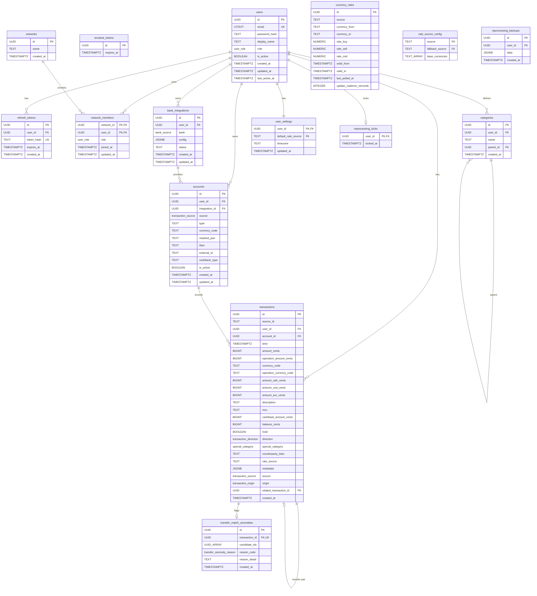

# Technical Specification: Transaction Ingestion Pipeline

- **Functional Specification:** `context/spec/003-transaction-ingestion-pipeline/functional-spec.md`
- **Status:** Slices 1–28 shipped. The monolithic `services/consumer/` was split into `services/normalization/` and `services/enrichment/` services.
- **Author(s):** Nick

---

## 1. High-Level Technical Approach

The pipeline spans four backend services and the database layer:

1. **Ingestion service** — dedicated FastAPI service that owns all pipeline-feeding writes and account lifecycle. Receives Monobank webhooks, handles account linking (Monobank + manual), account management (rename, soft-delete), triggers backfill, accepts manual transaction entries. Publishes **raw bank payloads** (not normalized) with a routing envelope to per-source Redpanda topics. Validates JWTs for authenticated endpoints (does not issue tokens — that's the main API's job). Connects as `grosh_ingestion` (RLS enforced).
2. **Main API service** — serves the frontend with read-only data endpoints and the auth system. Lists accounts, queries transactions with filters, serves compute-on-read aggregates, manages user settings. Owns login, refresh token rotation, token revocation, and user management. Has no Redpanda dependency and no bank-specific code. Connects as `grosh_api` (RLS enforced).
3. **Consumer services** — two-stage pipeline:
   - **Normalization service** (`services/normalization/`): subscribes to all `raw_transactions.*` topics, dispatches to per-source `NormalizationStrategy`, publishes `NormalizedTransaction` to `normalized_transactions`.
   - **Enrichment service** (`services/enrichment/`): subscribes to `normalized_transactions`, runs transfer detection → currency conversion → classification → persistence to PostgreSQL.
   Both connect as `grosh_consumer` (RLS bypassed).
4. **Database** — PostgreSQL 18 with `pgvector` and `pg_cron` extensions. Plain tables with B-tree indexes. Aggregations computed on read via a single SQL query (no materialized views). `pg_cron` handles TTL cleanup for revoked tokens. PG18 provides native `uuidv7()` for time-ordered UUID generation.

No frontend changes in this spec — REST API endpoints are the delivery boundary. Per-source raw models live in each source's module within the consumer; `NormalizedTransaction` is the internal consumer contract (not a cross-service shared model). All services connect to PostgreSQL with separate connection pools and per-service database roles.

**Data flow through the pipeline:**

```mermaid
flowchart LR
    subgraph External
        Mono[Monobank API]
        User[User / Frontend]
    end

    subgraph "Ingestion Service (thin gateway)"
        WH[Webhook endpoint\nunauthenticated]
        ME[Manual entry endpoint\nJWT]
        BT[Backfill trigger\nJWT]
        AL[Account linking\nJWT]
    end

    subgraph "Main API (reads + auth)"
        AUTH[Auth system\nlogin, refresh, revoke]
        TQ[GET /transactions\nGET /transactions/aggregates]
        AQ[GET /accounts]
    end

    subgraph Redpanda
        RT_M[(raw_transactions.monobank)]
        RT_MAN[(raw_transactions.manual)]
        NT[(normalized_transactions)]
    end

    subgraph "K8s Backfill Job (producer)"
        BW[Backfill worker\nresolves source from registry\npublishes raw payloads]
    end

    subgraph "Normalization Service"
        NC[Normalization consumer\nper-source strategy dispatch]
    end

    subgraph "Enrichment Service"
        PC[Enrichment consumer\ntransfer detection\ncurrency conversion\nclassification\npersistence]
    end

    subgraph "K8s Reprocess Job"
        RJ[Reprocess job\nreconstruct from DB\npublish to normalized_transactions]
    end

    subgraph "Ingestion Service"
        RT[POST /v1/users/{user_id}/reprocess\nor POST /v1/admin/reprocess\n409 if locked, API inserts lock atomically\nspawns K8s Job]
    end

    subgraph PostgreSQL
        TX[(transactions\nregular table, PK on id)]
        AN[(transfer_match_anomalies)]
        RL[(reprocessing_locks)]
        SB[(staging_normalized_transactions)]
    end

    Mono -- "HTTP POST\n(raw JSON)" --> WH
    WH -- "raw payload\n+ routing envelope" --> RT_M
    User -- "POST /manual/transactions" --> ME
    ME -- "raw payload\n+ envelope" --> RT_MAN
    User -- "POST /monobank/link" --> AL
    User -- "POST /monobank/accounts/{id}/backfill" --> BT
    BT -- "creates K8s Job" --> BW
    BW -- "calls bank API" --> Mono
    BW -- "raw payloads" --> RT_M
    RT_M --> NC
    RT_MAN --> NC
    NC -- "NormalizedTransaction\n(no active lock)" --> NT
    NC -. "NormalizedTransaction\n(user has active lock)" .-> SB
    SB -. "drain on NOTIFY\nor 60s sweep" .-> NT
    NT --> PC
    PC --> TX
    PC --> AN
    RJ -- "session-scoped\npg_advisory_lock" --> RL
    RJ -- "NormalizedTransaction\n(reconstructed from DB,\nbypasses staging)" --> NT
    RJ -. "NOTIFY reprocess_complete" .-> NC
    User -- "GET /transactions\nGET /aggregates" --> TQ
    User -- "GET /accounts" --> AQ
    User -- "POST /v1/users/{user_id}/reprocess\n(or /v1/admin/reprocess)" --> RT
    RT -- "creates K8s Job" --> RJ
    TQ -- "read" --> TX
    AQ -- "read" --> TX
```

Key points:
- **Two separate services serve the frontend.** The ingestion service handles all writes that feed the pipeline. The main API handles all reads and the auth system.
- **The ingestion service is a thin gateway.** It validates webhook authenticity, resolves `user_id`/`account_id` from the DB, and publishes the **raw bank payload** (not normalized) with a routing envelope to per-source topics. Normalization happens in the normalization service.
- **Consumer services have bank-specific code.** Normalization strategies live in `sources/{bank}/` within the normalization service. Transfer detection strategies live in `sources/{bank}/` within the enrichment service. Currency conversion, classification, and persistence are source-agnostic.
- **Two-stage consumer with intermediate topic.** Raw → normalized (per-source logic) is cleanly separated from normalized → DB (source-agnostic enrichment pipeline). This enables reprocessing to publish directly to `normalized_transactions` without per-source reconstruction.
- **Reprocessing publishes to `normalized_transactions`.** It reconstructs `NormalizedTransaction` from stored DB columns and replays through the enrichment consumer's normal processing path. Source-agnostic — one format regardless of bank count.
- **Auth is split:** the main API issues, refreshes, and revokes tokens. The ingestion service only validates them. Both share the same `JWT_SECRET`.
- **Each source** has code in two places: `sources/{bank}/` in ingestion (webhook, client, backfill) and `sources/{bank}/` in the normalization and enrichment services (normalizer strategy, transfer detection strategy). Adding a new bank means adding subfolders in both — the main API doesn't change.
- **The backfill K8s Job** is also a producer — it publishes raw bank payloads to the same per-source topic as the webhook.

---

## 2. Proposed Solution & Implementation Plan

### 2.1 Architecture Changes

**Ingestion service** is a FastAPI application (`services/ingestion/`). Code is organized by source under `sources/` — each source gets its own subfolder. Monobank has `router.py`, `client.py`, `rates_provider.py`, `models.py`, `linking_service.py`, `backfill.py`, and `repo.py`. NBU has `client.py` and `rates_provider.py`. Manual has `router.py` and `service.py`. There are no generic `routers/` or top-level `services/account_service.py`/`services/transaction_service.py` — these dissolved into source modules. It owns:
- The Redpanda producer (initialized in lifespan). `confluent_kafka.Producer` with `bootstrap.servers = redpanda:9092`. Fire-and-forget produces with delivery callbacks for error logging. Flushed on shutdown.
- Per-source modules under `sources/` — e.g. `sources/monobank/` contains the HTTP client, webhook + link endpoints in a single router, `MonobankLinkingService`, `MonobankRepo`, and `MonobankBackfillProvider`. The webhook handler extracts routing fields (source_id, external account_id) from the raw payload inline — no separate adapter. `sources/nbu/` has the NBU HTTP client and rates provider. `sources/manual/` has `ManualService` (account creation, transaction creation + Redpanda publish) and its router.
- Generic repositories: `repositories/account_repo.py` (create account, ownership check), `repositories/integration_repo.py` (create integration via config dict), `repositories/user_settings_repo.py` (read default rate source, validate rate source). Each repo owns exactly one table.
- Currency rate ingestion (full design rationale in `ingestion-currency-rate-guide.md`) — per-source background loops poll exchange rate endpoints at each provider's cadence (Monobank `/bank/currency` every 5min, NBU `/exchange` daily). Each provider is a `RateProviderConfig` with `RateKind.POLLED` or `RateKind.HISTORICAL`. Polled providers write `update_cadence_seconds` and `last_polled_at` to rows; historical providers write neither. Stores in the `currency_rates` SCD2 table. Each source defines a `rates_provider.py` that normalizes to `NormalizedRate`. Providers are registered in `main.py`.
- Rate fallback chain — `rate_source_config` table defines fallback relationships (monobank → nbu) and base pivot currencies. Consumer checks FRESH eligibility via `last_polled_at + K * update_cadence_seconds >= transaction_time` (K=2).
- Admin rate backfill — K8s Job fetches NBU historical rates for a date range via `?start=YYYYMMDD&end=YYYYMMDD&valcode=CC` (one request per currency, ~45 total). Triggered by admin endpoint.

**Auth in the ingestion service:** JWT validation only — decodes access tokens using the shared `JWT_SECRET`, extracts `user_id`, sets the RLS session variable. Does not issue tokens, manage refresh tokens, or handle login. If the token is expired, returns 401. The frontend refreshes via the main API and retries.

**Main API service** (existing) gains read-path endpoints: `GET /accounts`, `GET /transactions`, `GET /transactions/aggregates`, `GET /rates`, `GET /rates/at`, `GET /settings`, `PUT /settings`. Retains full ownership of the auth system (login, refresh, revocation). Has no Redpanda dependency.

**Backfill worker** runs as a Kubernetes Job using the **ingestion service image**. The ingestion service triggers it via the `kubernetes` Python client, passing all parameters as env vars. The Job resolves the bank source from the integration record and dispatches to the matching `TransactionBackfillProvider` from the registry. Each provider encapsulates bank-specific logic (API auth, pagination, rate limits, adapter) and publishes raw transaction batches to the source's `raw_transactions.{source}` topic. Using the ingestion image is natural — the backfill job is a producer that needs bank clients and adapters, not a consumer.

**Normalization service** (`services/normalization/`) runs the normalization consumer loop:
- **Normalization consumer** (`group.id = normalization`) — subscribes to all `raw_transactions.*` topics. Dispatches each message to the per-source `NormalizationStrategy` (registered in a `dict[str, NormalizationStrategy]`). Publishes the resulting `NormalizedTransaction` to the `normalized_transactions` topic, **unless** the message's `user_id` has an active `reprocessing_locks` row — in which case the `NormalizedTransaction` is INSERTed into `staging_normalized_transactions` instead (both the lock-row check and the publish/stage commit in the same DB transaction so the routing decision is consistent). Also runs a long-lived `LISTEN reprocess_complete` connection plus a 60s periodic sweep that drains staged rows back to `normalized_transactions` once the lock releases (publish-then-delete ordering for at-least-once). Bank-specific raw models are validated here (malformed payloads → skip + commit + log).

**Enrichment service** (`services/enrichment/`) runs the enrichment consumer loop:
- **Enrichment consumer** (`group.id = transaction-pipeline`) — subscribes to `normalized_transactions`. Runs the layered pipeline in sequence: transfer detection (per-source strategy) → currency conversion (source-agnostic) → classification (future, mixed) → persistence (`ON CONFLICT (id) DO NOTHING`). Each layer defines a Strategy protocol; the enrichment orchestrator dispatches via a registry dict. Transfer detection and normalization strategies are per-source; conversion and persistence are generic.

**Reprocessing job** runs as a Kubernetes Job using the **`grosh-consumer:latest` image** (the shared image bundles both `grosh_normalization/` and `grosh_enrichment/` packages, `NormalizedTransaction`, `TransactionRow.to_normalized()`, and the reprocess infrastructure — no separate image needed). The Job entrypoint (`reprocess_main.py`) is intentionally thin (~50 lines): it parses env, opens **one dedicated `asyncpg.connect()` (NOT from a pool — advisory locks are session-scoped and a pool acquire would auto-release on return)**, and delegates per-user work to `services/reprocess_orchestrator.py`. The connection is closed in a `finally` block so the advisory lock is released on abnormal exit. The service owns the 11-step state machine; `repositories/reprocess_repo.py` owns all SQL. Per user, the service holds a **session-scoped** `pg_advisory_lock(hashtext('reprocess:' || user_id::text))` for its entire lifetime: INSERT a `reprocessing_locks` row (status indicator), snapshot all of the user's transactions into `reprocessing_backups`, map stored rows to `NormalizedTransaction` via `TransactionRow.to_normalized()` (source-agnostic — one format, with `metadata.layer` stripped and `metadata.source` preserved), DELETE the originals (CASCADE clears anomalies), publish the reconstructed events directly to `normalized_transactions` (bypassing the staging buffer — the reprocess job is the lock holder), wait for the enrichment consumer to catch up via committed-offset polling, verify all snapshot IDs reappear in the DB, then atomically DELETE the lock row + `pg_advisory_unlock` + `NOTIFY reprocess_complete, $user_id`. The session-scoped lock + staging-buffer design (see `adr-transaction-reprocessing.md` "Concurrency") means the enrichment consumer is never blocked: live webhook traffic for the locked user is routed to `staging_normalized_transactions` by the normalization service and drained on lock release via LISTEN/NOTIFY.

**Reprocess trigger** lives in the **ingestion service**, alongside the existing backfill trigger. Two endpoints exist (per functional spec §2.9):
- `POST /v1/users/{user_id}/reprocess` — per-user trigger; auth `caller.id == user_id OR caller.role == admin`. Empty body.
- `POST /v1/admin/reprocess` — admin-only bulk trigger; body `{"user_ids": list[UUID] | null}` (`null` = all current users).

**Lock ownership inversion (changed from prior tech-spec design).** The ingestion API now atomically INSERTs the `reprocessing_locks` row inside the trigger transaction *before* submitting the K8s Job. The reprocess job pod no longer inserts on startup — it **asserts** the row exists and exits 0 cleanly if absent. This closes the race the prior "two-layer guard" design left open (two concurrent triggers passing the optimistic `EXISTS` check and both submitting jobs). The functional spec § 2.9 mandates this inversion; CLAUDE.md's data ownership matrix has been updated to document `reprocessing_locks` as the one co-owned table (Ingestion INSERTs, Consumer DELETEs — neither UPDATEs).

**RBAC change required.** The current `0007_app_roles.py` grants `INSERT, DELETE` on `reprocessing_locks` to `grosh_consumer` only. The new design requires a new migration (next available number) that:
- Grants `INSERT` on `reprocessing_locks` to `grosh_ingestion`.
- Revokes `INSERT` from `grosh_consumer` (consumer keeps DELETE; the reprocess job pod runs as `grosh_consumer` and only deletes its lock on completion).
- Both roles retain SELECT (granted by default privileges).

**Per-user trigger flow** (`POST /v1/users/{user_id}/reprocess`):
1. Verify authorization (`caller.id == user_id` or admin) → 403 with `code: INSUFFICIENT_PERMISSIONS` otherwise (the user_id in URL must equal caller's, or caller must be admin).
2. Begin an `asyncpg` transaction on a connection from the ingestion pool.
3. Attempt `INSERT INTO reprocessing_locks (user_id) VALUES ($1)`. On `unique_violation` (Postgres SQLSTATE `23505`): query the K8s API for an active reprocess Job via label selector `grosh.app/job-kind=reprocess,grosh.app/user-id={uuid}`, then rollback and return 409 with `code: REPROCESS_LOCKED` and `detail: "Reprocessing already in progress for user {user_id}. Existing job: {job_id}. Poll {status_url} for progress."` (exact format per functional spec §2.9).
4. Build the `V1Job` programmatically. Required labels (see "K8s Job labels" subsection below): `app.kubernetes.io/managed-by=grosh-ingestion`, `grosh.app/job-kind=reprocess`, `grosh.app/user-id={uuid}`. Job name pattern `grosh-reprocess-<short-user-id>-<unix-ts>`. `USER_IDS_JSON='["<user-uuid>"]'` and `envFrom: grosh-secrets`. `ttlSecondsAfterFinished: 3600` (so polling clients can capture terminal status).
5. Call `BatchV1Api.create_namespaced_job(namespace="grosh", body=v1_job)`. On exception (K8s API unreachable, RBAC denial, etc.): the still-open transaction rolls back (lock-row insert undone), return 502 with `code: JOB_SUBMISSION_FAILED`. User may immediately retry.
6. Commit the transaction. Return 202 with `JobTriggerResponse(job_id=<job_name>, status_url="/v1/users/{user_id}/reprocess/{job_name}")`.

**Bulk trigger flow** (`POST /v1/admin/reprocess`):
1. Verify caller is admin → 403 with `code: INSUFFICIENT_PERMISSIONS` otherwise.
2. Snapshot the target user list:
   - If body `user_ids` is `null`: `SELECT id FROM users` (single snapshot; new users created after this query are NOT included — deliberate snapshot semantic).
   - If body `user_ids` is a list: use it verbatim.
3. Begin a transaction. For each user_id in the snapshot, attempt `INSERT INTO reprocessing_locks (user_id) VALUES ($1)`. Collect successes into `targets`, failures (PK conflict) into `skipped = [{user_id, reason: "REPROCESS_LOCKED"}]`.
4. If `len(targets) == 0`: rollback, return 202 with `BulkReprocessResponse(job_id=None, status_url=None, skipped=<full list>)`. Client branches on `job_id is None` to skip polling.
5. Otherwise: build the `V1Job` with `USER_IDS_JSON=json.dumps([str(u) for u in targets])` env var. Labels: `app.kubernetes.io/managed-by=grosh-ingestion`, `grosh.app/job-kind=reprocess`. **No `grosh.app/user-id` label** (the job spans multiple users; user list is in env var). Job name pattern `grosh-reprocess-admin-<unix-ts>`.
6. Submit via `BatchV1Api.create_namespaced_job`. On exception: rollback all lock inserts, return 502 with `code: JOB_SUBMISSION_FAILED`.
7. Commit. Return 202 with `BulkReprocessResponse(job_id=<job_name>, status_url="/v1/admin/reprocess/{job_name}", skipped=<list>)`.

**Pod-startup lock assertion.** Inside `services/normalization/src/grosh_normalization/services/reprocess_orchestrator.py`, the per-user reprocess loop's first step changes from "INSERT lock row" to "SELECT 1 FROM reprocessing_locks WHERE user_id = $1." If the row is absent (the rare orphan-job case where the K8s submit succeeded but the API's transaction was rolled back due to a lost ack), the pod logs `"Reprocessing lock not found for user_id={uuid}; exiting cleanly"`, skips the user, and continues to the next. If all users are skipped, the pod exits 0 and the K8s Job ends in `status: succeeded`. The `pg_advisory_lock(hashtext('reprocess:' || user_id::text))` session-scoped acquisition still happens after the assertion — it serializes the pod's work against any other pod for the same user (defense in depth; the unique constraint on `reprocessing_locks` makes this near-impossible, but cheap).

**No cooldown.** The previously-documented 1-hour cooldown check (`SELECT max(created_at) FROM reprocessing_backups WHERE user_id = $1` → 429) is **removed** in line with functional spec §2.9. The `_COOLDOWN = timedelta(hours=1)` constant in `routers/reprocess.py` is deleted. If abuse becomes observable in production, cooldown can be reintroduced; until then, the deletion window + job runtime is self-throttling enough.

**Why ingestion and not the normalization/enrichment services or the main API:** the consumer services' responsibility is "process Kafka topics"; adding an HTTP server inside them dilutes that and creates a hybrid process where a hung Kafka consumer can starve the HTTP listener and vice versa. The main API is the read+auth surface; spawning K8s Jobs would expand its responsibility and bolt new K8s RBAC permissions onto a service that doesn't otherwise need them. Ingestion is the natural home: it already spawns K8s Jobs via `BackfillService` using the exact same `kubernetes` Python client, already binds to the `grosh-ingestion` ServiceAccount with `batch/v1.jobs.create` permission, and already groups "operations that produce events into the pipeline." Trade-off 1: the frontend has two base URLs (API for reads/auth, ingestion for writes/operations), but that split already exists today (manual entry, account linking, backfill are all on ingestion). Trade-off 2: ingestion is now the sole spawner of all three K8s job types (transactions backfill, rates backfill, reprocess). At single-instance 3-user scale this is fine.

**K8s Job labels (cross-cutting — applies to all three job kinds).** Every K8s Job spawned by the ingestion service carries:
- `app.kubernetes.io/managed-by=grosh-ingestion` — uniform across all kinds.
- `grosh.app/job-kind=<monobank_backfill|rates_backfill|reprocess>` — discriminator.
- Per-account-backfill jobs additionally carry `grosh.app/account-id={uuid}` AND `grosh.app/user-id={uuid}` (the account's owner, derived from the `accounts.user_id` FK at trigger time).
- Per-user reprocess jobs additionally carry `grosh.app/user-id={uuid}`.
- Admin bulk reprocess jobs carry NEITHER `user-id` NOR `account-id` labels (user list lives in `USER_IDS_JSON` env var).
- Rates-backfill jobs carry NEITHER (admin-only, no user/account scope).

The status endpoints (§2.3) verify these labels against the URL's path scope before responding — IDOR defense per functional spec §2.10.3. Reading labels requires `pods` and `jobs` read in the `grosh` namespace; see "K8s RBAC change" subsection below.

**K8s RBAC change required.** The current `infra/k8s/rbac/ingestion-role.yaml` grants only `["create", "get", "list", "watch"]` on `batch.jobs`. The new design requires reading pod status counters (`status.active`, `status.succeeded`, `status.failed`) for the job-status response shape, which means `pods` read access. The Role manifest is extended with a second rule block:
```yaml
- apiGroups: [""]
  resources: ["pods"]
  verbs: ["get", "list"]
```
This is a manifest change only; no code change.

### 2.2 Data Model / Database Changes

New migration: `0004_transaction_pipeline.py`

**Extensions to enable:**

| Extension            | Purpose                                                          |
|----------------------|------------------------------------------------------------------|
| `pgcrypto`           | `pgp_sym_encrypt` for Monobank token                             |
| `pgvector`           | Transaction description embeddings (future ML classifier)        |
| `pg_cron`            | Scheduled TTL cleanup for revoked tokens                         |
| `pg_stat_statements` | Per-query execution stats for observability (added in `0010_pg_stat_statements.py`) |

**New ENUM types:**

| Type                  | Values                                      |
|-----------------------|---------------------------------------------|
| `bank_source`         | `monobank`                                  |
| `transaction_direction` | `income`, `expense`, `zero`               |
| `special_category`    | `transfer` (future: `cancellation`, `hold`) |
| `transaction_source`  | `monobank`, `manual`                        |
| `transaction_origin`  | `bank`, `manual`                            |
| `transfer_anomaly_reason` | `unpaired_from_description`, `unpaired_to_description`, `ambiguous_pair_match`, `description_account_mismatch`, `description_consistency_mismatch` |

**ER diagram — full database state after this spec:**



**New tables:**

| Table               | Key Columns                                                                                                                                                                                                                                                                                                                                                                                                          | Notes                                                                                                                                                                        |
|---------------------|----------------------------------------------------------------------------------------------------------------------------------------------------------------------------------------------------------------------------------------------------------------------------------------------------------------------------------------------------------------------------------------------------------------------|------------------------------------------------------------------------------------------------------------------------------------------------------------------------------|
| `bank_integrations` | `id UUID PK`, `user_id FK→users`, `bank bank_source`, `config JSONB NOT NULL DEFAULT '{}'`, `status TEXT`, `created_at`, `updated_at`                                                                                                                                                                                                                                                                               | RLS on `user_id`. Bank-specific connection details live in `config`. Monobank stores `{"encrypted_token": "...", "webhook_secret": "...", "webhook_url": "..."}`. Token encrypted via `pgp_sym_encrypt` in `MonobankLinkingService`; stored as hex in `config.encrypted_token`. Webhook secret uniqueness enforced via partial expression index on `(config->>'webhook_secret') WHERE config->>'webhook_secret' IS NOT NULL`. |
| `accounts`          | `id UUID PK`, `user_id FK→users`, `integration_id FK→bank_integrations NULL`, `source transaction_source`, `type TEXT`, `currency_code TEXT`, `masked_pan TEXT`, `iban TEXT`, `external_id TEXT`, `cashback_type TEXT`, `name TEXT`, `is_active BOOLEAN`, `created_at`, `updated_at` | RLS on `user_id`. `integration_id` NULL for manual accounts. `type` is plain TEXT (not an enum — bank-specific types vary). `name` for manual accounts, unique per `(user_id, name, currency_code)` where `source = 'manual'`. |
| `categories`        | `id UUID PK`, `user_id FK→users NULL`, `name TEXT`, `parent_id FK→categories NULL`, `created_at`                                                                                                                                                                                                                                                                                                                     | RLS: `user_id = current_setting(...) OR user_id IS NULL` (system defaults visible to all).                                                                                   |
| `transactions`      | `id UUID PK` (deterministic hash), `source_id TEXT`, `user_id FK→users`, `account_id FK→accounts`, `time TIMESTAMPTZ`, `amount_cents BIGINT`, `operation_amount_cents BIGINT`, `currency_code TEXT`, `operation_currency_code TEXT NULL`, `amount_uah_cents BIGINT`, `amount_usd_cents BIGINT`, `amount_eur_cents BIGINT`, `description TEXT`, `mcc TEXT`, `cashback_amount_cents BIGINT`, `balance_cents BIGINT`, `hold BOOLEAN NULL`, `direction transaction_direction NOT NULL`, `special_category special_category NULL`, `counterparty_iban TEXT`, `rate_source TEXT`, `metadata JSONB`, `source transaction_source`, `origin transaction_origin`, `related_transaction_id UUID FK→transactions(id) ON DELETE SET NULL DEFERRABLE INITIALLY DEFERRED`, `created_at` | Regular table, PK on `id`. RLS on `user_id`. **Currency semantics:** `currency_code` is the account's base currency (resolved by the consumer from the `accounts` table at write time). `operation_currency_code` is the merchant/operation currency — NULL for domestic transactions, set to the foreign currency (e.g. `EUR`) for cross-currency purchases. `amount_cents` is in the account's base currency (the amount actually debited/credited). **Direction & special_category:** `direction` (`income`/`expense`/`zero`) is the immutable money-flow direction set by the normalizer from the amount sign — positive → `income`, negative → `expense`, zero → `zero`. `special_category` is the pipeline enrichment classification — NULL for ordinary transactions, set to `'transfer'` when the transfer detection strategy claims an internal transfer pair. Direction is preserved even on transfers (a transfer leg is still directionally `income` or `expense`). This two-field design avoids information loss: the old `transaction_type = 'transfer'` overwrote direction. `rate_source` stores which rate source chain was used for conversion (required for reprocessing). Display amounts denormalized at write time using per-bank exchange rates from `currency_rates`. `metadata` is a structured JSONB with two top-level namespaces: `metadata.source = {...}` holds source-side keys preserved from the bank payload (`counter_edrpou`, `counter_name`, `comment`, `receipt_id`, etc.), and `metadata.layer.<name> = {...}` holds per-pipeline-layer outputs that are re-derivable on reprocess. Populated layer namespaces: `metadata.layer.rate = {uah, usd, eur}` (currency conversion paths) and `metadata.layer.transfer = {row, pair?}` (transfer detection diagnostic block — `row` always present on MCC 4829 rows, `pair` present only on claimed pairs; see `adr-transfer-detection-v2.md` for the algorithm and the block's full schema). **Origin:** `origin` (`transaction_origin` enum: `bank`, `manual`) classifies how the transaction was created — `bank` for API-ingested, `manual` for user-entered. Derivable from `source` (`monobank` → `bank`, `manual` → `manual`). **Conflict handling:** `ON CONFLICT (id) DO NOTHING` for idempotent dedup. `UNIQUE (account_id, source_id)` as a safety net — violations indicate a bug (same bank tx with two UUIDs) and crash loudly. |
| `transfer_match_anomalies` | `id UUID PK`, `transaction_id UUID FK→transactions(id) ON DELETE CASCADE UNIQUE`, `candidate_ids UUID[]`, `reason_code transfer_anomaly_reason NOT NULL`, `reason_detail TEXT`, `created_at TIMESTAMPTZ` | Records rejected or suspicious transfer matches. One anomaly per transaction max (UNIQUE constraint). Only `unpaired_*` anomalies are auto-deleted when a partner arrives and the pair succeeds; terminal anomalies (`ambiguous_*`, `description_*`) persist for manual investigation. |
| `revoked_tokens`    | `jti UUID PK`, `expires_at TIMESTAMPTZ NOT NULL`                                                                                                                                                         | Access token revocation for instant logout. `pg_cron` purges expired rows every 5 minutes. No RLS needed. |
| `reprocessing_locks` | `user_id UUID PK FK→users`, `locked_at TIMESTAMPTZ NOT NULL DEFAULT now()`                                                                                                                               | Status indicator for frontend. Row exists = reprocessing in progress. Staleness is detected via `pg_locks` introspection (the row is stale iff no live session holds `pg_advisory_lock(hashtext('reprocess:' || user_id::text))`); the next reprocess job DELETEs such rows. `locked_at` is a debug breadcrumb only — not used for cleanup decisions. |
| `reprocessing_backups` | `id UUID PK`, `user_id UUID FK→users NOT NULL`, `data JSONB NOT NULL`, `created_at TIMESTAMPTZ NOT NULL DEFAULT now()`                                                                                  | Pre-delete snapshots for reprocessing safety. Retained 30 days. |
| `staging_normalized_transactions` | `id UUID PK DEFAULT uuidv7()`, `user_id UUID NOT NULL` (no FK — operational queue, not a relational entity; see `adr-transaction-reprocessing.md`), `payload JSONB NOT NULL`, `created_at TIMESTAMPTZ NOT NULL DEFAULT now()`. Index `idx_staging_user_created ON (user_id, created_at)`.                          | Buffer for `NormalizedTransaction` events whose `user_id` is currently being reprocessed. The normalization consumer routes here instead of publishing to `normalized_transactions` when `EXISTS (SELECT 1 FROM reprocessing_locks WHERE user_id = $1)` (both check and write commit in the same transaction). The drain task on the normalization consumer publishes staged rows back to `normalized_transactions` on `NOTIFY reprocess_complete` (LISTEN connection) and via a 60s periodic sweep as a fallback. Deletes happen after each successful publish (publish-then-delete for at-least-once semantics). No RLS — internal-only table. |
| `currency_rates`    | `id UUID PK DEFAULT uuidv7()`, `source TEXT`, `currency_from TEXT`, `currency_to TEXT`, `rate_buy NUMERIC(18,8) NULL`, `rate_sell NUMERIC(18,8) NULL`, `rate_mid NUMERIC(18,8) NOT NULL`, `valid_from TIMESTAMPTZ NOT NULL DEFAULT now()`, `valid_to TIMESTAMPTZ NULL`, `last_polled_at TIMESTAMPTZ NULL`, `update_cadence_seconds INTEGER NULL`                                                                                                    | SCD Type 2. Two independent sequences per (source, pair): polled rows (`last_polled_at` and `update_cadence_seconds` both set) and historical rows (both NULL). `valid_to = NULL` = current rate. Polled rows get `last_polled_at` bumped on every poll if rates unchanged. `valid_from` is the provider's authoritative timestamp (`at_time`), not SQL `now()`. Rates stored as exact decimals (NUMERIC(18,8)). `rate_buy`/`rate_sell` nullable for mid-only sources (NBU). No RLS — rates are global. |
| `rate_source_config` | `source TEXT PK`, `fallback_source TEXT FK→rate_source_config NULL`, `base_currencies TEXT[] NOT NULL DEFAULT '{}'`                                                                                                                                                                                                                                                                                                      | Fallback chain for rate sources. `base_currencies` lists the currencies this source publishes rates against (e.g. `{UAH}` for both Monobank and NBU). Consumer uses the union of all base currencies as candidate intermediates when chaining conversions — no hard-coded pivot currency. Seed: nbu→NULL (`{UAH}`), monobank→nbu (`{UAH}`). |
| `user_settings`      | `user_id UUID PK FK→users`, `default_rate_source TEXT FK→rate_source_config NULL`, `timezone TEXT NOT NULL DEFAULT 'UTC'`, `updated_at TIMESTAMPTZ DEFAULT now()`                                                                                                                                                                                                                                                                        | Per-user preferences. `default_rate_source` is nullable — no hardcoded default. NULL means no default; manual transactions must specify `rate_source` explicitly, or conversion falls back to the transaction's source. `timezone` is an IANA timezone identifier used by the aggregation query for timezone-aware bucketing (`AT TIME ZONE`). Defaults to `'UTC'`; the frontend auto-detects the browser timezone and sends `PUT /settings` on first load. RLS on `user_id`. Created automatically via `AFTER INSERT ON users` trigger when a new user is created. |

**Transaction ID strategy:** The primary key `id` is a deterministic UUID computed as `UUID5(NAMESPACE, source + ":" + source_id)` where `source` is "monobank" or "manual" and `source_id` is the external system's transaction identifier. This is computed by the producer (ingestion service) before publishing to Redpanda. The consumer uses `INSERT ... ON CONFLICT (id) DO NOTHING` for idempotent deduplication.

**Indexes:**

| Index                                                                              | Purpose                            |
|-------------------------------------------------------------------------------------|-------------------------------------|
| `transactions(user_id, time DESC)`                                                  | Feed pagination, aggregation queries |
| `transactions(id)` UNIQUE (PK)                                                      | Deduplication via ON CONFLICT       |
| `transactions(account_id, source_id)` UNIQUE                                        | Business-key dedup safety net       |
| `transactions(user_id, account_id, time DESC)`                                      | Per-account queries                 |
| `transactions(user_id, direction, time DESC) WHERE mcc = '4829' AND related_transaction_id IS NULL` | Transfer detection universal candidate fetch. The amount predicate (`amount_cents = $A OR operation_amount_cents = $B`) is rechecked on the candidate set rather than indexed — both clauses are amount equality, and at the per-user volume after the partial-index restriction the candidate set is bounded to a handful of rows. |
| `accounts(user_id)`                                                                 | Account listing                     |
| `accounts(user_id, name, currency_code) WHERE source = 'manual' AND name IS NOT NULL` UNIQUE | Manual account name uniqueness |
| `accounts(iban) WHERE iban IS NOT NULL`                                             | Transfer detection IBAN lookup       |
| `bank_integrations(config->>'webhook_secret') WHERE config->>'webhook_secret' IS NOT NULL` UNIQUE | Webhook secret validation |
| `currency_rates(source, currency_from, currency_to, valid_from) WHERE valid_to IS NULL` | Current rate lookup            |
| `revoked_tokens(expires_at)`                                                        | pg_cron TTL cleanup                 |

**Aggregation (compute-on-read):**

No materialized views. The `GET /transactions/aggregates` endpoint executes a single SQL query per request:

```sql
SELECT
    date_trunc($bucket, time AT TIME ZONE $user_tz) AS period_start,
    -- UAH
    COALESCE(SUM(amount_uah_cents) FILTER (WHERE direction = 'income'),  0) AS uah_income_cents,
    COALESCE(SUM(amount_uah_cents) FILTER (WHERE direction = 'expense'), 0) AS uah_expense_cents,
    ROUND(100.0 * COUNT(amount_uah_cents) / COUNT(*), 1) AS uah_converted_pct,
    -- USD, EUR follow same pattern
FROM transactions
WHERE user_id = $1
  AND direction IN ('income', 'expense')
  AND special_category IS NULL
  AND time >= COALESCE($from, '-infinity'::timestamptz)
  AND time <  COALESCE($to,   'infinity'::timestamptz)
GROUP BY period_start
ORDER BY period_start
```

With `INDEX (user_id, time DESC)`, this scans only the requesting user's rows. At 50 tx/month × 10 years = 6000 rows, any aggregation pattern completes in under 1ms. Supports any bucket size (day/week/month/quarter/year), arbitrary date ranges, per-currency selection, and timezone-aware bucketing. `converted_pct` exposes conversion completeness without inflating the response.

**Filter semantics:** the WHERE clause excludes both transfers (`special_category = 'transfer'`) and zero-amount rows (`direction = 'zero'`) — only real income/expense flows count toward bucket totals. `delta_cents` is computed in SQL as `income - expense` per currency.

**Time-range convention — half-open `[from, to)`:** `from` is inclusive, `to` is exclusive. This applies uniformly to every time-range filter exposed by the API (`GET /transactions`, `GET /transactions/aggregates`, `GET /rates`) and every `WHERE time >= from AND time < to` predicate in the repos. Rationale: half-open intervals tile the timeline without gaps or overlaps, match `date_trunc()` bucket boundaries (`[Jan 1, Feb 1)` is exactly January), align with SCD2 windows (`valid_from <= t AND (valid_to IS NULL OR valid_to > t)`), and let a frontend pass identical `from`/`to` to list and aggregate endpoints without an off-by-one. See the rule in root `CLAUDE.md`. Inclusive upper bounds (`time <= to`) are forbidden — they create bucket-edge double-counting and force end-of-day fudges (`23:59:59.999999`) that drift across timezones.

**Exception — backfill date params are inclusive end-of-day.** `POST /monobank/accounts/{id}/backfill` and `POST /admin/rates-backfill` accept `from`/`to` (or `from_date`/`to_date`) as **calendar dates**, not timestamps, and treat `to` as inclusive: the router converts `to` to `datetime.max.time()` before calling the bank API. This is intentional — the user's mental model when triggering a backfill is "fetch everything up to and including this date", and the bank APIs themselves use inclusive day-range semantics. Validators enforce `from < to` (transactions backfill) or `from_date <= to_date` (rates backfill). This is an acknowledged inconsistency with the SQL-filter half-open convention; harmonising would require changing user-facing semantics and is deferred. New endpoints that take time-range *filters* must use half-open; new endpoints that take backfill *date ranges* may use inclusive end-of-day, but must document the choice explicitly.

**`period_start` serialization:** the aggregation query uses `date_trunc($bucket, time AT TIME ZONE $user_tz)`, which returns a naive `timestamp` representing the bucket boundary in the user's wall-clock timezone. The repo attaches the user's tz and the router converts to UTC for serialization, so `period_start` in the JSON response is always a UTC ISO timestamp. For a `Europe/Kyiv` user, the January 2026 bucket appears as `"2025-12-31T22:00:00Z"` (= `2026-01-01T00:00 Kyiv`). Frontend authors must not interpret `period_start` as their local timezone — the bucket boundary is the user's, expressed in UTC. This is documented on the `AggregateItem.period_start` Pydantic field for OpenAPI consumers.

**Conversion-quality drill-down (deferred):** `GET /transactions/aggregates` exposes `converted_pct` per currency as a quality metric (e.g. `EUR.converted_pct = 96.0` means 4% of in-bucket transactions have `amount_eur_cents IS NULL`). The original Slice 15 design added a `?unconverted_currency=EUR` filter on `GET /transactions` for drill-down, but it was removed in Slice 15d before any frontend was built — the right tool (server filter, dedicated endpoint, client-side highlighting, or a `conversion_status` column) depends on access patterns we don't yet have. `converted_pct` itself stays as the load-bearing quality metric. When the frontend lands and a real drill-down need appears, revisit then.

**List-typed query params: repeated-key + StrEnum.** Multi-value query params on this endpoint (`currency`, `fields`) — and any future list-typed param across the API — use **repeated keys** with `list[SomeStrEnum]` typing: `?currency=UAH&currency=USD`, not `?currency=UAH,USD`. `Currency` is a `StrEnum` of `{UAH, USD, EUR}`; `AggregateField` is a `StrEnum` of `{income, expense, delta}`. Same applies to `direction` (`StrEnum` of `{income, expense, zero}`, scalar) and the `category` / `exclude_category` list params (`StrEnum` of `{transfer}`, future-extensible) on `GET /transactions` — the type system carries the enum constraint into OpenAPI. Why: FastAPI parses repeated keys natively, validates membership against the enum, and emits a proper OpenAPI `type: array, items: {enum: [...]}` schema; generated SDKs see typed `Currency[]` instead of bare `string`. Comma-separated would require a hand-rolled parser, weaken the OpenAPI schema, and lock us into "no value can ever contain a comma." Enum values are **canonical case only** — `?currency=uah` returns 422. See the rule in root `CLAUDE.md`.

**SpecialCategory filter on `GET /transactions`** (whitelist + blacklist with NULL-safe semantics). Two complementary list params:

- `category: list[SpecialCategory] | None` — whitelist. When present, the SQL `WHERE` adds `special_category = ANY($N::special_category[])`. NULL `special_category` rows are excluded (NULL is never `= ANY(...)` in SQL). Frontend uses this for category-focused views: `?category=transfer` for a Transfers tab, `?category=transfer&category=cancellation` to combine future categories.
- `exclude_category: list[SpecialCategory] | None` — blacklist. When present, the SQL `WHERE` adds `(special_category IS NULL OR special_category != ALL($N::special_category[]))`. The `OR special_category IS NULL` clause is **load-bearing**: a naive `special_category NOT IN (...)` filters NULL rows out (NULL `NOT IN (...)` is UNKNOWN, treated as false by `WHERE`), which would silently hide ordinary transactions — the spec promises blacklist always keeps NULL rows. Frontend uses this for the main feed: `?exclude_category=transfer`. When `cancellation`/`hold` ship later, the blacklist caller doesn't need a code change to keep seeing them.

Both predicates compose via `AND` when both params are present (e.g. `?category=transfer&exclude_category=hold` selects only transfer rows, then drops any hold — only meaningful once multiple categories exist).

**`build_where` can't render these two predicates** — its template is `(<expr> $N)` with a single space, which would produce `(special_category = ANY $1)` (invalid syntax: `ANY` requires `(...)` around its operand). Postgres array operators need the form `= ANY($1::special_category[])` and `!= ALL($1::special_category[])`. So the two new predicates are appended **after** `build_where` returns, using explicit `param_idx` arithmetic — the same pattern `list_transactions` already uses for the cursor-pagination predicate (`AND (time, id) < (${idx}, ${idx + 1})` at the current line 163).

```python
def _build_transaction_conditions(
    user_id: UUID,
    direction: str | None,
    category: list[SpecialCategory] | None,           # NEW: replaces special_category scalar
    exclude_category: list[SpecialCategory] | None,    # NEW
    account_id: UUID | None,
    from_time: datetime | None,
    to_time: datetime | None,
) -> tuple[str, list[object]]:
    where_clause, params = build_where([
        ("user_id =", user_id),
        ("direction =", direction),
        ("account_id =", account_id),
        ("time >=", from_time),
        ("time <", to_time),
    ])
    if category:
        idx = len(params) + 1
        where_clause += f" AND special_category = ANY(${idx}::special_category[])"
        params.append([c.value for c in category])
    if exclude_category:
        idx = len(params) + 1
        where_clause += (
            f" AND (special_category IS NULL"
            f" OR special_category != ALL(${idx}::special_category[]))"
        )
        params.append([c.value for c in exclude_category])
    return where_clause, params
```

The explicit `::special_category[]` cast is mandatory: asyncpg binds Python `list[str]` to PostgreSQL `text[]`, which Postgres won't implicitly cast to `special_category[]` inside `ANY/ALL`. Without the cast, the query errors with `operator does not exist: special_category = text`.

The fragments are short, the conditional-append pattern matches the file's existing cursor logic, and `build_where` stays focused on its single use case (binary-operator predicates with one placeholder). Promoting `ANY/ALL` support into `build_where` would either complicate its signature or weaken its mandatory-parens guarantee — not worth it for two call sites.

**Alternative considered and rejected:** extending `build_where` with a third tuple element for a custom placeholder template (`("special_category", "= ANY({}::special_category[])", value)`). Adds a sentinel-driven branch to the helper for marginal benefit; the explicit `param_idx` append below is more local and follows the cursor pattern.

**422 conflict validation lives in the router, not the repo.** The router computes `set(category or []) & set(exclude_category or [])` once per request; on non-empty intersection, raises `HTTPException(status_code=422, detail=f"category and exclude_category cannot contain the same values: {sorted(v.value for v in conflict)}")`. Duplicates within a single list collapse via the set conversion — `?category=transfer&category=transfer` is identical to `?category=transfer`. This check runs before any DB call, before pagination cursor decoding, and before RLS context-set; the repo only ever sees a conflict-free pair of lists.

**OpenAPI:** FastAPI emits `category` and `exclude_category` as `type: array, items: {type: string, enum: ["transfer"]}` (extending automatically as the `SpecialCategory` enum grows). Each gets a description that documents the NULL semantics and the conflict rule. The single-valued `special_category` query param from prior versions is **removed** — this is a breaking change to the API surface, but no shipped frontend depends on it (spec 004 is still Draft per its header).

**Repo method signature change.** `count_transactions` and `list_transactions` lose the `special_category: str | None` parameter and gain `category: list[SpecialCategory] | None = None, exclude_category: list[SpecialCategory] | None = None`. Existing tests using `special_category=` keyword call sites are updated in the same PR (the repo isn't called from anywhere outside the API service — `grep "list_transactions\|count_transactions" services/` to enumerate).

**`get_aggregates` is intentionally unchanged.** The aggregation method continues to hardcode `WHERE special_category IS NULL` (line 248 of `transaction_repo.py`) — aggregates always reflect only ordinary income/expense transactions, regardless of what categories exist now or get added later. This matches functional spec §2.7 ("Internal transfers and other special categories are excluded from aggregation by default"). If a future use case wants "aggregate just transfers" or similar, that's a separate endpoint or a separate explicit parameter — out of scope for this change.

**Optional-filter SQL assembly: `build_where` helper.** Repos that build `WHERE` clauses from optional filter parameters use `services/api/src/grosh_api/repositories/_sql.py::build_where`, not hand-rolled `param_idx` arithmetic. The helper takes a `list[tuple[str, object | None]]` of `(expr_left, value)` pairs (e.g. `("time >=", from_time)`), skips entries whose value is `None`, and returns `(condition_str, params)` — the condition string carries no leading `WHERE`, so callers compose into their own templates and can append cursor or other predicates cleanly. Compound expressions are passed as the entire left side (`("valid_to IS NULL OR valid_to >", at)` renders as `valid_to IS NULL OR valid_to > $N`). Module-private to the API service — not promoted to `shared/` because the consumer/ingestion/ml services do point lookups and inserts, not dynamic filter assembly. Revisit (and likely move to SQLAlchemy Core) if the pattern grows beyond the API service. pypika was evaluated and rejected: it doesn't speak asyncpg's `$N` placeholder style natively and falls apart on Postgres-specific SQL (`FILTER`, `AT TIME ZONE`, `COALESCE` with typed literals).

**pg_cron TTL for revoked tokens:**

```sql
SELECT cron.schedule_in_database(
    'purge-revoked-tokens',
    '*/5 * * * *',
    $$DELETE FROM revoked_tokens WHERE expires_at < now()$$,
    'grosh'
);
```

`pg_cron` and `pg_stat_statements` require `shared_preload_libraries=pg_cron,pg_stat_statements`, plus `cron.database_name=grosh` and `pg_stat_statements.track=all`, set via Docker Compose command args.

### 2.3 API Contracts

**Versioning.** All endpoints in both services are mounted under a `/v1` prefix **except the Monobank webhook**. Versioning is implemented at the FastAPI `APIRouter` level in each service's `main.py`:

```python
# services/api/src/grosh_api/main.py
app.include_router(auth_router, prefix="/v1")
app.include_router(transactions_router, prefix="/v1")
# ... every other router gets prefix="/v1"

# services/ingestion/src/grosh_ingestion/main.py
app.include_router(monobank_router, prefix="/v1")
app.include_router(manual_router, prefix="/v1")
app.include_router(admin_router, prefix="/v1")
app.include_router(reprocess_router, prefix="/v1")
# Webhook router is mounted UNVERSIONED — the URL is registered with Monobank:
app.include_router(monobank_webhook_router)  # NOT under /v1
```

The Monobank webhook router is a separate `APIRouter` instance (split out from the existing `monobank/router.py`) carrying only the GET/POST `/monobank/webhook/{webhook_secret}` routes. The rest of the Monobank source (`/monobank/link`, `/monobank/integrations`, etc.) lives on the versioned router. Existing path constants in tests and the Postman collection are migrated to the `/v1/` prefix.

**Response model rule.** Every endpoint declares an explicit `response_model=` parameter pointing at a Pydantic model. No bare `dict` returns. This is enforced by the OpenAPI-completeness CI check (§2.10 below).

#### Ingestion Service

**sources/monobank/router.py (split: lifecycle router under `/v1`, webhook router unversioned):**

| Method | Path                                                  | Auth | Request Body / Params                                | Response (status, model)                                                                                       | Notes                                                                                                                                                                                                                                                                                                                                                                                                                                                                                                                                                              |
|--------|-------------------------------------------------------|------|------------------------------------------------------|----------------------------------------------------------------------------------------------------------------|------------------------------------------------------------------------------------------------------------------------------------------------------------------------------------------------------------------------------------------------------------------------------------------------------------------------------------------------------------------------------------------------------------------------------------------------------------------------------------------------------------------------------------------------------------------|
| GET    | `/monobank/webhook/{webhook_secret}`                  | None | (none)                                               | 200 OK (no body)                                                                                               | Monobank verification handshake. **Unversioned by design** — URL already registered with Monobank.                                                                                                                                                                                                                                                                                                                                                                                                                                                                |
| POST   | `/monobank/webhook/{webhook_secret}`                  | None | Monobank `StatementItem`                             | 200 OK / 404 / 422                                                                                             | 404 if unknown secret or account; 422 if payload malformed. Unversioned, same reason.                                                                                                                                                                                                                                                                                                                                                                                                                                                                              |
| GET    | `/v1/monobank/integrations`                           | JWT  | (none)                                               | `200, list[MonobankIntegrationResponse]`                                                                       | Lists the calling user's Monobank integrations. Flat list (cursor pagination unnecessary — 0 or 1 integration per user in practice). RLS-scoped.                                                                                                                                                                                                                                                                                                                                                                                                                  |
| POST   | `/v1/monobank/link`                                   | JWT  | `{ monobank_token: str }`                            | `201 or 200, MonobankLinkResponse`                                                                             | Idempotent on `monobank_client_id` (fetched from Monobank `/personal/client-info`). **201** if a fresh `bank_integrations` row is inserted; **200** if existing row's token is rotated in place. **422 with `MONOBANK_TOKEN_INVALID`** if Monobank returns 401/403 for the token. **502 with `MONOBANK_API_UNAVAILABLE`** on Monobank timeout/5xx/429. **409 with `INTEGRATION_ALREADY_LINKED`** if the user already has an integration for a *different* `monobank_client_id` (must DELETE first). Response includes `webhook_registered: bool` — see §2.1 Linking. |
| DELETE | `/v1/monobank/integrations/{integration_id}`          | JWT  | (none)                                               | `204` or `404`                                                                                                 | Hard-deletes the `bank_integrations` row. Accounts and historical transactions preserved untouched. Best-effort webhook de-registration with 10-second timeout (warns on failure, proceeds with local delete). **404 with `INTEGRATION_NOT_FOUND`** if `integration_id` does not exist or does not belong to caller (no existence leak).                                                                                                                                                                                                                          |
| POST   | `/v1/monobank/accounts/{account_id}/backfill`         | JWT  | (query: `from: date`, `to: date`)                    | `202, JobTriggerResponse`                                                                                      | **Half-open `[from, to)`** per CLAUDE.md. Validation at the router: `from < to` else 422 `INVALID_DATE_RANGE`; `(to - from).days <= 31` else 422 `BACKFILL_WINDOW_TOO_LARGE`. **404 with `ACCOUNT_NOT_FOUND`** if account not owned by caller. Submits a K8s Job; returns `{job_id, status_url}` where `status_url` is the concrete path `/v1/monobank/accounts/{account_id}/backfill/{job_id}`. K8s submission failure → 502 `JOB_SUBMISSION_FAILED`.                                                                                                              |
| GET    | `/v1/monobank/accounts/{account_id}/backfill/{job_id}` | JWT | (none)                                               | `200, JobStatusResponse`                                                                                       | Poll backfill job status. Reads the K8s Job + pods in the `grosh` namespace via the `kubernetes` Python client. Returns native K8s status (pending/running/succeeded/failed) with pod counters and `failure_reason` (from `status.conditions[?type=='Failed'].message`). Verifies labels `grosh.app/account-id=={account_id}` AND `grosh.app/user-id=={caller_id}` (or caller is admin) before returning — **404 with `JOB_NOT_FOUND`** if either mismatch (IDOR defense). K8s API unreachable → 503 with `JOB_STATUS_UNAVAILABLE`.                                |

The old `POST /monobank/relink` endpoint is **removed** — token rotation is subsumed by idempotent `POST /v1/monobank/link`.

**routers/admin.py:**

| Method | Path                                          | Auth      | Request Body                          | Response                                  | Notes                                                                                                                                                                                              |
|--------|-----------------------------------------------|-----------|---------------------------------------|-------------------------------------------|----------------------------------------------------------------------------------------------------------------------------------------------------------------------------------------------------|
| POST   | `/v1/admin/rates-backfill`                    | JWT+admin | `{ source, from_date, to_date }`      | `202, JobTriggerResponse`                 | Validates `source` against `rate_source_config`; 422 `VALIDATION_ERROR` if unknown. `status_url` = `/v1/admin/rates-backfill/{job_id}`. K8s Job carries labels `grosh.app/job-kind=rates_backfill` plus `grosh.app/source={source}` (no user/account labels — admin-only; the source label lets the "already running" check be scoped per rate source so concurrent backfills for different sources are allowed). |
| GET    | `/v1/admin/rates-backfill/{job_id}`           | JWT+admin | (none)                                | `200, JobStatusResponse`                  | Same shape and K8s lookup as backfill status. Admin auth — non-admins get 403 `INSUFFICIENT_PERMISSIONS`. 404 `JOB_NOT_FOUND` if label `grosh.app/job-kind` is not `rates_backfill`.                |

**sources/manual/router.py:**

| Method | Path                                          | Auth | Request Body / Params                                                                                                              | Response                              | Notes                                                                                                                                                                                                                                                       |
|--------|-----------------------------------------------|------|------------------------------------------------------------------------------------------------------------------------------------|---------------------------------------|-------------------------------------------------------------------------------------------------------------------------------------------------------------------------------------------------------------------------------------------------------------|
| POST   | `/v1/manual/accounts`                         | JWT  | `{ type: "cash", currency_code, name }`                                                                                            | `201, ManualAccountResponse`          | 409 if name+currency already exists for user (`VALIDATION_ERROR` with detail). Creates a manual cash account.                                                                                                                                               |
| PUT    | `/v1/manual/accounts/{account_id}`            | JWT  | `{ name }`                                                                                                                         | `200, ManualAccountResponse`          | Manual accounts only — 403 `INSUFFICIENT_PERMISSIONS` if attempting to rename a bank account. 404 `ACCOUNT_NOT_FOUND` if not owned.                                                                                                                         |
| DELETE | `/v1/manual/accounts/{account_id}`            | JWT  | (none)                                                                                                                             | `204` or `404`                        | Soft-delete (`is_active=false`). Manual accounts only.                                                                                                                                                                                                       |
| POST   | `/v1/manual/transactions`                     | JWT  | `{ account_id, amount_cents, operation_currency_code, description, time, direction, mcc?, rate_source?, idempotency_key? }` | `201, ManualTransactionResponse`      | `direction` is a `TransactionDirection` `StrEnum` value; only `income` or `expense` are accepted (422 `VALIDATION_ERROR` on `zero`, `transfer`, or any other value). The request field name and the stored DB column are both `direction` — no mapping layer. 404 `ACCOUNT_NOT_FOUND` if account not owned. |

**routers/reprocess.py (per-user) and routers/admin_reprocess.py (admin bulk):**

| Method | Path                                                | Auth                     | Request Body                                  | Response                                                                              | Notes                                                                                                                                                                                                                                                                                                                                                                                                                                                                                                                                                                                                  |
|--------|-----------------------------------------------------|--------------------------|-----------------------------------------------|---------------------------------------------------------------------------------------|----------------------------------------------------------------------------------------------------------------------------------------------------------------------------------------------------------------------------------------------------------------------------------------------------------------------------------------------------------------------------------------------------------------------------------------------------------------------------------------------------------------------------------------------------------------------------------------------------|
| POST   | `/v1/users/{user_id}/reprocess`                     | JWT (self OR admin)      | (empty `{}`)                                  | `202, JobTriggerResponse`                                                             | Per-user trigger. `caller.id == user_id` OR `caller.role == admin`; otherwise 403 `INSUFFICIENT_PERMISSIONS`. API atomically INSERTs `reprocessing_locks` row inside the trigger transaction; on `unique_violation` returns 409 `REPROCESS_LOCKED` with `detail: "Reprocessing already in progress for user {user_id}. Existing job: {job_id}. Poll {status_url} for progress."` (job_id queried via K8s label selector). K8s submission failure → rollback + 502 `JOB_SUBMISSION_FAILED`. K8s Job labels: `grosh.app/job-kind=reprocess`, `grosh.app/user-id={uuid}`. No cooldown (removed).         |
| GET    | `/v1/users/{user_id}/reprocess/{job_id}`            | JWT (self OR admin)      | (none)                                        | `200, JobStatusResponse`                                                              | Poll per-user reprocess status. Verifies label `grosh.app/user-id=={user_id}` AND caller scope match (404 `JOB_NOT_FOUND` on mismatch). K8s API unreachable → 503 `JOB_STATUS_UNAVAILABLE`.                                                                                                                                                                                                                                                                                                                                                                                                            |
| POST   | `/v1/admin/reprocess`                               | JWT+admin                | `{ user_ids: list[UUID] \| null }`            | `202, BulkReprocessResponse`                                                          | Admin-only bulk trigger. `null` means "all users" via `SELECT id FROM users` **snapshot** at trigger time (new users created after this query are NOT included). For each target user, attempts atomic lock insert; users whose insert fails are added to `skipped: [{user_id, reason: "REPROCESS_LOCKED"}]`. If every user is skipped: returns 202 with `job_id=None, status_url=None, skipped=<full list>`. Otherwise: submits a single K8s Job with `USER_IDS_JSON=<successful targets>`. K8s Job labels: `grosh.app/job-kind=reprocess` only (no `user-id` label — spans multiple users).         |
| GET    | `/v1/admin/reprocess/{job_id}`                      | JWT+admin                | (none)                                        | `200, JobStatusResponse`                                                              | Poll admin bulk reprocess status. Verifies label `grosh.app/job-kind=reprocess` and absence of `grosh.app/user-id`. Non-admin → 403 `INSUFFICIENT_PERMISSIONS`.                                                                                                                                                                                                                                                                                                                                                                                                                                        |

The bare-verb `POST /reprocess` at the ingestion root is **removed**. All reprocess triggers go through the two endpoints above.

#### Main API Service

All Main API routes are mounted under `/v1/` per the versioning rule above.

**accounts.py router:**

| Method | Path                       | Auth | Query Params / Body                       | Response                                  | Notes                                        |
|--------|----------------------------|------|-------------------------------------------|-------------------------------------------|----------------------------------------------|
| GET    | `/v1/accounts`             | JWT  | `source`, `type`, `currency_code`, `name` | `200, list[AccountResponse]` (RLS-scoped) | All filters optional                         |
| GET    | `/v1/accounts/{id}`        | JWT  | (none)                                    | `200, AccountResponse` or 404 `ACCOUNT_NOT_FOUND` |                                      |

**transactions.py router:**

| Method | Path                                  | Auth | Query Params                                                              | Response                                                                                                                   |
|--------|---------------------------------------|------|---------------------------------------------------------------------------|----------------------------------------------------------------------------------------------------------------------------|
| GET    | `/v1/transactions`                    | JWT  | `direction` (enum), `category` (repeated, enum), `exclude_category` (repeated, enum), `account_id`, `from`, `to`, `limit`, `cursor` | `200, CursorPage[TransactionResponse]`. `from` is inclusive, `to` is exclusive (half-open `[from, to)`). `direction` is a `StrEnum` scalar; `category` and `exclude_category` are repeated-key `list[SpecialCategory]` with whitelist/blacklist semantics. Canonical case only — `?direction=expense` works, `?direction=Expense` returns 422 `VALIDATION_ERROR`. Each item includes `currency_code`, `operation_currency_code` (nullable), `direction`, and `special_category`. Invalid cursor → 400 `INVALID_CURSOR`. |
| GET    | `/v1/transactions/aggregates`         | JWT  | `currency` (repeated, enum), `from`, `to`, `bucket` (enum), `fields` (repeated, enum) | `200, AggregateResponse` with `{ bucket, items: [{ period_start, currencies: { UAH: { total_income_cents, total_expense_cents, delta_cents, converted_pct }, ... } }] }`. All params optional. Defaults: all currencies, all history, month bucket, all fields. `from` inclusive, `to` exclusive. Excludes transfers and zero-amount rows. List params use repeated-key form: `?currency=UAH&currency=USD&fields=income&fields=delta`. |

**rates.py router:**

| Method | Path                | Auth | Query Params                                                              | Response                                                                                                          | Notes                                                                                  |
|--------|---------------------|------|---------------------------------------------------------------------------|-------------------------------------------------------------------------------------------------------------------|----------------------------------------------------------------------------------------|
| GET    | `/v1/rates`         | JWT  | `source`, `currency_from`, `currency_to`, `from`, `to`, `limit`, `cursor` | `200, CursorPage[RateResponse]`. `from` filters `valid_from >= from` (inclusive); `to` filters `valid_from < to`. | No RLS (global table). Invalid cursor → 400 `INVALID_CURSOR`.                          |
| GET    | `/v1/rates/at`      | JWT  | `at` (datetime, default now), `source`, `currency_from`, `currency_to`    | `200, list[RateResponse]`                                                                                         | SCD2 point-in-time query (`valid_from <= at AND (valid_to IS NULL OR valid_to > at)`). Distinct from `/v1/rates` which filters on `valid_from`. |

**settings.py router:**

| Method | Path             | Auth | Request Body                          | Response                                              | Notes                                          |
|--------|------------------|------|---------------------------------------|-------------------------------------------------------|------------------------------------------------|
| GET    | `/v1/settings`   | JWT  | (none)                                | `200, UserSettingsResponse`                           | Returns current `user_settings` row            |
| PUT    | `/v1/settings`   | JWT  | `{ default_rate_source?, timezone? }` | `200, UserSettingsResponse`                           | Validates `default_rate_source` against `rate_source_config` (422 `VALIDATION_ERROR` if unknown). Validates `timezone` is a valid IANA identifier. Upserts `user_settings`. |

**admin.py router (Main API service):**

| Method | Path                 | Auth      | Query Params                  | Response                                  | Notes                                                                                                                                                                                                                                                                                                |
|--------|----------------------|-----------|-------------------------------|-------------------------------------------|------------------------------------------------------------------------------------------------------------------------------------------------------------------------------------------------------------------------------------------------------------------------------------------------------|
| GET    | `/v1/admin/users`    | JWT+admin | `limit` (default 50, 1–200), `cursor` (optional) | `200, CursorPage[AdminUserResponse]`      | Admin-only. Non-admin → 403 `INSUFFICIENT_PERMISSIONS`. Returns `{id, email, role, created_at, last_active_at}` per user. Sort order `created_at DESC, id DESC`; cursor encodes the composite `(created_at, id)` tuple via the existing `pagination.encode_cursor` helper. Invalid cursor → 400 `INVALID_CURSOR`. |

**Reprocess endpoints:** see Ingestion Service section above — both per-user and admin-bulk reprocess triggers/status endpoints live on the ingestion service (it owns the K8s spawn capability). The main API has no K8s dependency.

**`last_active_at` write path.** The auth service updates `users.last_active_at` on every access-token issuance. Concretely, both the login endpoint (`POST /v1/auth/login`) and the refresh endpoint (`POST /v1/auth/refresh`) execute `UPDATE users SET last_active_at = now() WHERE id = $1` immediately after signing the access token and immediately before returning the response. This is a single-row UPDATE per token issuance — at most once per 15 minutes per active user (the access-token TTL). No background task, no debouncing, no caching. The update is NOT triggered on every API request, on profile edits (those touch `updated_at` via the existing trigger), or anywhere else. The repo helper is `UserRepo.touch_last_active_at(conn, user_id)`.

#### Cross-Cutting API Concerns

**Shared error module (`shared/src/grosh_shared/errors.py`).** A new module in `grosh-shared` defines the entire error contract for both services:

```python
# shared/src/grosh_shared/errors.py
from enum import StrEnum
from typing import Any
from fastapi import HTTPException
from pydantic import BaseModel


class ErrorCode(StrEnum):
    VALIDATION_ERROR = "VALIDATION_ERROR"
    AUTHENTICATION_REQUIRED = "AUTHENTICATION_REQUIRED"
    INSUFFICIENT_PERMISSIONS = "INSUFFICIENT_PERMISSIONS"
    ACCOUNT_NOT_FOUND = "ACCOUNT_NOT_FOUND"
    INTEGRATION_NOT_FOUND = "INTEGRATION_NOT_FOUND"
    USER_NOT_FOUND = "USER_NOT_FOUND"
    JOB_NOT_FOUND = "JOB_NOT_FOUND"
    RATE_NOT_FOUND = "RATE_NOT_FOUND"
    INVALID_CURSOR = "INVALID_CURSOR"
    INVALID_DATE_RANGE = "INVALID_DATE_RANGE"
    REPROCESS_LOCKED = "REPROCESS_LOCKED"
    BACKFILL_WINDOW_TOO_LARGE = "BACKFILL_WINDOW_TOO_LARGE"
    MONOBANK_TOKEN_INVALID = "MONOBANK_TOKEN_INVALID"
    MONOBANK_API_UNAVAILABLE = "MONOBANK_API_UNAVAILABLE"
    INTEGRATION_ALREADY_LINKED = "INTEGRATION_ALREADY_LINKED"
    JOB_STATUS_UNAVAILABLE = "JOB_STATUS_UNAVAILABLE"
    JOB_SUBMISSION_FAILED = "JOB_SUBMISSION_FAILED"
    INTERNAL_ERROR = "INTERNAL_ERROR"


class ProblemDetail(BaseModel):
    type: str
    title: str
    status: int
    code: ErrorCode
    detail: str
    instance: str
    validation_errors: list[dict[str, Any]] | None = None


def raise_problem(
    status_code: int,
    code: ErrorCode,
    detail: str,
    *,
    instance: str = "",
    title: str | None = None,
    validation_errors: list[dict[str, Any]] | None = None,
) -> None:
    """Raise an HTTPException whose body conforms to the RFC 7807 envelope.

    The registered exception handler in each service (see error_handlers.py)
    serializes the body, sets the JSON content-type, and includes the
    validation_errors list on 422 responses only.
    """
    problem = ProblemDetail(
        type=f"https://docs.grosh.app/errors/{code.value.lower().replace('_', '-')}",
        title=title or _default_title(code),
        status=status_code,
        code=code,
        detail=detail,
        instance=instance,
        validation_errors=validation_errors,
    )
    raise HTTPException(status_code=status_code, detail=problem.model_dump(mode="json"))
```

Both `services/api/src/grosh_api/error_handlers.py` and `services/ingestion/src/grosh_ingestion/error_handlers.py` register three exception handlers:
1. **`HTTPException` handler** — picks up `raise_problem` calls (whose `detail` is already a serialized `ProblemDetail` dict) and emits the body verbatim with the matching HTTP status.
2. **`RequestValidationError` handler** — converts Pydantic v2's `.errors()` output to `list[{loc, msg, type}]` with `loc` converted from tuple to list, embeds it in the `ProblemDetail` envelope with `code=VALIDATION_ERROR` and `status=422`, and emits it.
3. **Catch-all `Exception` handler** — last resort. Logs the exception with `exc_info=True`, emits `ProblemDetail` with `code=INTERNAL_ERROR`, `status=500`, `detail="An unexpected error occurred"`. Never includes the original exception's repr in `detail` (avoids leaking secrets from stack traces).

All existing `raise HTTPException(status_code=X, detail="...")` call sites are migrated to `raise_problem(X, code=..., detail=...)`. No domain error returns the bare `{"detail": "..."}` shape.

**Response model rule (cross-cutting).** Every router declares `response_model=<TypedModel>` on every endpoint. No bare `dict` returns. Models live in `services/{service}/src/grosh_{service}/schemas.py` (or per-source under `sources/{bank}/schemas.py` for source-specific shapes). New shared shapes (`JobTriggerResponse`, `JobStatusResponse`, `BulkReprocessResponse`, `ProblemDetail`) live in `grosh-shared`:

| Model                        | Module                                | Used by                                                        |
|------------------------------|---------------------------------------|----------------------------------------------------------------|
| `JobTriggerResponse`         | `grosh_shared/jobs.py`                | All 4 job-trigger endpoints (backfill, rates-backfill, reprocess) |
| `JobStatusResponse`          | `grosh_shared/jobs.py`                | All 4 job-status endpoints                                     |
| `BulkReprocessResponse`      | `grosh_shared/jobs.py`                | `POST /v1/admin/reprocess` only                                |
| `ProblemDetail`              | `grosh_shared/errors.py`              | Every error response in both services                          |
| `MonobankLinkResponse`       | `services/ingestion/sources/monobank/schemas.py` | `POST /v1/monobank/link`                                       |
| `MonobankIntegrationResponse`| `services/ingestion/sources/monobank/schemas.py` | `GET /v1/monobank/integrations`                                |
| `ManualAccountResponse`      | `services/ingestion/sources/manual/schemas.py`   | `POST/PUT /v1/manual/accounts`                                 |
| `ManualTransactionResponse`  | `services/ingestion/sources/manual/schemas.py`   | `POST /v1/manual/transactions`                                 |
| `AdminUserResponse`          | `services/api/src/grosh_api/schemas.py`          | `GET /v1/admin/users`                                          |

`BulkReprocessResponse` declares `job_id: str | None` and `status_url: str | None` with a model validator asserting they are either both null or both non-null:

```python
class BulkReprocessResponse(BaseModel):
    job_id: str | None
    status_url: str | None
    skipped: list[SkippedUser]

    @model_validator(mode="after")
    def _check_both_or_neither(self) -> "BulkReprocessResponse":
        if (self.job_id is None) != (self.status_url is None):
            raise ValueError(
                "BulkReprocessResponse: job_id and status_url must be both null or both non-null"
            )
        return self
```

**OpenAPI completeness CI check.** A new GitHub Actions step (in the existing CI workflow) starts each service's FastAPI app in-process, fetches `/openapi.json`, and asserts that every operation has a non-empty `responses[*].content[*].schema`. An empty schema (`additionalProperties: true` without other constraints, or a missing `schema` key) fails the build. Implementation lives at `scripts/check_openapi_completeness.py`; it imports both `grosh_api.main:app` and `grosh_ingestion.main:app`, walks their OpenAPI documents, and exits non-zero on any incomplete operation. Runs in CI on every PR.

**Migration `0012_users_last_active_at_and_lock_rbac.py`.** A single migration covers both the `users.last_active_at` column and the `reprocessing_locks` RBAC change (they share an iteration; bundling avoids a half-applied state across deploys). Numbered `0012` because `0011_accounts_config_and_integration_uniqueness.py` landed first on this branch:

```python
def upgrade() -> None:
    # New column on users
    op.execute(
        "ALTER TABLE users ADD COLUMN last_active_at TIMESTAMPTZ NULL;"
    )
    # NO update trigger — auth service writes this explicitly per token issuance.

    # Lock-ownership RBAC inversion
    # Ingestion now atomically inserts the row before submitting the K8s Job
    op.execute("GRANT INSERT ON reprocessing_locks TO grosh_ingestion;")
    # Consumer keeps DELETE (the reprocess pod releases the lock on completion)
    # but no longer needs INSERT.
    op.execute("REVOKE INSERT ON reprocessing_locks FROM grosh_consumer;")


def downgrade() -> None:
    op.execute("GRANT INSERT ON reprocessing_locks TO grosh_consumer;")
    op.execute("REVOKE INSERT ON reprocessing_locks FROM grosh_ingestion;")
    op.execute("ALTER TABLE users DROP COLUMN last_active_at;")
```

**Migration `0013_fix_revoked_tokens_grants_and_users_rls.py`.** Added after end-to-end smoke testing surfaced two pre-existing defects that blocked real flows but weren't related to any single slice — both were latent gaps in the migration history that became visible only when the full stack was exercised:

1. **`POST /v1/auth/logout` returned 500** with `permission denied for table revoked_tokens`. Migration `0008_revoked_tokens.py` created the table and intended to grant `SELECT/INSERT/DELETE` to `grosh_api` in its `upgrade()` block, but the live dev database only had `SELECT` — an earlier version of `0008` must have omitted the grant block. Re-applying the GRANT idempotently in `0013` guarantees every environment converges regardless of historical state.
2. **`POST /v1/admin/users` returned 500** with `new row violates row-level security policy for table "users"`. The single `users_isolation` policy from `0007_app_roles.py` was defined as `FOR ALL USING (id = app.current_user_id())`, which for an `ALL` policy doubles as `WITH CHECK` on INSERT. Admin-driven user creation produces a fresh `id` that never matches the admin's `current_user_id()`, so the INSERT failed. The fix splits the policy and adds a non-recursive admin carve-out via a session variable.

```python
def upgrade() -> None:
    # 1. Re-apply the missing write grants for grosh_api on revoked_tokens.
    op.execute("GRANT SELECT, INSERT, DELETE ON revoked_tokens TO grosh_api;")

    # 2. Replace the single ALL policy with per-command policies so INSERT
    #    isn't forced through the same predicate as SELECT/UPDATE/DELETE.
    op.execute("DROP POLICY IF EXISTS users_isolation ON users;")
    op.execute("""
        CREATE POLICY users_isolation_select ON users
            FOR SELECT USING (id = app.current_user_id());
    """)
    op.execute("""
        CREATE POLICY users_isolation_update ON users
            FOR UPDATE
            USING (id = app.current_user_id())
            WITH CHECK (id = app.current_user_id());
    """)
    op.execute("""
        CREATE POLICY users_isolation_delete ON users
            FOR DELETE USING (id = app.current_user_id());
    """)

    # 3. Admin carve-out via a non-recursive session variable. A naive
    #    "look up admin role from the users table" predicate would cause
    #    PostgreSQL to detect infinite recursion (RLS on users querying
    #    users). Instead, grosh_api sets app.current_user_role in the
    #    request-prep dependency alongside app.current_user_id, and the
    #    policy reads it via a STABLE function that returns NULL when
    #    unset (NULLIF maps the empty string PG hands back when a
    #    transaction-local GUC is missing).
    op.execute("""
        CREATE OR REPLACE FUNCTION app.current_user_role()
        RETURNS text LANGUAGE sql STABLE AS $$
            SELECT NULLIF(current_setting('app.current_user_role', true), '')
        $$;
    """)
    op.execute("""
        CREATE POLICY users_admin_all ON users
            FOR ALL
            USING (app.current_user_role() = 'admin')
            WITH CHECK (app.current_user_role() = 'admin');
    """)

    # 4. Mirror the admin carve-out on user_settings. Migration 0006
    #    installs a BEFORE INSERT trigger on users that auto-creates a
    #    user_settings row via INSERT INTO user_settings (user_id)
    #    VALUES (NEW.id). The trigger runs in the admin's session, so
    #    the new settings row's user_id does not match
    #    app.current_user_id() and the user_settings_isolation policy
    #    rejects it. The mirror unblocks admin-driven user creation
    #    end-to-end through the trigger.
    op.execute("""
        CREATE POLICY user_settings_admin_all ON user_settings
            FOR ALL
            USING (app.current_user_role() = 'admin')
            WITH CHECK (app.current_user_role() = 'admin');
    """)
```

**`app.current_user_role` session variable contract.** Set by the API service's `get_current_user` dependency immediately after `set_rls_user_id`, scoped to the request transaction via `local=true`. A new helper `set_rls_user_role(conn, role)` in `shared/src/grosh_shared/user_db.py` makes the contract explicit (mirrors the existing `set_rls_user_id`). The ingestion service does not set this variable today — it has no admin-cross-user endpoints. If it ever does, the helper exists.

**RLS architecture after `0013` (authoritative — supersedes the simpler description in §"Database Role Separation & RLS Enforcement" below where it conflicts).** The `users` table has four policies post-`0013`:
- `users_auth_lookup` (FOR SELECT) — login flow's email lookup, gated by `app.current_user_email`
- `users_isolation_select` (FOR SELECT) — self-read for ordinary users
- `users_isolation_update` (FOR UPDATE, USING + WITH CHECK) — self-update
- `users_isolation_delete` (FOR DELETE) — self-delete
- `users_admin_all` (FOR ALL with WITH CHECK) — admin carve-out, gated by `app.current_user_role() = 'admin'`

`user_settings` has the original `user_settings_isolation` plus the mirrored `user_settings_admin_all` carve-out. All other user-scoped tables retain their single isolation policy.

**K8s RBAC manifest update.** `infra/k8s/rbac/ingestion-role.yaml` is extended to add `pods` read permission for the new job-status endpoints:

```yaml
rules:
  - apiGroups: ["batch"]
    resources: ["jobs"]
    verbs: ["create", "get", "list", "watch"]
  - apiGroups: [""]                  # new
    resources: ["pods"]              # new
    verbs: ["get", "list"]           # new
```

No new ServiceAccount needed — the existing `grosh-ingestion` SA gains the additional permission via the same RoleBinding.

### 2.4 Redpanda Topics

| Topic                        | Partitions | Key       | Purpose                                                        |
|------------------------------|------------|-----------|----------------------------------------------------------------|
| `raw_transactions.monobank`  | 3          | `user_id` | Raw Monobank payloads from webhook and backfill                |
| `raw_transactions.manual`    | 3          | `user_id` | Manual transaction entries                                     |
| `normalized_transactions`    | 3          | `user_id` | Source-agnostic `NormalizedTransaction` (intermediate topic)   |

Per-source topics carry raw bank payloads wrapped in a `TransactionEnvelope` (routing metadata + untyped `payload` dict). The normalization service subscribes to all `raw_transactions.*` topics. The enrichment service subscribes only to `normalized_transactions`. Reprocessing publishes directly to `normalized_transactions` (skips normalization).

### 2.5 Models & Wire Formats

**Shared package (`grosh-shared`):**

| File           | Contents                                                                               |
|----------------|----------------------------------------------------------------------------------------|
| `models.py`    | Enums (`TransactionSource`, `TransactionDirection`, `SpecialCategory`, `RateSource`), `Transaction`, `Account`, `BankIntegration` domain models |
| `id_utils.py`  | Deterministic UUID: `generate_transaction_id(source, source_id) -> UUID` via `uuid5`   |
| `auth.py`      | JWT decode/validate utility (shared between API and ingestion)                         |
| `iso_4217.py`  | ISO 4217 numeric → alpha-3 currency code mapping                                      |
| `db_url.py`    | DSN conversion helpers (asyncpg ↔ SQLAlchemy dialect)                                  |
| `errors.py`    | `ErrorCode` StrEnum (18 codes), `ProblemDetail` Pydantic model, `raise_problem(...)` helper. Imported by both services' routers and `error_handlers.py`. Full module shape in §2.3 "Cross-Cutting API Concerns." |
| `jobs.py`      | `JobTriggerResponse`, `JobStatusResponse`, `BulkReprocessResponse`, `SkippedUser`. Shared by all four job-triggering endpoints and the corresponding status endpoints. `BulkReprocessResponse` carries the `job_id`/`status_url`-both-null-or-both-non-null validator. |

The shared package no longer defines the Kafka message schema — each source owns its own raw format, and `NormalizedTransaction` is the internal consumer contract.

**Consumer models:**

| Model                   | Location                              | Purpose                                              |
|-------------------------|---------------------------------------|------------------------------------------------------|
| `TransactionEnvelope`   | `grosh_shared/envelope.py`            | Wire format between ingestion and consumer: `user_id`, `account_id`, `source`, `payload: dict` |
| `NormalizedTransaction` | `grosh_shared/normalized.py` | Source-agnostic intermediate format. All fields needed by the enrichment service: `id`, `source`, `source_id`, `user_id`, `account_id`, `time`, `amount_cents`, `operation_amount_cents`, `operation_currency_code`, `description`, `mcc`, `cashback_amount_cents`, `balance_cents`, `hold` (`bool | None` — nullable for sources without an equivalent settlement flag; see "Hold flag" subsection), `counterparty_iban`, `rate_source`, `metadata` |
| `TransferResult`        | `grosh_enrichment/services/transfer_detection.py` | Output of transfer detection. Fields: `special_category` (`'transfer'` on a successful claim, `None` otherwise), `related_transaction_id` (the partner's UUID on a successful claim, `None` otherwise), `anomalies: list[AnomalyRecord]` (zero or more anomalies to persist), and `metadata_block: dict | None` — the `metadata.layer.transfer` payload to merge under the row's `metadata`. Shape: `{"row": {...}}` on unpaired MCC 4829 rows, `{"row": {...}, "pair": {...}}` on claimed pairs (identical on both legs), `None` for non-MCC-4829 rows (the orchestrator writes nothing under `metadata.layer.transfer` in that case, preserving the invariant `metadata.layer.transfer exists ⇔ mcc == '4829'`). |
| `ConversionResult`      | `grosh_enrichment/services/currency_conversion_service.py` | Output of currency conversion: per-currency amounts + rate metadata |

**Per-source raw models (validated during normalization):**

| Source   | Model                      | Location                                              |
|----------|----------------------------|-------------------------------------------------------|
| Monobank | `MonobankStatementItem`    | `grosh_normalization/sources/monobank/models.py`      |
| Manual   | `ManualTransactionPayload` | `grosh_normalization/sources/manual/models.py`        |

The normalizer deserializes `envelope.payload` into the source-specific Pydantic model. Malformed payloads fail with a validation error (skip + commit + log).

### 2.6 Consumer Pipeline Logic

**Stage 1 — Normalization consumer:**

1. Poll message from any `raw_transactions.*` topic
2. Deserialize to `TransactionEnvelope` (routing metadata + raw `payload` dict)
3. Look up `NormalizationStrategy` from registry by `envelope.source`
4. Call `strategy.normalize(envelope)` → `NormalizedTransaction`
5. Publish `NormalizedTransaction` to `normalized_transactions` (key = `user_id`)
6. Commit Kafka offset

Each normalizer validates the raw payload (deserializes into source-specific Pydantic model), applies source-specific transformations (abs amounts, type inference from sign, currency code resolution), and emits a source-agnostic `NormalizedTransaction`.

**Stage 2 — Pipeline consumer:**

1. Poll message from `normalized_transactions`
2. Deserialize to `NormalizedTransaction`
3. Idempotency check: if `id` already exists in `transactions` table → skip (return immediately, no side effects)
4. Reprocess coordination (the enrichment service is decoupled from reprocess by design — see `adr-transaction-reprocessing.md` "Concurrency"). The enrichment consumer never blocks on the reprocess advisory lock. Coordination happens one stage upstream: the **normalization service** wraps its publish-to-`normalized_transactions` step in a check against `reprocessing_locks` for the message's `user_id`. If a lock row exists, the normalization service INSERTs the `NormalizedTransaction` into the `staging_normalized_transactions` buffer table instead of publishing to Kafka. Both the read (lock row check) and the write (publish or stage) commit in the same transaction so the routing decision is consistent. The enrichment consumer continues to process whatever lands on `normalized_transactions` without coordination overhead. Reprocess takes a **session-scoped** `pg_advisory_lock(hashtext('reprocess:' || user_id::text))` for the entire job — see §2.1's reprocessing-job paragraph.
5. **Transfer detection** (per-source strategy dispatch): for Monobank, runs the algorithm in `adr-transfer-detection-v2.md`. Sets `special_category = 'transfer'` and `related_transaction_id` on both legs when a pair is claimed. The `direction` field is preserved — a transfer leg remains `income` or `expense`. Writes `metadata.layer.transfer.row` on every MCC 4829 row (paired or not) and additionally `metadata.layer.transfer.pair` on claimed legs. Records anomalies for rejected, ambiguous, or unpaired matches.
6. **Currency conversion** (source-agnostic): tiered rate resolution (FRESH → CLOSEST) with fallback chain. Computes `amount_uah_cents`, `amount_usd_cents`, `amount_eur_cents`. Records rate path metadata.
7. **Classification** (future): rule lookup → MCC fallback → ML classifier. Currently a no-op pass-through.
8. **Persistence**: `INSERT INTO transactions (...) ON CONFLICT (id) DO NOTHING`
9. Commit Kafka offset

Note: `amount_cents` is always positive (or zero for checks) and is in the account's base currency (`currency_code`). `direction` (`income`/`expense`/`zero`) is set by the normalizer from the amount sign and is immutable. `special_category` is the pipeline enrichment field — NULL by default, set to `'transfer'` when the transfer detection strategy detects an internal transfer. Direction is preserved: a transfer leg is still `income` or `expense`. Zero-amount transactions have `direction = 'zero'`. `operation_currency_code` carries the merchant's currency for foreign purchases; NULL for domestic transactions.

**Transfer detection (Monobank strategy):**

The `MonobankTransferDetection` strategy detects internal transfers between the user's own accounts using a **single universal candidate fetch followed by IBAN-evidence ranking and description tiebreaking**. Full algorithm design lives in `adr-transfer-detection-v2.md` — this section summarizes the runtime flow and specifies the implementation layout that delivers it.

**Algorithm pass** (one call to `detect_and_pair(conn, tx)`):

1. **MCC + direction + idempotency gate** — return immediately if `tx.mcc != MccCode.WIRE_TRANSFER.code` (cheap in-memory string compare; the literal `'4829'` is sourced from `grosh_shared.mcc` so adding/relocating MCC constants happens in one place), if `tx.direction not in ("income", "expense")` (the normalizer emits `direction='zero'` for zero-amount rows — these have no opposite direction to search for and MUST short-circuit here; the detector returns an empty `TransferResult()` with `metadata_block=None`, so the orchestrator writes nothing under `metadata.layer.transfer`), or if `tx.id` already exists.
2. **Precompute row flags** — three values bound for the rest of the pass: `description_matched: bool`, `multi_hop_description: bool`, and `cp_iban_status ∈ {null, transitive, unlinked, honest}`. The directional transitive rule (multi-hop expense IBANs are suppressed because they point at the chain end, not the immediate partner) is encoded here as a single flag transition — no scattered `if direction == 'expense'` branches downstream.
3. **Unlinked-partner IBAN short-circuit** (the only flag-driven branch) — `cp_iban_status == 'unlinked'` rows skip the universal fetch entirely. They write `metadata.layer.transfer.row` for traceability and may emit `unpaired_*_description` if the prefix-but-unknown drift signal applies.
4. **Universal candidate fetch** — one `SELECT ... FOR UPDATE SKIP LOCKED` over `transactions` filtered by `(user_id, opposite direction, MCC 4829, account_id != self, related_transaction_id IS NULL, ±2s window)` plus a two-clause amount predicate (`amount_cents = incoming.op_amount OR operation_amount_cents = incoming.amount`). The two-clause form handles a Monobank quirk on FOP↔FOP cross-currency direct transfers: the income side's `operation_amount` echoes its own amount in its own currency rather than the partner's amount in the partner's currency, so a single-clause predicate misses one direction depending on which leg arrives first. ADR §3 "Universal candidate fetch" carries the full SQL; the asymmetry is unpacked in the same section under "Why two amount predicates".
5. **Hard IBAN consistency filter** — drops candidates whose `honest`/`unlinked` `cp_iban` contradicts the incoming row's account. `null`/`transitive` impose no constraint. `unlinked` candidates are always dropped (their cp_iban definitionally resolves to no own account).
6. **Per-pair evidence classification** — surviving candidates are tagged with `iban_evidence ∈ {bilateral, unilateral, none}` based on which sides contribute honest IBAN claims pointing at each other.
7. **Count-and-decide** — single branch on `len(candidates)`:
   - `0` → no claim; emit `unpaired_*_description` if the description has a `З `/`На ` prefix.
   - `1` → claim. Description validation runs as a **canary** (mismatch records `description_consistency_mismatch`, claim proceeds anyway).
   - `>1` → partition by IBAN evidence, commit to the **highest non-empty bucket** (bucket-locked principle — never fall through to a weaker bucket). Within that bucket, description validation runs as a **hard filter**: 1 survivor → claim; 0 with bucket evidence `none` → `description_account_mismatch`; 0 with bucket evidence `≥unilateral` or >1 survivors → `ambiguous_pair_match`.

Every MCC 4829 row that passes the gate writes `metadata.layer.transfer.row = {description_matched, multi_hop_description, cp_iban_status}`. Successful claims additionally write `metadata.layer.transfer.pair = {iban_evidence, description_decisive}` on **both legs** (the `pair` sub-block is identical on both legs).

**Anomaly types** (`transfer_anomaly_reason` enum):

| Code                               | Meaning                                                                                                                          | Auto-resolve on partner arrival |
|------------------------------------|----------------------------------------------------------------------------------------------------------------------------------|---------------------------------|
| `unpaired_from_description`        | Income side has a `З ` prefix but no partner found (yet).                                                                        | Yes (cleared on claim)          |
| `unpaired_to_description`          | Expense side has a `На ` prefix but no partner found (yet).                                                                      | Yes (cleared on claim)          |
| `ambiguous_pair_match`             | After bucket-locking and description filtering, >1 candidates remain (or 0 with evidence ≥unilateral). `reason_detail` carries the operative bucket's evidence level. | No (manual investigation)       |
| `description_account_mismatch`     | `none`-evidence bucket; description hard filter rejected all candidates.                                                         | No                              |
| `description_consistency_mismatch` | Pair was claimed (IBAN evidence sufficient) but descriptions disagree with partner account properties. Canary signal.            | No                              |

**Code organization — module layout under `sources/monobank/transfer/`:**

The strategy is split into purpose-named modules so each can be reviewed and unit-tested in isolation. The orchestrator (`detector.py`) is kept short and reads top-down as the algorithm flow above; all classification, scoring, anomaly construction, and JSON-shape logic lives behind named helper modules.

| Module                                          | Responsibility                                                                                                                                                                          | Approx LOC |
|-------------------------------------------------|-----------------------------------------------------------------------------------------------------------------------------------------------------------------------------------------|------------|
| `sources/monobank/transfer/detector.py`         | `MonobankTransferDetection` class implementing `TransferDetectionStrategy`. The `detect_and_pair` method reads top-down as steps 1–7 above. No SQL, no description parsing, no anomaly literals — all delegated. | ~120       |
| `sources/monobank/transfer/flags.py`            | `RowFlags` dataclass + `compute_row_flags(row, iban_to_account) -> RowFlags`. Pure function. `row` is duck-typed via a Protocol (`description` / `direction` / `counterparty_iban`) — both `NormalizedTransaction` (incoming) and `CandidateRow` (universal-fetch results) satisfy it, so the function serves both call sites without duplication. `iban_to_account` is a pre-resolved `dict[str, UUID]` the caller built. Owns the directional transitive rule (`expense AND multi_hop_description → cp_iban_status='transitive'`) as a single explicit branch. | ~80        |
| `sources/monobank/transfer/iban_classifier.py`  | `is_consistent(incoming_flags, candidate_flags, incoming_acc_iban, candidate_acc_iban) -> bool` for the hard filter, and `classify_pair_evidence(...) -> PairEvidence` returning `bilateral`/`unilateral`/`none`. Two pure functions, separately unit-tested. | ~80        |
| `sources/monobank/descriptions.py`              | Description guard: `_INCOME_MAP`, `_EXPENSE_MAP`, `parse_description`, `is_transfer_description`, `is_multi_hop_description`, `validate_pair_descriptions`. Lives one level up (under `sources/monobank/`) because descriptions are a bank-wide concern, not transfer-specific. | ~160       |
| `sources/monobank/transfer/decision.py`         | `decide(incoming_id, candidates, ...) -> Decision` — the count-and-decide branch (step 7). Returns one of `Claim(partner_id, iban_evidence, description_decisive, canary_anomaly?)`, `Anomaly(record)`, or `Skip()` (a discriminated union). The `incoming_id` parameter is the new row's UUID, stamped into every AnomalyRecord this function builds so the detector can persist them directly — no post-hoc rewrite step. `iban_evidence` is the same enum as the one written into `metadata.layer.transfer.pair.iban_evidence` — kept as a single name across the strategy so a reader can grep one term to trace the field from decision to JSON. The bucket-locked principle lives here as a single `_select_bucket(candidates_by_evidence)` helper. | ~120       |
| `sources/monobank/transfer/metadata.py`         | `build_row_block(flags) -> dict`, `build_pair_block(iban_evidence, description_decisive) -> dict`. Pure functions producing the `metadata.layer.transfer.{row,pair}` JSON shapes per ADR §2. Centralizing here means the JSON shape can change in one place without grep-hunting. | ~30        |
| `sources/monobank/transfer/anomalies.py`        | One builder per `AnomalyRecord` variant. Each builder takes the minimum context it needs and returns a typed `AnomalyRecord` with formatted `reason_detail`. The detector never constructs an `AnomalyRecord` inline. | ~80        |
| `sources/monobank/transfer/repo.py`             | Monobank-specific SQL repo. Methods: `transaction_exists(tx_id)` (idempotency gate; the verbose name avoids the bare-`exists` ambiguity at call sites), `find_universal_candidates(...)`, `claim_pair(existing_id, new_id, pair_metadata_block)`. The MCC literal is sourced from `grosh_shared.mcc.MccCode.WIRE_TRANSFER.code`, bound as a query parameter — not hardcoded in the SQL string. The `±2s` window and two-clause amount predicate (for the FOP↔FOP cross-currency `op_amount` quirk) ARE hardcoded, because they encode Monobank-specific behavior. Lives under `sources/monobank/` (not `repositories/`) for the same reason: every query is Monobank-shaped. SQL is triple-quoted, one item per line per project SQL style. | ~120       |
| `repositories/account_repo.py`                  | Single account repository covering all read paths: `get_by_id(conn, account_id) -> AccountProps` (raises `AccountNotFoundError`), `get_many_by_ids(conn, account_ids) -> dict[UUID, AccountProps]` (batch variant — returns only accounts that exist; callers must handle missing IDs explicitly via `.get(id)` with a default rather than assuming completeness, since accounts can be concurrently deleted), `find_by_iban(conn, iban, user_id) -> AccountProps \| None` (the IBAN-pointing-at-own-account lookup backing the consistency filter and evidence classification). Returns a frozen `AccountProps` dataclass (`id`, `type`, `currency_code`, `iban`) — no raw tuples, no positional indexing at call sites. The pipeline orchestrator's currency lookup uses `get_by_id(...).currency_code`. There is no separate `account_property_repo.py` — the earlier split between "thin" and "property-rich" lookups was an unjustified duplication of the same table's queries. | ~80        |
| `repositories/anomaly_repo.py`                  | `record_anomaly`, `delete_unpaired_anomalies_for_transactions`. The auto-resolve set is `{unpaired_from_description, unpaired_to_description}`; terminal anomalies (`ambiguous_pair_match`, `description_*`) persist for manual investigation. | ~70        |

**Why the split.** A reviewer can answer "is the bucket-locked principle correctly implemented?" by reading `decision.py` alone (~140 lines), or "does the directional transitive rule fire on the right inputs?" by reading `flags.py` alone (~60 lines). Each module has one responsibility and a tight unit-test surface. The `detector.py` orchestrator is short enough (~120 lines) to read as a near-direct transcription of the algorithm steps above.

**Pure functions where possible.** `flags.py`, `iban_classifier.py`, `descriptions.py`, `metadata.py`, and `anomalies.py` are stateless and DB-free. Unit tests pass plain dataclasses in and assert on the returned dataclass — no fixtures, no fakes, no DB roundtrip. Only `detector.py`, `decision.py` (composes the others), and the repos are exercised by integration tests against a real Postgres.

**Orchestrator merge contract.** The enrichment orchestrator (`services/enrichment_orchestrator.py`) is the single place that writes `metadata.layer.<name>` sub-blocks onto a row. The contract:

1. Orchestrator calls `strategy.detect_and_pair(conn, tx)` and receives a `TransferResult` carrying `metadata_block: dict | None`.
2. If `metadata_block is not None`, the orchestrator merges it under the `metadata.layer.transfer` key of the row being persisted — via the structured per-layer merge function (`_merge_metadata`), which writes each layer's payload under its own `metadata.layer.<name>` sub-key. The same value is also applied to the partner row via the `claim_pair` UPDATE when `related_transaction_id` is set, so both legs carry the identical `pair` sub-block.
3. The orchestrator never inspects, transforms, or filters the contents of `metadata_block` — it's an opaque payload owned by the strategy. The strategy is in full control of the layer's JSON shape; future changes to `metadata.layer.transfer.{row,pair}` happen entirely inside `sources/monobank/transfer/metadata.py` without touching the orchestrator.
4. For non-MCC-4829 rows, `metadata_block` is `None` and the orchestrator writes nothing under `metadata.layer.transfer` — preserving the invariant `metadata.layer.transfer exists ⇔ mcc == '4829'`.

The same contract generalizes to other layers: currency conversion returns a `ConversionResult.metadata_block` writing under `metadata.layer.rate`, and the orchestrator handles all sub-blocks uniformly. The strategies own their JSON; the orchestrator owns the wrapping.

**Strategy registration.** `TransferDetectionStrategy.detect_and_pair(conn, tx) -> TransferResult` (in `services/transfer_detection.py`) is the source-agnostic Protocol. The enrichment orchestrator dispatches via the registry dict `TRANSFER_STRATEGIES = {"monobank": MonobankTransferDetection(...)}`. Adding PUMB or Revolut means adding a new `sources/{bank}/transfer/` directory (with whatever module breakdown fits that bank's data) and registering the strategy. Zero changes to existing generic code.

**Concurrency.** `FOR UPDATE SKIP LOCKED` on the candidate fetch handles concurrent partner claims: two workers processing different legs of a same-millisecond pair land on one acquiring the row lock and the other skipping → the late arrival's universal fetch finds the now-committed first leg and pairs cleanly. The strategy runs entirely within the orchestrator's per-event transaction (`enrichment_orchestrator.py:run`), so the `UPDATE partner` and `INSERT new row` commit atomically — a crash mid-strategy leaves no half-claimed pair. The enrichment consumer must run with `concurrency=1` per Kafka partition (the standard Kafka per-partition guarantee — increasing throughput requires more partitions, not more consumers per partition).

**Currency rate lookup with tiered fallback:**

For each denormalized amount (`amount_uah_cents`, `amount_usd_cents`, `amount_eur_cents`), the consumer builds a **rate path** from `event.operation_currency_code` (the merchant/source currency) to the target display currency using a per-transaction source chain loaded via a recursive CTE (`load_source_chain(entry_source)`). The path may be a single direct rate or a two-step chain through a pivot currency. No hard-coded pivot — pivots are derived from `rate_source_config.base_currencies`, ordered by chain depth then array position.

**Rate quality tiers:**

| Tier    | Condition                                                                                              | Meaning                              |
|---------|--------------------------------------------------------------------------------------------------------|--------------------------------------|
| FRESH   | Poll-based row with `last_polled_at + K * update_cadence_seconds >= T` and SCD2 window covers T (K=2) | Rate was actively monitored at time T |
| CLOSEST | No FRESH match; nearest row by proximity to T within 7-day window                                      | Last resort, logged as warning       |

Historical rows (`last_polled_at IS NULL`) are never FRESH — they always resolve via CLOSEST proximity.

**Resolution order (outer to inner):**

For each tier in (FRESH, CLOSEST):
1. Try 1-hop: direct pair, then reverse pair (for each source in the chain)
2. Try 2-hop via each pivot currency; both legs must resolve at the **same tier**

Within FRESH: source-major, direction-minor — the transaction's bank is tried before its fallbacks; for each source, direct lookup before reverse.

Within CLOSEST: ranked by date distance across the whole chain. Under degraded conditions, proximity to the transaction time beats source authority.

If no path resolves at any tier → `amount_{target}_cents` is NULL. Transactions are immutable, and a future "repair" operation can re-convert amounts after rates are backfilled.

**Rate-side selection (liquidation semantics):**

When converting a held currency to a display currency, the consumer picks the side of the bank's quote that reflects what the user would realize on liquidation:

| Direction     | Side used  | Reasoning                                        |
|---------------|------------|--------------------------------------------------|
| `divide=False` (stored as from→to) | `rate_buy`  | Bank buys the held currency from user |
| `divide=True` (stored as to→from)  | `rate_sell` | Bank sells the display currency to user |

If the chosen side is NULL (NBU, cross-rate pairs), fall back to `rate_mid`. Never substitute the opposite side — that would invert the sign of the spread error. In multi-hop paths, each leg applies the rule independently.

**Rate traceability metadata:**

Uniform format for all conversions. Each step carries: `from`, `to`, `source`, `rate_id`, `rate`, `rate_side` (`buy`/`sell`/`mid`), `tier` (`fresh`/`closest`), `op` (`multiply`/`divide`). CLOSEST-tier steps additionally include `proximity_seconds` — the absolute time distance in seconds between the transaction time and the rate's `valid_from`, indicating how stale the rate is. FRESH-tier steps omit this field (freshness is guaranteed by the `last_polled_at` check). Path-level metadata includes `effective_rate`, `hops`, overall `quality` (worst tier in the path), `sides` used, and `max_proximity_seconds` (worst proximity across all steps, present only if any step is CLOSEST).

Direct rate (Monobank publishes USD→EUR cross rate, FRESH tier):
```json
{
  "rate_eur": {
    "path": [
      {"from": "USD", "to": "EUR", "source": "monobank", "rate_id": 42,
       "rate": "0.9030", "rate_side": "buy", "tier": "fresh", "op": "multiply"}
    ],
    "effective_rate": "0.9030",
    "hops": 1,
    "quality": "fresh",
    "sides": ["buy"]
  }
}
```

Chained rate (NBU only publishes X→UAH, USD→EUR via UAH pivot, CLOSEST tier):
```json
{
  "rate_eur": {
    "path": [
      {"from": "USD", "to": "UAH", "source": "nbu", "rate_id": 108,
       "rate": "41.23", "rate_side": "mid", "tier": "closest", "proximity_seconds": 86400, "op": "multiply"},
      {"from": "UAH", "to": "EUR", "source": "nbu", "rate_id": 109,
       "rate": "45.80", "rate_side": "mid", "tier": "closest", "proximity_seconds": 86400, "op": "divide"}
    ],
    "effective_rate": "0.9002",
    "hops": 2,
    "quality": "closest",
    "max_proximity_seconds": 86400,
    "sides": ["mid"]
  }
}
```

Identity conversions (transaction already in target currency) are omitted from metadata.

**Source chain protection:** The recursive CTE has a depth cap of 10. If the chain hits the cap with a non-NULL `fallback_source`, a `RateSourceChainError` is raised — this catches cyclic or misconfigured chains at query time rather than looping forever.

**Hold flag:**

The `hold` column is stored as-is from the bank API but **not used for filtering or branching**. Analysis of Monobank's historical statement API showed the flag is unreliable: settled transactions are returned with `hold = true` based on which internal system processed them (card pipeline vs IBAN/SEP), not based on actual settlement status. The most recent ~30 days of data always comes back as `hold = true` regardless. Aggregates filter on `direction` (and exclude rows where `special_category = 'transfer'`), not on `hold`. The consumer does not perform hold→settlement linking — deduplication relies solely on `ON CONFLICT (id) DO NOTHING`.

**Per-source semantics:** the column is `BOOLEAN NULL` (nullable, no default) so non-Monobank sources can write `NULL` honestly rather than fake `false`. Monobank's normalizer continues to populate it from the webhook's `hold` field. Future sources without an equivalent flag (PUMB encodes pending vs settled structurally in the AISP response array, not as a per-row column; Revolut Business has a richer 6-state `state` enum we'd lose information by collapsing into a bool) write `NULL`. If we ever need real settlement state, we'll adopt a richer multi-state enum and write it explicitly per source rather than overload `hold`.

Consumer config: normalization service `group.id = normalization`, enrichment service `group.id = transaction-pipeline`. Both: `auto.offset.reset = earliest`, `enable.auto.commit = false`. Manual commit after successful processing.

### 2.7 Backfill K8s Jobs

Two separate Job kinds, both source-agnostic. The ingestion service constructs each `V1Job` programmatically at submit time via the `kubernetes` Python client — there are no static YAML manifests under `infra/k8s/` to apply. Per-invocation fields (Job name, labels, env-var values) flow naturally as arguments to `BackfillService` / `ReprocessDispatcher`; the operator-side trigger is the corresponding HTTP endpoint, not `kubectl apply`. Parameters are passed to the pod as env vars; no Redpanda topic needed for the trigger path.

**Transactions backfill** (`BackfillService.trigger_transactions_backfill`):

- Uses the **ingestion service** Docker image with standalone entrypoint `python -m grosh_ingestion.jobs.run_transactions_backfill`
- Receives all parameters as env vars: `BACKFILL_INTEGRATION_ID`, `BACKFILL_USER_ID`, `BACKFILL_ACCOUNT_EXTERNAL_ID`, `BACKFILL_FROM_TIMESTAMP`, `BACKFILL_TO_TIMESTAMP`
- The entrypoint resolves the bank source from the integration record, then dispatches to the matching `TransactionBackfillProvider` from the source registry. Each provider encapsulates bank-specific logic (API auth, pagination, rate limits, adapter normalization)
- Publishes each transaction batch to `raw_transactions.{source}` as raw bank payloads wrapped in `TransactionEnvelope`
- Labels: `app.kubernetes.io/managed-by=grosh-ingestion`, `grosh.app/job-kind=monobank_backfill`, `grosh.app/account-id={uuid}`, `grosh.app/user-id={uuid}`
- `backoffLimit: 3`, `ttlSecondsAfterFinished: 3600`, `activeDeadlineSeconds: 1800`
- Triggered via `POST /v1/monobank/accounts/{account_id}/backfill`; status polled via `GET /v1/monobank/accounts/{account_id}/backfill/{job_id}`

**Rates backfill** (`BackfillService.trigger_rates_backfill`):

- Standalone entrypoint `python -m grosh_ingestion.jobs.run_rates_backfill`
- Receives `BACKFILL_SOURCE`, `BACKFILL_FROM_DATE`, `BACKFILL_TO_DATE` as env vars
- Looks up the `RateProviderConfig` from the registry and calls `config.fetch_historical(from_date, to_date)`. Each source's rates provider implements historical fetching
- Labels: `app.kubernetes.io/managed-by=grosh-ingestion`, `grosh.app/job-kind=rates_backfill`, `grosh.app/source={source}` (admin-only, no per-user scope)
- `backoffLimit: 3`, `ttlSecondsAfterFinished: 3600`, `activeDeadlineSeconds: 3600`
- Triggered via `POST /v1/admin/rates-backfill`; status polled via `GET /v1/admin/rates-backfill/{job_id}`

**Ingestion service constructs all three K8s Jobs** (transactions backfill, rates backfill, reprocess) the same way: `V1Job` built programmatically with unique timestamped names, container env vars set per call, `grosh-secrets` mounted via `envFrom`. The `kubernetes` package is a dependency of the ingestion service. `BackfillService` (both backfill kinds) and `ReprocessDispatcher` follow identical patterns — no YAML loading at runtime. Operators trigger Jobs via the HTTP endpoints listed above; ad-hoc `kubectl apply` was considered and rejected (per-invocation fields like Job name, user-id labels, and env vars vary too much for static YAML to be a real contract — see ADR §"Why no static template files" for the full reasoning).

### 2.8 New File Structure Summary

**Ingestion service (new):**

Source-specific code is grouped per source under `sources/`. Each source has a `router.py` (single router per source) and optionally `service.py` / `linking_service.py`, `client.py`, `models.py`, `rates_provider.py`, `repo.py`. Adding a new bank means adding a new subfolder under `sources/` — no changes to existing code. Normalization logic (raw bank payload → canonical `NormalizedTransaction`) lives in the consumer, not in the ingestion service — the ingestion service publishes raw bank payloads wrapped in `TransactionEnvelope`.

| Path                                                                                      | Responsibility                                                                         |
|-------------------------------------------------------------------------------------------|----------------------------------------------------------------------------------------|
| `services/ingestion/src/grosh_ingestion/main.py`                                         | App factory, lifespan (asyncpg pool + Redpanda producer + currency rate loop); registers all source routers |
| `services/ingestion/src/grosh_ingestion/deps.py`                                         | DI composition root, JWT validation dependency. Contains zero SQL — `get_current_user_id` consumes `RevokedTokenRepo`, `UserRepo` via `Depends`, never calls `conn.fetch*`/`conn.execute` directly. |
| `services/ingestion/src/grosh_ingestion/models.py`                                       | Ingestion domain models (NormalizedRate, RateProviderConfig, TransactionBackfillProvider, WebhookReregistrationProvider protocols) |
| `services/ingestion/src/grosh_ingestion/registry.py`                                     | Source provider registries: `RATE_PROVIDERS`, `TRANSACTION_BACKFILL_PROVIDERS`          |
| `services/ingestion/src/grosh_ingestion/sources/monobank/models.py`                      | Monobank Pydantic models (API responses, webhook payload, currency rate)               |
| `services/ingestion/src/grosh_ingestion/sources/monobank/client.py`                      | Monobank API HTTP client (httpx) + public currency rate fetch                          |
| `services/ingestion/src/grosh_ingestion/sources/monobank/rates_provider.py`              | Normalize Monobank currency rates → list[NormalizedRate]                               |
| `services/ingestion/src/grosh_ingestion/sources/monobank/router.py`                      | `/v1/monobank/link` (JWT, idempotent on `monobank_client_id`), `/v1/monobank/integrations` GET (JWT), `/v1/monobank/integrations/{id}` DELETE (JWT), `/v1/monobank/accounts/{id}/backfill` POST + `/v1/monobank/accounts/{id}/backfill/{job_id}` GET (JWT). Webhook routes (`/monobank/webhook/{secret}` GET/POST, unauthenticated) live on a separate sibling router mounted **without** `/v1` prefix — the webhook URL is registered with Monobank and cannot be changed without re-registering. |
| `services/ingestion/src/grosh_ingestion/sources/monobank/backfill.py`                    | `MonobankBackfillProvider` — implements `TransactionBackfillProvider` for Monobank      |
| `services/ingestion/src/grosh_ingestion/sources/monobank/linking_service.py`             | `MonobankLinkingService` — single `link()` method covering both the fresh-insert and idempotent-rotate-on-existing-client_id paths, plus the rebind-orphaned-accounts case after a prior hard-delete. Also handles `unlink()` (called by the DELETE endpoint) which performs the hard delete + best-effort Monobank webhook de-registration. The legacy `relink()` method is removed — its behavior is subsumed by `link()`. Contains zero SQL — all DB reads/writes go through `MonobankRepo`, including the encrypted-token reads. |
| `services/ingestion/src/grosh_ingestion/sources/monobank/repo.py`                        | `MonobankRepo` — `get_active_integration_by_webhook_secret()` (queries `config->>'webhook_secret'`), `get_account_by_external_id()`, plus the encrypted-token read methods that absorb `MonobankLinkingService`'s previously-inline `conn.fetchval` calls (e.g. `decrypt_token`). Each method filters by `user_id` to preserve the RLS gate. The decryption boundary is SELECT-and-decrypt-in-SQL via `pgp_sym_decrypt`, returning plaintext to the caller. Per-source repo (lives under `sources/monobank/`, not `repositories/`). |
| `services/ingestion/src/grosh_ingestion/sources/nbu/client.py`                           | NBU API HTTP client (daily + historical date-range queries)                            |
| `services/ingestion/src/grosh_ingestion/sources/nbu/rates_provider.py`                   | Normalize NBU rates → list[NormalizedRate] (daily + historical)                        |
| `services/ingestion/src/grosh_ingestion/sources/manual/router.py`                        | `/manual/accounts` POST + PUT + DELETE, `/manual/transactions` POST (all JWT)          |
| `services/ingestion/src/grosh_ingestion/sources/manual/service.py`                       | `ManualService` — account creation, transaction creation + Redpanda publish            |
| `services/ingestion/src/grosh_ingestion/repositories/account_repo.py`                    | Generic: `create_account()`, `belongs_to_user()`            |
| `services/ingestion/src/grosh_ingestion/repositories/user_settings_repo.py`              | `get_default_rate_source()` — reads `user_settings` table    |
| `services/ingestion/src/grosh_ingestion/repositories/integration_repo.py`                | Generic: `create_integration()`, `get_bank_source()`                                   |
| `services/ingestion/src/grosh_ingestion/repositories/user_repo.py`                       | User is_active check, get_role                                                         |
| `services/ingestion/src/grosh_ingestion/repositories/revoked_token_repo.py`              | Read-only mirror of the API service's `RevokedTokenRepo`: single method `is_revoked(conn, jti) -> bool` checking `revoked_tokens` for the JWT's jti. Used by `deps.py::get_current_user_id` for the JWT-revocation gate. **No `insert` method** — revocation is API-owned per the data-ownership matrix. The duplicate-mirror pattern (rather than a shared module) matches `staging_repo.lock_exists` (consumer) and `reprocess_repo.lock_exists` (ingestion): each service has its own DB role and connection lifecycle, so a 5-line read method per service beats import coupling. |
| `services/ingestion/src/grosh_ingestion/repositories/currency_rate_repo.py`              | SCD2 upsert (rates stored as NUMERIC(18,8))                                            |
| `services/ingestion/src/grosh_ingestion/services/backfill_service.py`                    | Source-agnostic K8s Job creation via `kubernetes` client                                |
| `services/ingestion/src/grosh_ingestion/services/reprocess_dispatcher.py`                | `ReprocessDispatcher` — sibling to `BackfillService`, reuses the same `kubernetes` Python client and `grosh-ingestion` ServiceAccount. Constructs a `V1Job` programmatically (NOT manifest-loading): unique timestamped Job name (`grosh-reprocess-<short-user-id>-<unix-ts>`), container image = consumer service image, command = `["python", "-m", "grosh_consumer.jobs.run_reprocess"]`, env var `USER_IDS_JSON='["<user-uuid-from-jwt>"]'` plus `envFrom: grosh-secrets`. Calls `BatchV1Api.create_namespaced_job(namespace="grosh", body=v1_job)`. Returns the created Job name. The K8s client is instantiated once at ingestion service startup (existing lifespan; already done for backfill), preferring `load_incluster_config()` and falling back to `load_kube_config()`. On `ApiException` the endpoint returns 503 loudly — no partial state is created since lock acquisition happens inside the spawned Job, not in ingestion. |
| `services/ingestion/src/grosh_ingestion/repositories/reprocess_repo.py`                  | Single write method: `insert_lock_atomic(conn, user_id) -> bool` (`INSERT INTO reprocessing_locks (user_id) VALUES ($1) ON CONFLICT DO NOTHING RETURNING 1`; returns True on insert, False on PK conflict). Called by the router inside the trigger transaction; the boolean return drives the 409 short-circuit. Ingestion holds INSERT (not DELETE) on this table per the updated RBAC matrix; the DELETE happens in the consumer's reprocess pod. No cooldown query — the 1-hour rate limit is removed. |
| `services/ingestion/src/grosh_ingestion/routers/reprocess.py`                            | Two endpoints: `POST /v1/users/{user_id}/reprocess` (per-user trigger; auth `caller.id == user_id OR caller.role == admin`) and `GET /v1/users/{user_id}/reprocess/{job_id}` (status poll). Inside a single DB transaction: call `reprocess_repo.insert_lock_atomic(user_id)` — on `False`, query K8s for the existing job_id via label selector and return 409 `REPROCESS_LOCKED` with the detail format from functional spec §2.9. On `True`, call `ReprocessDispatcher.trigger(user_id, ...)` to submit the K8s Job; on submission failure roll back and return 502 `JOB_SUBMISSION_FAILED`. On commit return `202, JobTriggerResponse`. Top-level router (not under `sources/`) because reprocess is source-agnostic. The admin bulk variant (`POST /v1/admin/reprocess` + `GET /v1/admin/reprocess/{job_id}`) lives in a sibling file `routers/admin_reprocess.py`. |
| `services/ingestion/src/grosh_ingestion/routers/admin.py`                                | `POST /admin/rates-backfill` (admin-only)                |
| `services/ingestion/src/grosh_ingestion/jobs/run_transactions_backfill.py`           | Standalone script: resolves source from integration, dispatches to provider             |
| `services/ingestion/src/grosh_ingestion/jobs/run_rates_backfill.py`                  | Standalone script: resolves source from registry, calls `fetch_historical()`            |
| `services/ingestion/src/grosh_ingestion/jobs/reregister_webhooks.py`                | Re-registers webhooks for all active integrations via `WEBHOOK_REREGISTRATION_PROVIDERS` |
| `services/ingestion/pyproject.toml`                                                       | Dependencies: fastapi, asyncpg, confluent-kafka, httpx, PyJWT, kubernetes, grosh-shared |
| `services/ingestion/Dockerfile`                                                           | Multi-stage build, same pattern as API                                                 |

**Main API service (modified):**

| Path                                                            | Responsibility                                     |
|-----------------------------------------------------------------|----------------------------------------------------|
| `services/api/src/grosh_api/routers/accounts.py`                | `GET /accounts`, `GET /accounts/{id}` — read-only            |
| `services/api/src/grosh_api/routers/transactions.py`            | `GET /transactions`, `GET /transactions/aggregates`          |
| `services/api/src/grosh_api/routers/rates.py`                   | `GET /rates` (cursor-paginated), `GET /rates/at` (point-in-time SCD2 query) |
| `services/api/src/grosh_api/routers/settings.py`                | `GET /settings`, `PUT /settings` — user_settings read/upsert |
| `services/api/src/grosh_api/repositories/rate_repo.py`          | Cursor-paginated rate listing and point-in-time SCD2 lookup  |
| `services/api/src/grosh_api/repositories/settings_repo.py`      | `user_settings` CRUD + rate_source validation                |
| `services/api/src/grosh_api/repositories/account_repo.py`       | Account read operations                                      |
| `services/api/src/grosh_api/repositories/transaction_repo.py`   | Transaction queries, aggregate queries                       |
| `services/api/migrations/versions/0004_transaction_pipeline.py` | Extensions (pgcrypto, pgvector), tables, indexes, RLS policies |
| `services/api/migrations/versions/0005_rate_source_config.py`   | last_polled_at on currency_rates, rate_source_config table   |
| `services/api/migrations/versions/0006_user_settings.py`        | user_settings table + auto-create trigger                    |
| `services/api/migrations/versions/0007_app_roles.py`            | Create grosh_api/grosh_ingestion/grosh_consumer roles, grant per-table write privileges (full matrix), RLS policy rewrite to use `app.current_user_id()` |
| `services/api/migrations/versions/0008_revoked_tokens.py`       | revoked_tokens table + pg_cron purge job                     |
| `services/api/migrations/versions/0009_staging_normalized_transactions.py` | staging_normalized_transactions table (reprocess buffer) |
| `services/api/migrations/versions/0010_pg_stat_statements.py`   | Enable pg_stat_statements extension for query observability  |

**Normalization service:**

| Path                                                                                    | Responsibility                                            |
|-----------------------------------------------------------------------------------------|-----------------------------------------------------------|
| `services/normalization/src/grosh_normalization/main.py`                                | Entrypoint: starts normalization consumer loop + staging drain via `asyncio.gather()` |
| `services/normalization/src/grosh_normalization/consumers/normalization_consumer.py`    | Stage 1: raw envelopes → NormalizedTransaction → `normalized_transactions` topic |
| `services/normalization/src/grosh_normalization/db.py`                                  | asyncpg pool setup                                        |
| `services/normalization/src/grosh_normalization/kafka.py`                               | Kafka producer delivery callback                          |
| `services/normalization/src/grosh_normalization/sources/monobank/normalizer.py`         | `MonobankNormalizer` (raw payload → NormalizedTransaction) |
| `services/normalization/src/grosh_normalization/sources/manual/normalizer.py`           | `ManualNormalizer` (trivial — payload is already canonical) |
| `services/normalization/src/grosh_normalization/services/staging_drain_service.py`      | `StagingDrainService` — long-lived asyncpg `LISTEN reprocess_complete` connection + 60s periodic sweep fallback. On notification, calls `drain_for_user(user_id)`: select staged rows in `created_at` order, publish each to `normalized_transactions`, DELETE after each successful publish (publish-then-delete for at-least-once). **Lifecycle is async context manager** (`async with StagingDrainService(pool, staging_repo): ...`): `__aenter__` constructs the Kafka producer, spawns the listener + sweep background tasks, and returns `self`. `__aexit__` runs the load-bearing 5-step cleanup (each step in its own `try/except` so a failure in step N does not skip steps N+1..N+4): (1) `listener_task.cancel()` and `sweep_task.cancel()`; (2) `await asyncio.gather(...)` — lets each task's `finally` block run; (3) defensive idempotent close of `self._listener_conn`; (4) `await asyncio.wait_for(asyncio.gather(*self._notify_drain_tasks, ...), timeout=2.0)`; (5) `self._producer.flush(timeout=10)`. NOTIFY-driven drain tasks tracked in `self._notify_drain_tasks: set[asyncio.Task]`. |
| `services/normalization/src/grosh_normalization/services/reprocess_orchestrator.py`     | `ReprocessOrchestrator.reprocess_user(user_id)` — owns the 11-step state machine AND the Kafka publish step (private `_publish_normalized_events` method, grouped at the bottom of the file under a "Kafka side effects" section comment). State machine: clean stale locks → acquire lock → snapshot → reconstruct → DELETE originals → publish → wait for catchup → verify → release lock (success path) OR restore from backup → release lock (failure path). All SQL goes through `ReprocessRepo`. **Uniform post-DELETE recovery:** every failure mode after the DELETE step flows through one `try/except` that calls `ReprocessRepo.restore_from_backup(user_id)` then `release_lock_atomic(user_id)` then re-raises as `ReprocessError`. The orchestrator holds the `Producer` for its lifetime; tests inject a mock producer via the constructor. |
| `services/normalization/src/grosh_normalization/reprocess_main.py`                      | Thin K8s Job entrypoint (~50 lines). Parses `USER_IDS_JSON` env var, opens the dedicated `asyncpg.connect()` (NOT pool — session-scoped advisory lock must survive across calls), constructs repos + Kafka `Producer` + `ReprocessOrchestrator`, iterates user IDs sequentially, closes the connection in `finally`. No SQL, no orchestration logic. |
| `services/normalization/src/grosh_normalization/repositories/staging_repo.py`           | `staging_normalized_transactions` access: `insert_staged`, `select_staged_for_user`, `delete_staged`, `lock_exists(conn, user_id) -> bool`, `select_unlocked_user_ids_with_staged_rows`. Used by the normalization consumer's routing branch and by `StagingDrainService`. |
| `services/normalization/src/grosh_normalization/repositories/reprocess_repo.py`         | All reprocess SQL on a dedicated `asyncpg.Connection`. Methods: `list_all_user_ids()`, `clean_stale_locks(user_id)`, `acquire_lock_atomic(user_id)`, `snapshot_transactions(user_id) -> list[UUID]`, `count_for_user(user_id)`, `verify_snapshot(user_id, ids) -> list[UUID]`, `release_lock_atomic(user_id)`, `restore_from_backup(user_id)`. Reconstruction lives on `TransactionRow.to_normalized()` (from `grosh_shared.normalized`). |
| `services/normalization/src/grosh_normalization/repositories/transaction_read_repo.py`  | `select_for_user(conn, user_id) -> list[TransactionRow]` — read-only; used by the reprocess flow to reconstruct events from stored rows. |

**Enrichment service:**

| Path                                                                                    | Responsibility                                            |
|-----------------------------------------------------------------------------------------|-----------------------------------------------------------|
| `services/enrichment/src/grosh_enrichment/main.py`                                     | Entrypoint: starts enrichment consumer loop              |
| `services/enrichment/src/grosh_enrichment/consumers/enrichment_consumer.py`            | Stage 2: NormalizedTransaction → enrichment orchestrator → DB |
| `services/enrichment/src/grosh_enrichment/db.py`                                       | asyncpg pool setup                                        |
| `services/enrichment/src/grosh_enrichment/kafka.py`                                    | Kafka producer delivery callback                          |
| `services/enrichment/src/grosh_enrichment/services/transfer_detection.py`              | `TransferDetectionStrategy` Protocol + `TransferResult`/`AnomalyRecord` dataclasses (the strategy interface — implementations live under `sources/{bank}/transfer/`) |
| `services/enrichment/src/grosh_enrichment/sources/monobank/transfer/detector.py`       | `MonobankTransferDetection` strategy — orchestrator implementing `TransferDetectionStrategy.detect_and_pair`. Reads top-down as the algorithm flow in `adr-transfer-detection-v2.md`; delegates all classification, scoring, and anomaly construction to the modules below. |
| `services/enrichment/src/grosh_enrichment/sources/monobank/transfer/flags.py`          | `RowFlags` dataclass + `compute_row_flags()`. Owns the directional transitive rule for `cp_iban_status`. Pure function. |
| `services/enrichment/src/grosh_enrichment/sources/monobank/transfer/iban_classifier.py` | `is_consistent()` hard-filter check + `classify_pair_evidence()` returning `bilateral`/`unilateral`/`none`. Pure functions. |
| `services/enrichment/src/grosh_enrichment/sources/monobank/transfer/decision.py`       | `decide()` count-and-decide branch. Owns the bucket-locked principle (`_select_bucket()`). Returns typed `Claim`/`Anomaly`/`Skip` discriminated union. |
| `services/enrichment/src/grosh_enrichment/sources/monobank/transfer/metadata.py`       | `build_row_block()`, `build_pair_block()` — pure JSON-shape builders for `metadata.layer.transfer.{row,pair}`. Centralized so JSON shape changes touch one file. |
| `services/enrichment/src/grosh_enrichment/sources/monobank/transfer/anomalies.py`      | One builder per `AnomalyRecord` variant. Centralizes `reason_detail` formatting; the detector never builds anomalies inline. |
| `services/enrichment/src/grosh_enrichment/sources/monobank/descriptions.py`            | Description guard maps and validators: `_INCOME_MAP`, `_EXPENSE_MAP`, `parse_description`, `is_transfer_description`, `is_multi_hop_description` (the `для переказу на` family flag), `validate_pair_descriptions`. |
| `services/enrichment/src/grosh_enrichment/services/enrichment_orchestrator.py`         | `EnrichmentOrchestrator` — orchestrates layer sequence (transfer → conversion → classification → persistence) |
| `services/enrichment/src/grosh_enrichment/services/currency_conversion_service.py`     | `ConversionResult` dataclass + source-agnostic rate resolution service |
| `services/enrichment/src/grosh_enrichment/repositories/account_repo.py`                | Single account repository. Methods return a frozen `AccountProps` dataclass (`id`, `type`, `currency_code`, `iban`) — no raw tuples. Surface: `get_by_id(conn, account_id) -> AccountProps` (raises `AccountNotFoundError`), `get_many_by_ids(conn, account_ids) -> dict[UUID, AccountProps]` (returns only accounts that exist — callers handle missing IDs via `.get(id)`), `find_by_iban(conn, iban, user_id) -> AccountProps \| None`. Covers all enrichment-side account reads: orchestrator's account-currency lookup, transfer detection's IBAN-to-account resolution, batch lookup for the bucket-locked decision. |
| `services/enrichment/src/grosh_enrichment/sources/monobank/transfer/repo.py`           | Monobank transfer detection SQL repo. Methods: `transaction_exists(tx_id)`, `find_universal_candidates(...)`, `claim_pair(existing_id, new_id, pair_metadata_block)`. The MCC literal is sourced from `grosh_shared.mcc.MccCode.WIRE_TRANSFER.code` (bound as a query parameter). Lives under `sources/monobank/` (not `repositories/`) because every query encodes Monobank-specific assumptions (±2s window, two-clause amount predicate for FOP↔FOP cross-currency `op_amount` quirk). When the second bank lands, factor common pieces out then. |
| `services/enrichment/src/grosh_enrichment/repositories/currency_rate_repo.py`          | Rate queries (reads only)                              |
| `services/enrichment/src/grosh_enrichment/repositories/anomaly_repo.py`                | Transfer anomaly recording (insert + auto-resolve unpaired anomalies on claim) |
| `services/enrichment/src/grosh_enrichment/repositories/transaction_repo.py`            | DB insert (`ON CONFLICT (id) DO NOTHING`) + transfer-pair UPDATE (`related_transaction_id`, `special_category='transfer'`). Write-owner of `transactions`. |

**Shared package:**

| Path                                        | Responsibility                                                         |
|---------------------------------------------|------------------------------------------------------------------------|
| `shared/src/grosh_shared/envelope.py`       | `TransactionEnvelope` — wire format between ingestion and consumer     |
| `shared/src/grosh_shared/id_utils.py`       | Deterministic UUID hash function                                       |
| `shared/src/grosh_shared/models.py`         | Enums (`Topic`, `TransactionSource`, etc.), `Account`, `BankIntegration` domain models |
| `shared/src/grosh_shared/auth.py`           | JWT decode/validate utility (shared between API and ingestion)         |
| `shared/src/grosh_shared/db_url.py`         | DSN conversion helpers (asyncpg ↔ SQLAlchemy dialect)                  |
| `shared/src/grosh_shared/iso_4217.py`       | ISO 4217 numeric → alpha-3 currency code mapping                      |
| `shared/src/grosh_shared/errors.py`         | `ErrorCode` StrEnum, `ProblemDetail` Pydantic model, `raise_problem(...)` helper for RFC 7807 envelope |
| `shared/src/grosh_shared/jobs.py`           | `JobTriggerResponse`, `JobStatusResponse`, `BulkReprocessResponse`, `SkippedUser` — response shapes shared by all four K8s-Job-triggering endpoints |

**Infrastructure:**

| Path                                             | Responsibility                                         |
|--------------------------------------------------|--------------------------------------------------------|
| `infra/k8s/rbac/ingestion-role.yaml` (and SA + RoleBinding) | ServiceAccount + Role + RoleBinding granting Job-create + Job-read + Pod-read on the `grosh` namespace. Used by the ingestion service for transactions-backfill, rates-backfill, and reprocess Jobs (all spawned by the same service; no cross-service RBAC sharing). K8s Job manifests themselves are NOT shipped as YAML — `BackfillService` and `ReprocessDispatcher` construct each `V1Job` programmatically at submit time. |
| `infra/grosh.postman_collection.json`            | Postman collection for all API and ingestion endpoints under `/v1/` (includes the per-user + admin-bulk reprocess endpoints and their status polls) |
| `scripts/reregister-webhooks/dev.sh`             | Re-register webhooks in local dev (docker compose exec)  |
| `scripts/reregister-webhooks/prod.sh`            | Re-register webhooks in production (kubectl exec)        |
| `scripts/dev-k8s-setup.sh`                       | Local K8s namespace, secrets, kubeconfig, image build    |
| `scripts/dev-generate-certs.sh`                  | mkcert localhost TLS certs for dev HTTPS                 |

---

### 2.9 Service Split (Slice 28) — Shipped

The single `services/consumer/` package was split into two independently-deployable services: `services/normalization/` (owns every producer of `normalized_transactions`) and `services/enrichment/` (the only consumer of `normalized_transactions`). The split was a pure refactor — no Kafka topology changes, no DB schema changes, no API changes, no behavior changes.

Full architectural rationale (cohesion rule, single-writer carve-outs, why one image + multiple entrypoints) lives in `references/adr-consumer-pipeline-architecture.md` §"Service split (Slice 28)".

**Cohesion rule applied to module placement.** The normalization service owns three runtime modes — steady-state normalization (long-running), staging drain (background task in the same long-running process), and the reprocess job (one-shot K8s Job in a separate pod from the same image). The enrichment service owns one runtime mode (long-running consumer of `normalized_transactions`). The pre-split `services/consumer/` tree was distributed as follows:

| Pre-split path (`services/consumer/src/grosh_consumer/...`)                               | Post-split destination                                                                                       |
|-------------------------------------------------------------------------------------------|--------------------------------------------------------------------------------------------------------------|
| `main.py`                                                                                 | Replaced by `services/normalization/src/grosh_normalization/main.py` (normalization consumer + staging drain) AND `services/enrichment/src/grosh_enrichment/main.py` (enrichment consumer). The `asyncio.gather()` of both loops was removed — each service runs its own single loop. |
| `consumers/normalization_consumer.py`                                                     | `services/normalization/src/grosh_normalization/consumers/normalization_consumer.py`                         |
| `consumers/pipeline_consumer.py`                                                          | `services/enrichment/src/grosh_enrichment/consumers/enrichment_consumer.py` (renamed)                       |
| `services/staging_drain_service.py`                                                       | `services/normalization/src/grosh_normalization/services/staging_drain_service.py`                           |
| `services/reprocess_service.py`                                                           | Renamed and split — see "Reprocess module renames" below                                                     |
| `services/pipeline.py`                                                                    | `services/enrichment/src/grosh_enrichment/services/enrichment_orchestrator.py` (renamed)                    |
| `services/currency_conversion_service.py`                                                 | `services/enrichment/src/grosh_enrichment/services/currency_conversion_service.py`                          |
| `services/transfer_detection.py` (strategy protocol)                                      | `services/enrichment/src/grosh_enrichment/services/transfer_detection.py`                                   |
| `sources/monobank/normalizer.py`                                                          | `services/normalization/src/grosh_normalization/sources/monobank/normalizer.py`                              |
| `sources/manual/normalizer.py`                                                            | `services/normalization/src/grosh_normalization/sources/manual/normalizer.py`                                |
| `sources/monobank/transfer/*` (detector, flags, iban_classifier, decision, metadata, anomalies) | `services/enrichment/src/grosh_enrichment/sources/monobank/transfer/*`                               |
| `sources/monobank/descriptions.py`                                                        | `services/enrichment/src/grosh_enrichment/sources/monobank/descriptions.py` (consumed only by transfer detection). If a future normalization change ever requires Monobank description parsing, duplicate the relevant logic into `services/normalization/.../sources/monobank/descriptions.py` rather than importing across services. |
| `repositories/transaction_repo.py` (write methods `INSERT`/`UPDATE` + `select_for_user` read) | Split: `services/enrichment/src/grosh_enrichment/repositories/transaction_repo.py` (write methods); `services/normalization/src/grosh_normalization/repositories/transaction_read_repo.py` (`select_for_user` only, used by reprocess) |
| `repositories/staging_repo.py`                                                            | `services/normalization/src/grosh_normalization/repositories/staging_repo.py`                                |
| `repositories/reprocess_repo.py`                                                          | `services/normalization/src/grosh_normalization/repositories/reprocess_repo.py`                              |
| `repositories/anomaly_repo.py`                                                            | `services/enrichment/src/grosh_enrichment/repositories/anomaly_repo.py`                                     |
| `repositories/account_repo.py`                                                            | `services/enrichment/src/grosh_enrichment/repositories/account_repo.py` (read-only; enrichment needs account lookups for transfer detection). The normalization service does not need account lookups today; if a future normalization change does, copy the read methods rather than couple services. |
| `repositories/currency_rate_repo.py`                                                      | `services/enrichment/src/grosh_enrichment/repositories/currency_rate_repo.py` (read-only; only the enrichment service reads rates) |
| `jobs/run_reprocess.py`                                                                   | `services/normalization/src/grosh_normalization/reprocess_main.py` — the K8s Job entrypoint.                |
| `models/normalized.py` (`NormalizedTransaction` + `TransactionRow.to_normalized()`)       | `shared/src/grosh_shared/normalized.py` — moved into the shared package because both services consume the type and the inverse mapping is read by the normalization service's reprocess flow. The enrichment service imports only the type; the normalization service imports both the type and `to_normalized()`. |
| `db.py` (`asyncpg.create_pool` helper)                                                    | Duplicated as `services/normalization/src/grosh_normalization/db.py` and `services/enrichment/src/grosh_enrichment/db.py`. The function is 10 lines; sharing it would require a new shared module for marginal benefit. |
| `kafka.py` (delivery callback)                                                            | Same — duplicated rather than shared.                                                                        |

**Reprocess module renames.** The legacy `services/reprocess_service.py` name was sloppy ("reprocess" is the user-visible verb for the *job*, not a precise name for the module). The split reworded:

- `services/normalization/.../services/reprocess_orchestrator.py` — the full Job orchestration (`ReprocessOrchestrator` class). This was the legacy `ReprocessService.reprocess_user(user_id)` state machine, renamed and consolidated: the Kafka publish step lives here as a private `_publish_normalized_events` method grouped under a "Kafka side effects" section comment, rather than in a separate `ReplayService` class. The split was considered (a class per concern would have isolated the producer-handling logic) and rejected — there was exactly one caller of the publish method, the producer lifecycle was already owned by the same scope, and the separation forced readers to navigate between two files to understand one operation. The orchestrator holds the `Producer` for its lifetime; the entrypoint (`reprocess_main.py`) constructs both.

The user-visible verb "reprocess" stays the same in API paths, K8s Job labels (`grosh.app/job-kind=reprocess`), and the `reprocessing_locks` / `reprocessing_backups` table names. Only the Python module names changed.

**Image and Dockerfile changes.**

- One image: `grosh-consumer:latest` (kept under the existing name for continuity; the image carries both `grosh_normalization/` and `grosh_enrichment/` packages).
- `services/consumer/Dockerfile` was renamed to `services/runtime/Dockerfile` and updated to copy both new service trees + the shared package. The `pyproject.toml` was also moved/renamed accordingly.
- The Dockerfile declares **no `CMD` / `ENTRYPOINT`** that points at a specific service. Every Compose service and every k3s Deployment / Job manifest specifies the entrypoint explicitly.
- Three entrypoints (locked by spec per the functional spec §2.4 cohesion-rule paragraph and the ADR):
  - `python -m grosh_normalization.main` — normalization service long-running (normalization consumer + staging drain).
  - `python -m grosh_enrichment.main` — enrichment service long-running.
  - `python -m grosh_normalization.reprocess_main` — reprocess K8s Job (one-shot). Reads `USER_IDS_JSON` env var (JSON array of UUIDs as strings). When `USER_IDS_JSON` is unset on a manually-`kubectl apply`-ed Job, the orchestrator defaults to processing all current user IDs via `SELECT id FROM users`.

**Compose changes (`infra/docker-compose.yml`).** The `consumer` service entry was replaced by two entries:

```yaml
services:
  normalization:
    image: grosh-consumer:latest      # same image tag as before
    build: { context: ., dockerfile: services/runtime/Dockerfile }
    command: ["python", "-m", "grosh_normalization.main"]
    depends_on: [redpanda, postgres]
    env_file: .env
  enrichment:
    image: grosh-consumer:latest
    build: { context: ., dockerfile: services/runtime/Dockerfile }
    command: ["python", "-m", "grosh_enrichment.main"]
    depends_on: [redpanda, postgres]
    env_file: .env
```

The shared `image:` tag means `docker compose build normalization` and `docker compose build enrichment` both rebuild the same image (only one build is actually needed; the second is a no-op). `docker-compose.dev.yml` hot-reload overrides are added per service (each watches its own subtree under `services/normalization/` or `services/enrichment/`).

**k3s manifest changes (`infra/k8s/`).**

- `ReprocessDispatcher.submit` (in the ingestion service) — `command` updated to `["python", "-m", "grosh_normalization.reprocess_main"]`. `image` stays `grosh-consumer:latest`. Labels and `USER_IDS_JSON` env var unchanged. K8s Job is constructed programmatically; no static template YAML to update.
- **No per-service Deployment manifests are added in this slice.** Production deployment is Phase 2 "Go Live" work — at that point all six stateless services (api, ingestion, normalization, enrichment, ml, frontend) need Deployments together, with real resource numbers from profiling and the full surrounding plumbing (ConfigMaps, Secrets, Services, NetworkPolicies). Speculative templates for only the two consumer-split halves would create asymmetric scaffolding that drifts before Phase 2 catches up to them; Compose remains the single source of truth for service orchestration until then.
- `infra/k8s/rbac/` (ingestion ServiceAccount + Role + RoleBinding) is unchanged.

**Database role (no change).** Both services connect as the existing `grosh_consumer` role. The post-split single-writer carve-out (enrichment service INSERTs/UPDATEs `transactions`; normalization service DELETEs during reprocess) is enforced by code review + integration tests, not by DB grants. Rationale: splitting the role into `grosh_normalization` + `grosh_enrichment` with scoped grants would require a new migration, two new role credentials in Infisical/k8s Secrets, and a Compose/k3s rewire — disproportionate cost at 3-user single-node scale. The split-role option is a documented follow-up in the ADR if a future incident reveals convention drift.

**Single-writer carve-out (documented as exception).** The split introduces one new exception to CLAUDE.md's "single writer per table" invariant — `transactions` is co-written by both services:

- Enrichment service is the only writer that **INSERTs** new rows into `transactions` (`ON CONFLICT (id) DO NOTHING`) and performs in-place **UPDATEs** (transfer-pair claiming sets `related_transaction_id` and `special_category='transfer'`).
- Normalization service performs the bulk **DELETE** on `transactions` during a reprocess job (the snapshot → DELETE → republish flow).

This sits alongside the existing `reprocessing_locks` co-ownership (ingestion INSERTs, normalization service DELETEs). Both exceptions are documented in CLAUDE.md's data-ownership matrix and re-asserted in the ADR. Each carve-out is bounded to a single SQL command per service (INSERT/UPDATE for the enrichment service, DELETE-only for the normalization service) so the invariant remains auditable: a `grep INSERT INTO transactions` should only find hits inside `services/enrichment/`, and a `grep DELETE FROM transactions` should only find hits inside `services/normalization/`.

**Integration tests** guard the carve-out and confirm the failure-domain claim:

1. **Carve-out grep test** (`services/runtime/tests/integration/test_single_writer_carveout.py`) — walks the `services/normalization/src/` and `services/enrichment/src/` trees, parses each `.py` file with `ast`, and asserts: no `INSERT INTO transactions` or `UPDATE transactions` SQL string in the normalization tree; no `DELETE FROM transactions` SQL string in the enrichment tree.
2. **Failure-domain test** (`services/runtime/tests/integration/test_split_failure_isolation.py`) — boots both services in-process via their factories, kills the normalization service's task, asserts the enrichment service keeps consuming + persisting in-flight events. Then does the reverse.
3. **End-to-end reprocess test** (`services/runtime/tests/integration/test_reprocess_endpoints.py`) — boots normalization and enrichment services as separate `asyncio.Task`s and asserts the reprocess Job entrypoint (`grosh_normalization.reprocess_main`) drives the full snapshot → DELETE → publish → catchup loop with the enrichment service as the consumer.

**Ingestion dispatcher** (`services/ingestion/src/grosh_ingestion/services/reprocess_dispatcher.py`) constructs the K8s Job with `command=["python", "-m", "grosh_normalization.reprocess_main"]`. The Job's `image:` stays `grosh-consumer:latest`, the ServiceAccount stays `grosh-ingestion`, and all labels and the `USER_IDS_JSON` env var contract are unchanged.

**Shared package addition.** `shared/src/grosh_shared/normalized.py` was added in slice 28, carrying `NormalizedTransaction` and `TransactionRow` (with `to_normalized()` inverse mapping). The enrichment service imports only `NormalizedTransaction`; the normalization service imports both.

**`TransactionRow` carries DB-schema awareness into shared — documented exception.** `TransactionRow` is a persistence row shape (column names match the `transactions` table) and `to_normalized()` is the inverse of the pipeline's DB→domain mapping. Shared modules are normally schema-free contracts (enums, IDs, JWT, envelope types). Placing schema-aware code in shared is a deliberate, narrow exception justified by the cohesion rule: the normalizer's reprocess flow needs the inverse mapping; the pipeline's persistence flow already encodes the forward mapping; co-locating both shapes in shared keeps them in sync without forcing a normalizer-imports-pipeline dependency. The trade-off is that future `transactions` schema changes touch one extra file (`shared/.../normalized.py`) alongside the migration and `transaction_repo.py` updates. CLAUDE.md's "Shared package conventions" gets an explicit note recording this exception. If a future change ever requires a third service to import `TransactionRow` without needing reprocess, that's the signal to revisit (e.g., extract the inverse mapping into a normalizer-private module and let only `NormalizedTransaction` stay in shared).

**API service keeps its own `TransactionRow` — do not unify.** `services/api/src/grosh_api/repositories/transaction_repo.py` already defines a local `TransactionRow` dataclass shape for read-only transaction listing on `GET /v1/transactions`. The API does not need `to_normalized()` (it's read-only, never replays events) and must not import the shared `TransactionRow`. The two classes share a name but have different purposes — the API's is a query-result row for HTTP responses; the shared one is the reprocess inverse-mapping shape. A future contributor seeing the duplication and proposing to unify them would expand the shared schema-awareness exception to a third service that doesn't need it, breaking the rationale above. The unification is **explicitly forbidden** by this spec; if convergence becomes attractive, revisit by extracting `to_normalized()` first.

**What does NOT change in slice 28 (re-stated for clarity):**

- Kafka topics, partition counts, consumer group IDs, message keys.
- `NormalizedTransaction` field set or envelope shape.
- DB schema, indexes, RLS policies, role grants.
- HTTP API: every endpoint, every response model, every label convention on K8s Jobs.
- Reprocessing lock semantics, advisory lock layout, staging drain mechanics, LISTEN/NOTIFY contract.
- Cooldown / rate-limit policy (none — same as today).
- Observability / metrics endpoints (none today — none added by slice 28).

---

## 3. Impact and Risk Analysis

### System Dependencies

- **Ingestion service** (`grosh_ingestion` role) depends on: Redpanda (producer), PostgreSQL (writes: accounts, bank_integrations, currency_rates, **`reprocessing_locks` INSERT only** — co-owned with the consumer per CLAUDE.md data ownership matrix; reads: all tables including `reprocessing_locks` for the 409 short-circuit), Monobank API (linking/webhook/rates), NBU API (rates), K8s API (backfill job trigger, rates-backfill job trigger, reprocess job trigger, plus **`pods` read** for the job-status endpoints — see RBAC manifest update in §2.3 "Cross-Cutting API Concerns")
- **Main API service** (`grosh_api` role) depends on: PostgreSQL (writes: users, refresh_tokens, revoked_tokens, user_settings; reads: all). No Redpanda dependency. **No K8s dependency** — operations that spawn K8s Jobs (backfill, reprocess) all live in the ingestion service.
- **Consumer service** (`grosh_consumer` role, RLS bypassed) depends on: Redpanda (consumer), PostgreSQL (writes: transactions, transfer_match_anomalies, staging_normalized_transactions; DELETEs on `reprocessing_locks` and `reprocessing_backups`; reads: all). The normalization stage additionally runs a long-lived `LISTEN reprocess_complete` connection plus a 60s periodic sweep that drains staged rows back to `normalized_transactions`. The consumer service has **no user-facing HTTP server** — its sole responsibility is processing Kafka topics; the reprocess trigger endpoints (`POST /v1/users/{user_id}/reprocess`, `POST /v1/admin/reprocess`) live in the ingestion service. K8s liveness/readiness probes use `exec` (e.g., a script that checks the Kafka consumer's offset lag is bounded) or `tcpSocket` (against an internal metrics port if added later) — never HTTP.
- **Transaction Backfill Job** depends on: Monobank API (statement reads), Redpanda (producer), shared package
- **Rate Backfill Job** depends on: NBU API (historical rates), PostgreSQL (writes: currency_rates)
- **Reprocessing Job** depends on: PostgreSQL (reads: transactions; writes: reprocessing_locks, reprocessing_backups; deletes: transactions; holds session-scoped `pg_advisory_lock` for the entire job; issues `NOTIFY reprocess_complete` on success), Redpanda (producer to normalized_transactions). Spawned by the ingestion service's `ReprocessDispatcher`; runs in the `grosh` namespace using the consumer service image.

### Potential Risks & Mitigations

| Risk                                                | Mitigation                                                                                                                                          |
|-----------------------------------------------------|-----------------------------------------------------------------------------------------------------------------------------------------------------|
| Monobank webhook replay / duplicate delivery        | Deterministic hash ID + `ON CONFLICT DO NOTHING` makes consumer fully idempotent                                                                    |
| Monobank API downtime during backfill               | K8s Job `backoffLimit: 3` retries. Backfill is idempotent — safe to re-run.                                                                         |
| Webhook endpoint abuse (public, unauthenticated)    | Opaque webhook secret in URL (unguessable). Validate account exists in DB. Rate-limit endpoint.                                                     |
| Redpanda unavailable when webhook fires             | Producer delivery failure logged. Monobank retries webhook delivery (built-in). No data loss.                                                       |
| Transfer detection misses (IBAN not yet registered) | When a new account is linked, re-scan recent transactions for transfer matches.                                                                     |
| Consumer crashes mid-batch                          | Manual offset commit after DB write. At-least-once + idempotent dedup. No data loss.                                                                |
| Monobank webhook has no payload signature            | Confirmed: Monobank does not sign webhook payloads. Security relies on the unguessable UUID4 secret in the URL path + account ID validation against DB. Acceptable for a self-hosted app with no public registration. |

### Database Role Separation & RLS Enforcement

Currently all services connect as `grosh_admin` (the table owner from `POSTGRES_USER`). PostgreSQL skips RLS for table owners, so RLS policies are only enforced because the API and ingestion services explicitly call `set_config('app.current_user_id', ...)` before queries. If a service forgets the `set_config` call, it silently sees all rows instead of failing — a dangerous default.

**Target state:** four database roles — one per service plus the owner for migrations. Each service gets `SELECT` on all tables but write privileges only on the tables it owns. With one documented exception (`reprocessing_locks` — see CLAUDE.md's data-ownership matrix), no table has write access from more than one service. `reprocessing_locks` is INSERTed by ingestion and DELETEd by consumer; neither service UPDATEs it (the row has no mutable state), so the co-ownership is safe.

| Role              | RLS      | Used by                      | Notes                          |
|-------------------|----------|------------------------------|--------------------------------|
| `grosh_admin`     | Bypassed | Alembic migrations only      | Table owner                    |
| `grosh_api`       | Enforced | API service                  |                                |
| `grosh_ingestion` | Enforced | Ingestion service            |                                |
| `grosh_consumer`  | Bypassed | Consumer service, K8s jobs   | `BYPASSRLS` attribute          |

**Why the consumer bypasses RLS:** The consumer processes events for all users in a single loop. It needs cross-user access for transfer detection (IBAN lookup across all accounts) and writes transactions for any user. Setting `set_config` per-event would work but adds complexity with no security benefit — the consumer is a trusted internal service, not user-facing. The role has `BYPASSRLS` but restricted write grants (per the matrix above), so privilege separation is still enforced at the table level.

**Write privilege matrix (all roles also get SELECT on all tables):**

| Table                        | `grosh_api`    | `grosh_ingestion`  | `grosh_consumer`           |
|------------------------------|----------------|--------------------|----------------------------|
| `users`                      | INSERT, UPDATE | —                  | —                          |
| `refresh_tokens`             | INSERT, DELETE | —                  | —                          |
| `revoked_tokens`             | INSERT, DELETE | —                  | —                          |
| `accounts`                   | —              | INSERT, UPDATE     | —                          |
| `bank_integrations`          | —              | INSERT, UPDATE     | —                          |
| `transactions`               | —              | —                  | INSERT, UPDATE, DELETE     |
| `transfer_match_anomalies`   | —              | —                  | INSERT, DELETE             |
| `currency_rates`             | —              | INSERT, UPDATE     | —                          |
| `user_settings`              | INSERT, UPDATE | —                  | —                          |
| `reprocessing_locks`         | —              | INSERT             | DELETE                     |
| `reprocessing_backups`       | —              | —                  | INSERT, DELETE             |
| `staging_normalized_transactions` | —         | —                  | INSERT, DELETE             |

Account management endpoints (`PUT /manual/accounts/{id}`, `DELETE /manual/accounts/{id}`) live in the ingestion service. This consolidates all account write operations (create, rename, soft-delete) in a single service and prevents split write ownership on the `accounts` table.

**Migration (`0007_app_roles.py`):**

1. Create roles `grosh_api`, `grosh_ingestion`, `grosh_consumer` with `LOGIN` (passwords from env vars)
2. Grant `CONNECT ON DATABASE`, `USAGE ON SCHEMA public` to all three
3. Grant `SELECT ON ALL TABLES` and `USAGE, SELECT ON ALL SEQUENCES` to all three
4. Grant table-specific write privileges per the matrix above
5. `ALTER DEFAULT PRIVILEGES FOR ROLE grosh_admin` — grant SELECT + sequence usage to all three roles for future objects
6. Create `app` schema with `app.current_user_id()` utility function (see below)
7. Rewrite all RLS policies to use `app.current_user_id()` instead of raw `current_setting(...)::uuid` cast
8. Add `users_auth_lookup` policy for email-based login lookups

**RLS utility function (`app` schema):**

```sql
CREATE FUNCTION app.current_user_id()
RETURNS UUID
LANGUAGE sql
STABLE
PARALLEL SAFE
AS $$
    SELECT NULLIF(current_setting('app.current_user_id', true), '')::uuid;
$$;
```

All RLS policies use `app.current_user_id()` instead of inlining the cast. This prevents `''::uuid` errors — PostgreSQL reverts transaction-local `set_config` values to empty string (not NULL) after commit. `NULLIF` converts `''` to NULL, which safely doesn't match any row. The `app` schema keeps utility functions separate from data tables.

**Login RLS:** The `users` table has a second permissive policy (`users_auth_lookup`) that matches on `email = NULLIF(current_setting('app.current_user_email', true), '')::citext`. The login flow calls `set_config('app.current_user_email', email, true)` before querying.

**DSN configuration:** Each service gets its own `DATABASE_URL` env var using its role. Alembic uses `DATABASE_URL_ADMIN` (grosh_admin). Env vars: `GROSH_API_DB_PASSWORD`, `GROSH_INGESTION_DB_PASSWORD`, `GROSH_CONSUMER_DB_PASSWORD`.

**Verification:** Connect as `grosh_api`, attempt `INSERT INTO transactions` → permission denied. Connect as `grosh_consumer`, query `accounts` without `set_config` → all rows visible (RLS bypassed). Connect as `grosh_ingestion`, query `accounts` without `set_config` → zero rows (RLS enforced). With `set_config`, only that user's rows.

### Access Token Revocation (Instant Logout)

JWTs are stateless — once issued, they're valid until expiry (15 min). Without server-side revocation, "logout" only kills the refresh token; the access token keeps working. For a family app this is confusing UX.

**Solution:** A `revoked_tokens` table with `pg_cron` TTL cleanup.

**Table:**

```sql
CREATE TABLE revoked_tokens (
    jti        UUID        PRIMARY KEY,
    expires_at TIMESTAMPTZ NOT NULL
);
CREATE INDEX idx_revoked_tokens_expires_at ON revoked_tokens (expires_at);
```

TTL via `pg_cron`: `DELETE FROM revoked_tokens WHERE expires_at < now()` every 5 minutes. No RLS needed — revocation is a global concern. The `grosh_api` role gets INSERT + DELETE on this table.

**Flow:**
1. `POST /auth/logout` — insert the current access token's `jti` + `exp` into `revoked_tokens` (alongside existing refresh token deletion)
2. `POST /auth/logout-all` — revoke current access token + delete all refresh tokens
3. `get_current_user` dependency — after decoding the JWT, check `SELECT 1 FROM revoked_tokens WHERE jti = $1`. If found → 401.

**Performance:** At 3 users with 15-min token TTL, the table never exceeds ~20 rows. `pg_cron` purges expired entries every 5 minutes. The query is a single indexed lookup.

**Write privilege:** `grosh_api` gets INSERT, DELETE on `revoked_tokens`. No other service writes to it.

---

## 4. Testing Strategy

| Layer                 | Approach                                                                                                                                                                                                                                                                                     |
|-----------------------|----------------------------------------------------------------------------------------------------------------------------------------------------------------------------------------------------------------------------------------------------------------------------------------------|
| **Unit tests**        | Ingestion service: mock repos, Monobank client, K8s client. Test adapter payload building. Main API: mock repos. Test query filtering and aggregation. Consumer: test normalization strategies (raw → NormalizedTransaction), transfer detection modules in isolation (`flags.py` directional transitive rule cases; `iban_classifier.py` consistency filter + evidence levels; `decision.py` count-and-decide bucket-locked behavior; `metadata.py` JSON shape; `anomalies.py` reason_detail formatting), currency conversion (rate resolution, tier ordering, path building). |
| **Integration tests** | Ingestion: real DB, mocked Redpanda producer. Verify endpoints produce correct events. Main API: real DB (rollback-transaction pattern). Verify query endpoints return correct data including aggregates. Consumer: real DB, feed pre-built `NormalizedTransaction` events. Verify transfer pairing end-to-end (universal fetch → consistency filter → bucket-locked decision → claim with `metadata.layer.transfer.{row,pair}` written on both legs), rate conversion, persistence, and dedup. |
| **Contract tests**    | Verify `TransactionEnvelope` + raw payload round-trip (ingestion → normalization service). Verify `NormalizedTransaction` round-trip (normalization service → enrichment service). |
| **Backfill tests**    | Unit test the pagination logic (mock Monobank API responses). Integration test with a local K8s environment is deferred to Phase 2 Go Live. |
| **Transfer detection** | Regression suite covering: MCC + idempotency gate; unlinked-partner IBAN short-circuit (with and without known description); universal fetch returning 0/1/>1 candidates; hard consistency filter dropping `unlinked` and contradictory `honest` candidates; evidence classification (`bilateral`/`unilateral`/`none`); directional transitive rule (multi-hop expense IBAN suppressed, multi-hop income IBAN honored); bucket-locked principle (>1-bucket scenario does not fall through to weaker bucket on description failure); description canary on count==1 path; description hard filter on >1 path; auto-resolve of `unpaired_*` anomalies on later partner arrival; FOP↔FOP cross-currency direct pairs found regardless of webhook arrival order (asymmetric `op_amount` predicate); 4-leg multi-hop chain replays correctly; invariant `metadata.layer.transfer exists ⇔ mcc == '4829'` (with `pair` sub-block present only on claimed rows); concurrent claim scenarios via `FOR UPDATE SKIP LOCKED`. Tests live under `services/enrichment/tests/integration/test_transfer_*.py` and `services/enrichment/tests/unit/test_transfer_*.py` — see ADR §10 for the case enumeration. |
| **Reprocessing**      | End-to-end: insert transactions, call `POST /v1/users/{user_id}/reprocess` on the **ingestion service**, verify (1) the endpoint atomically INSERTs the `reprocessing_locks` row inside the trigger transaction and returns 202 `JobTriggerResponse`; (2) a concurrent second call returns 409 `REPROCESS_LOCKED` with the existing `job_id` in the `detail` string (no cooldown — the spec removed the 1-hour rate limit); (3) the endpoint spawns a K8s Job in the `grosh` namespace via `ReprocessDispatcher` (mirroring the `BackfillService` test pattern — mock `BatchV1Api.create_namespaced_job` in unit tests; real K8s in integration tests); (4) the Job runs the reprocess, all transactions re-appear with updated pipeline results (`metadata.layer.*` regenerated; `metadata.source` byte-identical to snapshot). **Pod-startup lock assertion:** trigger a reprocess, manually DELETE the `reprocessing_locks` row before the pod starts, confirm the pod logs the expected message and exits 0 cleanly without touching any `transactions` rows. **Job submission failure:** mock K8s API to return a 5xx, confirm the lock-row INSERT is rolled back and the endpoint returns 502 `JOB_SUBMISSION_FAILED`. **Concurrency:** send a webhook for the locked user during the reprocess window — confirm the event lands in `staging_normalized_transactions`, the enrichment consumer is never blocked, and the staged event is drained on `NOTIFY reprocess_complete` (or by the 60s periodic sweep as a fallback). **Failure recovery:** kill the reprocess Job pod mid-flight — confirm the session-scoped advisory lock releases automatically (session ended), the backup row exists for restore, and the periodic sweep eventually drains any staged events even without the NOTIFY. **Bulk reprocess:** call `POST /v1/admin/reprocess` with `user_ids: null` (all-users), confirm the response includes any pre-locked users in `skipped` and the K8s Job runs only for the successful-lock users; with `user_ids: []` (empty list), confirm 422 `VALIDATION_ERROR`. **Admin all-skipped case:** lock all users, call `POST /v1/admin/reprocess` with `user_ids: null`, confirm the response has `job_id: None`, `status_url: None`, `skipped: [...]` (all users in the skipped list). |
